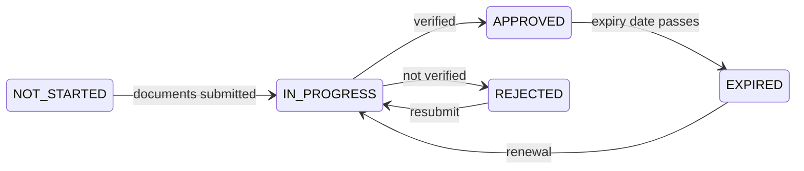

# Verificarse (KYC)

**KYC** — *Know Your Customer*, el conocimiento del cliente — es la comprobación que establece con quién trata el registro. Hasta que su organización la supere, puede acceder y mirar alrededor, y poco más.

Es la puerta detrás de la cual espera todo lo demás, así que conviene hacerlo bien a la primera.

---

## Por qué existe

No porque el operador sea cauteloso. Porque una empresa regulada que deja mantener valores a una parte no verificada comete una infracción, y porque la alternativa — un sistema financiero en el que nadie sabe quién posee qué — es precisamente aquel por el que circulan los fondos de origen delictivo.

Las obligaciones aplicables vienen del derecho de prevención del blanqueo: la GwG alemana, las directivas europeas contra el blanqueo y sus equivalentes en las demás jurisdicciones que Registerwerk modela. [KYC y prevención del blanqueo](../compliance/kyc-aml.md) tiene el detalle.

!!! info "Se verifica a su organización, no a usted personalmente"
    Registerwerk verifica **entidades jurídicas**. Los usuarios individuales pertenecen a una entidad verificada; no se verifican por separado.

    Por eso la caducidad del KYC de su organización detiene a *todos* en su empresa, no solo a quien se ocupaba de ello.

---

## Qué aporta usted

Varía según la jurisdicción, el tipo de entidad y la política del propio operador. Habitualmente:

| | |
|---|---|
| **Documentos de constitución** | Nota del registro mercantil, escritura de constitución. |
| **Identidad de los representantes** | Quién puede actuar por la organización. |
| **Titularidad real** | Quién la posee o controla en última instancia — normalmente todo el que supere el 25 %. |
| **Acreditación del domicilio** | Domicilio social. |
| **LEI** | Si dispone de él. |
| **Declaración sobre sanciones** | Y filtrado contra listas de sanciones. |

!!! tip "La titularidad real es lo que causa los retrasos"
    Todo lo demás es un documento que ya tiene. La titularidad real, a menudo no.

    Si su propiedad discurre por sociedades holding, fideicomisos o varias jurisdicciones, reúna la cadena *antes* de empezar — hasta las personas físicas del final. «Eso lo mandamos después» es donde se atasca la mayoría de los expedientes KYC, a veces durante semanas.

---

## Los estados

| Estado | Puede |
|---|---|
| `NOT_STARTED` | Acceder. Poco más. |
| `IN_PROGRESS` | Esperar. Responder a las consultas. |
| `APPROVED` | Todo lo que sus funciones permitan. |
| `REJECTED` | Leer el motivo, corregir, volver a enviar. |
| `EXPIRED` | Mantener lo que tiene. No moverlo. |

*KYC* en la barra superior muestra su estado actual y la fecha de caducidad.

---

## Cuando caduca

La verificación no es permanente. Lleva una fecha de caducidad, porque la propiedad y el control cambian y una comprobación de hace cuatro años acredita muy poco.

!!! danger "La caducidad detiene las transmisiones de toda su organización"
    Cuando el KYC decae, las transmisiones se detienen. No solo para quien lleva el cumplimiento — para todos en su empresa.

    **No pierde sus valores.** Sigue siendo titular, sigue teniendo derecho a cupones y amortización, y todo continúa visible. Lo que pierde es la capacidad de mover algo.

    La plataforma le avisa según se acerca la caducidad. **Inicie la renovación entonces, no después.** La renovación tarda lo mismo que la comprobación original, y la caducidad no espera a que usted esté listo.

Ponga la fecha de caducidad en el calendario que su organización mira de verdad. Es la interrupción más evitable de la plataforma, y también la más frecuente.

---

## Denegación

Recibe un motivo. Léalo y atienda ese punto concreto — volver a enviar el mismo expediente produce la misma respuesta.

Causas habituales:

- Titularidad real incompleta, o no rastreada hasta personas físicas
- Documentos caducados (las notas registrales suelen tener una antigüedad máxima)
- Nombres incoherentes entre documentos
- Una coincidencia de filtrado de sanciones sin resolver

!!! note "Una coincidencia no es una acusación"
    El filtrado de sanciones compara nombres, y los nombres no son únicos. Los falsos positivos son frecuentes — en la mayoría de las carteras, la mayoría de las coincidencias.

    Una coincidencia significa que una persona tiene que mirar, no que nadie crea nada. Responda a las preguntas y se resuelve. No es un juicio sobre su organización.

---

## Superarlo deprisa

- [ ] Reúna la titularidad real **primero**, hasta personas físicas.
- [ ] Compruebe que cada documento está vigente y es legible.
- [ ] Asegúrese de que el nombre de la entidad coincide exactamente en todos ellos.
- [ ] Designe a una persona que se responsabilice del expediente y conteste las consultas.
- [ ] Agende la caducidad el mismo día en que le aprueben.

---

## Adónde ir ahora

- [Obtener su cuenta](onboarding.md)
- [Conectar un monedero](investors/wallet-setup.md) — el otro requisito
- [KYC y prevención del blanqueo](../compliance/kyc-aml.md) — el detalle regulatorio
