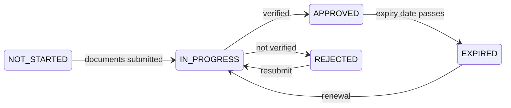

# Se faire vérifier (KYC)

**KYC** — *Know Your Customer*, la connaissance du client — est le contrôle qui établit à qui le registre a affaire. Tant que votre organisation ne l'a pas franchi, vous pouvez vous connecter et regarder autour de vous, et faire très peu d'autre chose.

C'est la porte derrière laquelle tout attend : il vaut donc la peine de la franchir correctement du premier coup.

---

## Pourquoi cela existe

Non parce que l'opérateur serait prudent. Parce qu'une entreprise réglementée qui laisse une partie non vérifiée détenir des titres commet une infraction, et parce que l'alternative — un système financier où personne ne sait qui possède quoi — est précisément celui par lequel circulent les produits du crime.

Les obligations correspondantes viennent du droit de la lutte contre le blanchiment : la GwG allemande, les directives européennes anti-blanchiment et leurs équivalents dans les autres juridictions que Registerwerk modélise. [KYC et LCB-FT](../compliance/kyc-aml.md) en donne le détail.

!!! info "C'est votre organisation qui est vérifiée, pas vous personnellement"
    Registerwerk vérifie des **entités juridiques**. Les utilisateurs individuels appartiennent à une entité vérifiée ; ils ne sont pas vérifiés séparément.

    C'est pourquoi l'expiration du KYC de votre organisation bloque *tout le monde* chez vous, et pas seulement la personne qui en avait la charge.

---

## Ce que vous fournissez

Cela varie selon la juridiction, le type d'entité et la politique propre de l'opérateur. En général :

| | |
|---|---|
| **Documents d'immatriculation** | Extrait du registre du commerce, acte constitutif. |
| **Identité des représentants** | Qui peut agir pour l'organisation. |
| **Bénéficiaires effectifs** | Qui la possède ou la contrôle en dernier ressort — généralement au-delà de 25 %. |
| **Justificatif d'adresse** | Siège social. |
| **LEI** | Si vous en avez un. |
| **Déclaration relative aux sanctions** | Et filtrage contre les listes de sanctions. |

!!! tip "Ce sont les bénéficiaires effectifs qui causent les retards"
    Tout le reste est un document que vous avez déjà. Les bénéficiaires effectifs, souvent non.

    Si votre actionnariat passe par des holdings, des trusts ou plusieurs juridictions, reconstituez la chaîne *avant* de commencer — jusqu'aux personnes physiques au bout. « On fournira ça plus tard » est l'endroit où la plupart des dossiers KYC s'enlisent, parfois pendant des semaines.

---

## Les états

| État | Vous pouvez |
|---|---|
| `NOT_STARTED` | Vous connecter. Guère plus. |
| `IN_PROGRESS` | Attendre. Répondre aux questions. |
| `APPROVED` | Tout ce que vos rôles permettent. |
| `REJECTED` | Lire le motif, corriger, resoumettre. |
| `EXPIRED` | Conserver ce que vous avez. Pas le déplacer. |

*KYC* dans la barre supérieure affiche votre état courant et la date d'expiration.

---

## Quand cela expire

La vérification n'est pas permanente. Elle porte une échéance, parce que la propriété et le contrôle changent et qu'un contrôle vieux de quatre ans n'atteste plus grand-chose.

!!! danger "L'expiration arrête les transferts pour toute votre organisation"
    Quand le KYC expire, les transferts s'arrêtent. Pas seulement pour la personne chargée de la conformité — pour tout le monde chez vous.

    **Vous ne perdez pas vos titres.** Vous restez titulaire, restez fondé à percevoir coupons et remboursement, et tout demeure visible. Ce que vous perdez, c'est la faculté de déplacer quoi que ce soit.

    La plateforme vous alerte à l'approche de l'échéance. **Lancez le renouvellement à ce moment-là, pas après.** Le renouvellement prend autant de temps que le contrôle initial, et l'échéance n'attend pas que vous soyez prêt.

Inscrivez la date d'expiration dans le calendrier que votre organisation consulte réellement. C'est la perturbation la plus évitable de la plateforme, et c'est aussi la plus fréquente.

---

## Refus

Vous recevez un motif. Lisez-le et traitez le point précis — resoumettre le même dossier produit la même réponse.

Causes fréquentes :

- Bénéficiaires effectifs incomplets, ou non remontés jusqu'à des personnes physiques
- Documents périmés (les extraits de registre ont généralement un âge maximal)
- Noms incohérents d'un document à l'autre
- Une correspondance de filtrage des sanctions non résolue

!!! note "Une correspondance n'est pas une accusation"
    Le filtrage des sanctions rapproche des noms, et les noms ne sont pas uniques. Les faux positifs sont fréquents — la majorité des correspondances, dans la plupart des portefeuilles.

    Une correspondance signifie qu'un humain doit regarder, pas que quiconque croit quelque chose. Répondez aux questions et cela se résout. Ce n'est pas un jugement sur votre organisation.

---

## Passer vite

- [ ] Reconstituez les bénéficiaires effectifs **d'abord**, jusqu'aux personnes physiques.
- [ ] Vérifiez que chaque document est à jour et lisible.
- [ ] Assurez-vous que le nom de l'entité concorde exactement dans tous les documents.
- [ ] Désignez une personne responsable du dossier et des réponses aux questions.
- [ ] Inscrivez l'échéance à l'agenda le jour même de l'approbation.

---

## Et ensuite

- [Obtenir votre compte](onboarding.md)
- [Connecter un portefeuille](investors/wallet-setup.md) — l'autre prérequis
- [KYC et LCB-FT](../compliance/kyc-aml.md) — le détail réglementaire
