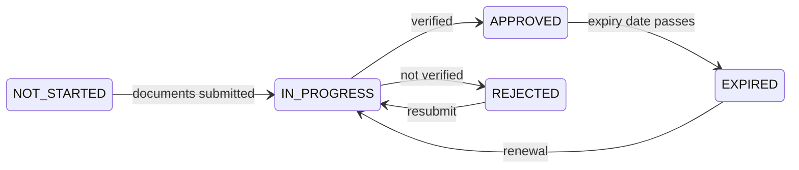

# Farsi verificare (KYC)

**KYC** — *Know Your Customer*, l'adeguata verifica della clientela — è il controllo che stabilisce con chi il registro ha a che fare. Finché la tua organizzazione non lo supera, puoi accedere e guardarti intorno, e poco altro.

È il cancello dietro cui tutto aspetta: conviene farlo bene la prima volta.

---

## Perché esiste

Non perché l'operatore sia prudente. Perché un'impresa vigilata che lascia detenere strumenti finanziari a un soggetto non verificato commette un illecito, e perché l'alternativa — un sistema finanziario in cui nessuno sa chi possiede che cosa — è proprio quello attraverso cui si muovono i proventi criminali.

Gli obblighi rilevanti vengono dalla normativa antiriciclaggio: la GwG tedesca, le direttive antiriciclaggio dell'Unione e i loro equivalenti nelle altre giurisdizioni che Registerwerk modella. [KYC e antiriciclaggio](../compliance/kyc-aml.md) contiene il dettaglio.

!!! info "Verifica la tua organizzazione, non te personalmente"
    Registerwerk verifica **soggetti giuridici**. I singoli utenti appartengono a un soggetto verificato; non sono verificati separatamente.

    Per questo la scadenza del KYC della tua organizzazione ferma *tutti* nella tua società, non solo chi se ne occupava.

---

## Che cosa fornisci

Varia per giurisdizione, tipo di soggetto e politica dell'operatore. Di norma:

| | |
|---|---|
| **Documenti di iscrizione** | Visura camerale, atto costitutivo. |
| **Identità dei rappresentanti** | Chi può agire per l'organizzazione. |
| **Titolarità effettiva** | Chi in ultima istanza la possiede o la controlla — di norma chiunque oltre il 25 %. |
| **Conferma dell'indirizzo** | Sede legale. |
| **LEI** | Se ne hai uno. |
| **Dichiarazione sulle sanzioni** | E screening rispetto alle liste sanzioni. |

!!! tip "È la titolarità effettiva a causare i ritardi"
    Tutto il resto è un documento che già hai. La titolarità effettiva spesso no.

    Se la proprietà passa per holding, trust o più giurisdizioni, ricostruisci la catena *prima* di cominciare — fino alle persone fisiche in fondo. «Quello lo mandiamo dopo» è il punto in cui la maggior parte delle pratiche KYC si arena, a volte per settimane.

---

## Gli stati

| Stato | Puoi |
|---|---|
| `NOT_STARTED` | Accedere. Poco altro. |
| `IN_PROGRESS` | Aspettare. Rispondere alle richieste. |
| `APPROVED` | Tutto ciò che i tuoi ruoli consentono. |
| `REJECTED` | Leggere la motivazione, correggere, reinviare. |
| `EXPIRED` | Tenere ciò che hai. Non muoverlo. |

*KYC* nella barra superiore mostra il tuo stato attuale e la data di scadenza.

---

## Quando scade

La verifica non è permanente. Porta una scadenza, perché proprietà e controllo cambiano e un controllo di quattro anni fa dimostra ben poco.

!!! danger "La scadenza ferma i trasferimenti per tutta la tua organizzazione"
    Quando il KYC decade, i trasferimenti si fermano. Non solo per chi cura la conformità — per tutti nella tua società.

    **Non perdi i tuoi strumenti finanziari.** Resti titolare, resti legittimato a cedole e rimborso, e tutto resta visibile. Ciò che perdi è la possibilità di muovere qualcosa.

    La piattaforma ti avvisa all'avvicinarsi della scadenza. **Avvia il rinnovo allora, non dopo.** Il rinnovo richiede quanto il controllo iniziale, e la scadenza non aspetta che tu sia pronto.

Metti la data di scadenza nel calendario che la tua organizzazione guarda davvero. È l'interruzione più evitabile della piattaforma, ed è anche la più comune.

---

## Rigetto

Ricevi una motivazione. Leggila e affronta quel punto preciso — reinviare lo stesso fascicolo produce la stessa risposta.

Cause frequenti:

- Titolarità effettiva incompleta, o non risalita fino alle persone fisiche
- Documenti non aggiornati (le visure hanno di norma un'età massima)
- Nomi incoerenti tra un documento e l'altro
- Una corrispondenza di screening sanzioni non risolta

!!! note "Una corrispondenza non è un'accusa"
    Lo screening sanzioni confronta nomi, e i nomi non sono univoci. I falsi positivi sono frequenti — nella maggior parte dei portafogli, la maggioranza delle corrispondenze.

    Una corrispondenza significa che una persona deve guardare, non che qualcuno creda qualcosa. Rispondi alle domande e si risolve. Non è un giudizio sulla tua organizzazione.

---

## Superarla in fretta

- [ ] Ricostruisci la titolarità effettiva **per prima cosa**, fino alle persone fisiche.
- [ ] Controlla che ogni documento sia aggiornato e leggibile.
- [ ] Assicurati che il nome del soggetto coincida esattamente in tutti i documenti.
- [ ] Nomina una persona che presidi la pratica e risponda alle richieste.
- [ ] Annota la scadenza in agenda il giorno stesso dell'approvazione.

---

## Dove andare adesso

- [Ottenere l'account](onboarding.md)
- [Collegare un wallet](investors/wallet-setup.md) — l'altro presupposto
- [KYC e antiriciclaggio](../compliance/kyc-aml.md) — il dettaglio regolamentare
