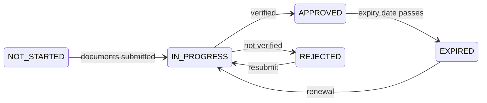

# Getting verified (KYC)

**KYC** — *Know Your Customer* — is the check that establishes who the registry is dealing with. Until your organisation passes it, you can sign in and look around, and do very little else.

It is the gate everything waits behind, so it is worth getting right the first time.

---

## Why it exists

Not because the operator is cautious. Because a regulated firm that lets an unverified party hold securities is committing an offence, and because the alternative — a financial system where nobody knows who owns anything — is the one criminal proceeds move through.

The relevant obligations come from anti-money-laundering law: the German GwG, the EU anti-money-laundering directives, and their equivalents in the other jurisdictions Registerwerk models. [KYC & AML](../compliance/kyc-aml.md) has the detail.

!!! info "It verifies your organisation, not you personally"
    Registerwerk verifies **legal entities**. Individual users belong to a verified entity; they are not verified separately.

    This is why your organisation's KYC lapsing stops *everyone* at your company, not just whoever was responsible for it.

---

## What you provide

It varies by jurisdiction, entity type and the operator's own policy. Typically:

| | |
|---|---|
| **Registration documents** | Commercial register extract, certificate of incorporation. |
| **Identity of representatives** | Who may act for the organisation. |
| **Beneficial ownership** | Who ultimately owns or controls it — usually anyone above 25%. |
| **Address confirmation** | Registered office. |
| **LEI** | Where you have one. |
| **Sanctions declaration** | And screening against sanctions lists. |

!!! tip "Beneficial ownership is what causes delays"
    Everything else is a document you already have. Beneficial ownership frequently is not.

    If your ownership runs through holding companies, trusts, or several jurisdictions, assemble the chain *before* you start — up to the natural persons at the end of it. "We'll get that later" is where most KYC applications stall, sometimes for weeks.

---

## The states

| State | You can |
|---|---|
| `NOT_STARTED` | Sign in. Little else. |
| `IN_PROGRESS` | Wait. Respond to queries. |
| `APPROVED` | Everything your roles permit. |
| `REJECTED` | Read the reason, fix, resubmit. |
| `EXPIRED` | Hold what you have. Not move it. |

*KYC* in the top bar shows your current state and expiry date.

---

## When it expires

Verification is not permanent. It carries an expiry, because ownership and control change and a check from four years ago evidences very little.

!!! danger "Expiry stops transfers for your whole organisation"
    When KYC lapses, transfers stop. Not just for whoever manages compliance — for everyone at your company.

    **You do not lose your securities.** You remain the holder, remain entitled to coupons and repayment, and everything remains visible. What you lose is the ability to move anything.

    The platform warns you as expiry approaches. **Start renewal then, not after.** Renewal takes as long as the original check, and expiry does not wait for you to be ready.

Put the expiry date in whatever calendar your organisation actually looks at. This is the most avoidable disruption on the platform, and it is also the most common.

---

## Rejection

You get a reason. Read it and address the specific point — resubmitting the same package produces the same answer.

Common causes:

- Beneficial ownership incomplete, or not traced to natural persons
- Documents out of date (registry extracts usually have a maximum age)
- Names inconsistent across documents
- An unresolved sanctions screening match

!!! note "A screening match is not an accusation"
    Sanctions screening matches names, and names are not unique. False positives are common — the majority of matches, in most books.

    A match means a human has to look, not that anyone believes something. Answer the questions and it resolves. It is not a judgement about your organisation.

---

## Getting through it quickly

- [ ] Assemble beneficial ownership **first**, to natural persons.
- [ ] Check every document is current and legible.
- [ ] Make sure the entity name matches exactly across all of them.
- [ ] Nominate one person to own the process and answer queries.
- [ ] Diary the expiry the day you are approved.

---

## Where next

- [Getting your account](onboarding.md)
- [Connecting a wallet](investors/wallet-setup.md) — the other prerequisite
- [KYC & AML](../compliance/kyc-aml.md) — the regulatory detail
