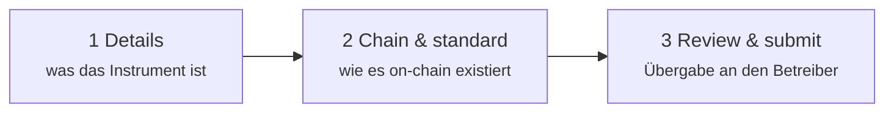
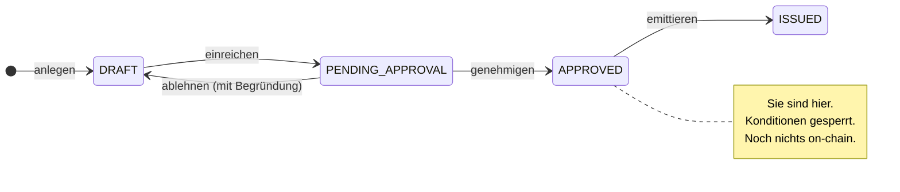

# Station 1 — Konzeption und Genehmigung

*Nordwind Energie hat beschlossen, 50 Millionen Euro aufzunehmen. Es existiert noch nichts außer einer Absicht.*

Diese Station macht aus der Absicht ein präzise beschriebenes Instrument, das ein Computer verwalten und eine Aufsicht prüfen kann. **Keine Blockchain wird berührt.** Am Ende hat ein Mensch beim Register den Vorschlag angesehen und Ja gesagt.

---

## Was Sie tun

Im Arbeitsbereich **Issuer**: *Issuances → New Issuance*. Ein dreistufiges Formular.

### Schritt 1 — Details

Wirtschaft und Identität des Instruments: Name, ISIN sofern vorhanden, Jurisdiktion und — bei einer Anleihe — Nennbetrag, Währung, Ausgabe- und Fälligkeitstag, Kuponsatz, Zinsberechnungsmethode, Zahlungsfrequenz.

Zwei Felder leisten mehr, als sie aussehen:

**ISIN.** Der zwölfstellige Code, der das Wertpapier weltweit identifiziert. Registerwerk erzwingt die Eindeutigkeit im Register, vergibt aber keine ISIN — die bekommen Sie von Ihrer nationalen Nummerierungsstelle. Sie können ohne ISIN anlegen und sogar emittieren; Sie werden es nur mit der Außenwelt deutlich schwerer haben.

**Jurisdiktion.** Das ist kein Etikett. Sie wählt aus, welches Regelwerk die Plattform für den Rest des Lebens dieses Instruments anwendet — welche Registerinhalte zwingend sind, welche Meldungen erzeugt werden, was der Betreiber prüfen muss. Sie später zu ändern ist keine Feldkorrektur. Siehe [Rechtsrahmen](../../legal/index.md).

??? note "Für Fachleute: die Anleihekonditionen im Detail"

    Anleihen führen neben dem Asset einen eigenen Konditionensatz: Nennbetrag, Währung, Ausgabe- und Fälligkeitstag, Kuponsatz, Referenzzinssatz und Spread (bei variabel verzinsten Papieren), Zinsberechnungsmethode, Zahlungsfrequenz, Kündbarkeit mit optionalem Kündigungsplan — und **Ausgabepreis** als Bruchteil des Nennbetrags.

    Der Ausgabepreis steht standardmäßig auf `1.0`, also pari. Er zählt bei Nullkuponanleihen: Sie zahlen keine Zinsen und entschädigen den Anleger stattdessen durch einen Preis unter Nennbetrag — Kauf zu 800 €, Rückzahlung von 1.000 € in fünf Jahren. Ohne einen echten Ausgabepreis lässt sich eine Nullkuponanleihe überhaupt nicht abbilden.

    Die Zinsberechnungsmethode (ACT/360, ACT/365, 30/360, …) legt fest, wie ein angebrochenes Jahr in einen Bruchteil umgerechnet wird. Sie ist unspektakulär, und sie verändert den Betrag.

### Schritt 2 — Chain und Standard

Zwei Entscheidungen — hier betritt die Tokenisierung die Geschichte.

**Welche Blockchain.** Ethereum und Verwandte, Solana, Canton, StarkNet, Stellar — jeweils Mainnet oder Testnet. [Unterstützte Blockchains](../../blockchains/index.md) vergleicht sie.

**Welcher Token-Standard.** Das ist die wichtige Entscheidung, und sie verdient den Platz unten.

### Schritt 3 — Prüfen und einreichen

Zusammenfassung, dann einreichen. Die Emission wechselt von `DRAFT` zu `PENDING_APPROVAL`, und **Sie können sie nicht mehr bearbeiten**. Sie liegt jetzt beim Betreiber.

---

## Den Token-Standard wählen

Ein Token-Standard ist der vereinbarte Regelsatz, dem ein Token-Contract folgt, damit Wallets, Handelsplätze und andere Contracts damit umgehen können, ohne jeden Emittenten gesondert zu behandeln.

Für eine schlichte Anleihe wie die von Nordwind stehen praktisch zwei zur Wahl:

=== "ERC-20 — der einfache"

    Jede Einheit ist identisch und frei austauschbar, wie Bargeld. Von jeder existierenden Wallet und jedem Handelsplatz verstanden.

    **Das Problem:** ERC-20 kennt keinen Begriff davon, wer ihn halten darf. Wer eine Einheit empfängt, besitzt sie. Für ein reguliertes Wertpapier ist das meist disqualifizierend — eine auf professionelle Anleger beschränkte Anleihe darf nicht in einer anonymen Wallet landen, nur weil jemand sie dorthin geschickt hat.

    Vertretbar, wenn Übertragungsbeschränkungen tatsächlich an anderer Stelle durchgesetzt werden, oder für einen Testnet-Piloten.

    [:octicons-arrow-right-24: ERC-20 im Detail](../../token-standards/erc20.md)

=== "ERC-3643 — der regulierte"

    Auch **T-REX** genannt. Ein ERC-20 mit angeschweißter Identitäts- und Compliance-Schicht, und die übliche Antwort für ein echtes Wertpapier.

    Bevor eine Übertragung abschließt, fragt der Contract selbst: *Ist der Empfänger eine registrierte Identität? Hält er die von diesem Instrument geforderten Nachweise? Verstößt diese Übertragung gegen eine Regel — Höchstzahl an Inhabern, Länderbeschränkung, Haltefrist?* Ist eine Antwort falsch, wird die Übertragung **rückabgewickelt**. Nicht nachträglich zur Prüfung markiert — abgelehnt, on-chain, im Moment des Versuchs.

    Genau das macht ein Wertpapier-Token zum Wertpapier-Token: Die Regeln sind kein Richtliniendokument, sondern ausführbarer Code, der vor der Übertragung läuft.

    [:octicons-arrow-right-24: ERC-3643 im Detail](../../token-standards/erc3643.md)

Für andere Instrumentenformen gibt es andere Standards: ERC-1155, wenn ein Contract viele Serien tragen muss; ERC-3525 für teilfungible Instrumente, die einen Slot teilen, aber im Wert abweichen; ERC-4626 und ERC-7540 für Fonds und Vaults; DAML auf Canton, wenn Vertraulichkeit zwischen Gegenparteien gefordert ist; SPL-2022 auf Solana. [Token-Standard wählen](../issuers/token-standards.md) geht die Entscheidung ordentlich durch.

!!! tip "Nordwind wählt ERC-3643"
    Die Anleihe wird unter einer Prospektausnahme professionellen Anlegern angeboten, es dürfen sie also nur geprüfte Anleger halten. Diese Anforderung muss der Token selbst durchsetzen — und dafür gibt es ERC-3643.

??? note "Für Fachleute: wie ERC-3643 eine Übertragung tatsächlich blockiert"

    Vier Contracts, und der Token ist nur einer davon.

    - **ONCHAINID** — ein Identitäts-Contract je Partei, der signierte *Claims* über sie hält („KYC geprüft", „professioneller Anleger", „Ansässigkeit Deutschland"). Die Identität ist die Contract-Adresse; die Claims sind Bestätigungen von Ausstellern, denen das Register vertraut.
    - **Trusted Issuers Registry** — welche Claim-Aussteller zählen, für welche Claim-Topics (1 = KYC, 2 = Geldwäscheprävention, 3 = Anlegerqualifikation).
    - **Identity Registry** — die Zuordnung von Wallet-Adresse zu ONCHAINID, dazu ein Ländercode.
    - **Compliance** — die Regelmodule: Inhaberobergrenzen, Länderquoten, Haltefristen, Höchstbestände.

    Bei jedem `transfer` ruft der Token `canTransfer` auf. Das löst die Wallet des Empfängers zu einer Identität auf, prüft, ob diese gültige Claims vertrauenswürdiger Aussteller hält, und befragt dann jedes Compliance-Modul. Ein einziges `false`, und die gesamte Transaktion wird rückabgewickelt.

    Die Konsequenz, die man verinnerlichen sollte: **eine Übertragung an eine nicht registrierte Wallet scheitert immer.** Das ist kein Fehler und die häufigste Überraschung für Anleger, die gewöhnliche Token gewohnt sind. Es bedeutet außerdem, dass die Zulassung eines Anlegers Voraussetzung dafür ist, dass er überhaupt etwas empfangen kann — keine Formalie danach.

---

## Was der Betreiber tut

Die Einreichung landet in der Warteschlange des Betreibers. Ein Mensch prüft sie — die Konditionen, die Stellung des Emittenten, die Jurisdiktion, den KYC-Status des emittierenden Rechtsträgers und ob Chain und Standard zum Behaupteten passen.

Dann geschieht eines von zwei Dingen:

| | |
|---|---|
| **Genehmigt** | Status wird `APPROVED`. Konditionen sind gesperrt. Sie dürfen ausbringen. |
| **Abgelehnt** | Status kehrt zu `DRAFT` zurück, mit dokumentierter Begründung. Sie bearbeiten und reichen erneut ein. |

!!! info "Es gibt keinen Status `REJECTED`"
    Eine Ablehnung schickt die Emission zurück nach `DRAFT`, wo sie wieder bearbeitbar ist. Die Begründung wird im Audit-Log festgehalten, aber die Emission bleibt nicht in einer Sackgasse stehen. Das unterscheidet sich von manchen anderen Registern und ist Absicht — ein abgelehnter Entwurf ist ein Entwurf.

Jeder dieser Übergänge wird in ein manipulationssicher nachweisbares [Audit-Log](../../platform/audit-log.md) geschrieben, mit Person und Zeitpunkt.

---

## Wo Sie stehen

Die Anleihe ist vollständig beschrieben, genehmigt — und existiert ausschließlich im Register.

Als Nächstes: sie real machen.

[Station 2: Primäremission :octicons-arrow-right-24:](primary-issuance.md){ .md-button .md-button--primary }
