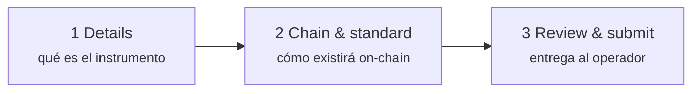
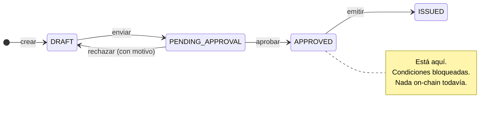

# Etapa 1 — Diseño y aprobación

*Nordwind Energie ha decidido pedir prestados 50 millones de euros. Todavía no existe nada salvo una intención.*

Esta etapa convierte esa intención en un instrumento descrito con la precisión suficiente para que un ordenador pueda administrarlo y un supervisor examinarlo. **No se toca ninguna blockchain.** Al final, una persona del registro ha mirado la propuesta y ha dicho que sí.

---

## Lo que usted hace

En el espacio **Issuer**: *Issuances → New Issuance*. Un formulario de tres pasos.

### Paso 1 — Details

La economía y la identidad del instrumento: denominación, código ISIN si lo tiene, jurisdicción y — para un bono — valor nominal, divisa, fechas de emisión y vencimiento, tipo de cupón, base de cálculo de intereses, periodicidad de pago.

Dos de estos campos pesan más de lo que parece:

**Código ISIN.** Los doce caracteres que identifican el valor en todo el mundo. Registerwerk impone su unicidad en el registro, pero no lo asigna — lo obtiene de su agencia nacional de codificación. Puede crear e incluso emitir sin ISIN; simplemente le costará mucho más interactuar con el exterior.

**Jurisdicción.** No es una etiqueta. Selecciona el cuerpo de reglas que la plataforma aplicará a este instrumento durante toda su vida — qué contenido registral es obligatorio, qué comunicaciones se generan, qué debe comprobar el operador. Cambiarla después no es corregir un campo. Véase [Marcos jurídicos](../../legal/index.md).

??? note "Para especialistas: las condiciones del bono en detalle"

    Los bonos llevan, junto al activo, un conjunto de condiciones propio: valor nominal, divisa, fechas de emisión y vencimiento, tipo de cupón, tipo de referencia y diferencial (para tipo variable), base de cálculo de intereses, periodicidad, amortización anticipada con calendario opcional, y **precio de emisión** como fracción del valor nominal.

    El precio de emisión vale `1.0` por defecto — a la par. Importa en los bonos cupón cero, que no pagan intereses y compensan al inversor vendiéndose bajo par: comprar a 800 €, recibir 1.000 € dentro de cinco años. Sin un precio de emisión real, un bono cupón cero no puede representarse.

    La base de cálculo de intereses (ACT/360, ACT/365, 30/360, …) determina cómo un año incompleto se convierte en una fracción. No es espectacular, y cambia el importe.

### Paso 2 — Chain & standard

Dos decisiones — aquí es donde la tokenización entra realmente en escena.

**Qué blockchain.** Ethereum y afines, Solana, Canton, StarkNet, Stellar — cada una en mainnet o testnet. [Blockchains admitidas](../../blockchains/index.md) las compara.

**Qué estándar de token.** Esta es la decisión importante, y merece el espacio de abajo.

### Paso 3 — Review & submit

Un resumen y el envío. La emisión pasa de `DRAFT` a `PENDING_APPROVAL` y **ya no puede editarla**. Ahora está en manos del operador.

---

## Elegir un estándar de token

Un estándar de token es el conjunto acordado de reglas que sigue un contrato, para que monederos, centros de negociación y otros contratos sepan tratarlo sin gestionar a cada emisor como un caso especial.

Para un bono sencillo como el de Nordwind, la elección real está entre dos:

=== "ERC-20 — el sencillo"

    Cada unidad es idéntica y libremente intercambiable, como el efectivo. Lo entienden todos los monederos y todos los mercados existentes.

    **El problema:** ERC-20 no tiene ninguna noción de quién puede tenerlo. Quien recibe una unidad es su dueño. Para un valor regulado esto suele ser descalificante — un bono restringido a inversores profesionales no puede acabar en un monedero anónimo solo porque alguien lo haya enviado allí.

    Razonable cuando las restricciones de transmisión se imponen realmente en otro sitio, o para una prueba en testnet.

    [:octicons-arrow-right-24: ERC-20 en detalle](../../token-standards/erc20.md)

=== "ERC-3643 — el regulado"

    También llamado **T-REX**. Un ERC-20 con una capa de identidad y cumplimiento soldada encima, y la respuesta habitual para un valor real.

    Antes de que una transmisión se complete, el propio contrato pregunta: *¿el receptor es una identidad registrada? ¿posee las acreditaciones que exige este instrumento? ¿esta transmisión infringe alguna regla — límite de titulares, restricción por país, periodo de bloqueo?* Si una sola respuesta falla, la transmisión se **revierte**. No se marca para revisión posterior — se rechaza, on-chain, en el instante del intento.

    Esto es exactamente lo que convierte a un token de valores en un token de valores: las reglas no son un documento de políticas, son código ejecutable que corre antes de la transmisión.

    [:octicons-arrow-right-24: ERC-3643 en detalle](../../token-standards/erc3643.md)

Existen otros estándares para otras formas de instrumento: ERC-1155 cuando un contrato debe soportar muchas series; ERC-3525 para instrumentos semifungibles que comparten un compartimento pero difieren en valor; ERC-4626 y ERC-7540 para fondos y bóvedas; DAML sobre Canton cuando se exige confidencialidad entre contrapartes; SPL-2022 sobre Solana. [Elegir un estándar de token](../issuers/token-standards.md) recorre la decisión en condiciones.

!!! tip "Nordwind elige ERC-3643"
    El bono se ofrece a inversores profesionales bajo una exención de folleto, así que solo pueden tenerlo inversores verificados. Ese requisito debe imponerlo el propio token, y para eso está ERC-3643.

??? note "Para especialistas: cómo bloquea ERC-3643 una transmisión"

    Cuatro contratos, y el token es solo uno de ellos.

    - **ONCHAINID** — un contrato de identidad por parte, que contiene *acreditaciones* firmadas sobre ella («KYC verificado», «inversor profesional», «residente en Alemania»). La identidad es la dirección del contrato; las acreditaciones proceden de emisores en los que el registro confía.
    - **Trusted Issuers Registry** — qué emisores de acreditaciones cuentan y para qué materias (1 = KYC, 2 = prevención del blanqueo, 3 = cualificación del inversor).
    - **Identity Registry** — la correspondencia entre dirección de monedero y ONCHAINID, más un código de país.
    - **Compliance** — los módulos de reglas: límites de titulares, cuotas por país, periodos de bloqueo, saldo máximo.

    En cada `transfer`, el token invoca `canTransfer`. Eso resuelve el monedero del receptor a una identidad, comprueba que esa identidad tenga acreditaciones válidas de emisores de confianza y después consulta cada módulo de cumplimiento. Un solo `false` y toda la transacción se revierte.

    La consecuencia que conviene interiorizar: **una transmisión a un monedero no registrado siempre fallará.** No es un defecto, y es la sorpresa más común para inversores acostumbrados a tokens corrientes. También significa que admitir a un inversor es un requisito previo para que pueda recibir algo, no un trámite posterior.

---

## Lo que hace el operador

La solicitud llega a la cola del operador. Una persona la revisa — las condiciones del instrumento, la situación del emisor, la jurisdicción, el estado KYC de la entidad emisora y si la cadena y el estándar encajan con lo que se declara.

Después ocurre una de dos cosas:

| | |
|---|---|
| **Aprobada** | El estado pasa a `APPROVED`. Las condiciones quedan bloqueadas. Ya puede desplegar. |
| **Rechazada** | El estado vuelve a `DRAFT`, con el motivo registrado. Corrige y vuelve a presentar. |

!!! info "No existe un estado `REJECTED`"
    Un rechazo devuelve la emisión a `DRAFT`, donde vuelve a ser editable. El motivo queda en el registro de auditoría, pero la emisión no se queda en un callejón sin salida. Esto difiere de otros registros, y es deliberado — un borrador rechazado es un borrador.

Cada una de estas transiciones se escribe en un [registro de auditoría](../../platform/audit-log.md) a prueba de manipulación, con quién y cuándo.

---

## Dónde está usted

El bono está descrito por completo, aprobado, y existe únicamente en el registro.

A continuación: hacerlo real.

[Etapa 2: Emisión primaria :octicons-arrow-right-24:](primary-issuance.md){ .md-button .md-button--primary }
