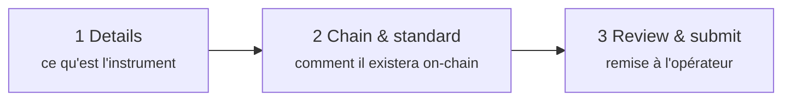
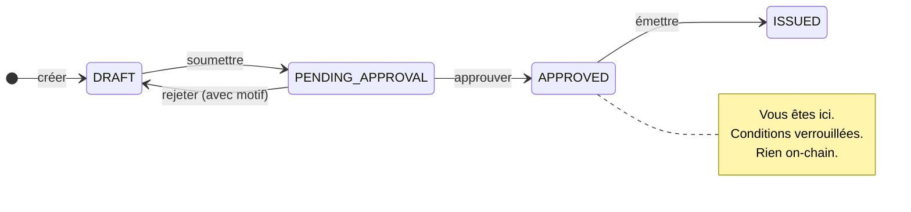

# Étape 1 — Conception et approbation

*Nordwind Energie a décidé d'emprunter 50 millions d'euros. Rien n'existe encore, sinon une intention.*

Cette étape transforme l'intention en un instrument décrit avec assez de précision pour qu'un ordinateur puisse l'administrer et un régulateur l'examiner. **Aucune blockchain n'est touchée.** À la fin, un humain du registre a regardé la proposition et a dit oui.

---

## Ce que vous faites

Dans l'espace **Issuer** : *Issuances → New Issuance*. Un formulaire en trois étapes.

### Étape 1 — Details

L'économie et l'identité de l'instrument : nom, code ISIN le cas échéant, juridiction et — pour une obligation — valeur nominale, devise, dates d'émission et d'échéance, taux de coupon, convention de décompte des jours, périodicité de paiement.

Deux de ces champs pèsent plus lourd qu'il n'y paraît :

**Le code ISIN.** Les douze caractères qui identifient le titre dans le monde entier. Registerwerk impose son unicité dans le registre mais n'en attribue pas — vous l'obtenez auprès de votre agence nationale de codification. Vous pouvez créer et même émettre sans ISIN ; vous aurez simplement beaucoup plus de mal à interagir avec l'extérieur.

**La juridiction.** Ce n'est pas une étiquette. Elle sélectionne le corps de règles que la plateforme appliquera à cet instrument pour toute sa vie — quel contenu de registre est obligatoire, quelles déclarations sont produites, ce que l'opérateur doit vérifier. La changer ensuite n'est pas une correction de champ. Voir [Cadres juridiques](../../legal/index.md).

??? note "Pour les spécialistes : les conditions obligataires en détail"

    Les obligations portent, à côté de l'actif, un jeu de conditions distinct : valeur nominale, devise, dates d'émission et d'échéance, taux de coupon, taux de référence et spread (pour le taux variable), convention de décompte des jours, périodicité, caractère remboursable par anticipation avec calendrier optionnel, et **prix d'émission** exprimé en fraction de la valeur nominale.

    Le prix d'émission vaut `1.0` par défaut — le pair. Il compte pour les obligations à coupon zéro, qui ne versent aucun intérêt et rémunèrent l'investisseur en étant vendues sous le pair : acheter à 800 €, recevoir 1 000 € dans cinq ans. Sans un véritable prix d'émission, une obligation à coupon zéro ne peut tout simplement pas être représentée.

    La convention de décompte des jours (ACT/360, ACT/365, 30/360, …) détermine comment une année incomplète devient une fraction. Elle n'a rien de spectaculaire, et elle change le montant versé.

### Étape 2 — Chain & standard

Deux décisions — c'est ici que la tokenisation entre réellement en scène.

**Quelle blockchain.** Ethereum et ses proches, Solana, Canton, StarkNet, Stellar — chacune en mainnet ou testnet. [Blockchains prises en charge](../../blockchains/index.md) les compare.

**Quelle norme de jeton.** C'est la décision importante, et elle mérite la place ci-dessous.

### Étape 3 — Review & submit

Un récapitulatif, puis la soumission. L'émission passe de `DRAFT` à `PENDING_APPROVAL` et **vous ne pouvez plus la modifier**. Elle est désormais chez l'opérateur.

---

## Choisir une norme de jeton

Une norme de jeton est l'ensemble de règles convenu que suit un contrat, afin que portefeuilles, plateformes de négociation et autres contrats sachent le manipuler sans traiter chaque émetteur comme un cas particulier.

Pour une obligation simple comme celle de Nordwind, le choix réel se limite à deux :

=== "ERC-20 — la simple"

    Chaque unité est identique et librement interchangeable, comme des espèces. Comprise par tous les portefeuilles et toutes les plateformes existants.

    **Le problème :** ERC-20 n'a aucune notion de qui a le droit de le détenir. Quiconque reçoit une unité la possède. Pour un titre réglementé, c'est généralement rédhibitoire — une obligation réservée aux investisseurs professionnels ne peut pas atterrir dans un portefeuille anonyme au seul motif que quelqu'un l'y a envoyée.

    Défendable lorsque les restrictions de transfert sont réellement appliquées ailleurs, ou pour un pilote en testnet.

    [:octicons-arrow-right-24: ERC-20 en détail](../../token-standards/erc20.md)

=== "ERC-3643 — la réglementée"

    Aussi appelée **T-REX**. Un ERC-20 auquel on a soudé une couche d'identité et de conformité, et la réponse habituelle pour un vrai titre financier.

    Avant qu'un transfert n'aboutisse, le contrat lui-même demande : *le destinataire est-il une identité enregistrée ? détient-il les attestations exigées par cet instrument ? ce transfert enfreint-il une règle — plafond du nombre de titulaires, restriction géographique, période de blocage ?* Si une seule réponse est mauvaise, le transfert est **annulé**. Pas signalé pour examen ultérieur — refusé, on-chain, au moment même de la tentative.

    C'est exactement ce qui fait d'un jeton de titre un jeton de titre : les règles ne sont pas un document de politique interne, ce sont des instructions exécutables qui s'exécutent avant le transfert.

    [:octicons-arrow-right-24: ERC-3643 en détail](../../token-standards/erc3643.md)

D'autres normes existent pour d'autres formes d'instruments : ERC-1155 lorsqu'un contrat doit porter plusieurs séries ; ERC-3525 pour les instruments semi-fongibles partageant un même compartiment mais de valeurs différentes ; ERC-4626 et ERC-7540 pour les fonds et coffres ; DAML sur Canton lorsque la confidentialité entre contreparties est exigée ; SPL-2022 sur Solana. [Choisir une norme de jeton](../issuers/token-standards.md) déroule la décision en détail.

!!! tip "Nordwind choisit ERC-3643"
    L'obligation est offerte à des investisseurs professionnels sous une exemption de prospectus : seuls des investisseurs vérifiés peuvent la détenir. Cette exigence doit être appliquée par le jeton lui-même, et c'est le rôle d'ERC-3643.

??? note "Pour les spécialistes : comment ERC-3643 bloque réellement un transfert"

    Quatre contrats, et le jeton n'en est qu'un.

    - **ONCHAINID** — un contrat d'identité par partie, portant des *attestations* signées la concernant (« KYC vérifié », « investisseur professionnel », « résident allemand »). L'identité est l'adresse du contrat ; les attestations émanent d'émetteurs auxquels le registre fait confiance.
    - **Trusted Issuers Registry** — quels émetteurs d'attestations comptent, et pour quels thèmes (1 = KYC, 2 = LCB-FT, 3 = qualification de l'investisseur).
    - **Identity Registry** — la correspondance entre adresse de portefeuille et ONCHAINID, plus un code pays.
    - **Compliance** — les modules de règles : plafonds de titulaires, quotas par pays, périodes de blocage, solde maximal.

    À chaque `transfer`, le jeton appelle `canTransfer`. Cela résout le portefeuille du destinataire en une identité, vérifie que celle-ci détient des attestations valides d'émetteurs de confiance, puis interroge chaque module de conformité. Un seul `false` et toute la transaction est annulée.

    La conséquence à intégrer : **un transfert vers un portefeuille non enregistré échouera toujours.** Ce n'est pas un défaut, et c'est la surprise la plus fréquente pour les investisseurs habitués aux jetons ordinaires. Cela signifie aussi que l'admission d'un investisseur est un préalable à toute réception, et non une formalité postérieure.

---

## Ce que fait l'opérateur

La soumission arrive dans la file de l'opérateur. Un humain l'examine — les conditions de l'instrument, la situation de l'émetteur, la juridiction, le statut KYC de l'entité émettrice, et si la chaîne et la norme correspondent à ce qui est annoncé.

Puis l'une de deux choses se produit :

| | |
|---|---|
| **Approuvée** | Le statut passe à `APPROVED`. Les conditions sont verrouillées. Vous pouvez déployer. |
| **Rejetée** | Le statut revient à `DRAFT`, avec un motif consigné. Vous corrigez et resoumettez. |

!!! info "Il n'existe pas de statut `REJECTED`"
    Un rejet renvoie l'émission à `DRAFT`, où elle redevient modifiable. Le motif est consigné dans la piste d'audit, mais l'émission ne reste pas dans un état sans issue. Cela diffère de certains autres registres, et c'est délibéré — un projet rejeté reste un projet.

Chacune de ces transitions est écrite dans une [piste d'audit](../../platform/audit-log.md) inviolable, avec l'auteur et l'horodatage.

---

## Où vous en êtes

L'obligation est entièrement décrite, approuvée, et n'existe que dans le registre.

Ensuite : la rendre réelle.

[Étape 2 : Émission primaire :octicons-arrow-right-24:](primary-issuance.md){ .md-button .md-button--primary }
