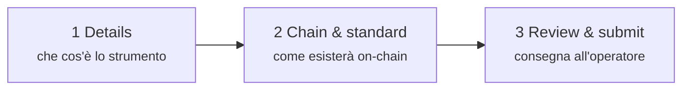
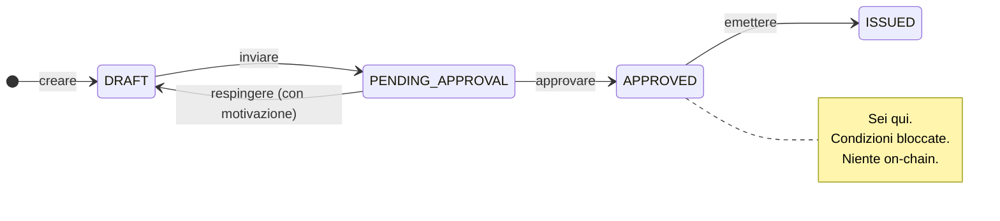

# Fase 1 — Progettazione e approvazione

*Nordwind Energie ha deciso di prendere a prestito 50 milioni di euro. Non esiste ancora nulla, se non un'intenzione.*

Questa fase trasforma l'intenzione in uno strumento descritto con la precisione necessaria perché un computer possa amministrarlo e un'autorità esaminarlo. **Nessuna blockchain viene toccata.** Alla fine, una persona del registro ha guardato la proposta e ha detto sì.

---

## Che cosa fai

Nell'area **Issuer**: *Issuances → New Issuance*. Un modulo in tre passaggi.

### Passaggio 1 — Details

L'economia e l'identità dello strumento: denominazione, codice ISIN se esiste, giurisdizione e — per un'obbligazione — valore nominale, valuta, date di emissione e scadenza, tasso cedolare, convenzione di calcolo giorni, periodicità di pagamento.

Due di questi campi pesano più di quanto sembri:

**Codice ISIN.** I dodici caratteri che identificano lo strumento nel mondo. Registerwerk ne impone l'unicità nel registro, ma non lo assegna — lo ottieni dalla tua agenzia nazionale di codifica. Puoi creare e persino emettere senza ISIN; farai semplicemente molta più fatica a interagire con l'esterno.

**Giurisdizione.** Non è un'etichetta. Seleziona l'insieme di regole che la piattaforma applicherà a questo strumento per tutta la sua vita — quali contenuti di registro sono obbligatori, quali segnalazioni vengono generate, che cosa deve verificare l'operatore. Cambiarla dopo non è la correzione di un campo. Vedi [Quadri normativi](../../legal/index.md).

??? note "Per gli specialisti: le condizioni obbligazionarie in dettaglio"

    Le obbligazioni portano, accanto all'asset, un insieme separato di condizioni: valore nominale, valuta, date di emissione e scadenza, tasso cedolare, tasso di riferimento e spread (per il tasso variabile), convenzione di calcolo giorni, periodicità, rimborsabilità anticipata con eventuale piano, e **prezzo di emissione** come frazione del valore nominale.

    Il prezzo di emissione vale `1.0` per impostazione predefinita — alla pari. Conta per le obbligazioni zero coupon, che non pagano interessi e compensano l'investitore vendendo sotto la pari: comprare a 800 €, ricevere 1.000 € tra cinque anni. Senza un vero prezzo di emissione, un'obbligazione zero coupon non è rappresentabile.

    La convenzione di calcolo giorni (ACT/360, ACT/365, 30/360, …) stabilisce come un anno incompleto diventa una frazione. Non è spettacolare, e cambia l'importo.

### Passaggio 2 — Chain & standard

Due decisioni — è qui che la tokenizzazione entra davvero in scena.

**Quale blockchain.** Ethereum e affini, Solana, Canton, StarkNet, Stellar — ciascuna in mainnet o testnet. [Blockchain supportate](../../blockchains/index.md) le confronta.

**Quale standard di token.** È la decisione importante, e merita lo spazio qui sotto.

### Passaggio 3 — Review & submit

Un riepilogo, poi l'invio. L'emissione passa da `DRAFT` a `PENDING_APPROVAL` e **non puoi più modificarla**. Ora è dall'operatore.

---

## Scegliere uno standard di token

Uno standard di token è l'insieme di regole concordato che un contratto segue, così che wallet, sedi di negoziazione e altri contratti sappiano trattarlo senza gestire ogni emittente come un caso a sé.

Per un'obbligazione semplice come quella di Nordwind la scelta reale è tra due:

=== "ERC-20 — quello semplice"

    Ogni unità è identica e liberamente intercambiabile, come il contante. Compreso da qualunque wallet e qualunque sede esistente.

    **Il problema:** ERC-20 non ha alcuna nozione di chi possa detenerlo. Chiunque riceva un'unità la possiede. Per uno strumento regolamentato questo è di norma squalificante — un'obbligazione riservata a investitori professionali non può finire in un wallet anonimo solo perché qualcuno ce l'ha mandata.

    Ragionevole quando le restrizioni al trasferimento sono davvero imposte altrove, o per un progetto pilota su testnet.

    [:octicons-arrow-right-24: ERC-20 in dettaglio](../../token-standards/erc20.md)

=== "ERC-3643 — quello regolamentato"

    Detto anche **T-REX**. Un ERC-20 con saldato sopra uno strato di identità e conformità, ed è la risposta abituale per uno strumento vero.

    Prima che un trasferimento si perfezioni, è il contratto stesso a chiedere: *il destinatario è un'identità registrata? possiede i claim richiesti da questo strumento? questo trasferimento viola una regola — numero massimo di titolari, restrizione per paese, periodo di lock-up?* Se una sola risposta è sbagliata, il trasferimento viene **annullato**. Non segnalato per un esame successivo — rifiutato, on-chain, nel momento del tentativo.

    È esattamente questo a fare di un token su strumento finanziario ciò che è: le regole non sono un documento di policy, sono codice eseguibile che gira prima del trasferimento.

    [:octicons-arrow-right-24: ERC-3643 in dettaglio](../../token-standards/erc3643.md)

Esistono altri standard per altre forme di strumento: ERC-1155 quando un contratto deve portare molte serie; ERC-3525 per strumenti semi-fungibili che condividono uno slot ma differiscono di valore; ERC-4626 ed ERC-7540 per fondi e vault; DAML su Canton quando serve riservatezza tra controparti; SPL-2022 su Solana. [Scegliere uno standard di token](../issuers/token-standards.md) percorre la decisione per bene.

!!! tip "Nordwind sceglie ERC-3643"
    L'obbligazione è offerta a investitori professionali in regime di esenzione dal prospetto, quindi possono detenerla solo investitori verificati. Quel requisito deve essere imposto dal token stesso, ed è ciò che fa ERC-3643.

??? note "Per gli specialisti: come ERC-3643 blocca davvero un trasferimento"

    Quattro contratti, e il token è solo uno.

    - **ONCHAINID** — un contratto di identità per ciascuna parte, che porta *claim* firmati sul suo conto («KYC verificato», «investitore professionale», «residente in Germania»). L'identità è l'indirizzo del contratto; i claim provengono da emittenti di cui il registro si fida.
    - **Trusted Issuers Registry** — quali emittenti di claim contano, e per quali temi (1 = KYC, 2 = antiriciclaggio, 3 = qualifica dell'investitore).
    - **Identity Registry** — la corrispondenza tra indirizzo del wallet e ONCHAINID, più un codice paese.
    - **Compliance** — i moduli di regole: limiti di titolari, quote per paese, periodi di lock-up, saldo massimo.

    A ogni `transfer` il token invoca `canTransfer`. Questo risolve il wallet del destinatario in un'identità, verifica che essa possieda claim validi di emittenti fidati, poi interroga ogni modulo di conformità. Un solo `false` e l'intera transazione viene annullata.

    La conseguenza da interiorizzare: **un trasferimento verso un wallet non registrato fallirà sempre.** Non è un difetto, ed è la sorpresa più frequente per gli investitori abituati ai token ordinari. Significa anche che l'ammissione di un investitore è un presupposto perché possa ricevere qualcosa, non una formalità successiva.

---

## Che cosa fa l'operatore

La richiesta arriva nella coda dell'operatore. Una persona la esamina — le condizioni dello strumento, la posizione dell'emittente, la giurisdizione, lo stato KYC del soggetto emittente e se chain e standard corrispondono a quanto dichiarato.

Poi accade una di due cose:

| | |
|---|---|
| **Approvata** | Lo stato diventa `APPROVED`. Le condizioni sono bloccate. Puoi distribuire. |
| **Respinta** | Lo stato torna a `DRAFT`, con la motivazione registrata. Correggi e ripresenti. |

!!! info "Non esiste uno stato `REJECTED`"
    Un rifiuto riporta l'emissione a `DRAFT`, dove torna modificabile. La motivazione resta nel registro di controllo, ma l'emissione non rimane in un vicolo cieco. Questo differisce da altri registri, ed è voluto — una bozza respinta è una bozza.

Ognuno di questi passaggi viene scritto in un [registro di controllo](../../platform/audit-log.md) a prova di manomissione, con autore e momento.

---

## Dove sei

L'obbligazione è descritta per intero, approvata, ed esiste solo nel registro.

Poi: renderla reale.

[Fase 2: Emissione primaria :octicons-arrow-right-24:](primary-issuance.md){ .md-button .md-button--primary }
