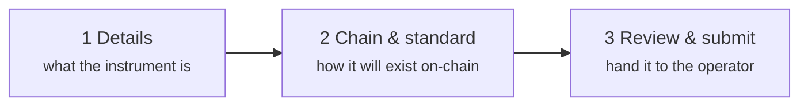
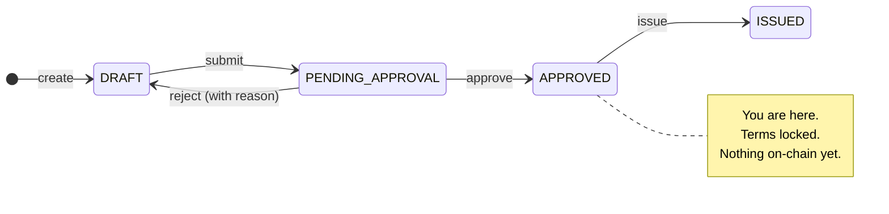

# Stage 1 — Design and approval

*Nordwind Energie has decided to borrow €50 million. Nothing exists yet but an intention.*

This stage turns that intention into a precisely described instrument that a computer can administer and a regulator can inspect. **No blockchain is touched.** At the end of it, a human at the registry has looked at the proposal and said yes.

---

## What you do

In the **Issuer** workspace, *Issuances → New Issuance*. It is a three-step form.

### Step 1 — Details

The economics and the identity of the instrument: name, ISIN if it has one, jurisdiction, and — for a bond — face value, currency, issue and maturity dates, coupon rate, day count, payment frequency.

Two of these do more work than they look like they do:

**ISIN.** The twelve-character code that identifies the security worldwide. Registerwerk enforces that it is unique across the registry, but it does not issue one — you get it from your national numbering agency. You can create and even issue a security without one; you will simply have a harder time doing anything with the outside world.

**Jurisdiction.** This is not a label. It selects which body of rules the platform applies to this instrument for the rest of its life — which register content is mandatory, which reports are generated, what the operator must check. Changing it later is not a matter of editing a field. See [Legal frameworks](../../legal/index.md).

??? note "For the specialist: the bond terms in full"

    Bond instruments carry a separate terms record alongside the asset: face value, currency, issue date, maturity date, coupon rate, reference rate and spread (for floating-rate paper), day count convention, payment frequency, callability with an optional call schedule, and **issue price** as a fraction of face value.

    Issue price defaults to `1.0` — par. It matters for zero-coupon bonds, which pay no interest and instead compensate the investor by being sold below face value: buy at €800, receive €1,000 in five years. Without a genuine issue price a zero-coupon bond cannot be represented at all.

    Day count convention (ACT/360, ACT/365, 30/360, …) decides how a partial year is turned into a fraction when interest is calculated. It is unglamorous and it changes the money.

### Step 2 — Chain and standard

Two decisions, and this is where tokenisation actually enters the story.

**Which blockchain.** Ethereum and its relatives, Solana, Canton, StarkNet, Stellar — and for each, mainnet or testnet. [Supported blockchains](../../blockchains/index.md) compares them.

**Which token standard.** This is the important one, and it deserves the space below.

### Step 3 — Review and submit

A summary, then submit. The issuance moves from `DRAFT` to `PENDING_APPROVAL` and **you can no longer edit it**. It is now with the operator.

---

## Choosing a token standard

A token standard is the agreed set of rules a token contract follows, so that wallets, exchanges and other contracts know how to deal with it without special-casing every issuer.

For a plain bond like Nordwind's, the real choice is between two:

=== "ERC-20 — the simple one"

    Every unit is identical and freely interchangeable, like cash. Understood by every wallet and every exchange in existence.

    **The problem:** ERC-20 has no concept of who is allowed to hold it. Anybody who receives a unit owns it. For a regulated security this is usually disqualifying — you cannot let a bond restricted to professional investors land in an anonymous wallet because someone sent it there.

    Reasonable when transfer restrictions are genuinely enforced somewhere else, or for a pilot on a testnet.

    [:octicons-arrow-right-24: ERC-20 in detail](../../token-standards/erc20.md)

=== "ERC-3643 — the regulated one"

    Also called **T-REX**. An ERC-20 with an identity and compliance layer welded on, and the usual answer for a real security.

    Before any transfer completes, the contract itself asks: *is the receiver a registered identity? do they hold the claims this instrument requires? does this transfer break a rule — a holder cap, a country restriction, a lock-up?* If any answer is wrong, the transfer **reverts**. Not flagged for review afterwards — refused, on-chain, at the moment it is attempted.

    This is what makes a security token a security token: the rules are not a policy document, they are executable code that runs before the transfer.

    [:octicons-arrow-right-24: ERC-3643 in detail](../../token-standards/erc3643.md)

Other standards exist for other shapes of instrument: ERC-1155 where one contract must carry many series; ERC-3525 for semi-fungible instruments that share a slot but differ in value; ERC-4626 and ERC-7540 for funds and vaults; DAML on Canton where privacy between counterparties is the requirement; SPL-2022 on Solana. [Choosing a token standard](../issuers/token-standards.md) walks through the decision properly.

!!! tip "Nordwind chooses ERC-3643"
    The bond is offered to professional investors under a prospectus exemption, so only verified investors may hold it. That requirement has to be enforced by the token itself, and ERC-3643 is how.

??? note "For the specialist: how ERC-3643 actually blocks a transfer"

    Four contracts, and the token is only one of them.

    - **ONCHAINID** — an identity contract per party, holding signed *claims* about them ("KYC verified", "accredited", "resident of Germany"). The identity is the contract address; the claims are attestations from issuers the registry trusts.
    - **Trusted Issuers Registry** — which claim issuers count, for which claim topics (1 = KYC, 2 = AML, 3 = Accreditation).
    - **Identity Registry** — the mapping from wallet address to ONCHAINID, plus a country code.
    - **Compliance** — the rule modules: holder caps, per-country limits, lock-ups, maximum balance.

    On every `transfer`, the token calls `canTransfer`. That resolves the receiver's wallet to an identity, checks the identity holds valid claims from trusted issuers, then asks each compliance module. One `false` and the whole transaction reverts.

    The consequence worth internalising: **a transfer to a wallet that is not registered will always fail.** This is not a bug, and it is the single most common surprise for investors used to ordinary tokens. It also means admitting an investor is a prerequisite for them receiving anything, not a formality afterwards.

---

## What the operator does

The submission lands in the operator's queue. A human reviews it — the instrument's terms, the issuer's standing, the jurisdiction, the KYC status of the issuing entity, whether the chain and standard fit what is being claimed.

Then one of two things happens:

| | |
|---|---|
| **Approved** | Status becomes `APPROVED`. Terms are locked. You may now deploy. |
| **Rejected** | Status returns to `DRAFT` with a recorded reason. You edit and resubmit. |

!!! info "There is no `REJECTED` state"
    A rejection sends the issuance back to `DRAFT`, where it is editable again. The rejection reason is recorded in the audit log, but the issuance itself does not sit in a dead-end state. This differs from some other registries, and it is deliberate — a rejected draft is a draft.

Every one of these transitions is written to a tamper-evident [audit log](../../platform/audit-log.md), with who did it and when.

---

## Where you are

The bond is fully described, approved, and exists only in the register.

Next: making it real.

[Stage 2: Primary issuance :octicons-arrow-right-24:](primary-issuance.md){ .md-button .md-button--primary }
