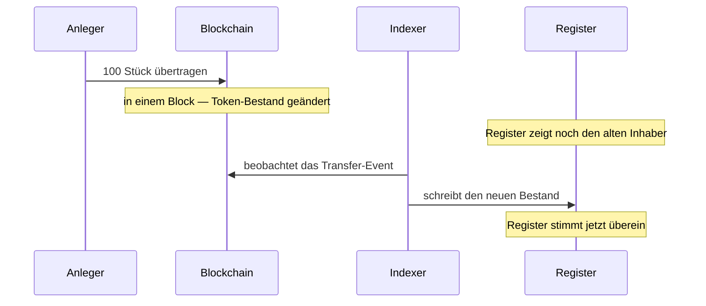

# Station 3 — Verwahrung und Bestand

*Fünfzig Anleger besitzen jetzt ein Stück von Nordwinds Anleihe. Was genau haben sie?*

Das ist die Station, in der nichts geschieht — und diejenige, die darüber entscheidet, ob alles andere funktioniert. Sie lohnt langsames Lesen.

---

## Zwei Aufzeichnungen, eine Wahrheit

Sagen wir es deutlich, denn alles Weitere folgt daraus:

**Registerwerk führt dieselbe Eigentumstatsache an zwei Stellen, und die beiden können auseinanderdriften.**

!!! abstract "Das Register"
    Eine Zeile in der Datenbank des Betreibers. Nennt Inhaber, Nennbetrag, Eintragungsart, Beschränkungen, Rechte Dritter.

    **Das ist die rechtlich maßgebliche Aufzeichnung.** Nach §16 eWpG bestimmt sich die Inhaberschaft an einem elektronischen Wertpapier nach dem Register.

!!! abstract "Der Token"
    Ein Bestand in einem Smart Contract auf einer Blockchain. Öffentlich, von jedermann überprüfbar, und das, was sich bei einer Übertragung tatsächlich bewegt.

    **Das ist die Aufzeichnung, die ausführt.** Sie ist das, was eine Gegenpartei unabhängig prüfen kann.

Im Idealfall stimmen beide überein. Meistens tun sie das. Aber sie werden von unterschiedlichen Mechanismen in unterschiedlichem Tempo aktualisiert, und es gibt Momente, in denen sie es nicht tun.

Zwischen dem zweiten und dem vierten Schritt weichen die beiden Aufzeichnungen voneinander ab — meist für Sekunden, gelegentlich länger, wenn ein Indexer zurückliegt oder eine Chain überlastet ist.

!!! question "Welche gilt denn nun?"
    **Das Register.** Immer. Die Blockchain ist maßgeblich dafür, was die Blockchain getan hat; sie ist nicht maßgeblich dafür, wem ein Wertpapier nach deutschem Recht gehört.

    Praktisch relevant wird das in einer bestimmten Lage: jemand bewegt Token unmittelbar on-chain, von Wallet zu Wallet, an der Plattform vorbei. Bei einem ERC-3643-Wertpapier müssen beide Wallets bereits zugelassen sein, das Papier kann also nicht in unbefugte Hände geraten — aber es *kann* ein Register entstehen, das bis zum Nachziehen des Indexers nicht der Wirklichkeit entspricht, und eine Übertragung ohne dahinterstehende Order.

---

## Wo Ihre Anleihe wirklich liegt

Eine Frage, die einfach klingt und es nicht ist.

Ihre Stücke sind ein Bestand, der **einer Wallet-Adresse** zugeordnet ist, innerhalb eines Contracts, auf einer Blockchain. Die Token liegen nicht „in" Ihrer Wallet, so wie eine Datei in einem Ordner liegt. Der Contract führt eine Tabelle von Adresse zu Bestand, und neben Ihrer Adresse steht eine Zahl.

Was Ihre Wallet tatsächlich hält, ist ein **privater Schlüssel** — ein Geheimnis, mit dem Sie Änderungen an dieser Zeile autorisieren können. Daraus folgt der einzige Satz in dieser Dokumentation, der Sie alles kosten kann:

!!! danger "Schlüssel verloren heißt: Token nicht mehr bewegbar"
    Ein privater Schlüssel kann nicht zurückgesetzt, wiederhergestellt oder neu ausgegeben werden. Niemand — weder der Registerbetreiber noch der Emittent — kann den Zugriff auf eine Wallet wiederherstellen, deren Schlüssel weg ist.

    Bei Registerwerk sind die Folgen milder als in der unregulierten Kryptowelt: Das *Register* führt Sie weiterhin als Inhaber, Ihr Anspruch gegen Nordwind besteht fort. Aber die Token zu bewegen erfordert eine vom Betreiber ausgeführte **Zwangsübertragung** nach §24 eWpG — eine förmliche, belegte Korrektur und keine Sache eines Nachmittags.

    [:octicons-arrow-right-24: Wallet verbinden — und sicher aufbewahren](../investors/wallet-setup.md)

### Endpunkte

Ein **Endpunkt** ist eine Wallet-Adresse, die Sie beim Register mit einer Bezeichnung hinterlegt haben. *Endpoints* in der oberen Leiste.

Das Registrieren bewirkt zweierlei: Es sagt der Plattform, wohin für Sie bestimmte Wertpapiere gehen sollen, und es erklärt, dass die Adresse Ihnen gehört — womit Sanktionsprüfung und Travel-Rule-Prüfungen gegen eine bekannte Partei laufen können statt gegen eine anonyme Zeichenkette.

??? note "Für Fachleute: Adressnormalisierung"

    EVM- und StarkNet-Adressen (`0x…`) werden in Kleinschreibung gespeichert. Prüfsummen- und Kleinschreibform derselben Adresse bezeichnen dasselbe Konto, und die Normalisierung beim Schreiben verhindert, dass ein vom Indexer geschriebener Bestand und eine im UI eingegebene Adresse nicht zusammenfinden.

    Solana- (Base58) und Stellar-Adressen (Base32) sind dagegen **case-sensitiv** und werden exakt so gespeichert, wie sie eingegeben wurden — Kleinschreibung würde sie zerstören. Die Normalisierung gilt daher nur für `0x`-Adressen.

---

## Was Sie sehen

*Positions* im Arbeitsbereich Investor oder Trader listet jeden Bestand, den Sie haben, über alle Assets und Chains hinweg.

| Spalte | Bedeutet |
|---|---|
| **Nominal amount** | Nennbetrag, den Sie halten. 100 Stück Nordwind = 100.000 € Nennbetrag. |
| **Wallet** | Die Adresse, die ihn hält. |
| **Entry type** | Sammel- oder Einzeleintragung — siehe [Primäremission](primary-issuance.md#was-ein-registereintrag-enthalt). |
| **Status** | Aktiv oder gesperrt. |

*Investments* geht für einen einzelnen Bestand eine Ebene tiefer: die Konditionen des Instruments, seine On-Chain-Adresse, die Übertragungshistorie und Ihre Registerauszüge.

!!! note "Nennbetrag ist nicht Marktwert"
    Das Register erfasst den **Nennbetrag** — den Nennwert Ihres Anspruchs. Es ist nicht das, was Ihr Bestand heute wert ist.

    Ein Bestand von 100.000 € Nennbetrag in einer Anleihe, die bei 96 % des Nennwerts handelt, bringt beim sofortigen Verkauf 96.000 € und wird bei Fälligkeit trotzdem mit 100.000 € zurückgezahlt. Registerwerk ist ein Register, kein Bewertungsdienst: Es sagt Ihnen, was Sie halten, nicht, was jemand dafür zahlt.

---

## Wenn ein Bestand gesperrt ist

Manchmal muss ein Bestand eingefroren werden. Ein Gerichtsbeschluss. Ein Sanktionstreffer. Eine Verpfändung. Eine ungeklärte KYC-Lücke.

Registerwerk setzt das als **Sperrvermerk** nach §16 eWpG um — eine Beschränkung, die unmittelbar am Registereintrag vermerkt wird. Solange sie besteht, kann der Bestand nicht übertragen werden, und die Sperre ist in Ihren Positionen samt Grund sichtbar.

Eine Sperre nimmt Ihnen Ihr Wertpapier nicht weg. Es gehört Ihnen weiterhin, Sie erhalten weiterhin Zinsen und werden bei Fälligkeit zurückgezahlt. Was Sie verloren haben, ist die Möglichkeit, es zu bewegen.

[:octicons-arrow-right-24: Sperrvermerk im Detail](../../compliance/sperrvermerk.md)

??? note "Für Fachleute: Durchsetzung an zwei Stellen"

    Eine Sperre wird im Register durchgesetzt *und*, wo der Standard es unterstützt, on-chain — ERC-3643 bietet das Einfrieren von Adressen und von Teilbeständen.

    Beides ist nötig. Nur im Register durchgesetzt, bleiben die Token für jeden mit dem Schlüssel bewegbar. Nur on-chain durchgesetzt, fehlt jede rechtlich bedeutsame Aufzeichnung des Grundes. Sperren tragen ein optionales Ablaufdatum, damit befristete Beschränkungen von selbst enden und nicht davon abhängen, dass jemand daran denkt.

---

## Sanktionsprüfung und Travel Rule

Zwei Prüfungen laufen ständig im Hintergrund, und es lohnt zu wissen, dass es sie gibt, denn sie können Sie aufhalten.

Die **Sanktionsprüfung** gleicht die Beteiligten einer Übertragung mit Sanktionslisten ab. Ein Treffer bricht nichts stillschweigend ab — er erzeugt einen Fall zur menschlichen Beurteilung, und die Übertragung wartet. Falsch-Positive sind häufig (Namen sind nicht eindeutig), und sie aufzulösen ist Menschenarbeit, nicht Algorithmenarbeit.

Die **Travel Rule** (TFR) verlangt, dass Angaben zu Auftraggeber und Begünstigtem eine Übertragung oberhalb eines Schwellenwerts begleiten — das Krypto-Äquivalent zu dem, was eine Bank mit einer Überweisung mitschickt. Deshalb fragt die Registrierung eines Endpunkts, wem er gehört.

Beide sind [fail-closed](../../compliance/sanctions-screening.md): Ist der Prüfdienst nicht erreichbar, werden Übertragungen abgelehnt, statt ungeprüft durchgelassen zu werden.

??? note "Für Fachleute: Prüfung vertraulicher Übertragungen"

    Vertrauliche Token (Zama fhEVM) verschlüsseln Beträge on-chain — genau das Problem für eine Regel, die vom Betrag abhängt.

    Ein geplanter Dienst entschlüsselt die Events, die er sehen darf, und prüft sie, wobei er je Deployment einen Cursor führt. Der subtile Teil ist das Scheitern: Schlägt eine Entschlüsselung fehl, würde ein Vorrücken des Cursors die Prüfung dieser Übertragung dauerhaft und unbemerkt überspringen — während ewiges Wiederholen den Dienst bei einem tatsächlich defekten Event blockieren würde. Er wiederholt begrenzt oft, rückt dann vor und protokolliert auf ERROR, damit eine ungeprüfte Übertragung immer sichtbar ist statt entweder unsichtbar oder tödlich.

---

## Ihr Registerauszug

Halten Sie im Wege einer **Einzeleintragung** und sind Sie Verbraucher, steht Ihnen nach §19(2) eWpG ein *Registerauszug* zu — nach der Ersteintragung, nach jeder Sie betreffenden Änderung und mindestens jährlich.

Registerwerk erzeugt diese automatisch und bewahrt sie auf. Sie sind eigenständige Registeraufzeichnungen: aufbewahrt, prüfbar und noch nach Jahren reproduzierbar. Ein Auszug, den man nicht erneut erzeugen kann, beweist nichts.

Institutionelle Inhaber in einer Sammeleintragung fallen nicht unter diese Pflicht — deshalb sehen nicht alle Inhaber Auszüge.

---

## Wo Sie stehen

Fünfzig Anleger halten einen Anspruch gegen Nordwind, festgehalten in einem Register, das rechtlich maßgeblich ist, und gespiegelt auf einer Blockchain, die öffentlich überprüfbar ist. Fünf Jahre lang wird die Anleihe so daliegen.

Nur will einer von ihnen sein Geld früher zurück.

[Station 4: Sekundärmarkt :octicons-arrow-right-24:](secondary-market.md){ .md-button .md-button--primary }
