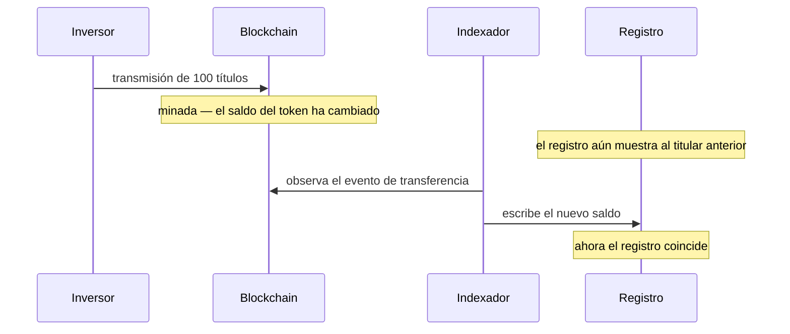

# Etapa 3 — Tenencia y custodia

*Cincuenta inversores poseen ya una parte del bono de Nordwind. ¿Qué tienen, concretamente?*

Es la etapa en la que no ocurre nada — y la que determina si todo lo demás funciona. Merece una lectura pausada.

---

## Dos registros, una verdad

Digámoslo con claridad, porque todo lo demás se deriva de aquí:

**Registerwerk mantiene el mismo hecho de propiedad en dos sitios, y ambos pueden separarse.**

!!! abstract "El registro"
    Una fila en la base de datos del operador. Nombra al titular, el valor nominal, el tipo de inscripción, las restricciones, los derechos de terceros.

    **Es el asiento con relevancia jurídica.** Conforme al §16 eWpG, la titularidad de un valor electrónico se determina por el registro.

!!! abstract "El token"
    Un saldo en un contrato inteligente sobre una blockchain. Público, verificable por cualquiera, y es lo que realmente se mueve en una transmisión.

    **Es el asiento que ejecuta.** Es lo que una contraparte puede comprobar de forma independiente.

En el caso ideal ambos coinciden. La mayor parte del tiempo lo hacen. Pero se actualizan mediante mecanismos distintos a ritmos distintos, y hay momentos en que no coinciden.

Entre el segundo y el cuarto paso, los dos asientos difieren — normalmente segundos, a veces más si un indexador va retrasado o una cadena está congestionada.

!!! question "¿Cuál prevalece, entonces?"
    **El registro.** Siempre. La blockchain hace fe de lo que la blockchain hizo; no hace fe de quién es dueño de un valor conforme al Derecho alemán.

    En la práctica esto importa en una situación concreta: alguien mueve tokens directamente on-chain, de monedero a monedero, sorteando la plataforma. En un valor ERC-3643 ambos monederos deben estar ya admitidos, así que el bono no puede acabar en manos no autorizadas — pero *sí* puede producir un registro que ya no se corresponde con la realidad hasta que el indexador se ponga al día, y una transmisión sin una orden detrás.

---

## Dónde está realmente su bono

Una pregunta que parece sencilla y no lo es.

Sus títulos son un saldo anotado frente a **una dirección de monedero**, dentro de un contrato, en una blockchain. Los tokens no están «en» su monedero como un archivo está en una carpeta. El contrato mantiene una tabla de dirección a saldo, y junto a su dirección hay un número.

Lo que su monedero contiene realmente es una **clave privada** — un secreto que le permite autorizar cambios en esa fila. De ahí la única frase de esta documentación que puede costarle todo:

!!! danger "Perder la clave es perder la capacidad de mover los tokens"
    Una clave privada no puede restablecerse, recuperarse ni reemitirse. Nadie — ni el operador del registro ni el emisor — puede restaurar el acceso a un monedero cuya clave ha desaparecido.

    En Registerwerk las consecuencias son más llevaderas que en la cripto no regulada: el *registro* sigue haciéndole constar como titular, de modo que su derecho frente a Nordwind subsiste. Pero mover los tokens exige una **transferencia forzosa** ejecutada por el operador al amparo del §24 eWpG, que es una corrección formal y documentada, no el trabajo de una tarde.

    [:octicons-arrow-right-24: Conectar un monedero — y custodiarlo con seguridad](../investors/wallet-setup.md)

### Puntos finales

Un **punto final** es una dirección de monedero que usted ha registrado ante el registro, con una etiqueta. *Endpoints* en la barra superior.

Registrarlo hace dos cosas: indica a la plataforma adónde enviar los valores destinados a usted, y declara que la dirección es suya — lo que permite que el filtrado de sanciones y los controles de la Travel Rule se ejecuten contra una parte conocida en lugar de contra una cadena de caracteres anónima.

??? note "Para especialistas: normalización de direcciones"

    Las direcciones EVM y StarkNet (`0x…`) se almacenan en minúsculas. Las formas con suma de verificación y en minúsculas de una misma dirección designan la misma cuenta, y normalizar en la escritura evita que un saldo escrito por un indexador y una dirección introducida en la interfaz no lleguen a coincidir nunca.

    Las direcciones de Solana (base58) y Stellar (base32), en cambio, **distinguen mayúsculas y minúsculas** y se almacenan exactamente como se introdujeron — pasarlas a minúsculas las corrompería. La normalización se aplica por tanto solo a las direcciones con prefijo `0x`.

---

## Lo que usted ve

*Positions*, en el espacio Investor o Trader, enumera cada posición que mantiene, en todos los activos y todas las cadenas.

| Columna | Significa |
|---|---|
| **Nominal amount** | El valor nominal que mantiene. 100 títulos de Nordwind = 100.000 € nominales. |
| **Wallet** | La dirección que lo mantiene. |
| **Entry type** | Inscripción colectiva o individual — véase [Emisión primaria](primary-issuance.md#que-contiene-una-inscripcion-registral). |
| **Status** | Activa o bloqueada. |

*Investments* baja un nivel para una posición concreta: las condiciones del instrumento, su dirección on-chain, el historial de transmisiones y sus extractos registrales.

!!! note "El nominal no es el valor de mercado"
    El registro recoge el **valor nominal** — el importe facial de su derecho. No es lo que vale su posición hoy.

    Una posición de 100.000 € nominales en un bono que cotiza al 96 % del par vale 96.000 € si vende ahora, y aun así amortizará 100.000 € al vencimiento. Registerwerk es un registro, no un servicio de valoración: le dice qué tiene, no cuánto le darán por ello.

---

## Cuando una posición está bloqueada

A veces una posición debe congelarse. Una resolución judicial. Una coincidencia en una lista de sanciones. Una pignoración. Una carencia de KYC sin resolver.

Registerwerk lo implementa como **bloqueo del titular** — el *Sperrvermerk* del §16 eWpG, una restricción anotada directamente sobre el asiento registral. Mientras está activa, la posición no puede transmitirse, y el bloqueo es visible en sus posiciones junto con su motivo.

Un bloqueo no le quita el valor. Sigue siendo suyo, sigue percibiendo intereses, será amortizado al vencimiento. Lo que ha perdido es la facultad de moverlo.

[:octicons-arrow-right-24: El Sperrvermerk en detalle](../../compliance/sperrvermerk.md)

??? note "Para especialistas: ejecución en dos sitios"

    Un bloqueo se aplica en el registro *y*, donde el estándar lo permite, on-chain — ERC-3643 expone la congelación de direcciones y de saldos parciales.

    Hacen falta ambos. Aplicado solo en el registro, los tokens siguen siendo movibles por quien tenga la clave. Aplicado solo on-chain, no queda ningún asiento jurídicamente significativo del motivo. Los bloqueos llevan una fecha de expiración opcional, para que las restricciones temporales se extingan por sí solas en lugar de depender de que alguien se acuerde.

---

## Filtrado de sanciones y Travel Rule

Dos comprobaciones se ejecutan continuamente en segundo plano, y conviene saber que existen porque pueden interrumpirle.

El **filtrado de sanciones** coteja a las partes de una transmisión con las listas de sanciones. Una coincidencia no cancela nada en silencio — abre un expediente para valoración humana, y la transmisión espera. Los falsos positivos son frecuentes (los nombres no son únicos) y resolverlos es trabajo de una persona, no de un algoritmo.

La **Travel Rule** (TFR) exige que la información sobre ordenante y beneficiario viaje junto a una transmisión por encima de cierto umbral — el equivalente cripto de lo que un banco envía con una transferencia. Por eso registrar un punto final pregunta de quién es.

Ambos son [de denegación por defecto](../../compliance/sanctions-screening.md): si el servicio de filtrado no está disponible, las transmisiones se rechazan en lugar de dejarse pasar sin comprobar.

??? note "Para especialistas: filtrar transmisiones confidenciales"

    Los tokens confidenciales (Zama fhEVM) cifran los importes on-chain — exactamente el problema para una regla que depende del importe.

    Un servicio programado descifra los eventos que está autorizado a ver y los filtra, llevando un cursor por despliegue. La parte sutil es el fallo: si un descifrado falla, avanzar el cursor saltaría de forma permanente y silenciosa el filtrado de esa transmisión — mientras que reintentar indefinidamente bloquearía el servicio ante un evento realmente defectuoso. Reintenta un número acotado de veces, luego avanza y registra en ERROR, de modo que una transmisión sin filtrar sea siempre visible en lugar de invisible o fatal.

---

## Su extracto registral

Si mantiene bajo **inscripción individual** y es consumidor, el §19(2) eWpG le da derecho a un *Registerauszug* — tras su inscripción inicial, tras cada cambio que le afecte y al menos una vez al año.

Registerwerk los genera automáticamente y los conserva. Son documentos registrales por derecho propio: conservados, auditables y reproducibles años después. Un extracto que no puede volver a generarse no prueba nada.

Los titulares institucionales en una inscripción colectiva quedan fuera de esta obligación — de ahí que no todos los titulares reciban extractos.

---

## Dónde está usted

Cincuenta inversores tienen un derecho de crédito frente a Nordwind, anotado en un registro que hace fe y reflejado en una blockchain verificable públicamente. El bono permanecerá así durante cinco años.

Salvo que uno de ellos quiere recuperar su dinero antes.

[Etapa 4: Mercado secundario :octicons-arrow-right-24:](secondary-market.md){ .md-button .md-button--primary }
