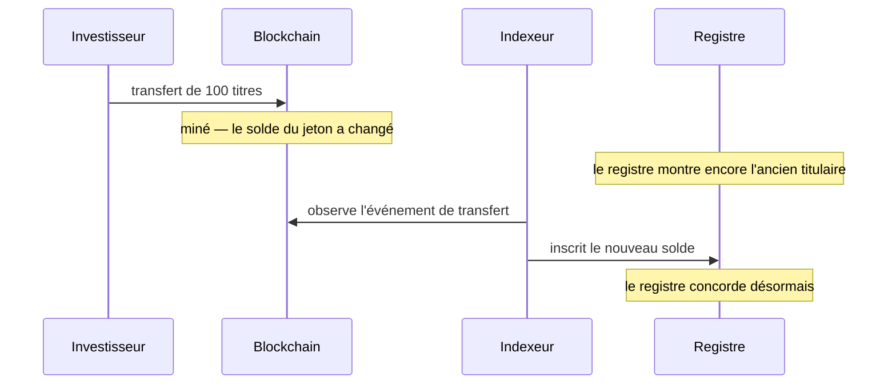

# Étape 3 — Détention et conservation

*Cinquante investisseurs possèdent désormais une part de l'obligation Nordwind. Que détiennent-ils, concrètement ?*

C'est l'étape où rien ne se passe — et celle qui détermine si tout le reste fonctionne. Elle mérite une lecture lente.

---

## Deux enregistrements, une vérité

Disons-le clairement, car tout le reste en découle :

**Registerwerk conserve le même fait de propriété à deux endroits, et les deux peuvent diverger.**

!!! abstract "Le registre"
    Une ligne dans la base de données de l'opérateur. Elle nomme le titulaire, la valeur nominale, le type d'inscription, les restrictions, les droits de tiers.

    **C'est l'enregistrement doté d'une portée juridique.** Au sens du §16 eWpG, la propriété d'un titre électronique est déterminée par le registre.

!!! abstract "Le jeton"
    Un solde dans un contrat intelligent sur une blockchain. Public, vérifiable par quiconque, et c'est lui qui se déplace réellement lors d'un transfert.

    **C'est l'enregistrement qui exécute.** C'est ce qu'une contrepartie peut vérifier de façon indépendante.

Idéalement, les deux concordent. La plupart du temps, c'est le cas. Mais ils sont mis à jour par des mécanismes différents à des rythmes différents, et il existe des moments où ils divergent.

Entre la deuxième et la quatrième étape, les deux enregistrements divergent — en général quelques secondes, parfois davantage si un indexeur est en retard ou si une chaîne est congestionnée.

!!! question "Alors lequel fait foi ?"
    **Le registre.** Toujours. La blockchain fait foi de ce que la blockchain a fait ; elle ne fait pas foi de savoir à qui appartient un titre au regard du droit allemand.

    En pratique, cela compte dans un cas précis : quelqu'un déplace des jetons directement on-chain, de portefeuille à portefeuille, en contournant la plateforme. Pour un titre ERC-3643, les deux portefeuilles doivent déjà être admis : l'obligation ne peut donc pas se retrouver entre des mains non autorisées — mais cela *peut* produire un registre qui ne correspond plus à la réalité jusqu'à ce que l'indexeur rattrape, et un transfert sans ordre derrière lui.

---

## Où se trouve réellement votre obligation

Une question qui paraît simple et ne l'est pas.

Vos titres sont un solde inscrit en regard d'**une adresse de portefeuille**, à l'intérieur d'un contrat, sur une blockchain. Les jetons ne sont pas « dans » votre portefeuille comme un fichier est dans un dossier. Le contrat tient une table adresse-vers-solde, et à côté de votre adresse figure un nombre.

Ce que votre portefeuille détient réellement, c'est une **clé privée** — un secret qui vous permet d'autoriser des modifications de cette ligne. D'où la seule phrase de cette documentation qui peut vous coûter tout ce que vous avez :

!!! danger "Perdre la clé, c'est perdre la capacité de déplacer les jetons"
    Une clé privée ne peut être ni réinitialisée, ni récupérée, ni réémise. Personne — ni l'opérateur du registre, ni l'émetteur — ne peut restaurer l'accès à un portefeuille dont la clé a disparu.

    Chez Registerwerk, les conséquences sont plus supportables que dans la crypto non régulée : le *registre* continue de vous inscrire comme titulaire, votre créance sur Nordwind subsiste donc. Mais déplacer les jetons exige un **transfert forcé** exécuté par l'opérateur au titre du §24 eWpG, qui est une correction formelle et documentée, pas l'affaire d'un après-midi.

    [:octicons-arrow-right-24: Connecter un portefeuille — et le conserver en sécurité](../investors/wallet-setup.md)

### Points de réception

Un **point de réception** est une adresse de portefeuille que vous avez enregistrée auprès du registre, avec un libellé. *Endpoints* dans la barre supérieure.

L'enregistrement fait deux choses : il indique à la plateforme où envoyer les titres qui vous sont destinés, et il déclare que l'adresse est la vôtre — ce qui permet au filtrage des sanctions et aux contrôles Travel Rule de s'exécuter contre une partie connue plutôt que contre une chaîne de caractères anonyme.

??? note "Pour les spécialistes : normalisation des adresses"

    Les adresses EVM et StarkNet (`0x…`) sont stockées en minuscules. Les formes à somme de contrôle et en minuscules d'une même adresse désignent le même compte, et normaliser à l'écriture évite qu'un solde inscrit par un indexeur et une adresse saisie dans l'interface ne se rejoignent jamais.

    Les adresses Solana (base58) et Stellar (base32) sont en revanche **sensibles à la casse** et sont stockées exactement telles que saisies — les passer en minuscules les corromprait. La normalisation ne s'applique donc qu'aux adresses préfixées `0x`.

---

## Ce que vous voyez

*Positions*, dans l'espace Investor ou Trader, liste chaque position que vous détenez, tous actifs et toutes chaînes confondus.

| Colonne | Signifie |
|---|---|
| **Nominal amount** | La valeur nominale que vous détenez. 100 titres Nordwind = 100 000 € de nominal. |
| **Wallet** | L'adresse qui la détient. |
| **Entry type** | Inscription collective ou individuelle — voir [Émission primaire](primary-issuance.md#ce-que-contient-une-inscription-au-registre). |
| **Status** | Active, ou bloquée. |

*Investments* descend d'un niveau pour une position donnée : les conditions de l'instrument, son adresse on-chain, l'historique des transferts et vos relevés de registre.

!!! note "Le nominal n'est pas la valeur de marché"
    Le registre inscrit la **valeur nominale** — le montant facial de votre créance. Ce n'est pas ce que vaut votre position aujourd'hui.

    Une position de 100 000 € de nominal sur une obligation cotant 96 % du pair vaut 96 000 € si vous vendez maintenant, et remboursera tout de même 100 000 € à l'échéance. Registerwerk est un registre, pas un service de valorisation : il vous dit ce que vous détenez, pas ce que quelqu'un vous en donnera.

---

## Quand une position est bloquée

Il arrive qu'une position doive être gelée. Une décision de justice. Une correspondance sur une liste de sanctions. Un nantissement. Un manquement KYC non résolu.

Registerwerk met cela en œuvre sous forme de **blocage du titulaire** — le *Sperrvermerk* du §16 eWpG, une restriction portée directement sur l'inscription au registre. Tant qu'elle est active, la position ne peut pas être transférée, et le blocage est visible dans vos positions avec son motif.

Un blocage ne vous retire pas votre titre. Vous en êtes toujours propriétaire, vous percevez toujours les intérêts, vous serez toujours remboursé à l'échéance. Ce que vous avez perdu, c'est la faculté de le déplacer.

[:octicons-arrow-right-24: Le Sperrvermerk en détail](../../compliance/sperrvermerk.md)

??? note "Pour les spécialistes : une application à deux endroits"

    Un blocage est appliqué dans le registre *et*, là où la norme le permet, on-chain — ERC-3643 expose le gel d'adresse et le gel de solde partiel.

    Les deux sont nécessaires. Appliqué au seul registre, les jetons restent déplaçables par quiconque détient la clé. Appliqué à la seule chaîne, il ne reste aucune trace juridiquement significative du motif. Les blocages portent une échéance facultative, afin que les restrictions à durée déterminée s'éteignent d'elles-mêmes plutôt que de dépendre de la mémoire de quelqu'un.

---

## Filtrage des sanctions et Travel Rule

Deux contrôles s'exécutent en permanence en arrière-plan, et il vaut la peine de savoir qu'ils existent, car ils peuvent vous interrompre.

Le **filtrage des sanctions** compare les parties à un transfert aux listes de sanctions. Une correspondance n'annule rien en silence — elle ouvre un dossier pour appréciation humaine, et le transfert attend. Les faux positifs sont fréquents (les noms ne sont pas uniques) et les résoudre est le travail d'une personne, pas d'un algorithme.

La **Travel Rule** (TFR) exige que les informations sur le donneur d'ordre et le bénéficiaire accompagnent un transfert au-delà d'un seuil — l'équivalent crypto de ce qu'une banque transmet avec un virement. C'est pourquoi l'enregistrement d'un point de réception demande à qui il appartient.

Les deux sont [en rejet par défaut](../../compliance/sanctions-screening.md) : si le service de filtrage est indisponible, les transferts sont refusés plutôt que laissés passer sans contrôle.

??? note "Pour les spécialistes : filtrer des transferts confidentiels"

    Les jetons confidentiels (Zama fhEVM) chiffrent les montants on-chain — exactement le problème pour une règle qui dépend du montant.

    Un service planifié déchiffre les événements qu'il est autorisé à voir et les filtre, en suivant un curseur par déploiement. La subtilité est dans l'échec : si un déchiffrement échoue, avancer le curseur sauterait définitivement et silencieusement le filtrage de ce transfert — tandis que réessayer indéfiniment bloquerait le service sur un événement réellement défectueux. Il réessaie un nombre borné de fois, puis avance et journalise en ERROR, de sorte qu'un transfert non filtré soit toujours visible plutôt qu'invisible ou fatal.

---

## Votre relevé de registre

Si vous détenez au titre d'une **inscription individuelle** et que vous êtes un consommateur, le §19(2) eWpG vous ouvre droit à un *Registerauszug* — un relevé du contenu du registre vous concernant — après votre inscription initiale, après chaque changement vous concernant, et au moins une fois par an.

Registerwerk les produit automatiquement et les conserve. Ce sont des documents de registre à part entière : conservés, auditables et reproductibles des années plus tard. Un relevé que l'on ne peut pas régénérer ne prouve rien.

Les titulaires institutionnels d'une inscription collective échappent à cette obligation — d'où le fait que tous les titulaires n'en reçoivent pas.

---

## Où vous en êtes

Cinquante investisseurs détiennent une créance sur Nordwind, consignée dans un registre qui fait foi et reflétée sur une blockchain vérifiable publiquement. L'obligation restera ainsi pendant cinq ans.

Sauf que l'un d'eux veut récupérer son argent plus tôt.

[Étape 4 : Marché secondaire :octicons-arrow-right-24:](secondary-market.md){ .md-button .md-button--primary }
