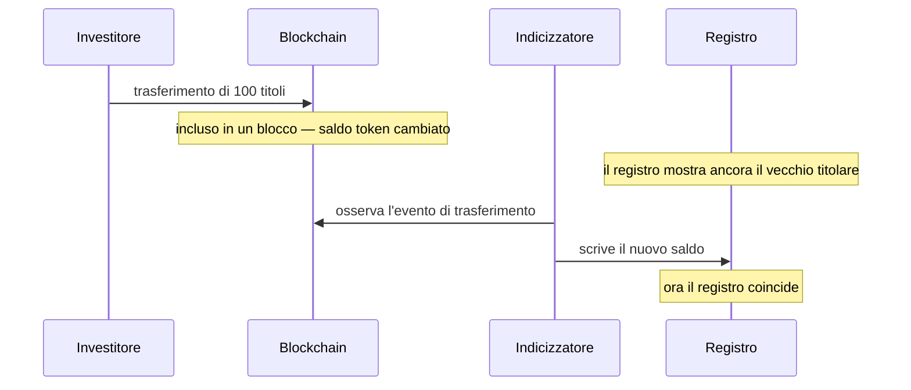

# Fase 3 — Detenzione e custodia

*Cinquanta investitori possiedono ora una parte dell'obbligazione Nordwind. Che cosa hanno, concretamente?*

È la fase in cui non succede nulla — e quella che determina se tutto il resto funziona. Merita una lettura lenta.

---

## Due registrazioni, una verità

Diciamolo chiaramente, perché tutto il resto ne discende:

**Registerwerk tiene lo stesso fatto di proprietà in due posti, e i due possono divergere.**

!!! abstract "Il registro"
    Una riga nella banca dati dell'operatore. Indica il titolare, il valore nominale, il tipo di iscrizione, le restrizioni, i diritti di terzi.

    **È la registrazione con rilevanza giuridica.** Ai sensi del §16 eWpG, la titolarità di uno strumento elettronico è determinata dal registro.

!!! abstract "Il token"
    Un saldo in uno smart contract su una blockchain. Pubblico, verificabile da chiunque, ed è ciò che si muove davvero quando avviene un trasferimento.

    **È la registrazione che esegue.** È ciò che una controparte può verificare in modo indipendente.

Idealmente coincidono. Il più delle volte è così. Ma vengono aggiornate da meccanismi diversi a velocità diverse, e ci sono momenti in cui non coincidono.

Tra il secondo e il quarto passaggio le due registrazioni divergono — di solito per secondi, occasionalmente più a lungo se un indicizzatore è indietro o una chain è congestionata.

!!! question "Quale fa fede, allora?"
    **Il registro.** Sempre. La blockchain fa fede di ciò che la blockchain ha fatto; non fa fede di chi sia proprietario di uno strumento secondo il diritto tedesco.

    In pratica questo conta in una situazione precisa: qualcuno muove token direttamente on-chain, da wallet a wallet, aggirando la piattaforma. Per uno strumento ERC-3643 entrambi i wallet devono essere già ammessi, quindi l'obbligazione non può finire in mani non autorizzate — ma *può* produrre un registro che non corrisponde più alla realtà finché l'indicizzatore non recupera, e un trasferimento senza alcun ordine dietro.

---

## Dov'è davvero la tua obbligazione

Una domanda che sembra semplice e non lo è.

I tuoi titoli sono un saldo registrato a fronte di **un indirizzo wallet**, dentro un contratto, su una blockchain. I token non sono «dentro» il tuo wallet come un file è dentro una cartella. Il contratto tiene una tabella indirizzo-saldo, e accanto al tuo indirizzo c'è un numero.

Ciò che il tuo wallet contiene davvero è una **chiave privata** — un segreto che ti consente di autorizzare modifiche a quella riga. Da cui l'unica frase di questa documentazione che può costarti tutto:

!!! danger "Perdere la chiave significa perdere la possibilità di muovere i token"
    Una chiave privata non può essere reimpostata, recuperata o riemessa. Nessuno — né l'operatore del registro né l'emittente — può ripristinare l'accesso a un wallet la cui chiave è andata perduta.

    In Registerwerk le conseguenze sono più sopportabili che nella cripto non regolamentata: il *registro* continua a riportarti come titolare, quindi il tuo credito verso Nordwind sopravvive. Ma muovere i token richiede un **trasferimento coattivo** eseguito dall'operatore ai sensi del §24 eWpG, che è una correzione formale e documentata, non il lavoro di un pomeriggio.

    [:octicons-arrow-right-24: Collegare un wallet — e custodirlo in sicurezza](../investors/wallet-setup.md)

### Endpoint

Un **endpoint** è un indirizzo wallet che hai registrato presso il registro, con un'etichetta. *Endpoints* nella barra superiore.

Registrarlo fa due cose: dice alla piattaforma dove inviare gli strumenti destinati a te, e dichiara che l'indirizzo è tuo — il che consente allo screening sanzioni e ai controlli Travel Rule di operare su una parte nota anziché su una stringa anonima.

??? note "Per gli specialisti: normalizzazione degli indirizzi"

    Gli indirizzi EVM e StarkNet (`0x…`) sono memorizzati in minuscolo. Le forme con checksum e in minuscolo dello stesso indirizzo indicano lo stesso conto, e normalizzare in scrittura evita che un saldo scritto dall'indicizzatore e un indirizzo digitato nell'interfaccia non si incontrino mai.

    Gli indirizzi Solana (base58) e Stellar (base32) sono invece **sensibili alle maiuscole** e vengono memorizzati esattamente come inseriti — convertirli in minuscolo li corromperebbe. La normalizzazione si applica quindi solo agli indirizzi con prefisso `0x`.

---

## Che cosa vedi

*Positions*, nell'area Investor o Trader, elenca ogni posizione che detieni, su tutti gli asset e tutte le chain.

| Colonna | Significa |
|---|---|
| **Nominal amount** | Il valore nominale che detieni. 100 titoli Nordwind = 100.000 € nominali. |
| **Wallet** | L'indirizzo che lo detiene. |
| **Entry type** | Iscrizione collettiva o individuale — vedi [Emissione primaria](primary-issuance.md#che-cosa-contiene-uniscrizione-a-registro). |
| **Status** | Attiva o bloccata. |

*Investments* scende di un livello su una singola posizione: le condizioni dello strumento, il suo indirizzo on-chain, lo storico dei trasferimenti e i tuoi estratti di registro.

!!! note "Il nominale non è il valore di mercato"
    Il registro riporta il **valore nominale** — l'importo facciale del tuo credito. Non è quanto vale oggi la tua posizione.

    Una posizione da 100.000 € nominali su un'obbligazione che quota il 96 % della pari vale 96.000 € se vendi adesso, e rimborserà comunque 100.000 € a scadenza. Registerwerk è un registro, non un servizio di valutazione: ti dice che cosa detieni, non quanto qualcuno ti darà.

---

## Quando una posizione è bloccata

A volte una posizione va congelata. Un provvedimento giudiziario. Una corrispondenza con una lista sanzioni. Una costituzione in garanzia. Una carenza KYC irrisolta.

Registerwerk lo realizza come **blocco del titolare** — il *Sperrvermerk* del §16 eWpG, una restrizione annotata direttamente sull'iscrizione a registro. Finché è attiva, la posizione non può essere trasferita, e il blocco è visibile nelle tue posizioni con la relativa motivazione.

Un blocco non ti toglie lo strumento. Resti proprietario, continui a percepire gli interessi, sarai rimborsato a scadenza. Ciò che hai perso è la facoltà di muoverlo.

[:octicons-arrow-right-24: Il Sperrvermerk in dettaglio](../../compliance/sperrvermerk.md)

??? note "Per gli specialisti: applicazione in due luoghi"

    Un blocco viene applicato nel registro *e*, dove lo standard lo consente, on-chain — ERC-3643 espone il congelamento dell'indirizzo e del saldo parziale.

    Servono entrambi. Applicato solo nel registro, i token restano muovibili da chiunque possieda la chiave. Applicato solo on-chain, non resta alcuna traccia giuridicamente significativa del motivo. I blocchi portano una scadenza facoltativa, così che le restrizioni a termine si estinguano da sole anziché dipendere dalla memoria di qualcuno.

---

## Screening sanzioni e Travel Rule

Due controlli girano di continuo in secondo piano, e vale la pena sapere che esistono, perché possono interromperti.

Lo **screening sanzioni** confronta le parti di un trasferimento con le liste sanzioni. Una corrispondenza non annulla nulla in silenzio — apre un caso per una valutazione umana, e il trasferimento attende. I falsi positivi sono frequenti (i nomi non sono univoci) e risolverli è lavoro di una persona, non di un algoritmo.

La **Travel Rule** (TFR) impone che le informazioni su ordinante e beneficiario accompagnino un trasferimento oltre una soglia — l'equivalente cripto di ciò che una banca trasmette con un bonifico. Per questo la registrazione di un endpoint chiede a chi appartiene.

Entrambi sono [a rifiuto in caso di errore](../../compliance/sanctions-screening.md): se il servizio di screening non è raggiungibile, i trasferimenti vengono rifiutati anziché lasciati passare senza controllo.

??? note "Per gli specialisti: screening dei trasferimenti riservati"

    I token riservati (Zama fhEVM) cifrano gli importi on-chain — esattamente il problema per una regola che dipende dall'importo.

    Un servizio pianificato decifra gli eventi che è autorizzato a vedere e li sottopone a screening, tenendo un cursore per ciascun deployment. La parte sottile è il fallimento: se una decifratura fallisce, avanzare il cursore salterebbe in modo permanente e silenzioso lo screening di quel trasferimento — mentre riprovare all'infinito bloccherebbe il servizio su un evento realmente difettoso. Riprova un numero limitato di volte, poi avanza e registra a livello ERROR, così che un trasferimento non sottoposto a screening sia sempre visibile anziché invisibile o fatale.

---

## Il tuo estratto di registro

Se detieni tramite **iscrizione individuale** e sei un consumatore, il §19(2) eWpG ti dà diritto a un *Registerauszug* — dopo l'iscrizione iniziale, dopo ogni variazione che ti riguarda e almeno una volta l'anno.

Registerwerk li genera automaticamente e li conserva. Sono documenti di registro a pieno titolo: conservati, verificabili e riproducibili anche anni dopo. Un estratto che non si può rigenerare non prova nulla.

I titolari istituzionali in un'iscrizione collettiva non rientrano in questo obbligo — ecco perché non tutti i titolari ricevono estratti.

---

## Dove sei

Cinquanta investitori detengono un credito verso Nordwind, annotato in un registro che fa fede e rispecchiato su una blockchain verificabile pubblicamente. L'obbligazione resterà così per cinque anni.

Solo che uno di loro vuole indietro il proprio denaro in anticipo.

[Fase 4: Mercato secondario :octicons-arrow-right-24:](secondary-market.md){ .md-button .md-button--primary }
