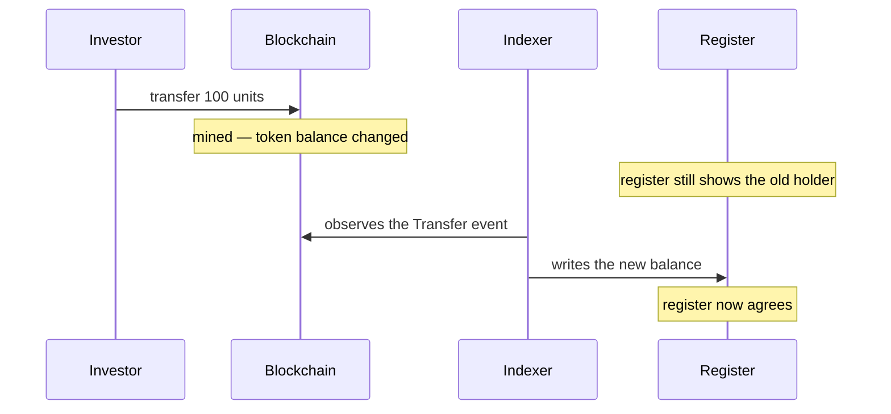

# Stage 3 — Holding and custody

*Fifty investors now own a piece of Nordwind's bond. What, concretely, do they have?*

This is the stage nothing happens in — and the one that determines whether everything else works. It is worth reading slowly.

---

## Two records, one truth

Say it plainly, because everything else follows from it:

**Registerwerk keeps the same ownership fact in two places, and they can drift apart.**

!!! abstract "The register"
    A row in the operator's database. Names the holder, the nominal amount, the entry type, restrictions, third-party rights.

    **This is the record with legal significance.** Under §16 eWpG, ownership of an electronic security is determined by the register.

!!! abstract "The token"
    A balance in a smart contract on a blockchain. Public, verifiable by anyone, and the thing that actually moves when a transfer happens.

    **This is the record that executes.** It is what a counterparty can independently check.

Ideally these agree. Usually they do. But they are updated by different mechanisms at different speeds, and there are moments when they do not.

Between the second and fourth step, the two records disagree — usually for seconds, occasionally for longer if an indexer is behind or a chain is congested.

!!! question "So which one is right?"
    **The register.** Always. The blockchain is authoritative about what the blockchain did; it is not authoritative about who owns a security under German law.

    In practice this matters in one specific situation: someone moves tokens directly on-chain, wallet to wallet, bypassing the platform. For an ERC-3643 security both wallets must already be admitted, so this cannot put the bond in unauthorised hands — but it *can* produce a register that no longer matches reality until the indexer catches up, and it produces a transfer with no order behind it.

---

## Where your bond actually is

A question that sounds simple and is not.

Your units are a balance recorded against **a wallet address**, inside a contract, on a blockchain. The tokens are not "in" your wallet the way a file is in a folder. The contract holds a table of address-to-balance, and your address has a number next to it.

What your wallet actually holds is a **private key** — a secret that lets you authorise changes to that row. Which leads to the only sentence in this documentation that can cost you everything:

!!! danger "Lose the key, lose the ability to move the tokens"
    A private key cannot be reset, recovered or reissued. Nobody — not the registry operator, not the issuer — can restore access to a wallet whose key is gone.

    In Registerwerk the consequences are more survivable than in unregulated crypto: the *register* still records you as the holder, so your claim against Nordwind survives. But moving the tokens requires an operator-executed **forced transfer** under §24 eWpG, which is a formal, evidenced correction and not an afternoon's work.

    [:octicons-arrow-right-24: Connecting a wallet — and how to hold it safely](../investors/wallet-setup.md)

### Endpoints

An **endpoint** is a wallet address you have registered with the registry, with a label. *Endpoints* in the top bar.

Registering does two things: it tells the platform where to send securities meant for you, and it declares that the address is yours — which lets sanctions screening and Travel Rule checks run against a known party rather than an anonymous string.

??? note "For the specialist: address normalisation"

    EVM and StarkNet addresses (`0x…`) are stored lowercase. Checksummed and lowercase forms of the same address are the same account, and normalising at write time prevents an indexer-written balance and a UI-entered address failing to match.

    Solana (base58) and Stellar (base32) addresses are **case-sensitive** and are stored exactly as entered — lowercasing them would corrupt them. Normalisation is therefore applied only to `0x`-prefixed addresses.

---

## What you can see

*Positions* in the Investor or Trader workspace lists every holding you have, across every asset and chain.

| Column | Means |
|---|---|
| **Nominal amount** | Face value you hold. 100 units of Nordwind = €100,000 nominal. |
| **Wallet** | The address holding it. |
| **Entry type** | Collective or individual — see [Primary issuance](primary-issuance.md#what-a-register-entry-contains). |
| **Status** | Active, or blocked. |

*Investments* goes one level deeper for a single holding: the instrument's terms, its on-chain address, the transfer history, and your register statements.

!!! note "Nominal is not market value"
    The register records **nominal** — the face value of your claim. It is not what the bond is worth today.

    A €100,000 nominal holding in a bond trading at 96% of face value is worth €96,000 if you sell it now, and will still repay €100,000 at maturity. Registerwerk is a register, not a valuation service: it tells you what you hold, not what somebody will pay for it.

---

## When a holding is blocked

Sometimes a holding must be frozen. A court order. A sanctions match. A pledge to a lender. An unresolved KYC lapse.

Registerwerk implements this as a **holder block** — the §16 eWpG *Sperrvermerk*, a restriction noted directly against the register entry. While active, the holding cannot be transferred, and the block is visible in your positions with its reason.

A block does not take your security away. You still own it, still receive interest, still get repaid at maturity. What you have lost is the ability to move it.

[:octicons-arrow-right-24: Sperrvermerk in detail](../../compliance/sperrvermerk.md)

??? note "For the specialist: enforcement in two places"

    A block is enforced in the register *and*, where the standard supports it, on-chain — ERC-3643 exposes address freezing and partial-balance freezing.

    Both are needed. Register-only enforcement leaves the tokens movable by anyone holding the key. Chain-only enforcement leaves no legally meaningful record of why. Blocks carry an optional expiry so that time-limited restrictions lapse on their own instead of relying on someone remembering.

---

## Sanctions screening and the Travel Rule

Two checks run continuously in the background, and it is worth knowing they exist because they can interrupt you.

**Sanctions screening** matches the parties to a transfer against sanctions lists. A hit does not silently cancel anything — it raises a case for a human to assess, and the transfer waits. False positives are common (names are not unique) and resolving them is a person's job, not an algorithm's.

**The Travel Rule** (TFR) requires that information about the originator and beneficiary travels alongside a transfer above a threshold — the crypto equivalent of the information a bank sends with a wire. This is why registering an endpoint asks who owns it.

Both are [fail-closed](../../compliance/sanctions-screening.md): if the screening service is unavailable, transfers are refused rather than allowed through unscreened.

??? note "For the specialist: screening confidential transfers"

    Confidential tokens (Zama fhEVM) encrypt amounts on-chain, which is exactly the problem for a rule that depends on the amount.

    A scheduled service decrypts events it is authorised to see and screens them, tracking a per-deployment cursor. The subtle part is failure: if a decrypt fails, advancing the cursor would permanently and silently skip screening for that transfer — while retrying forever would wedge the service on a genuinely broken event. It retries a bounded number of times, then advances and logs at ERROR, so an unscreened transfer is always visible rather than either invisible or fatal.

---

## Your register statement

If you hold under an **individual entry** and you are a consumer, §19(2) eWpG entitles you to a *Registerauszug* — a statement of the register content concerning you — after your initial entry, after every change affecting you, and at least annually.

Registerwerk generates these automatically and keeps them. They are register records in their own right: retained, auditable, and reproducible years later. A statement you cannot produce again is not evidence.

Institutional holders in a collective entry are outside this obligation, which is why not every holder sees statements.

---

## Where you are

Fifty investors hold a claim on Nordwind, recorded in a register that is legally authoritative and mirrored on a blockchain that is publicly verifiable. The bond will sit like this for five years.

Except that one of them wants their money back early.

[Stage 4: Secondary trading :octicons-arrow-right-24:](secondary-market.md){ .md-button .md-button--primary }
