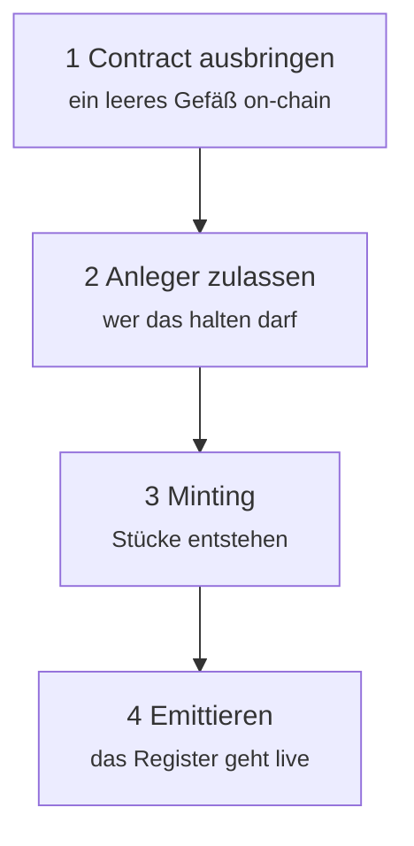
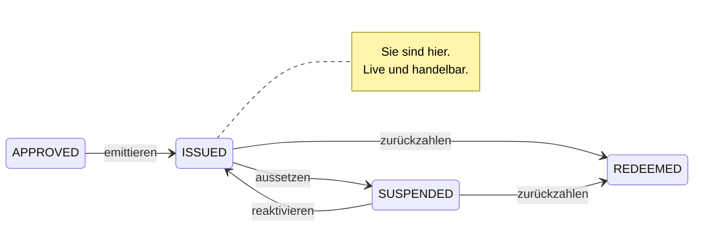

# Station 2 — Primäremission

*Die Anleihe ist genehmigt. Jetzt muss sie real werden.*

Die **Primäremission** ist das Geschäft zwischen Emittent und den ersten Anlegern: der einzige Zeitpunkt, an dem Nordwind Geld erhält. Alles danach — jeder Handel, jeder Kredit — sind Geschäfte der Anleger untereinander. Nordwinds Bilanz bleibt davon unberührt.

Diese Unterscheidung lohnt sich zu merken, denn sie erklärt, warum diese Station so streng kontrolliert ist und die späteren vergleichsweise frei.

---

## Die Reihenfolge

Die Reihenfolge ist nicht beliebig. Unter ERC-3643 kann ein nicht zugelassener Anleger **keine Token empfangen** — die Übertragung wird rückabgewickelt. Wer vor der Zulassung mintet, erzeugt nichts als fehlgeschlagene Transaktionen.

---

## 1. Contract ausbringen

*Issuances → Ihre Emission → Deploy.*

Registerwerk sendet die Transaktion, die den Contract auf die gewählte Blockchain bringt, und erfasst die entstandene Adresse. Bei ERC-3643 ist das nicht ein Contract, sondern die ganze Suite — Token, Identity Registry, Trusted Issuers Registry, Compliance — miteinander verdrahtet.

Sie sehen einen **Transaktions-Hash** (die Quittung) und eine **Contract-Adresse** (wo die Anleihe nun liegt). Beides ist öffentlich; jeder kann es in einem Block-Explorer nachschlagen.

An diesem Punkt existiert der Contract und hält **null Stücke**. Niemand besitzt etwas.

??? note "Für Fachleute: deterministische Adressen"

    Die Factory bringt mit `CREATE2` aus, die Contract-Adresse ist also eine reine Funktion aus Deployer, Salt und Bytecode. Sie lässt sich daher *vor* dem Ausbringen berechnen.

    Das ist kein Kunststück. Es bedeutet, dass die Adresse im Register erfasst, Gegenparteien mitgeteilt und in Verträgen referenziert werden kann, bevor die Transaktion in einem Block liegt — und dass ein fehlgeschlagenes, wiederholtes Deployment an derselben Adresse landet. Nachgelagerte Systeme müssen nicht auf eine Quittung warten, um zu wissen, wo sie suchen sollen.

    [:octicons-arrow-right-24: Auf eine Blockchain ausbringen](../issuers/deploying-to-chain.md)

---

## 2. Anleger zulassen

*Issuance → Investors → Add investor.*

Nordwinds Platzeur hat Käufer gefunden. Bevor einer davon auch nur ein Stück empfangen kann, muss er zugelassen werden:

1. **Sein Rechtsträger muss aufgenommen und KYC-genehmigt sein.** Nicht nach Einschätzung des Emittenten — nach Prüfung des Betreibers. Siehe [KYC prüfen](../../operator/customers/kyc-process.md).
2. **Er muss eine Wallet-Adresse registrieren** (einen *Endpunkt*), auf die empfangen wird. Siehe [Wallet verbinden](../investors/wallet-setup.md).
3. **Er wird in die Identity Registry eingetragen** — das ist die Zulassung on-chain.

Erst dann kann er die Anleihe halten.

!!! warning "Diesen Schritt unterschätzen die meisten"
    Die Zulassung von Anlegern ist kein Verwaltungsaufwand, den man später nachholt. Sie ist eine Voraussetzung, die der Token-Contract selbst durchsetzt. Ein Emittent, der vor der Zulassung gemintet hat, hat einen Contract voller Stücke und keine rechtmäßige Möglichkeit, sie zu bewegen.

### Was ein Registereintrag enthält

Jeder zugelassene Anleger wird zum **Inhaber** — einer Zeile im Register. Nach §16 eWpG ist das die maßgebliche Aufzeichnung, und das deutsche Recht kennt zwei Formen:

=== "Sammeleintragung"

    Das Register nennt einen **Verwahrer**, der für viele dahinterstehende Anleger hält. Das Register sieht den Verwahrer; der Verwahrer führt eigene Bücher für seine Kunden.

    Das vertraute Modell und die Art, wie institutionelle Wertpapiere heute überwiegend gehalten werden.

=== "Einzeleintragung"

    Das Register nennt den **Anleger unmittelbar**, bezeichnet durch eine pseudonyme Kennung statt durch Klarnamen on-chain.

    §17(2) eWpG verlangt für diese Einträge mehr Inhalt: Rechte Dritter an dem Bestand, Verfügungsbeschränkungen und einen etwaigen Vermerk zur Rechtsfähigkeit des Inhabers. Und §19(2) verpflichtet den Emittenten, Verbraucher-Inhabern einen **Registerauszug** zu übermitteln — nach der Ersteintragung, nach jeder sie betreffenden Änderung und mindestens jährlich.

    Registerwerk erzeugt und bewahrt diese Auszüge als eigenständige Registeraufzeichnungen auf, denn ein Auszug, der sich später nicht reproduzieren lässt, beweist nichts.

Ein Asset kann beide Formen zugleich führen — das Register nennt das einen `MIXED`-Bestand.

---

## 3. Minting

*Issuance → Mint.*

**Minting** heißt, Stücke zu schaffen, die vorher nicht existierten, und sie einem Inhaber zuzuordnen. Das ist der Moment, in dem das Wertpapier entsteht.

Nordwind mintet 50.000 Stück auf ihre Anleger, in den jeweils gezeichneten Anteilen. Der Gesamtbestand des Token-Contracts geht von null auf 50.000. Jeder Registereintrag hält den Nennbetrag des Anlegers fest.

!!! danger "Minting ist die schärfste Kante im System"
    Minting schafft Wert aus dem Nichts. Ein Fehler hier ist keine falsche Zahl in einem Bericht — es sind echte Wertpapiere in den falschen Händen.

    Registerwerk behandelt es daher als kontrollierten Vorgang: **Mint-Kontrollregeln** können begrenzen, wie viel eine bestimmte Adresse jemals empfangen darf, der Vorgang verlangt [Step-up-Authentifizierung](../../compliance/step-up-mfa.md), und jedes Minting wird im Audit-Log mit der handelnden Person festgehalten.

### Wo das Geld bleibt

Beachten Sie, was die Plattform *nicht* getan hat: Sie hat keine 50 Millionen Euro bewegt.

Die Geldseite einer Primäremission — Anleger zahlen an Nordwind — ist eine Zahlungsfrage, und Registerwerk unterstützt dafür mehrere Antworten, genannt **Zahlungswege**:

| Weg | Was er ist |
|---|---|
| **Stablecoin** | Ein Token, der eine Währung abbildet und auf derselben Chain wie das Wertpapier läuft. |
| **Pontes** | Eine API für Echtzeit-Banküberweisungen. |
| **ERC-7573 DvP** | Ein Settlement-Contract, der beide Seiten voneinander abhängig macht. |
| **SEPA off-chain** | Eine gewöhnliche Banküberweisung, per Referenz abgeglichen. |

Der dritte verdient Aufmerksamkeit. **Lieferung gegen Zahlung** beseitigt das älteste Risiko der Wertpapierabwicklung: dass eine Seite leistet und die andere nicht. Bei LgZ bewegt sich das Wertpapier *genau dann*, wenn sich die Zahlung bewegt — nicht als Versprechen, sondern als Eigenschaft der Transaktion.

??? note "Für Fachleute: LgZ, und was es nicht beweist"

    `DvpSettlement.sol` setzt ein Muster nach Art von ERC-7573 um. Beide Seiten werden gegen einen Hash gesperrt; die Freigabe des Geheimnisses erfüllt beide oder keine. `EwpgBondDesk` zeigt dieselbe Token-und-Zahlung-in-einer-Transaktion-Form.

    Zwei ehrliche Einschränkungen:

    **Atomarität gilt pro Ledger.** Liegt das Wertpapier auf Ethereum und kommt das Geld per SEPA, kann kein Contract das atomar machen. Was LgZ dort liefert, ist eine bedingte Freigabe, keine einzelne Transaktion. Echte Atomarität verlangt beide Seiten auf demselben Ledger.

    **Technische Abwicklung ist keine rechtliche Erfüllung.** Dass ein Contract beide Übertragungen in einer Transaktion ausführt, ist ein Nachweis darüber, was ein Computer getan hat. Ob das Erfüllung der Verbindlichkeit, Insolvenzfestigkeit oder ordnungsgemäße Lieferung nach Ihrem anwendbaren Recht darstellt, ist eine Rechtsfrage, die der Code nicht beantwortet.

    Stablecoin-Wege führen MiCAR-bezogene Offenlegungsfelder — Emittent, Erlaubnis, E-Geld-Token-Kennzeichen, Rückzahlung zum Nennwert, White Paper — und eine prüfbare Bestätigung des Betreibers, dass das jemand tatsächlich geprüft hat. Registerwerk verifiziert nichts davon eigenständig. [:octicons-arrow-right-24: Zahlungswege](../../platform/defi-interoperability.md)

---

## 4. Emittieren

Der letzte Übergang: `APPROVED` → `ISSUED`.

Die Anleihe ist live. Das Register ist maßgeblich. Anleger sehen ihre Bestände, erhalten Auszüge und können — ab hier — handeln.

`SUSPENDED` friert den Handel ein, ohne das Instrument zu beenden — für eine Kapitalmaßnahme, einen Rechtsstreit oder einen vermuteten Fehler. Umkehrbar. `REDEEMED` ist es nicht.

---

## Was gerade passiert ist, in einem Absatz

Nordwind hat eine Anleihe beschrieben, ein Betreiber hat sie genehmigt, ein Contract wurde ausgebracht, Anleger wurden geprüft und zu diesem Contract zugelassen, 50.000 Stück wurden auf ihre Namen geschaffen, und das Register hat alles davon festgehalten. Nordwind hat 50 Millionen Euro. Fünfzig Anleger haben einen Anspruch gegen Nordwind. Und jeder Schritt ist einer namentlich benannten Person in einem Protokoll zurechenbar, das sich nicht unbemerkt ändern lässt.

[Station 3: Verwahrung und Bestand :octicons-arrow-right-24:](holding.md){ .md-button .md-button--primary }
