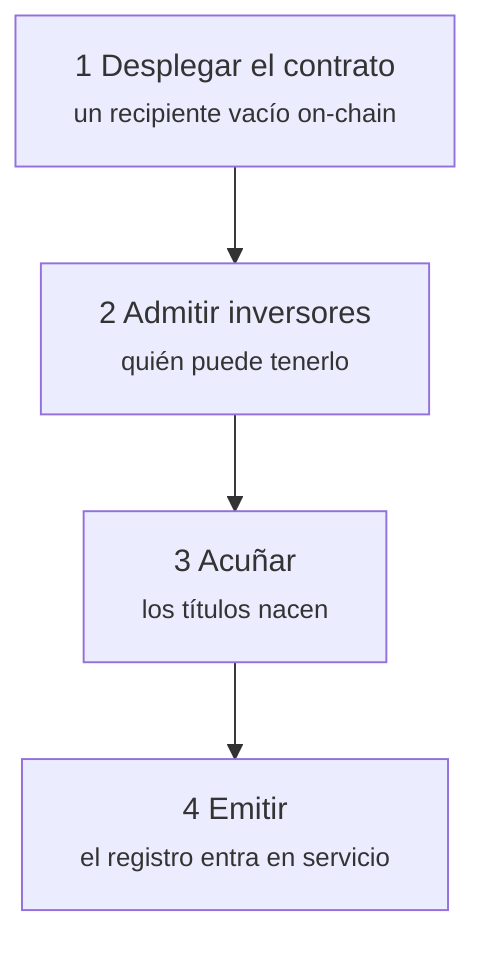
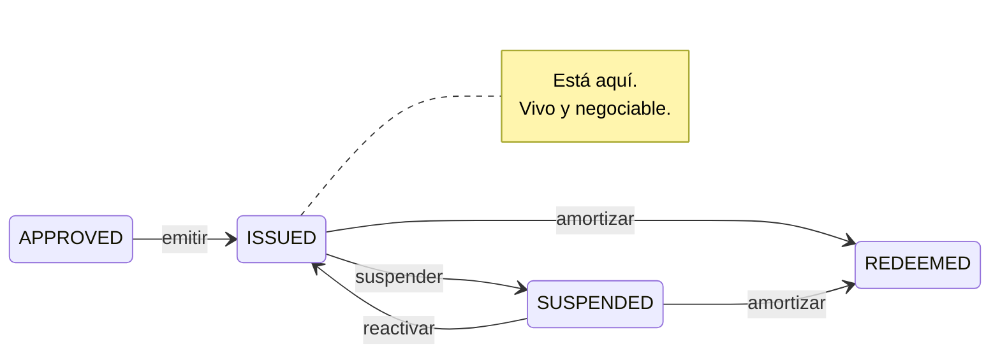

# Etapa 2 — Emisión primaria

*El bono está aprobado. Ahora tiene que hacerse real.*

La **emisión primaria** es la operación entre el emisor y los primeros inversores: el único momento en que Nordwind recibe dinero. Todo lo posterior — cada negociación, cada préstamo — ocurre entre inversores. El balance de Nordwind no se ve afectado.

Conviene retener esta distinción: explica por qué esta etapa está tan controlada y las siguientes son comparativamente libres.

---

## El orden de las operaciones

El orden no es arbitrario. Con ERC-3643, un inversor no admitido **no puede recibir tokens** — la transmisión se revierte. Acuñar antes de admitir solo produce transacciones fallidas.

---

## 1. Desplegar el contrato

*Issuances → su emisión → Deploy.*

Registerwerk envía la transacción que inscribe el contrato en la blockchain elegida y registra la dirección resultante. En ERC-3643 no se trata de un contrato, sino de toda la suite — token, identity registry, trusted issuers registry, compliance — cableados entre sí.

Obtendrá un **hash de transacción** (el recibo) y una **dirección de contrato** (donde reside ahora el bono). Ambos son públicos; cualquiera puede consultarlos en un explorador de bloques.

En este punto el contrato existe y contiene **cero títulos**. Nadie posee nada.

??? note "Para especialistas: direcciones deterministas"

    La factoría despliega con `CREATE2`, de modo que la dirección del contrato es una función pura del desplegador, una sal y el bytecode. Puede calcularse *antes* del despliegue.

    No es un truco. Significa que la dirección puede anotarse en el registro, comunicarse a las contrapartes y citarse en contratos antes incluso de que la transacción se mine — y que un despliegue fallido y reintentado acaba en la misma dirección. Los sistemas posteriores no necesitan esperar un recibo para saber dónde mirar.

    [:octicons-arrow-right-24: Desplegar en una blockchain](../issuers/deploying-to-chain.md)

---

## 2. Admitir a los inversores

*Issuance → Investors → Add investor.*

El colocador de Nordwind ha encontrado compradores. Antes de que cualquiera de ellos pueda recibir un solo título, tiene que ser admitido:

1. **Su entidad debe estar dada de alta y con el KYC aprobado.** No a juicio del emisor, sino del operador. Véase [Revisar el KYC](../../operator/customers/kyc-process.md).
2. **Debe registrar una dirección de monedero** (un *punto final*) donde recibir. Véase [Conectar un monedero](../investors/wallet-setup.md).
3. **Se le inscribe en el identity registry**, que es lo que lo admite on-chain.

Solo entonces puede tener el bono.

!!! warning "Este es el paso que se subestima"
    Admitir inversores no es papeleo que se pueda dejar para después. Es un requisito previo impuesto por el propio contrato del token. Un emisor que ha acuñado antes de admitir se queda con un contrato lleno de títulos y ninguna forma lícita de moverlos.

### Qué contiene una inscripción registral

Cada inversor admitido pasa a ser **titular** — una fila del registro. Conforme al §16 eWpG, ese es el asiento que cuenta, y el Derecho alemán conoce dos formas:

=== "Inscripción colectiva (Sammeleintragung)"

    El registro nombra a un **depositario** que mantiene por cuenta de muchos inversores subyacentes. El registro ve al depositario; el depositario lleva sus propios libros para sus clientes.

    El modelo familiar, y la forma en que hoy se mantienen la mayoría de los valores institucionales.

=== "Inscripción individual (Einzeleintragung)"

    El registro nombra **directamente al inversor**, identificado por una referencia seudónima en lugar de por un nombre en claro on-chain.

    El §17(2) eWpG exige más contenido para estos asientos: derechos de terceros sobre la posición, restricciones de disposición y cualquier nota sobre la capacidad jurídica del titular. Y el §19(2) obliga al emisor a remitir un **extracto registral** (*Registerauszug*) a los titulares consumidores — tras la inscripción inicial, tras cada cambio que les afecte y al menos una vez al año.

    Registerwerk genera y conserva esos extractos como documentos registrales por derecho propio, porque un extracto que no puede reproducirse después no prueba nada.

Un mismo activo puede llevar ambas formas a la vez — el registro lo llama posición `MIXED`.

---

## 3. Acuñar

*Issuance → Mint.*

**Acuñar** es crear unidades que antes no existían y asignarlas a un titular. Es el momento en que el valor viene a la existencia.

Nordwind acuña 50.000 títulos repartidos entre sus inversores en las proporciones suscritas. La oferta total del contrato pasa de cero a 50.000. Cada asiento registral recoge el valor nominal que tiene el inversor.

!!! danger "La acuñación es el filo más afilado del sistema"
    Acuñar crea valor de la nada. Un error aquí no es una cifra equivocada en un informe — son valores reales en las manos equivocadas.

    Por eso Registerwerk lo trata como una operación controlada: las **reglas de control de acuñación** pueden limitar cuánto podrá recibir jamás una dirección concreta, la operación exige [autenticación reforzada](../../compliance/step-up-mfa.md), y cada acuñación queda en el registro de auditoría con la persona que la realizó.

### Adónde va el dinero

Fíjese en lo que la plataforma **no** ha hecho: no ha movido 50 millones de euros.

La pata de efectivo de una emisión primaria — los inversores pagando a Nordwind — es una cuestión de pagos, y Registerwerk admite varias respuestas, llamadas **vías de pago**:

| Vía | Qué es |
|---|---|
| **Stablecoin** | Un token que representa una divisa, circulando en la misma cadena que el valor. |
| **Pontes** | Una API de pago bancario instantáneo. |
| **DvP ERC-7573** | Un contrato de liquidación que hace cada pata condicionada a la otra. |
| **SEPA fuera de cadena** | Una transferencia bancaria ordinaria, conciliada por referencia. |

La tercera merece atención. La **entrega contra pago** elimina el riesgo más antiguo de la liquidación de valores: que una parte cumpla y la otra no. Con entrega contra pago, el valor se mueve *si y solo si* se mueve el pago — no como promesa, sino como propiedad de la transacción.

??? note "Para especialistas: la entrega contra pago, y lo que no prueba"

    `DvpSettlement.sol` implementa un esquema al estilo ERC-7573. Ambas patas quedan bloqueadas contra un hash; revelar el secreto liquida ambas o ninguna. `EwpgBondDesk` muestra la misma forma de «token y pago en la misma transacción».

    Dos matices honestos:

    **La atomicidad es por cadena.** Si el valor está en Ethereum y el dinero llega por SEPA, ningún contrato puede hacerlos atómicos. Lo que la entrega contra pago aporta allí es una liberación condicionada, no una única transacción. La atomicidad real exige ambas patas en la misma cadena.

    **La liquidación técnica no es la liquidación jurídica.** Que un contrato ejecute ambas transmisiones en una transacción prueba lo que hizo un ordenador. Si eso constituye extinción de la obligación, firmeza frente a un concurso o buena entrega según su ley aplicable es una cuestión jurídica que el código no resuelve.

    Las vías de stablecoin llevan campos de divulgación vinculados a MiCAR — emisor, autorización, condición de token de dinero electrónico, reembolso a la par, libro blanco — más una atestación auditable del operador de que alguien los comprobó realmente. Registerwerk no verifica nada de eso de forma independiente. [:octicons-arrow-right-24: Vías de pago](../../platform/defi-interoperability.md)

---

## 4. Emitir

La transición final: `APPROVED` → `ISSUED`.

El bono está vivo. El registro hace fe. Los inversores ven sus posiciones, reciben sus extractos y pueden — a partir de aquí — negociar.

`SUSPENDED` congela la negociación sin poner fin al instrumento — por una operación societaria, un litigio o un error sospechado. Reversible. `REDEEMED` no lo es.

---

## Lo que acaba de ocurrir, en un párrafo

Nordwind describió un bono, un operador lo aprobó, se desplegó un contrato, se verificó y admitió a los inversores en ese contrato, se crearon 50.000 títulos a su nombre y el registro lo anotó todo. Nordwind tiene 50 millones de euros. Cincuenta inversores tienen un derecho de crédito frente a Nordwind. Y cada paso es imputable a una persona con nombre y apellidos, en un registro que nadie puede alterar sin que se note.

[Etapa 3: Tenencia y custodia :octicons-arrow-right-24:](holding.md){ .md-button .md-button--primary }
