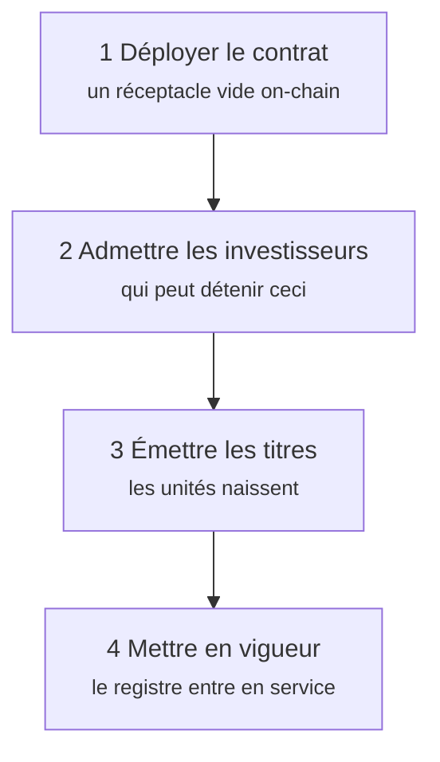
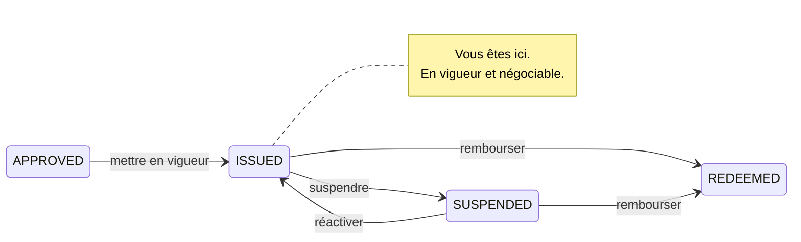

# Étape 2 — Émission primaire

*L'obligation est approuvée. Il faut maintenant la rendre réelle.*

L'**émission primaire** est l'opération entre l'émetteur et les premiers investisseurs : le seul moment où Nordwind reçoit de l'argent. Tout ce qui suit — chaque négociation, chaque prêt — se passe entre investisseurs. Le bilan de Nordwind n'en est pas affecté.

Cette distinction mérite d'être retenue : elle explique pourquoi cette étape est si strictement encadrée et les suivantes comparativement libres.

---

## L'ordre des opérations

L'ordre n'est pas arbitraire. Sous ERC-3643, un investisseur non admis **ne peut pas recevoir de jetons** — le transfert est annulé. Émettre avant d'admettre ne produit que des transactions en échec.

---

## 1. Déployer le contrat

*Issuances → votre émission → Deploy.*

Registerwerk envoie la transaction qui inscrit le contrat sur la blockchain choisie et enregistre l'adresse obtenue. Pour ERC-3643, il ne s'agit pas d'un contrat mais de toute la suite — jeton, registre d'identités, registre des émetteurs de confiance, conformité — câblés ensemble.

Vous obtenez un **hachage de transaction** (le reçu) et une **adresse de contrat** (où réside désormais l'obligation). Les deux sont publics ; n'importe qui peut les consulter dans un explorateur de blocs.

À ce stade, le contrat existe et détient **zéro titre**. Personne ne possède rien.

??? note "Pour les spécialistes : adresses déterministes"

    La fabrique déploie avec `CREATE2` : l'adresse du contrat est donc une fonction pure du déployeur, d'un sel et du bytecode. Elle peut être calculée *avant* le déploiement.

    Ce n'est pas un tour de passe-passe. Cela signifie que l'adresse peut être consignée au registre, communiquée aux contreparties et citée dans des contrats avant même que la transaction ne soit minée — et qu'un déploiement échoué puis relancé aboutit à la même adresse. Les systèmes en aval n'ont pas besoin d'attendre un reçu pour savoir où regarder.

    [:octicons-arrow-right-24: Déployer sur une blockchain](../issuers/deploying-to-chain.md)

---

## 2. Admettre les investisseurs

*Issuance → Investors → Add investor.*

Le placeur de Nordwind a trouvé des acheteurs. Avant que l'un d'eux puisse recevoir ne serait-ce qu'un titre, il doit être admis :

1. **Son entité doit être intégrée et son KYC approuvé.** Pas selon le jugement de l'émetteur — selon celui de l'opérateur. Voir [Examiner le KYC](../../operator/customers/kyc-process.md).
2. **Il doit enregistrer une adresse de portefeuille** (un *point de réception*) pour recevoir. Voir [Connecter un portefeuille](../investors/wallet-setup.md).
3. **Il est inscrit au registre d'identités**, ce qui vaut admission on-chain.

Alors seulement il peut détenir l'obligation.

!!! warning "C'est l'étape que l'on sous-estime"
    Admettre les investisseurs n'est pas une formalité administrative que l'on règle après coup. C'est une condition préalable imposée par le contrat du jeton lui-même. Un émetteur qui a émis les titres avant d'admettre se retrouve avec un contrat plein d'unités et aucun moyen licite de les déplacer.

### Ce que contient une inscription au registre

Chaque investisseur admis devient un **titulaire** — une ligne du registre. Au sens du §16 eWpG, c'est l'enregistrement qui fait foi, et le droit allemand en connaît deux formes :

=== "Inscription collective (Sammeleintragung)"

    Le registre désigne un **conservateur** détenant pour le compte de nombreux investisseurs sous-jacents. Le registre voit le conservateur ; celui-ci tient ses propres livres pour ses clients.

    Le modèle familier, et la manière dont la plupart des titres institutionnels sont détenus aujourd'hui.

=== "Inscription individuelle (Einzeleintragung)"

    Le registre désigne **directement l'investisseur**, identifié par une référence pseudonyme plutôt que par un nom en clair on-chain.

    Le §17(2) eWpG exige davantage de contenu pour ces inscriptions : droits de tiers sur la position, restrictions de disposition et toute mention relative à la capacité juridique du titulaire. Et le §19(2) oblige l'émetteur à adresser un **relevé de registre** (*Registerauszug*) aux titulaires consommateurs — après l'inscription initiale, après chaque changement les concernant, et au moins une fois par an.

    Registerwerk produit et conserve ces relevés comme des documents de registre à part entière, car un relevé que l'on ne peut pas reproduire plus tard ne prouve rien.

Un même actif peut porter les deux formes simultanément — le registre parle alors d'une position `MIXED`.

---

## 3. Créer les titres

*Issuance → Mint.*

**Créer** (*minting*), c'est faire naître des unités qui n'existaient pas et les attribuer à un titulaire. C'est le moment où le titre vient à l'existence.

Nordwind crée 50 000 titres répartis entre ses investisseurs selon les montants souscrits. L'offre totale du contrat passe de zéro à 50 000. Chaque inscription au registre porte la valeur nominale détenue par l'investisseur.

!!! danger "La création de titres est l'arête la plus vive du système"
    Créer des titres fabrique de la valeur à partir de rien. Une erreur ici n'est pas un chiffre faux dans un rapport — ce sont de vrais titres entre de mauvaises mains.

    Registerwerk en fait donc une opération contrôlée : des **règles de contrôle de création** peuvent plafonner ce qu'une adresse donnée pourra jamais recevoir, l'opération exige une [authentification renforcée](../../compliance/step-up-mfa.md), et chaque création est consignée dans la piste d'audit avec son auteur.

### Où va l'argent

Remarquez ce que la plateforme n'a *pas* fait : elle n'a pas déplacé 50 millions d'euros.

Le volet espèces d'une émission primaire — les investisseurs payant Nordwind — est une question de paiement, et Registerwerk prend en charge plusieurs réponses, appelées **rails de paiement** :

| Rail | De quoi il s'agit |
|---|---|
| **Stablecoin** | Un jeton représentant une devise, circulant sur la même chaîne que le titre. |
| **Pontes** | Une API de paiement bancaire instantané. |
| **DvP ERC-7573** | Un contrat de règlement qui rend chaque volet conditionnel à l'autre. |
| **SEPA hors chaîne** | Un virement bancaire ordinaire, rapproché par référence. |

Le troisième mérite l'attention. La **livraison contre paiement** supprime le plus vieux risque du règlement de titres : qu'une partie exécute et l'autre non. En LCP, le titre ne bouge *que si* le paiement bouge — non par promesse, mais comme propriété de la transaction.

??? note "Pour les spécialistes : la LCP, et ce qu'elle ne prouve pas"

    `DvpSettlement.sol` met en œuvre un schéma de type ERC-7573. Les deux volets sont verrouillés contre un hachage ; la révélation du secret dénoue les deux ou aucun. `EwpgBondDesk` illustre la même forme « jeton et paiement dans une seule transaction ».

    Deux réserves honnêtes :

    **L'atomicité est propre à un registre.** Si le titre est sur Ethereum et l'argent arrive par SEPA, aucun contrat ne peut rendre les deux atomiques. Ce que la LCP apporte alors est une libération conditionnelle, pas une transaction unique. L'atomicité véritable exige les deux volets sur le même registre.

    **Le règlement technique n'est pas le règlement juridique.** Qu'un contrat exécute les deux transferts en une transaction prouve ce qu'a fait un ordinateur. Savoir si cela vaut extinction de l'obligation, opposabilité en cas de liquidation ou bonne livraison au regard de votre droit applicable est une question juridique que le code ne tranche pas.

    Les rails stablecoin portent des champs de publication liés à MiCAR — émetteur, agrément, qualification de jeton de monnaie électronique, remboursement au pair, livre blanc — ainsi qu'une attestation auditable de l'opérateur certifiant que quelqu'un les a réellement vérifiés. Registerwerk ne vérifie rien de tout cela de manière indépendante. [:octicons-arrow-right-24: Rails de paiement](../../platform/defi-interoperability.md)

---

## 4. Mettre en vigueur

La transition finale : `APPROVED` → `ISSUED`.

L'obligation est en vigueur. Le registre fait foi. Les investisseurs voient leurs positions, reçoivent leurs relevés et peuvent — à partir d'ici — négocier.

`SUSPENDED` gèle la négociation sans mettre fin à l'instrument — pour une opération sur titres, un litige ou une erreur soupçonnée. Réversible. `REDEEMED` ne l'est pas.

---

## Ce qui vient de se passer, en un paragraphe

Nordwind a décrit une obligation, un opérateur l'a approuvée, un contrat a été déployé, des investisseurs ont été vérifiés puis admis à ce contrat, 50 000 titres ont été créés à leur nom, et le registre a tout consigné. Nordwind dispose de 50 millions d'euros. Cinquante investisseurs détiennent une créance sur Nordwind. Et chaque étape est imputable à une personne nommée, dans un journal que nul ne peut modifier discrètement.

[Étape 3 : Détention et conservation :octicons-arrow-right-24:](holding.md){ .md-button .md-button--primary }
