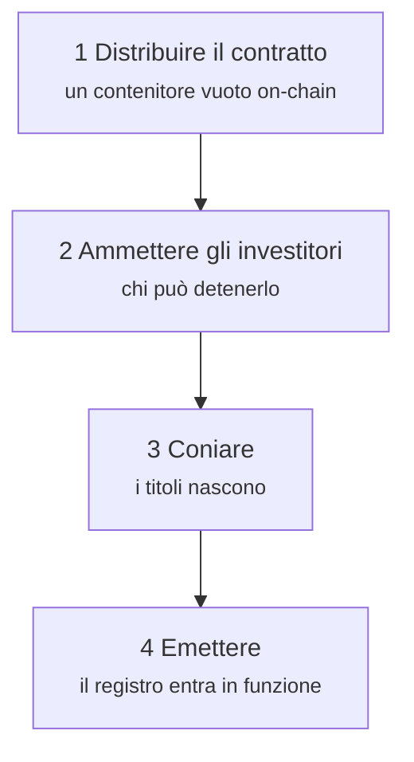
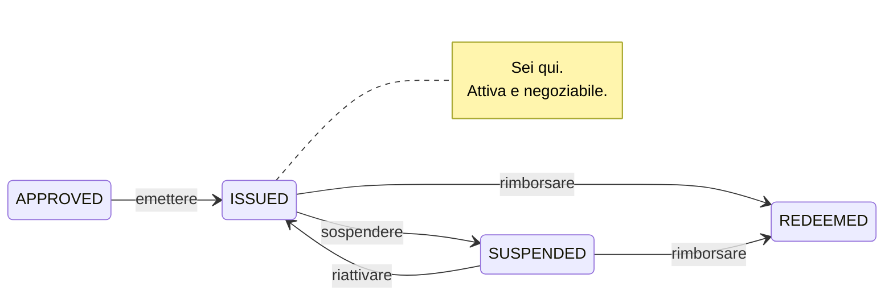

# Fase 2 — Emissione primaria

*L'obbligazione è approvata. Ora deve diventare reale.*

L'**emissione primaria** è l'operazione tra emittente e primi investitori: l'unico momento in cui Nordwind riceve denaro. Tutto ciò che segue — ogni negoziazione, ogni prestito — avviene tra investitori. Il bilancio di Nordwind non ne risente.

Vale la pena tenere a mente questa distinzione: spiega perché questa fase è così controllata e le successive comparativamente libere.

---

## L'ordine delle operazioni

L'ordine non è arbitrario. Con ERC-3643 un investitore non ammesso **non può ricevere token** — il trasferimento viene annullato. Coniare prima di ammettere produce solo transazioni fallite.

---

## 1. Distribuire il contratto

*Issuances → la tua emissione → Deploy.*

Registerwerk invia la transazione che iscrive il contratto sulla blockchain scelta e registra l'indirizzo risultante. Per ERC-3643 non si tratta di un contratto ma dell'intera suite — token, identity registry, trusted issuers registry, compliance — collegati tra loro.

Ottieni un **hash di transazione** (la ricevuta) e un **indirizzo di contratto** (dove risiede ora l'obbligazione). Entrambi sono pubblici; chiunque può consultarli in un block explorer.

A questo punto il contratto esiste e detiene **zero titoli**. Nessuno possiede nulla.

??? note "Per gli specialisti: indirizzi deterministici"

    La factory distribuisce con `CREATE2`, quindi l'indirizzo del contratto è una funzione pura di deployer, salt e bytecode. Può essere calcolato *prima* della distribuzione.

    Non è un gioco di prestigio. Significa che l'indirizzo può essere annotato nel registro, comunicato alle controparti e citato negli accordi prima ancora che la transazione sia inclusa in un blocco — e che una distribuzione fallita e ripetuta atterra allo stesso indirizzo. I sistemi a valle non devono attendere una ricevuta per sapere dove guardare.

    [:octicons-arrow-right-24: Distribuire su una blockchain](../issuers/deploying-to-chain.md)

---

## 2. Ammettere gli investitori

*Issuance → Investors → Add investor.*

Il collocatore di Nordwind ha trovato acquirenti. Prima che uno di loro possa ricevere anche un solo titolo, deve essere ammesso:

1. **Il suo soggetto giuridico deve essere attivato e con KYC approvato.** Non a giudizio dell'emittente, ma dell'operatore. Vedi [Esaminare il KYC](../../operator/customers/kyc-process.md).
2. **Deve registrare un indirizzo wallet** (un *endpoint*) su cui ricevere. Vedi [Collegare un wallet](../investors/wallet-setup.md).
3. **Viene iscritto nell'identity registry**, ed è questo che lo ammette on-chain.

Solo allora può detenere l'obbligazione.

!!! warning "È il passaggio che si sottovaluta"
    Ammettere gli investitori non è un adempimento amministrativo da sbrigare dopo. È un presupposto imposto dal contratto del token stesso. Un emittente che ha coniato prima di ammettere si ritrova con un contratto pieno di titoli e nessun modo lecito di muoverli.

### Che cosa contiene un'iscrizione a registro

Ogni investitore ammesso diventa un **titolare** — una riga del registro. Ai sensi del §16 eWpG questa è la registrazione che conta, e il diritto tedesco ne conosce due forme:

=== "Iscrizione collettiva (Sammeleintragung)"

    Il registro indica un **depositario** che detiene per conto di molti investitori sottostanti. Il registro vede il depositario; il depositario tiene i propri libri per i suoi clienti.

    Il modello familiare, e il modo in cui oggi è detenuta la maggior parte degli strumenti istituzionali.

=== "Iscrizione individuale (Einzeleintragung)"

    Il registro indica **direttamente l'investitore**, identificato da un riferimento pseudonimo anziché da un nome in chiaro on-chain.

    Il §17(2) eWpG richiede per queste iscrizioni più contenuto: diritti di terzi sulla posizione, restrizioni alla disposizione e ogni annotazione sulla capacità giuridica del titolare. E il §19(2) obbliga l'emittente a inviare un **estratto di registro** (*Registerauszug*) ai titolari consumatori — dopo l'iscrizione iniziale, dopo ogni variazione che li riguarda e almeno una volta l'anno.

    Registerwerk produce e conserva questi estratti come documenti di registro a pieno titolo, perché un estratto che non si può riprodurre in seguito non prova nulla.

Uno stesso asset può portare entrambe le forme insieme — il registro la chiama posizione `MIXED`.

---

## 3. Coniare

*Issuance → Mint.*

**Coniare** significa creare unità che prima non esistevano e assegnarle a un titolare. È il momento in cui lo strumento viene all'esistenza.

Nordwind conia 50.000 titoli distribuiti tra i suoi investitori nelle proporzioni sottoscritte. L'offerta totale del contratto passa da zero a 50.000. Ogni iscrizione a registro riporta il valore nominale detenuto dall'investitore.

!!! danger "Il conio è il punto più tagliente del sistema"
    Coniare crea valore dal nulla. Un errore qui non è un numero sbagliato in un report — sono strumenti veri nelle mani sbagliate.

    Registerwerk lo tratta perciò come un'operazione controllata: le **regole di controllo del conio** possono limitare quanto un dato indirizzo potrà mai ricevere, l'operazione richiede [autenticazione rafforzata](../../compliance/step-up-mfa.md), e ogni conio è registrato nel registro di controllo con la persona che lo ha eseguito.

### Dove va il denaro

Nota che cosa la piattaforma **non** ha fatto: non ha spostato 50 milioni di euro.

La gamba contante di un'emissione primaria — gli investitori che pagano Nordwind — è una questione di pagamenti, e Registerwerk supporta diverse risposte, dette **binari di pagamento**:

| Binario | Che cos'è |
|---|---|
| **Stablecoin** | Un token che rappresenta una valuta, in circolazione sulla stessa chain dello strumento. |
| **Pontes** | Un'API di pagamento bancario istantaneo. |
| **DvP ERC-7573** | Un contratto di regolamento che rende ciascuna gamba condizionata all'altra. |
| **SEPA off-chain** | Un normale bonifico bancario, riconciliato per riferimento. |

Il terzo merita attenzione. La **consegna contro pagamento** elimina il rischio più antico del regolamento titoli: che una parte adempia e l'altra no. Con la consegna contro pagamento lo strumento si muove *se e solo se* si muove il pagamento — non per promessa, ma come proprietà della transazione.

??? note "Per gli specialisti: la consegna contro pagamento, e ciò che non prova"

    `DvpSettlement.sol` implementa uno schema in stile ERC-7573. Entrambe le gambe sono bloccate contro un hash; la rivelazione del segreto regola entrambe o nessuna. `EwpgBondDesk` mostra la stessa forma «token e pagamento nella stessa transazione».

    Due precisazioni oneste:

    **L'atomicità è per singolo registro.** Se lo strumento è su Ethereum e il denaro arriva via SEPA, nessun contratto può renderli atomici. Ciò che la consegna contro pagamento offre lì è un rilascio condizionato, non un'unica transazione. L'atomicità vera richiede entrambe le gambe sullo stesso registro.

    **Il regolamento tecnico non è il regolamento giuridico.** Che un contratto esegua entrambi i trasferimenti in una transazione prova che cosa ha fatto un computer. Se ciò costituisca estinzione dell'obbligazione, opponibilità in caso di insolvenza o buona consegna secondo la legge applicabile è una questione giuridica che il codice non risolve.

    I binari stablecoin portano campi informativi legati a MiCAR — emittente, autorizzazione, qualifica di token di moneta elettronica, rimborso alla pari, white paper — più un'attestazione verificabile dell'operatore che qualcuno li abbia effettivamente controllati. Registerwerk non verifica nulla di tutto ciò in modo indipendente. [:octicons-arrow-right-24: Binari di pagamento](../../platform/defi-interoperability.md)

---

## 4. Emettere

Il passaggio finale: `APPROVED` → `ISSUED`.

L'obbligazione è attiva. Il registro fa fede. Gli investitori vedono le proprie posizioni, ricevono gli estratti e possono — da qui in poi — negoziare.

`SUSPENDED` congela la negoziazione senza chiudere lo strumento — per un'operazione societaria, una controversia o un errore sospetto. Reversibile. `REDEEMED` non lo è.

---

## Che cosa è appena successo, in un paragrafo

Nordwind ha descritto un'obbligazione, un operatore l'ha approvata, un contratto è stato distribuito, gli investitori sono stati verificati e ammessi a quel contratto, 50.000 titoli sono stati creati a loro nome e il registro ha annotato tutto. Nordwind ha 50 milioni di euro. Cinquanta investitori hanno un credito verso Nordwind. E ogni passaggio è attribuibile a una persona con nome e cognome, in un registro che nessuno può modificare di nascosto.

[Fase 3: Detenzione e custodia :octicons-arrow-right-24:](holding.md){ .md-button .md-button--primary }
