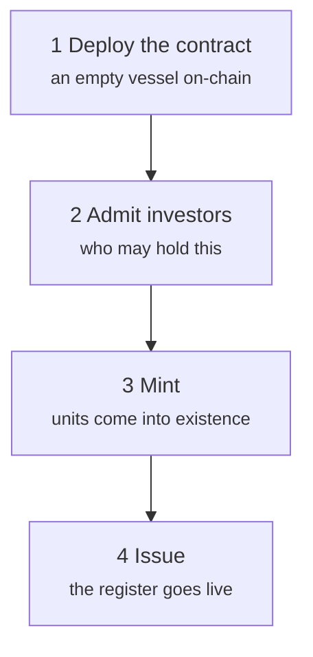
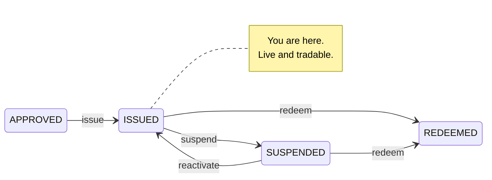

# Stage 2 — Primary issuance

*The bond is approved. Now it has to become real.*

**Primary issuance** is the transaction between the issuer and the first investors: the only point at which Nordwind receives money. Everything afterwards — every trade, every loan — is investors dealing with each other. Nordwind's balance sheet is unaffected by any of it.

That distinction is worth holding onto, because it explains why this stage is so heavily controlled and later stages are comparatively free.

---

## The order of operations

The sequence is not arbitrary. Under ERC-3643 an investor who has not been admitted **cannot receive tokens** — the transfer reverts. Minting before admitting produces nothing but failed transactions.

---

## 1. Deploy the contract

*Issuances → your issuance → Deploy.*

Registerwerk sends the transaction that puts the contract on the chosen blockchain and records the resulting address. For ERC-3643 this is not one contract but the whole suite — token, identity registry, trusted issuers registry, compliance — wired together.

You will see a **transaction hash** (the receipt) and a **contract address** (where the bond now lives). Both are public; anyone can look them up on a block explorer.

At this point the contract exists and holds **zero units**. Nobody owns anything.

??? note "For the specialist: deterministic addresses"

    The factory deploys with `CREATE2`, so the contract address is a pure function of the deployer, a salt, and the contract bytecode. It can therefore be computed *before* deployment.

    This is not a party trick. It means the address can be recorded in the register, communicated to counterparties, and referenced in agreements before the transaction is mined — and if the deployment fails and is retried, it lands at the same address. Systems downstream do not need to wait for a receipt to know where to look.

    [:octicons-arrow-right-24: Deploying to a blockchain](../issuers/deploying-to-chain.md)

---

## 2. Admit investors

*Issuance → Investors → Add investor.*

Nordwind's placement agent has found buyers. Before any of them can receive a single unit, each has to be admitted:

1. **Their entity must be onboarded and KYC-approved.** Not the issuer's judgement — the operator's. See [Reviewing KYC](../../operator/customers/kyc-process.md).
2. **They must register a wallet address** (an *endpoint*) to receive into. See [Connecting a wallet](../investors/wallet-setup.md).
3. **They are added to the identity registry**, which is what admits them on-chain.

Only then can they hold the bond.

!!! warning "This is the step people underestimate"
    Admitting investors is not administrative overhead you can do afterwards. It is a precondition enforced by the token contract itself. An issuer who has minted before admitting has a contract full of units and no lawful way to move them.

### What a register entry contains

Each admitted investor becomes a **holder** — a row in the register. Under §16 eWpG this is the record that matters, and German law recognises two ways of keeping it:

=== "Collective entry (Sammeleintragung)"

    The register names a **custodian** holding on behalf of many underlying investors. The registry sees the custodian; the custodian keeps its own books for its clients.

    The familiar model, and how most institutional securities are held today.

=== "Individual entry (Einzeleintragung)"

    The register names the **investor directly**, identified by a pseudonymous reference rather than a clear name on-chain.

    §17(2) eWpG requires more content for these entries: third-party rights over the holding, disposal restrictions, and any note on the holder's legal capacity. And §19(2) obliges the issuer to send a **register statement** (*Registerauszug*) to consumer holders — after the initial entry, after every change affecting them, and at least once a year.

    Registerwerk generates and retains those statements as register records in their own right, because a statement that cannot be reproduced later is not evidence of anything.

A single asset may hold both forms at once — the register calls that a `MIXED` holding.

---

## 3. Mint

*Issuance → Mint.*

**Minting** is creating units that did not previously exist and assigning them to a holder. This is the moment the security comes into being.

Nordwind mints 50,000 units across its investors in the proportions each subscribed for. The token contract's total supply goes from zero to 50,000. Each investor's register entry records their nominal amount.

!!! danger "Minting is the sharpest edge in the system"
    Minting creates value from nothing. An error here is not a wrong number in a report — it is real securities in the wrong hands.

    Registerwerk therefore treats it as a controlled operation: **mint control rules** can cap how much a given address may ever receive, the action requires [step-up authentication](../../compliance/step-up-mfa.md), and every mint is recorded in the audit log with the actor who performed it.

### Where the money goes

Notice what the platform has *not* done: it has not moved €50 million.

The cash leg of a primary issuance — investors paying Nordwind — is a payments question, and Registerwerk supports several answers, called **payment rails**:

| Rail | What it is |
|---|---|
| **Stablecoin** | A token representing a currency, moving on the same chain as the security. |
| **Pontes** | An instant bank-payment API. |
| **ERC-7573 DvP** | A settlement contract that makes both legs conditional on each other. |
| **Off-chain SEPA** | An ordinary bank transfer, reconciled by reference. |

The third one deserves attention. **Delivery versus Payment** is the mechanism that removes the oldest risk in securities settlement: that one side performs and the other does not. Under DvP the security moves *if and only if* the payment moves — not as a promise, but as a property of the transaction.

??? note "For the specialist: DvP, and what it does not prove"

    `DvpSettlement.sol` implements an ERC-7573-style pattern. Both legs are locked against a hash; releasing the secret settles both or neither. `EwpgBondDesk` demonstrates the same-transaction token-and-payment shape.

    Two honest qualifications:

    **Atomicity is per-ledger.** If the security is on Ethereum and the cash arrives by SEPA, no contract can make those atomic. What DvP gives you there is a conditional release, not a single transaction. Genuine atomicity requires both legs on the same ledger.

    **Technical settlement is not legal settlement.** A contract executing both transfers in one transaction is evidence about what a computer did. Whether that constitutes discharge of the obligation, finality against a liquidator, or good delivery under your governing law is a legal question the code cannot answer.

    Stablecoin rails carry MiCAR-related disclosure fields — issuer, authorisation, e-money-token flag, redemption at par, white paper — plus an auditable operator attestation that someone actually checked them. Registerwerk does not independently verify any of it. [:octicons-arrow-right-24: Payment rails](../../platform/defi-interoperability.md)

---

## 4. Issue

The final transition: `APPROVED` → `ISSUED`.

The bond is live. The register is authoritative. Investors can see their holdings, receive statements, and — from here — trade.

`SUSPENDED` freezes trading without ending the instrument — for a corporate action, a legal dispute, or a suspected error. It is reversible. `REDEEMED` is not.

---

## What just happened, in one paragraph

Nordwind described a bond, an operator approved it, a contract was deployed, investors were verified and admitted to that contract, 50,000 units were created in their names, and the register recorded all of it. Nordwind has €50 million. Fifty investors have a claim on Nordwind. And every step is attributable to a named human in a log that cannot be quietly edited.

[Stage 3: Holding and custody :octicons-arrow-right-24:](holding.md){ .md-button .md-button--primary }
