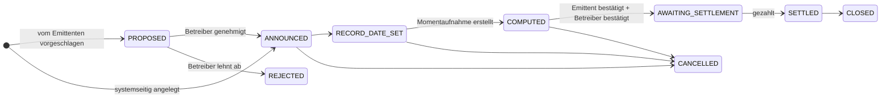
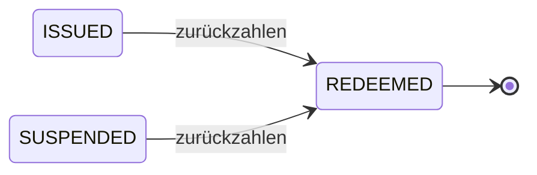

# Station 6 — Kapitalmaßnahmen und Rückzahlung

*Fünf Jahre vergehen. Zweimal jährlich zahlt Nordwind Zinsen. Dann endet der Kredit.*

Eine **Kapitalmaßnahme** ist alles, was der Emittent tut und was Inhaber in ihrer Eigenschaft als Inhaber betrifft. Einen Kupon zahlen. Eine Dividende zahlen. Die Stücke teilen. Sie wandeln. Das Kapital zurückzahlen. Der Begriff ist alt und etwas irreführend — nichts davon verlangt, dass eine Gesellschaft etwas Ungewöhnliches tut. Es ist schlicht die Kategorie für *Ereignisse, die das Register abbilden muss*.

---

## Das Problem, das jede Kapitalmaßnahme lösen muss

Die Anleihe wechselt ständig den Besitzer. Kupons werden zweimal im Jahr gezahlt. Also:

**Wer bekommt das Geld?**

Die Antwort kann nicht lauten „wer sie hält, wenn die Zahlung ankommt" — das ist im Voraus nicht bestimmbar und würde den Handel chaotisch machen. Märkte lösen das mit drei Terminen, und die lohnen sich einmal zu lernen, denn jede Kapitalmaßnahme in jedem Markt benutzt sie.

| Termin | Bedeutung |
|---|---|
| **Ankündigungstag** | Der Emittent erklärt die Maßnahme. Noch geschieht nichts. |
| **Nachweisstichtag** | Vom Register wird eine Momentaufnahme gemacht. **Wer in diesem Augenblick Inhaber ist, bekommt gezahlt** — unabhängig davon, was danach passiert. |
| **Ex-Tag** | Ab hier handelt das Papier *ohne* die anstehende Zahlung. Wer danach kauft, hat keinen Anspruch darauf. |
| **Zahltag** | Das Geld fließt tatsächlich. |

!!! example "Nordwinds dritter Kupon"

    | | |
    |---|---|
    | Angekündigt | 1. Mai |
    | Ex-Tag | 12. Juni |
    | **Nachweisstichtag** | **15. Juni** |
    | Zahltag | 30. Juni |

    Ein Anleger, der am 15. Juni 100 Stück hält, erhält am 30. Juni 2.250 € — 100.000 € Nennbetrag × 4,5 % ÷ 2.

    Verkauft er am 20. Juni, bekommt er die Zahlung **trotzdem**: Er war am Nachweisstichtag Inhaber. Der Käufer weiß das — deshalb fällt der Kurs am Ex-Tag ungefähr um den Kupon. Nichts ist verloren gegangen; der Anspruch ist schlicht beim Verkäufer geblieben.

??? note "Für Fachleute: die Momentaufnahme ist eine echte Tabelle"

    Die Momentaufnahme zum Nachweisstichtag wird als je eine Zeile pro Inhaber materialisiert und hält Inhaber, Wallet-Adresse, den in diesem Augenblick gehaltenen Nennbetrag und den berechneten Anspruch fest.

    Zwei Gründe, sie zu speichern statt neu zu berechnen. Erstens muss der Anspruch noch Jahre später reproduzierbar sein, und eine Neuberechnung aus einem veränderlichen Register wäre das nicht. Zweitens wird die Anleger-Kennung auf jede Zeile denormalisiert, damit „Gesamteinkünfte dieses Anlegers im Steuerjahr N" ohne modulübergreifenden Join beantwortbar ist — genau die Abfrage, die eine Steuerbescheinigung braucht.

---

## Der Lebenszyklus einer Kapitalmaßnahme

Kupons und Rückzahlungen werden **systemseitig angelegt** — automatisch aus dem Zahlungsplan oder dem Fälligkeitstermin erzeugt, statt dass ein Mensch daran denken muss, und starten bei `ANNOUNCED`. Dividenden, Splits und vorzeitige Kündigungen werden **vom Emittenten vorgeschlagen**: Der Emittent reicht eine Maßnahme ein, die bei `PROPOSED` beginnt, und sie tritt dem Register erst bei (`ANNOUNCED`), nachdem ein Betreiber sie geprüft und genehmigt hat — oder wird endgültig verworfen (`REJECTED`), falls nicht.

`COMPUTED` → `AWAITING_SETTLEMENT` verlangt die Zustimmung **zweier getrennter Parteien**, unabhängig davon, wie die Maßnahme angelegt wurde: Der Emittent bestätigt, dass die zugrundeliegende Verpflichtung tatsächlich bereit ist — das Geld für einen Kupon oder eine Dividende, der Mechanismus für einen Split oder eine Kündigung —, und anschließend bestätigt ein Betreiber die Register-/Onchain-Seite. Der häufigste katastrophale Fehler in der Wertpapierverwaltung ist die Zahlung an die falsche Liste, und dass zwei Organisationen statt zwei Kollegen derselben Organisation zustimmen müssen, macht es deutlich schwerer, dass das unbemerkt passiert. Die Bestätigung des Emittenten ist eine normale authentifizierte Aktion; nur die Bestätigung des Betreibers verlangt [Step-up](../../compliance/step-up-mfa.md). Bestätigt der Emittent nie, kann ein Betreiber die Anforderung übersteuern — dauerhaft und gesondert als Ausnahme protokolliert, niemals ununterscheidbar von einer echten Bestätigung.

### Die Typen, die Registerwerk abbildet

Nur eine Teilmenge lässt sich heute tatsächlich anlegen — der Rest ist modelliert (hat einen Platz im Lebenszyklus und in der Abwicklungsmechanik), hat aber noch keinen Weg der Anlage.

**Heute unterstützt**

| | Angelegt von |
|---|---|
| `COUPON`, `INTEREST_PAYMENT` | System, aus dem Zahlungsplan. |
| `REDEMPTION` | System, zum Fälligkeitstermin. |
| `DIVIDEND` | Emittentenvorschlag, vom Betreiber geprüft. |
| `SPLIT` | Emittentenvorschlag, vom Betreiber geprüft. Wird per manueller Bestätigung des Betreibers abgewickelt — kein unterstützter Token-Standard verfügt über eine Onchain-Split-Primitive. |
| `CALL` | Emittentenvorschlag, vom Betreiber geprüft. Vorzeitige Rückzahlung durch den Emittenten, wo die Bedingungen es zulassen. |

**Modelliert, noch nicht unterstützt**

| | |
|---|---|
| `PARTIAL_REDEMPTION` | Teilweise Rückzahlung des Kapitals. |
| `REVERSE_SPLIT` | Verringerung der Stückzahl ohne Änderung des Gesamtwerts. |
| `CONVERSION` | Umwandlung in ein anderes Instrument. |
| `CAPITAL_CALL` | Aufforderung an die Inhaber, weiter einzuzahlen. |

---

## Steuerbescheinigungen

Für deutsche Inhaber sind Erträge aus einem Wertpapier steuerpflichtig, und der Inhaber braucht eine **Steuerbescheinigung** — ein Dokument darüber, was er in einem Jahr erhalten hat.

Registerwerk erzeugt sie aus den Einträgen der Kapitalmaßnahmen: für jeden Anleger alle Ansprüche des Steuerjahres, zusammengefasst.

!!! warning "Sie weist aus, was gezahlt wurde, nicht was geschuldet wird"
    Die Bescheinigung ist eine Tatsachenaufzeichnung über Ausschüttungen aus diesem Register. Sie ist keine Steuerberatung, berücksichtigt keine Einkünfte anderswo und berechnet niemandes Steuerschuld. Quellensteuerpflichten hängen von Ansässigkeit und Status des Inhabers ab und liegen in der Verantwortung von Emittent und Inhaber.

---

## Rückzahlung — das Ende

Bei Fälligkeit endet der Kredit. Nordwind zahlt 1.000 € je Stück an diejenigen, die sie am Nachweisstichtag halten, und die Stücke hören auf zu existieren.

Mechanisch ist das eine Kapitalmaßnahme vom Typ `REDEMPTION`, die bei Erreichen des Fälligkeitstags automatisch erzeugt wird, genau wie Kupons. Der Unterschied liegt in dem, was danach geschieht:

1. Die Momentaufnahme zum Nachweisstichtag wird erstellt.
2. Der Anspruch jedes Inhabers ist sein Nennbetrag zum Nennwert.
3. Der Emittent bestätigt, ein Betreiber bestätigt, und die Zahlung wird abgewickelt.
4. Die Token werden **vernichtet** — on-chain zerstört, der Bestand geht auf null zurück.
5. Das Asset wechselt zu `REDEEMED`.

`REDEEMED` ist ein Endzustand. Es gibt keinen Übergang heraus — keine Reaktivierung, keine Neuemission. Ein zurückgezahltes Wertpapier ist erledigt, und das Register bewahrt seine vollständige Historie dauerhaft.

!!! danger "Vernichtung ist unumkehrbar, und sie wird beobachtet"
    Token zu zerstören ist ein ebenso scharfer Vorgang wie sie zu schaffen. Eine Zwangsvernichtung nach §26 eWpG verlangt [Step-up-Authentifizierung](../../compliance/step-up-mfa.md), wird im Audit-Log mit namentlich benannter handelnder Person festgehalten und erfordert in manchen Konfigurationen das Vier-Augen-Prinzip.

    Beachten Sie, was die Rückzahlung *nicht* tut: Sie löscht nichts. Inhaberzeilen werden soft-deleted, nie entfernt, denn ein §16-Registereintrag, der verschwindet, kann Aufbewahrungs- und Nachweispflichten nicht erfüllen. Alles bleibt abfragbar — es ist lediglich als abgeschlossen gekennzeichnet.

### Wenn die Rückzahlung ausbleibt

Der Zahltag verstreicht, und nichts wird abgewickelt. Das ist ein **Zahlungsausfall**, und es ist ein reales Ereignis, das die Plattform erkennt statt zu ignorieren: Rückzahlungsmaßnahmen, deren Zahltag ohne Abwicklung verstrichen ist, werden markiert, ebenso ausgefallene Kupons.

Registerwerk hebt die Hand. Es kann keinen Anspruch durchsetzen — das ist Sache des Treuhänders, der Inhaber und der Gerichte.

---

## Die ganze Geschichte in sechs Zeilen

1. **Konzeption** — Nordwind beschreibt eine Anleihe; der Betreiber genehmigt sie.
2. **Emission** — ein Contract wird ausgebracht, Anleger zugelassen, 50.000 Stück gemintet.
3. **Bestand** — Anleger halten; das Register ist maßgeblich, die Chain überprüfbar.
4. **Handel** — Stücke wechseln den Besitzer; Compliance-Regeln halten bei jeder Übertragung.
5. **Beleihung** — ein Inhaber verpfändet Stücke und leiht sich dagegen.
6. **Rückzahlung** — Kupons gezahlt, Kapital zurückgezahlt, Token vernichtet, Register geschlossen.

Jeder Schritt ist einer namentlich benannten Person in einem [manipulationssicher nachweisbaren Protokoll](../../platform/audit-log.md) zurechenbar. Jede Beschränkung wird von Code statt von einer Richtlinie durchgesetzt. Und zu keinem Zeitpunkt musste jemand eine Urkunde in der Hand halten.

---

## Wohin als Nächstes

-   **Die Arbeit tun**

    ---

    [Anleger](../workspaces/investor.md) · [Händler](../workspaces/trader.md) · [Emittent](../workspaces/issuer.md) · [Prüfer](../workspaces/auditor.md)

-   **Tiefer einsteigen**

    ---

    [Token-Standards](../../token-standards/index.md) · [Rechtsrahmen](../../legal/index.md) · [Compliance-Komponenten](../../compliance/index.md)

-   **Noch Fragen**

    ---

    [Fragen und Antworten](../faq.md) · [Glossar](../glossary.md)

