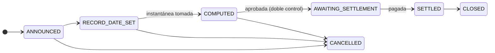
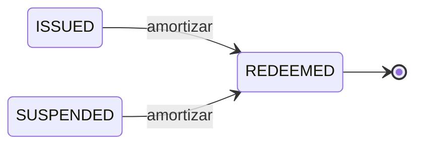

# Etapa 6 — Operaciones societarias y amortización

*Pasan cinco años. Dos veces al año Nordwind paga intereses. Después el préstamo termina.*

Una **operación societaria** es todo lo que hace el emisor y que afecta a los titulares en cuanto titulares. Pagar un cupón. Pagar un dividendo. Desdoblar los títulos. Convertirlos. Devolver el principal. El término es antiguo y algo engañoso — nada de esto exige que una sociedad haga algo inusual. Es sencillamente la categoría de los *acontecimientos que el registro debe reflejar*.

---

## El problema que toda operación societaria debe resolver

El bono cambia de manos constantemente. Los cupones se pagan dos veces al año. Por tanto:

**¿A quién se paga?**

La respuesta no puede ser «a quien lo tenga cuando llegue el pago» — eso no se puede saber por anticipado y haría caótica la negociación. Los mercados lo resuelven con tres fechas, y vale la pena aprenderlas una vez, porque toda operación societaria en todo mercado las utiliza.

| Fecha | Qué significa |
|---|---|
| **Fecha de anuncio** | El emisor declara la operación. Todavía no ocurre nada. |
| **Fecha de registro** | Se fotografía el registro. **Quien sea titular en ese instante cobra** — pase lo que pase después. |
| **Fecha ex-cupón** | A partir de aquí el valor se negocia *sin* el pago pendiente. Quien compre después no tiene derecho a él. |
| **Fecha de pago** | El dinero se mueve efectivamente. |

!!! example "El tercer cupón de Nordwind"

    | | |
    |---|---|
    | Anunciado | 1 de mayo |
    | Fecha ex-cupón | 12 de junio |
    | **Fecha de registro** | **15 de junio** |
    | Fecha de pago | 30 de junio |

    Un inversor que el 15 de junio tenga 100 títulos recibe 2.250 € el 30 de junio — 100.000 € nominales × 4,5 % ÷ 2.

    Si vende el 20 de junio, cobra **igualmente** el pago: era titular en la fecha de registro. El comprador lo sabe — por eso el precio baja aproximadamente el importe del cupón en la fecha ex-cupón. No se ha perdido nada; el derecho simplemente se quedó con el vendedor.

??? note "Para especialistas: la fotografía es una tabla real"

    La instantánea de la fecha de registro se materializa como una fila por titular, y recoge el titular, la dirección de monedero, el nominal mantenido en ese instante y el derecho calculado.

    Dos razones para almacenarla en lugar de recalcularla. Primera, el derecho debe ser reproducible años después, y un recálculo a partir de un registro mutable no lo sería. Segunda, el identificador del inversor se desnormaliza en cada fila, de modo que «rendimientos totales de este inversor en el ejercicio N» se responda sin un join entre módulos — justo la consulta que necesita un certificado fiscal.

---

## El ciclo de vida de una operación societaria

El paso `COMPUTED` → `AWAITING_SETTLEMENT` exige **[doble control](../../compliance/step-up-mfa.md)**: una segunda persona autorizada debe aprobar antes de que salga dinero frente a una lista de titulares. El error catastrófico más común en la administración de valores es pagar a la lista equivocada, y deshacerlo es muy difícil.

Los cupones de un bono se generan automáticamente a partir del calendario de pagos en lugar de confiarse a la memoria de alguien, y la tarea diaria que hace avanzar las operaciones a lo largo de sus fechas se ejecuta sola.

### Los tipos que modela Registerwerk

| | |
|---|---|
| `COUPON`, `INTEREST_PAYMENT` | Intereses periódicos. |
| `DIVIDEND` | Un reparto a los tenedores de capital. |
| `REDEMPTION`, `PARTIAL_REDEMPTION` | Devolución del principal, total o parcial. |
| `CALL` | Amortización anticipada por el emisor, cuando las condiciones lo permiten. |
| `SPLIT`, `REVERSE_SPLIT` | Cambiar el número de títulos sin cambiar el valor total. |
| `CONVERSION` | Transformar el instrumento en otro. |
| `CAPITAL_CALL` | Requerir desembolsos adicionales a los titulares. |
| `PLEDGE` | Dejar constancia de que una posición ha sido pignorada. |

---

## Certificados fiscales

Para los titulares alemanes, los rendimientos de un valor tributan, y el titular necesita una **Steuerbescheinigung** — un certificado fiscal que indique lo percibido en un año determinado.

Registerwerk lo genera a partir de las filas de operaciones societarias: para cada inversor, todos los derechos del ejercicio, agregados.

!!! warning "Acredita lo que se pagó, no lo que se debe"
    El certificado es una constancia fáctica de los repartos procedentes de este registro. No es asesoramiento fiscal, no tiene en cuenta rendimientos obtenidos en otros sitios y no calcula la deuda tributaria de nadie. Las obligaciones de retención dependen de la residencia y la condición del titular, y son responsabilidad del emisor y del titular.

---

## La amortización — el final

Al vencimiento el préstamo termina. Nordwind devuelve 1.000 € por título a quienes los tengan en la fecha de registro, y los títulos dejan de existir.

Mecánicamente se trata de una operación societaria de tipo `REDEMPTION`, generada automáticamente al llegar la fecha de vencimiento, exactamente igual que los cupones. La diferencia está en lo que ocurre después:

1. Se toma la instantánea de la fecha de registro.
2. El derecho de cada titular es su nominal al valor nominal.
3. El pago se aprueba con doble control y se liquida.
4. Los tokens se **destruyen** — eliminados on-chain, la oferta vuelve a cero.
5. El activo pasa a `REDEEMED`.

`REDEEMED` es terminal. No existe transición de salida — ni reactivación ni reemisión. Un valor amortizado está cerrado, y el registro conserva su historial completo de forma permanente.

!!! danger "La destrucción es irreversible, y está vigilada"
    Destruir tokens es una operación tan afilada como crearlos. Una destrucción forzosa al amparo del §26 eWpG exige [autenticación reforzada](../../compliance/step-up-mfa.md), queda anotada en el registro de auditoría con la persona que la realizó y, en algunas configuraciones, requiere doble control.

    Fíjese en lo que la amortización **no** hace: no borra nada. Las filas de titulares se marcan como eliminadas, nunca se suprimen, porque un asiento registral del §16 eWpG que desapareciera no podría satisfacer las obligaciones de conservación e inalterabilidad. Todo sigue siendo consultable — simplemente queda marcado como cerrado.

### Cuando la amortización no se produce

Pasa la fecha de pago y no se liquida nada. Eso es un **impago**, y es un acontecimiento real que la plataforma detecta en lugar de ignorar: las operaciones de amortización cuya fecha de pago ha vencido sin liquidarse se señalan, igual que los cupones no atendidos.

Registerwerk levanta la bandera. No puede exigir un crédito — eso corresponde al comisario del sindicato, a los titulares y a los tribunales.

---

## Toda la historia en seis líneas

1. **Diseño** — Nordwind describe un bono; el operador lo aprueba.
2. **Emisión** — se despliega un contrato, se admite a los inversores, se acuñan 50.000 títulos.
3. **Tenencia** — los inversores mantienen; el registro hace fe, la cadena es verificable.
4. **Negociación** — los títulos cambian de manos; las reglas de cumplimiento aguantan en cada transmisión.
5. **Financiación** — un titular pignora títulos y pide prestado contra ellos.
6. **Amortización** — cupones pagados, principal devuelto, tokens destruidos, registro cerrado.

Cada paso es imputable a una persona con nombre y apellidos en un [registro a prueba de manipulación](../../platform/audit-log.md). Cada restricción la impone el código y no una política interna. Y en ningún momento hizo falta que nadie sostuviera un título físico.

---

## Adónde ir ahora

-   **Hacer el trabajo**

    ---

    [Inversor](../workspaces/investor.md) · [Trader](../workspaces/trader.md) · [Emisor](../workspaces/issuer.md) · [Auditor](../workspaces/auditor.md)

-   **Profundizar**

    ---

    [Estándares de token](../../token-standards/index.md) · [Marcos jurídicos](../../legal/index.md) · [Componentes de cumplimiento](../../compliance/index.md)

-   **Aún tiene dudas**

    ---

    [Preguntas y respuestas](../faq.md) · [Glosario](../glossary.md)

