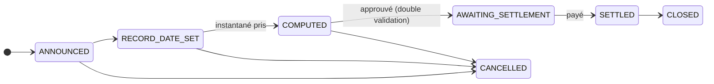
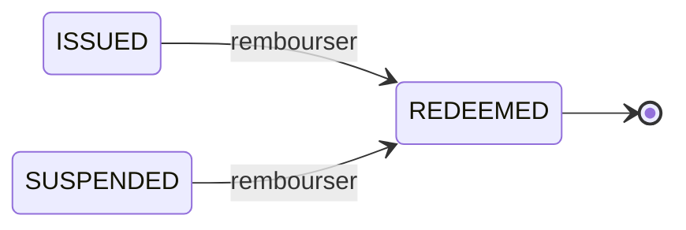

# Étape 6 — Opérations sur titres et remboursement

*Cinq années passent. Deux fois par an, Nordwind verse des intérêts. Puis le prêt prend fin.*

Une **opération sur titres** est tout ce que fait l'émetteur et qui affecte les titulaires en tant que titulaires. Verser un coupon. Verser un dividende. Diviser les titres. Les convertir. Rembourser le principal. Le terme est ancien et légèrement trompeur — rien ici n'exige qu'une société fasse quoi que ce soit d'inhabituel. C'est simplement la catégorie des *événements que le registre doit refléter*.

---

## Le problème que toute opération sur titres doit résoudre

L'obligation change de mains en permanence. Les coupons sont versés deux fois par an. Donc :

**Qui est payé ?**

La réponse ne peut pas être « celui qui la détient quand le paiement arrive » — c'est impossible à connaître à l'avance et cela rendrait la négociation chaotique. Les marchés résolvent cela avec trois dates, et il vaut la peine de les apprendre une fois, car toute opération sur titres, sur tout marché, les utilise.

| Date | Signification |
|---|---|
| **Date d'annonce** | L'émetteur déclare l'opération. Rien ne se passe encore. |
| **Date d'enregistrement** | Le registre est photographié. **Quiconque est titulaire à cet instant est payé** — quoi qu'il advienne ensuite. |
| **Date de détachement** | À partir de là, le titre se négocie *sans* le paiement à venir. Celui qui achète après n'y a pas droit. |
| **Date de paiement** | L'argent circule effectivement. |

!!! example "Le troisième coupon de Nordwind"

    | | |
    |---|---|
    | Annoncé | 1er mai |
    | Date de détachement | 12 juin |
    | **Date d'enregistrement** | **15 juin** |
    | Date de paiement | 30 juin |

    Un investisseur détenant 100 titres le 15 juin reçoit 2 250 € le 30 juin — 100 000 € de nominal × 4,5 % ÷ 2.

    S'il vend le 20 juin, il perçoit **quand même** le paiement : il était titulaire à la date d'enregistrement. L'acheteur le sait — c'est pourquoi le cours baisse d'environ le montant du coupon à la date de détachement. Rien n'a été perdu ; le droit est simplement resté au vendeur.

??? note "Pour les spécialistes : la photographie est une vraie table"

    L'instantané pris à la date d'enregistrement est matérialisé sous forme d'une ligne par titulaire, capturant le titulaire, l'adresse de portefeuille, le nominal détenu à cet instant et le droit calculé.

    Deux raisons de le stocker plutôt que de le recalculer. D'abord, le droit doit être reproductible des années plus tard, ce qu'un recalcul à partir d'un registre mutable ne serait pas. Ensuite, l'identifiant de l'investisseur est dénormalisé sur chaque ligne, de sorte que « revenus totaux de cet investisseur pour l'exercice N » se répond sans jointure inter-modules — précisément la requête dont une attestation fiscale a besoin.

---

## Le cycle de vie d'une opération sur titres

Le passage `COMPUTED` → `AWAITING_SETTLEMENT` exige la **[double validation](../../compliance/step-up-mfa.md)** : une seconde personne habilitée doit approuver avant que de l'argent ne parte au regard d'une liste de titulaires. L'erreur catastrophique la plus courante en administration de titres est de payer la mauvaise liste, et elle est très difficile à défaire.

Les coupons d'une obligation sont générés automatiquement à partir de l'échéancier plutôt que confiés à la mémoire d'un humain, et la tâche quotidienne qui fait progresser les opérations au fil de leurs dates s'exécute d'elle-même.

### Les types que Registerwerk modélise

| | |
|---|---|
| `COUPON`, `INTEREST_PAYMENT` | Intérêts périodiques. |
| `DIVIDEND` | Une distribution aux détenteurs de capital. |
| `REDEMPTION`, `PARTIAL_REDEMPTION` | Remboursement du principal, en totalité ou en partie. |
| `CALL` | Remboursement anticipé par l'émetteur, lorsque les conditions le permettent. |
| `SPLIT`, `REVERSE_SPLIT` | Modifier le nombre de titres sans modifier la valeur totale. |
| `CONVERSION` | Transformer l'instrument en un autre. |
| `CAPITAL_CALL` | Appeler des versements complémentaires auprès des titulaires. |
| `PLEDGE` | Consigner qu'une position a été nantie. |

---

## Attestations fiscales

Pour les titulaires allemands, les revenus d'un titre sont imposables, et le titulaire a besoin d'une **Steuerbescheinigung** — une attestation fiscale indiquant ce qu'il a perçu au cours d'une année donnée.

Registerwerk la produit à partir des lignes d'opérations sur titres : pour chaque investisseur, l'ensemble des droits de l'exercice, agrégés.

!!! warning "Elle indique ce qui a été payé, pas ce qui est dû"
    L'attestation est un relevé factuel des distributions issues de ce registre. Ce n'est pas un conseil fiscal, elle ne tient pas compte de revenus perçus ailleurs et ne calcule l'impôt de personne. Les obligations de retenue à la source dépendent de la résidence et du statut du titulaire, et relèvent de la responsabilité de l'émetteur et du titulaire.

---

## Le remboursement — la fin

À l'échéance, le prêt prend fin. Nordwind rembourse 1 000 € par titre à ceux qui les détiennent à la date d'enregistrement, et les titres cessent d'exister.

Mécaniquement, il s'agit d'une opération sur titres de type `REDEMPTION`, générée automatiquement à l'arrivée de la date d'échéance, exactement comme les coupons. La différence tient à ce qui se passe ensuite :

1. L'instantané à la date d'enregistrement est pris.
2. Le droit de chaque titulaire est son nominal à la valeur nominale.
3. Le paiement est approuvé en double validation puis réglé.
4. Les jetons sont **détruits** — supprimés on-chain, l'offre revient à zéro.
5. L'actif passe à `REDEEMED`.

`REDEEMED` est terminal. Il n'existe aucune transition pour en sortir — ni réactivation, ni réémission. Un titre remboursé est clos, et le registre conserve son historique complet de façon permanente.

!!! danger "La destruction est irréversible, et elle est surveillée"
    Détruire des jetons est une opération aussi tranchante que d'en créer. Une destruction forcée au titre du §26 eWpG exige une [authentification renforcée](../../compliance/step-up-mfa.md), est consignée dans la piste d'audit avec l'auteur nommément désigné, et requiert dans certaines configurations la double validation.

    Notez ce que le remboursement ne fait *pas* : il ne supprime rien. Les lignes de titulaires font l'objet d'une suppression logique, jamais d'un effacement, car une inscription au registre au sens du §16 eWpG qui disparaîtrait ne pourrait satisfaire aux obligations de conservation et d'inviolabilité. Tout reste interrogeable — c'est simplement marqué comme clos.

### Lorsque le remboursement n'a pas lieu

La date de paiement passe et rien n'est réglé. C'est un **défaut de paiement**, et c'est un événement réel que la plateforme détecte plutôt qu'elle ne l'ignore : les opérations de remboursement dont la date de paiement est dépassée sans règlement sont signalées, tout comme les coupons manqués.

Registerwerk lève le drapeau. Il ne peut pas faire exécuter une créance — cela relève du représentant de la masse, des titulaires et des tribunaux.

---

## Toute l'histoire en six lignes

1. **Conception** — Nordwind décrit une obligation ; l'opérateur l'approuve.
2. **Émission** — un contrat est déployé, les investisseurs admis, 50 000 titres créés.
3. **Détention** — les investisseurs détiennent ; le registre fait foi, la chaîne est vérifiable.
4. **Négociation** — les titres changent de mains ; les règles de conformité tiennent à chaque transfert.
5. **Financement** — un titulaire nantit des titres et emprunte contre eux.
6. **Remboursement** — coupons versés, principal remboursé, jetons détruits, registre clos.

Chaque étape est imputable à une personne nommément désignée dans une [piste d'audit inviolable](../../platform/audit-log.md). Chaque restriction est appliquée par du code plutôt que par une politique interne. Et à aucun moment quiconque n'a eu besoin de tenir un certificat entre ses mains.

---

## Et ensuite

-   **Faire le travail**

    ---

    [Investisseur](../workspaces/investor.md) · [Trader](../workspaces/trader.md) · [Émetteur](../workspaces/issuer.md) · [Auditeur](../workspaces/auditor.md)

-   **Aller plus loin**

    ---

    [Normes de jetons](../../token-standards/index.md) · [Cadres juridiques](../../legal/index.md) · [Composants de conformité](../../compliance/index.md)

-   **Encore des questions**

    ---

    [Questions et réponses](../faq.md) · [Glossaire](../glossary.md)

