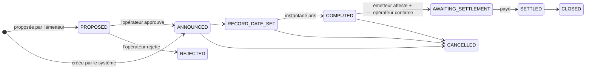
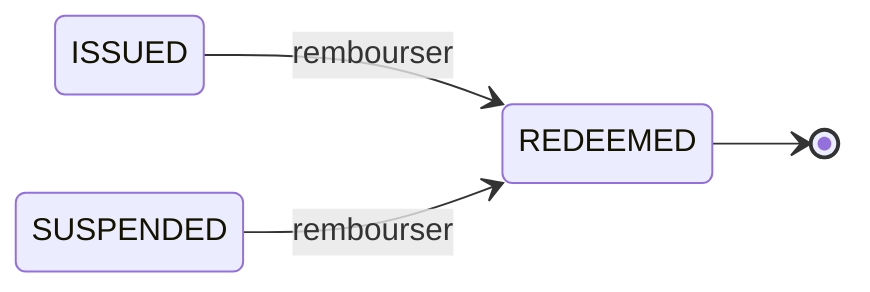

# Étape 6 — Opérations sur titres et remboursement

*Cinq années passent. Deux fois par an, Nordwind verse des intérêts. Puis le prêt prend fin.*

Une **opération sur titres** est tout ce que fait l'émetteur et qui affecte les titulaires en tant que titulaires. Verser un coupon. Verser un dividende. Diviser les titres. Les convertir. Rembourser le principal. Le terme est ancien et légèrement trompeur — rien ici n'exige qu'une société fasse quoi que ce soit d'inhabituel. C'est simplement la catégorie des *événements que le registre doit refléter*.

---

## Le problème que toute opération sur titres doit résoudre

L'obligation change de mains en permanence. Les coupons sont versés deux fois par an. Donc :

**Qui est payé ?**

La réponse ne peut pas être « celui qui la détient quand le paiement arrive » — c'est impossible à connaître à l'avance et cela rendrait la négociation chaotique. Les marchés résolvent cela avec trois dates, et il vaut la peine de les apprendre une fois, car toute opération sur titres, sur tout marché, les utilise.

| Date | Signification |
|---|---|
| **Date d'annonce** | L'émetteur déclare l'opération. Rien ne se passe encore. |
| **Date d'enregistrement** | Le registre est photographié. **Quiconque est titulaire à cet instant est payé** — quoi qu'il advienne ensuite. |
| **Date de détachement** | À partir de là, le titre se négocie *sans* le paiement à venir. Celui qui achète après n'y a pas droit. |
| **Date de paiement** | L'argent circule effectivement. |

!!! example "Le troisième coupon de Nordwind"

    | | |
    |---|---|
    | Annoncé | 1er mai |
    | Date de détachement | 12 juin |
    | **Date d'enregistrement** | **15 juin** |
    | Date de paiement | 30 juin |

    Un investisseur détenant 100 titres le 15 juin reçoit 2 250 € le 30 juin — 100 000 € de nominal × 4,5 % ÷ 2.

    S'il vend le 20 juin, il perçoit **quand même** le paiement : il était titulaire à la date d'enregistrement. L'acheteur le sait — c'est pourquoi le cours baisse d'environ le montant du coupon à la date de détachement. Rien n'a été perdu ; le droit est simplement resté au vendeur.

??? note "Pour les spécialistes : la photographie est une vraie table"

    L'instantané pris à la date d'enregistrement est matérialisé sous forme d'une ligne par titulaire, capturant le titulaire, l'adresse de portefeuille, le nominal détenu à cet instant et le droit calculé.

    Deux raisons de le stocker plutôt que de le recalculer. D'abord, le droit doit être reproductible des années plus tard, ce qu'un recalcul à partir d'un registre mutable ne serait pas. Ensuite, l'identifiant de l'investisseur est dénormalisé sur chaque ligne, de sorte que « revenus totaux de cet investisseur pour l'exercice N » se répond sans jointure inter-modules — précisément la requête dont une attestation fiscale a besoin.

---

## Le cycle de vie d'une opération sur titres

```mermaid
stateDiagram-v2
    direction LR
    [*] --> PROPOSED: proposée par l'émetteur
    [*] --> ANNOUNCED: créée par le système
    PROPOSED --> ANNOUNCED: l'opérateur approuve
    PROPOSED --> REJECTED: l'opérateur rejette
    ANNOUNCED --> RECORD_DATE_SET
    RECORD_DATE_SET --> COMPUTED: instantané pris
    COMPUTED --> AWAITING_SETTLEMENT: émetteur atteste + opérateur confirme
    AWAITING_SETTLEMENT --> SETTLED: payé
    SETTLED --> CLOSED
    ANNOUNCED --> CANCELLED
    RECORD_DATE_SET --> CANCELLED
    COMPUTED --> CANCELLED
```

Les coupons, et finalement le remboursement, sont **créés par le système** — générés automatiquement à partir de l'échéancier ou de la date d'échéance, plutôt que confiés à la mémoire d'un humain, et démarrent à `ANNOUNCED`. Les dividendes, les fractionnements et les remboursements anticipés sont **proposés par l'émetteur** : l'émetteur soumet une opération qui démarre à `PROPOSED`, et elle ne rejoint le registre (`ANNOUNCED`) qu'une fois qu'un opérateur l'a examinée et approuvée — ou elle est définitivement écartée (`REJECTED`) sinon.

Le passage `COMPUTED` → `AWAITING_SETTLEMENT` exige l'accord de **deux parties distinctes**, quelle que soit la façon dont l'opération a été créée : l'émetteur atteste que l'obligation sous-jacente est réellement prête — les fonds pour un coupon ou un dividende, le mécanisme pour un fractionnement ou un remboursement anticipé — puis un opérateur confirme le volet registre/on-chain. L'erreur catastrophique la plus courante en administration de titres est de payer la mauvaise liste, et le fait que deux organisations doivent donner leur accord, et non deux collègues d'une même organisation, rend cela bien plus difficile à laisser passer inaperçu. L'attestation de l'émetteur est une action authentifiée normale ; seule la confirmation de l'opérateur exige une [authentification renforcée](../../compliance/step-up-mfa.md). Si l'émetteur n'atteste jamais, un opérateur peut passer outre cette exigence — ce contournement est enregistré comme une exception distincte et durablement visible, jamais indiscernable d'une attestation authentique.

### Les types que Registerwerk modélise

Seul un sous-ensemble peut réellement être créé aujourd'hui — le reste est modélisé (il a sa place dans le cycle de vie et le mécanisme de règlement) mais n'a pas encore de voie de création.

**Pris en charge aujourd'hui**

| | Créée par |
|---|---|
| `COUPON`, `INTEREST_PAYMENT` | Le système, à partir de l'échéancier. |
| `REDEMPTION` | Le système, à la date d'échéance. |
| `DIVIDEND` | Proposition de l'émetteur, examinée par l'opérateur. |
| `SPLIT` | Proposition de l'émetteur, examinée par l'opérateur. Réglé par constat manuel de l'opérateur — aucun standard de jeton pris en charge ne dispose d'une primitive de fractionnement on-chain. |
| `CALL` | Proposition de l'émetteur, examinée par l'opérateur. Remboursement anticipé par l'émetteur, lorsque les conditions le permettent. |

**Modélisé, pas encore pris en charge**

| | |
|---|---|
| `PARTIAL_REDEMPTION` | Remboursement partiel du principal. |
| `REVERSE_SPLIT` | Réduire le nombre de titres sans modifier la valeur totale. |
| `CONVERSION` | Transformer l'instrument en un autre. |
| `CAPITAL_CALL` | Appeler des versements complémentaires auprès des titulaires. |

---

## Relevé de revenus (pas une attestation fiscale) { #tax-certificates }

Pour les titulaires allemands, les revenus d'un titre sont imposables. Registerwerk fournit chaque année un **Ertragsübersicht** (relevé de revenus) indiquant ce qui a été versé au titulaire — mais ce n'est **pas une Steuerbescheinigung** au sens du § 45a EStG.

Il est produit à partir des lignes d'opérations sur titres réglées : pour chaque investisseur, les droits à coupon, intérêts et dividendes de l'année civile, regroupés **par devise** (des montants en devises différentes ne sont jamais additionnés). Les remboursements de capital (remboursement, rachat, remboursement partiel) et les appels de fonds ne sont **pas des revenus** et sont exclus ; les plus-values de cession ou de remboursement ne sont pas déterminées, car le registre ne contient pas les prix de revient.

!!! warning "Il indique ce qui a été payé, pas ce qui est dû"
    Le relevé est un état factuel des distributions brutes issues de ce registre. Ce n'est pas un conseil fiscal, il ne tient pas compte de revenus perçus ailleurs et ne calcule l'impôt de personne. **Registerwerk ne retient ni Kapitalertragsteuer ni Solidaritätszuschlag** — les coupons sont versés bruts et le relevé l'indique (retenu : 0,00). Savoir si le teneur de registre agit comme agent payeur qui retient et atteste est une décision de principe encore ouverte ; d'ici là, titulaires et émetteurs restent responsables de la retenue et de la déclaration.

---

## Le remboursement — la fin

À l'échéance, le prêt prend fin. Nordwind rembourse 1 000 € par titre à ceux qui les détiennent à la date d'enregistrement, et les titres cessent d'exister.

Mécaniquement, il s'agit d'une opération sur titres de type `REDEMPTION`, générée automatiquement à l'arrivée de la date d'échéance, exactement comme les coupons. La différence tient à ce qui se passe ensuite :

1. L'instantané à la date d'enregistrement est pris.
2. Le droit de chaque titulaire est son nominal à la valeur nominale.
3. L'émetteur atteste, un opérateur confirme, et le paiement est réglé.
4. Les jetons sont **détruits** — supprimés on-chain, l'offre revient à zéro.
5. L'actif passe à `REDEEMED`.

```mermaid
stateDiagram-v2
    direction LR
    ISSUED --> REDEEMED: rembourser
    SUSPENDED --> REDEEMED: rembourser
    REDEEMED --> [*]
```

`REDEEMED` est terminal. Il n'existe aucune transition pour en sortir — ni réactivation, ni réémission. Un titre remboursé est clos, et le registre conserve son historique complet de façon permanente.

!!! danger "La destruction est irréversible, et elle est surveillée"
    Détruire des jetons est une opération aussi tranchante que d'en créer. Une destruction forcée au titre du §26 eWpG exige une [authentification renforcée](../../compliance/step-up-mfa.md), est consignée dans la piste d'audit avec l'auteur nommément désigné, et requiert dans certaines configurations la double validation.

    Notez ce que le remboursement ne fait *pas* : il ne supprime rien. Les lignes de titulaires font l'objet d'une suppression logique, jamais d'un effacement, car une inscription au registre au sens du §16 eWpG qui disparaîtrait ne pourrait satisfaire aux obligations de conservation et d'inviolabilité. Tout reste interrogeable — c'est simplement marqué comme clos.

### Lorsque le remboursement n'a pas lieu

Le paiement n'est pas réglé à la date prévue. La plateforme ne parle pas immédiatement de défaut : le paiement apparaît d'abord comme **paiement en attente** (en retard) pendant le délai de grâce — 30 jours pour les intérêts, 7 jours pour le principal par défaut. Ce n'est que s'il reste impayé ensuite que le coupon est signalé **manqué** et l'obligation **en défaut**. Si le paiement est réglé à un moment quelconque, le signal est effacé et l'obligation est marquée remboursée (ou le coupon payé).

Registerwerk lève le drapeau. Il ne peut pas faire exécuter une créance — cela relève du représentant de la masse, des titulaires et des tribunaux.

---

## Toute l'histoire en six lignes

1. **Conception** — Nordwind décrit une obligation ; l'opérateur l'approuve.
2. **Émission** — un contrat est déployé, les investisseurs admis, 50 000 titres créés.
3. **Détention** — les investisseurs détiennent ; le registre fait foi, la chaîne est vérifiable.
4. **Négociation** — les titres changent de mains ; les règles de conformité tiennent à chaque transfert.
5. **Financement** — un titulaire nantit des titres et emprunte contre eux.
6. **Remboursement** — coupons versés, principal remboursé, jetons détruits, registre clos.

Chaque étape est imputable à une personne nommément désignée dans une [piste d'audit inviolable](../../platform/audit-log.md). Chaque restriction est appliquée par du code plutôt que par une politique interne. Et à aucun moment quiconque n'a eu besoin de tenir un certificat entre ses mains.

---

## Et ensuite

-   **Faire le travail**

    ---

    [Investisseur](../workspaces/investor.md) · [Trader](../workspaces/trader.md) · [Émetteur](../workspaces/issuer.md) · [Auditeur](../workspaces/auditor.md)

-   **Aller plus loin**

    ---

    [Normes de jetons](../../token-standards/index.md) · [Cadres juridiques](../../legal/index.md) · [Composants de conformité](../../compliance/index.md)

-   **Encore des questions**

    ---

    [Questions et réponses](../faq.md) · [Glossaire](../glossary.md)

