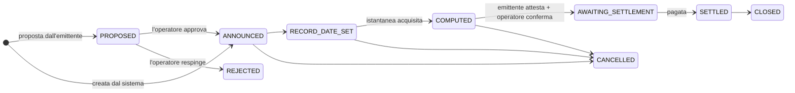
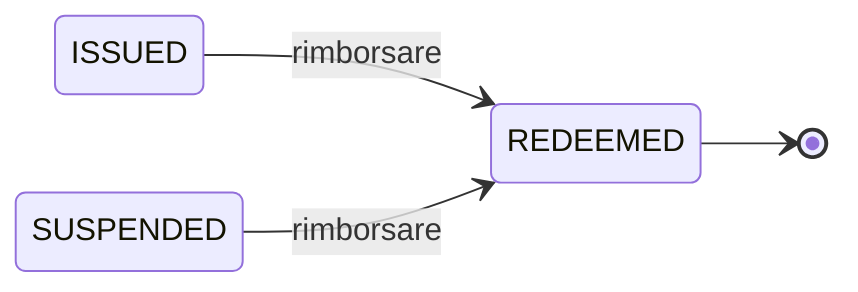

# Fase 6 — Operazioni societarie e rimborso

*Passano cinque anni. Due volte l'anno Nordwind paga gli interessi. Poi il prestito finisce.*

Un'**operazione societaria** è tutto ciò che l'emittente fa e che riguarda i titolari in quanto titolari. Pagare una cedola. Pagare un dividendo. Frazionare i titoli. Convertirli. Rimborsare il capitale. Il termine è antico e un po' fuorviante — nulla di tutto questo richiede che una società faccia qualcosa di insolito. È semplicemente la categoria degli *eventi che il registro deve riflettere*.

---

## Il problema che ogni operazione societaria deve risolvere

L'obbligazione cambia di mano continuamente. Le cedole si pagano due volte l'anno. Quindi:

**Chi viene pagato?**

La risposta non può essere «chi la detiene quando arriva il pagamento»: è impossibile saperlo in anticipo e renderebbe caotica la negoziazione. I mercati risolvono la cosa con tre date, e vale la pena impararle una volta per tutte, perché ogni operazione societaria su ogni mercato le usa.

| Data | Che cosa significa |
|---|---|
| **Data di annuncio** | L'emittente dichiara l'operazione. Non succede ancora nulla. |
| **Data di registrazione** | Si fotografa il registro. **Chi è titolare in quell'istante viene pagato** — a prescindere da ciò che accade dopo. |
| **Data di stacco** | Da qui il titolo si negozia *senza* il pagamento in arrivo. Chi compra dopo non ne ha diritto. |
| **Data di pagamento** | Il denaro si muove davvero. |

!!! example "La terza cedola di Nordwind"

    | | |
    |---|---|
    | Annunciata | 1° maggio |
    | Data di stacco | 12 giugno |
    | **Data di registrazione** | **15 giugno** |
    | Data di pagamento | 30 giugno |

    Un investitore che il 15 giugno detiene 100 titoli riceve 2.250 € il 30 giugno — 100.000 € nominali × 4,5 % ÷ 2.

    Se vende il 20 giugno, incassa **comunque** il pagamento: era titolare alla data di registrazione. L'acquirente lo sa — ed è per questo che alla data di stacco il prezzo scende all'incirca dell'importo della cedola. Nulla è andato perduto; il diritto è semplicemente rimasto al venditore.

??? note "Per gli specialisti: la fotografia è una tabella vera"

    L'istantanea alla data di registrazione viene materializzata come una riga per titolare, e cattura il titolare, l'indirizzo del wallet, il nominale detenuto in quell'istante e il diritto calcolato.

    Due motivi per memorizzarla anziché ricalcolarla. Primo, il diritto deve essere riproducibile anche anni dopo, e un ricalcolo a partire da un registro mutevole non lo sarebbe. Secondo, l'identificativo dell'investitore è denormalizzato su ogni riga, così che «reddito complessivo di questo investitore nell'anno fiscale N» sia rispondibile senza un join tra moduli — esattamente la query di cui ha bisogno una certificazione fiscale.

---

## Il ciclo di vita di un'operazione societaria

Le cedole e, alla fine, il rimborso vengono **creati dal sistema** — generati automaticamente dal piano dei pagamenti o dalla data di scadenza, anziché essere affidati alla memoria di una persona, e partono da `ANNOUNCED`. I dividendi, i frazionamenti e i rimborsi anticipati sono **proposti dall'emittente**: l'emittente presenta un'operazione che parte da `PROPOSED`, e questa entra a far parte del registro (`ANNOUNCED`) solo dopo che un operatore l'ha esaminata e approvata — oppure viene scartata definitivamente (`REJECTED`) in caso contrario.

Il passaggio `COMPUTED` → `AWAITING_SETTLEMENT` richiede il via libera di **due parti separate**, comunque sia stata creata l'operazione: l'emittente attesta che l'obbligazione sottostante è realmente pronta — il denaro per una cedola o un dividendo, il meccanismo per un frazionamento o un rimborso anticipato — e poi un operatore conferma il lato registro/on-chain. L'errore catastrofico più comune nell'amministrazione di strumenti finanziari è pagare l'elenco sbagliato, e il fatto che debbano dare il via libera due organizzazioni, non due colleghi della stessa, rende molto più difficile che ciò accada inosservato. L'attestazione dell'emittente è un'azione autenticata normale; solo la conferma dell'operatore richiede [autenticazione rafforzata](../../compliance/step-up-mfa.md). Se l'emittente non attesta mai, un operatore può scavalcare il requisito — questo viene registrato come eccezione distinta e permanentemente visibile, mai indistinguibile da un'attestazione genuina.

### I tipi che Registerwerk modella

Solo un sottoinsieme può essere effettivamente creato oggi — il resto è modellato (ha un posto nel ciclo di vita e nel meccanismo di regolamento) ma non ha ancora un percorso di creazione.

**Supportati oggi**

| | Creata da |
|---|---|
| `COUPON`, `INTEREST_PAYMENT` | Il sistema, dal piano dei pagamenti. |
| `REDEMPTION` | Il sistema, alla data di scadenza. |
| `DIVIDEND` | Proposta dell'emittente, esaminata dall'operatore. |
| `SPLIT` | Proposta dell'emittente, esaminata dall'operatore. Si regola tramite constatazione manuale dell'operatore — nessuno standard di token supportato dispone di una primitiva di frazionamento on-chain. |
| `CALL` | Proposta dell'emittente, esaminata dall'operatore. Rimborso anticipato da parte dell'emittente, ove le condizioni lo consentano. |

**Modellati, non ancora supportati**

| | |
|---|---|
| `PARTIAL_REDEMPTION` | Rimborso parziale del capitale. |
| `REVERSE_SPLIT` | Ridurre il numero di titoli senza cambiare il valore complessivo. |
| `CONVERSION` | Trasformare lo strumento in un altro. |
| `CAPITAL_CALL` | Richiamare versamenti aggiuntivi ai titolari. |

---

## Certificazioni fiscali

Per i titolari tedeschi i proventi di uno strumento sono imponibili, e il titolare ha bisogno di una **Steuerbescheinigung** — una certificazione fiscale che indichi quanto ha percepito in un dato anno.

Registerwerk la produce a partire dalle righe delle operazioni societarie: per ciascun investitore, tutti i diritti dell'anno fiscale, aggregati.

!!! warning "Attesta ciò che è stato pagato, non ciò che è dovuto"
    La certificazione è una registrazione fattuale delle distribuzioni provenienti da questo registro. Non è consulenza fiscale, non tiene conto di redditi percepiti altrove e non calcola l'imposta di nessuno. Gli obblighi di ritenuta dipendono dalla residenza e dallo status del titolare e sono responsabilità dell'emittente e del titolare.

---

## Il rimborso — la fine

Alla scadenza il prestito finisce. Nordwind rimborsa 1.000 € per titolo a chi li detiene alla data di registrazione, e i titoli cessano di esistere.

Meccanicamente si tratta di un'operazione societaria di tipo `REDEMPTION`, generata automaticamente all'arrivo della data di scadenza, esattamente come le cedole. La differenza sta in ciò che accade dopo:

1. Viene acquisita l'istantanea alla data di registrazione.
2. Il diritto di ciascun titolare è il suo nominale al valore nominale.
3. L'emittente attesta, un operatore conferma, e il pagamento viene regolato.
4. I token vengono **distrutti** — eliminati on-chain, l'offerta torna a zero.
5. L'asset passa a `REDEEMED`.

`REDEEMED` è terminale. Non esiste alcuna transizione per uscirne — niente riattivazione, niente riemissione. Uno strumento rimborsato è chiuso, e il registro ne conserva permanentemente la storia completa.

!!! danger "La distruzione è irreversibile, ed è sorvegliata"
    Distruggere token è un'operazione tagliente quanto crearli. Una distruzione coattiva ai sensi del §26 eWpG richiede [autenticazione rafforzata](../../compliance/step-up-mfa.md), viene annotata nel registro di controllo con la persona che l'ha eseguita e, in alcune configurazioni, richiede i quattro occhi.

    Nota che cosa il rimborso *non* fa: non cancella nulla. Le righe dei titolari vengono soft-deleted, mai rimosse, perché un'iscrizione a registro ai sensi del §16 eWpG che sparisse non potrebbe soddisfare gli obblighi di conservazione e di inalterabilità. Tutto resta interrogabile — è semplicemente contrassegnato come chiuso.

### Quando il rimborso non avviene

La data di pagamento passa e nulla viene regolato. È un **inadempimento**, ed è un evento reale che la piattaforma rileva anziché ignorare: le operazioni di rimborso la cui data di pagamento è trascorsa senza regolamento vengono segnalate, così come le cedole mancate.

Registerwerk alza la mano. Non può far valere un credito — quello spetta al rappresentante degli obbligazionisti, ai titolari e ai tribunali.

---

## Tutta la storia in sei righe

1. **Progettazione** — Nordwind descrive un'obbligazione; l'operatore la approva.
2. **Emissione** — viene distribuito un contratto, ammessi gli investitori, coniati 50.000 titoli.
3. **Detenzione** — gli investitori detengono; il registro fa fede, la chain è verificabile.
4. **Negoziazione** — i titoli cambiano di mano; le regole di conformità tengono a ogni trasferimento.
5. **Finanziamento** — un titolare dà in garanzia titoli e ci prende a prestito sopra.
6. **Rimborso** — cedole pagate, capitale rimborsato, token distrutti, registro chiuso.

Ogni passaggio è attribuibile a una persona con nome e cognome in un [registro a prova di manomissione](../../platform/audit-log.md). Ogni restrizione è imposta dal codice anziché da una policy. E in nessun momento qualcuno ha dovuto tenere in mano un certificato.

---

## Dove andare adesso

-   **Fare il lavoro**

    ---

    [Investitore](../workspaces/investor.md) · [Negoziatore](../workspaces/trader.md) · [Emittente](../workspaces/issuer.md) · [Revisore](../workspaces/auditor.md)

-   **Approfondire**

    ---

    [Standard di token](../../token-standards/index.md) · [Quadri normativi](../../legal/index.md) · [Componenti di conformità](../../compliance/index.md)

-   **Ancora domande**

    ---

    [Domande e risposte](../faq.md) · [Glossario](../glossary.md)

