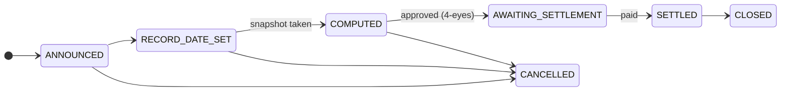
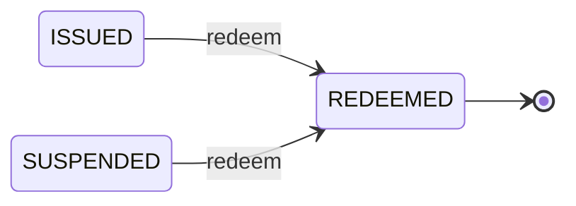

# Stage 6 — Corporate actions and redemption

*Five years pass. Twice a year Nordwind pays interest. Then the loan ends.*

A **corporate action** is anything the issuer does that affects holders as holders. Paying a coupon. Paying a dividend. Splitting the units. Converting them. Repaying the principal. The name is old and slightly misleading — nothing here requires a corporation to act unusually. It is simply the category for *events the register has to reflect*.

---

## The problem every corporate action has to solve

The bond changes hands constantly. Coupons are paid twice a year. So:

**Who gets paid?**

The answer cannot be "whoever holds it when the payment lands" — that is unknowable in advance and would make trading chaotic. Markets solve it with three dates, and they are worth learning once because every corporate action in every market uses them.

| Date | What it means |
|---|---|
| **Announcement date** | The issuer declares the action. Nothing happens yet. |
| **Record date** | The register is photographed. **Whoever is a holder at this instant gets paid** — regardless of what happens afterwards. |
| **Ex date** | From here the security trades *without* the upcoming payment. A buyer after this date is not entitled to it. |
| **Payment date** | The money actually moves. |

!!! example "Nordwind's third coupon"

    | | |
    |---|---|
    | Announced | 1 May |
    | Ex date | 12 June |
    | **Record date** | **15 June** |
    | Payment date | 30 June |

    An investor holding 100 units on 15 June receives €2,250 on 30 June — €100,000 nominal × 4.5% ÷ 2.

    Sell on 20 June and you **still** get the payment: you were a holder on the record date. The buyer knows this — it is why the price drops by roughly the coupon on the ex date. Nothing has been lost; the entitlement simply stayed with the seller.

??? note "For the specialist: the snapshot is a real table"

    The record-date snapshot is materialised as one row per holder, capturing the asset holder, the wallet address, the nominal held at that instant, and the computed entitlement.

    Two reasons it is stored rather than recomputed. First, entitlement must be reproducible years later, and recomputing from a mutable register would not be. Second, the investor id is denormalised onto each row so that "this investor's total income for tax year N" is answerable without a cross-module join — which is exactly the query a tax certificate needs.

---

## The lifecycle of a corporate action

`COMPUTED` → `AWAITING_SETTLEMENT` requires **[four eyes](../../compliance/step-up-mfa.md)**: a second authorised person has to approve before money moves against a holder list. The commonest catastrophic error in securities administration is paying the wrong list, and it is very hard to reverse.

Coupons on a bond are raised automatically from the payment schedule rather than being remembered by a human, and the daily job that advances actions through their dates runs on its own.

### The types Registerwerk models

| | |
|---|---|
| `COUPON`, `INTEREST_PAYMENT` | Periodic interest. |
| `DIVIDEND` | A distribution to equity holders. |
| `REDEMPTION`, `PARTIAL_REDEMPTION` | Repaying principal, in whole or in part. |
| `CALL` | The issuer repaying early, where terms allow. |
| `SPLIT`, `REVERSE_SPLIT` | Changing the number of units without changing total value. |
| `CONVERSION` | Turning the instrument into another one. |
| `CAPITAL_CALL` | Requiring holders to contribute more. |
| `PLEDGE` | Recording that a holding has been pledged. |

---

## Tax certificates

For German holders, income from a security is taxable, and the holder needs a **Steuerbescheinigung** — a tax certificate stating what they received in a given year.

Registerwerk produces this from the corporate-action entries: for each investor, every entitlement across the tax year, aggregated.

!!! warning "It states what was paid, not what is owed"
    The certificate is a factual record of distributions from this registry. It is not tax advice, does not account for income elsewhere, and does not compute anybody's liability. Withholding obligations depend on the holder's residence and status, and are the issuer's and holder's responsibility.

---

## Redemption — the end

At maturity the loan ends. Nordwind repays €1,000 per unit to whoever holds them on the record date, and the units cease to exist.

Mechanically this is a corporate action of type `REDEMPTION`, raised automatically when the maturity date arrives, exactly as coupons are. The difference is what happens afterwards:

1. The record-date snapshot is taken.
2. Each holder's entitlement is their nominal at face value.
3. Payment is approved under four eyes and settles.
4. The tokens are **burned** — destroyed on-chain, supply returns to zero.
5. The asset moves to `REDEEMED`.

`REDEEMED` is terminal. There is no transition out of it — no reactivation, no reissue. A redeemed security is finished, and the register keeps its complete history permanently.

!!! danger "Burning is irreversible, and it is watched"
    Destroying tokens is as sharp an operation as creating them. A forced burn under §26 eWpG requires [step-up authentication](../../compliance/step-up-mfa.md), is recorded in the audit log with a named actor, and in some configurations requires four eyes.

    Note what redemption does *not* do: it does not delete anything. Holder rows are soft-deleted, never removed, because a §16 register entry that vanishes cannot satisfy retention or tamper-evidence obligations. Everything remains queryable — it is simply marked closed.

### When redemption does not happen

The payment date passes and nothing settles. This is a **default**, and it is a real event that the platform detects rather than ignores: redemption actions whose payment date has passed unsettled are flagged, as are missed coupons.

Registerwerk raises the flag. It cannot enforce a claim — that is a matter for the trustee, the holders and the courts.

---

## The whole story, in six lines

1. **Design** — Nordwind describes a bond; the operator approves it.
2. **Issuance** — a contract is deployed, investors admitted, 50,000 units minted.
3. **Holding** — investors hold; the register is authoritative, the chain is verifiable.
4. **Trading** — units change hands; compliance rules hold on every transfer.
5. **Lending** — a holder pledges units and borrows against them.
6. **Redemption** — coupons paid, principal repaid, tokens burned, register closed.

Every step is attributable to a named person in a [tamper-evident log](../../platform/audit-log.md). Every restriction is enforced by code rather than policy. And at no point did anybody need to physically hold a certificate.

---

## Where to next

-   **Do the job**

    ---

    [Investor](../workspaces/investor.md) · [Trader](../workspaces/trader.md) · [Issuer](../workspaces/issuer.md) · [Auditor](../workspaces/auditor.md)

-   **Go deeper**

    ---

    [Token standards](../../token-standards/index.md) · [Legal frameworks](../../legal/index.md) · [Compliance components](../../compliance/index.md)

-   **Still have questions**

    ---

    [Questions and answers](../faq.md) · [Glossary](../glossary.md)

