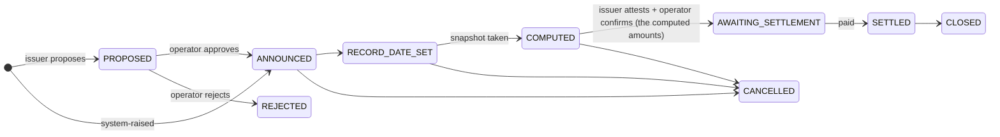
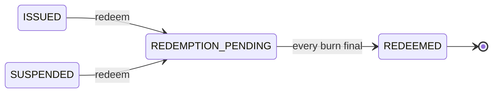

# Stage 6 — Corporate actions and redemption

*Five years pass. Twice a year Nordwind pays interest. Then the loan ends.*

A **corporate action** is anything the issuer does that affects holders as holders. Paying a coupon. Paying a dividend. Splitting the units. Converting them. Repaying the principal. The name is old and slightly misleading — nothing here requires a corporation to act unusually. It is simply the category for *events the register has to reflect*.

---

## The problem every corporate action has to solve

The bond changes hands constantly. Coupons are paid twice a year. So:

**Who gets paid?**

The answer cannot be "whoever holds it when the payment lands" — that is unknowable in advance and would make trading chaotic. Markets solve it with three dates, and they are worth learning once because every corporate action in every market uses them.

| Date | What it means |
|---|---|
| **Announcement date** | The issuer declares the action. Nothing happens yet. |
| **Record date** | The register is photographed. **Whoever is a holder at this instant gets paid** — regardless of what happens afterwards. |
| **Ex date** | From here the security trades *without* the upcoming payment. A buyer after this date is not entitled to it. |
| **Payment date** | The money actually moves. |

!!! example "Nordwind's third coupon"

    | | |
    |---|---|
    | Announced | 1 May |
    | Ex date | 12 June |
    | **Record date** | **15 June** |
    | Payment date | 30 June |

    An investor holding 100 units on 15 June receives €2,250 on 30 June — €100,000 nominal × 4.5% ÷ 2.

    Sell on 20 June and you **still** get the payment: you were a holder on the record date. The buyer knows this — it is why the price drops by roughly the coupon on the ex date. Nothing has been lost; the entitlement simply stayed with the seller.

??? note "For the specialist: the snapshot is a real table"

    The record-date snapshot is materialised as one row per holder, capturing the asset holder, the wallet address, the nominal held at that instant, and the computed entitlement.

    Two reasons it is stored rather than recomputed. First, entitlement must be reproducible years later, and recomputing from a mutable register would not be. Second, the investor id is denormalised onto each row so that "this investor's total income for tax year N" is answerable without a cross-module join — which is exactly the query a tax certificate needs.

---

## The lifecycle of a corporate action

```mermaid
stateDiagram-v2
    direction LR
    [*] --> PROPOSED: issuer proposes
    [*] --> ANNOUNCED: system-raised
    PROPOSED --> ANNOUNCED: operator approves
    PROPOSED --> REJECTED: operator rejects
    ANNOUNCED --> RECORD_DATE_SET
    RECORD_DATE_SET --> COMPUTED: snapshot taken
    COMPUTED --> AWAITING_SETTLEMENT: issuer attests + operator confirms (the computed amounts)
    AWAITING_SETTLEMENT --> SETTLED: paid
    SETTLED --> CLOSED
    ANNOUNCED --> CANCELLED
    RECORD_DATE_SET --> CANCELLED
    COMPUTED --> CANCELLED
```

Coupons and redemptions are **system-raised** — created automatically from the payment schedule or the maturity date, rather than being remembered by a human, and start life `ANNOUNCED`. Dividends, splits, and early calls are **issuer-proposed**: the issuer submits one starting `PROPOSED`, and it only joins the register (`ANNOUNCED`) once an operator has reviewed and approved it — or is discarded permanently (`REJECTED`) if not.

`COMPUTED` → `AWAITING_SETTLEMENT` needs sign-off from **two separate parties**, whichever way the action was raised: the issuer attests that the underlying obligation is actually ready — the cash for a coupon or dividend, the mechanics for a split or call — and then an operator confirms the register/on-chain side. The commonest catastrophic error in securities administration is paying the wrong list, and having two organisations, not two colleagues from one, sign off makes it far harder to happen unnoticed. Both sign-offs cover the **computed amounts**: they are only possible once the action is `COMPUTED`, each is bound to a fingerprint (digest) of the entries, the total and the rounding residual, and a re-computation voids them — the payout starts only when both valid signatures match the amounts as they stand. At payout every holder is checked again (entity active, KYC valid, no sanctions hit, no Sperrvermerk): an ineligible holder is **held** — recorded with the reason, an operator task, never paid — while all other holders are paid; a registry-side hold (blocked snapshot, frozen register, a hold the system placed) is never presented as the issuer's non-payment, so it does not turn a coupon `OVERDUE`/`MISSED` or a bond `OVERDUE`/`DEFAULTED`. Attesting is a normal authenticated action; only the operator's confirmation is [step-up](../../compliance/step-up-mfa.md) gated. If the issuer never attests, an operator can override the requirement — permanently and separately logged as an exception, never indistinguishable from a genuine attestation.

### The types Registerwerk models

Only a subset can actually be created today — the rest are modelled (they have a place in the lifecycle and settlement machinery) but have no creation path yet.

**Supported today**

| | Raised by |
|---|---|
| `COUPON`, `INTEREST_PAYMENT` | System, from the payment schedule. |
| `REDEMPTION` | System, at the maturity date. |
| `DIVIDEND` | Issuer proposal, operator-reviewed. |
| `SPLIT` | Issuer proposal, operator-reviewed. Settles by the operator's manual assertion — no supported token standard has an on-chain split primitive. |
| `CALL` | Issuer proposal, operator-reviewed. The issuer repaying early, where terms allow. |

**Modelled, not yet supported**

| | |
|---|---|
| `PARTIAL_REDEMPTION` | Repaying part of the principal. |
| `REVERSE_SPLIT` | Reducing the number of units without changing total value. |
| `CONVERSION` | Turning the instrument into another one. |
| `CAPITAL_CALL` | Requiring holders to contribute more. |

---

## Income statement (not a tax certificate) { #tax-certificates }

For German holders, income from a security is taxable. Registerwerk provides an annual **Ertragsaufstellung** (income statement) listing what was paid to the holder in a given year — but it is **not a Steuerbescheinigung** within the meaning of § 45a EStG.

It is produced from the settled corporate-action entries: for each investor, the coupon, interest and dividend entitlements of the calendar year, grouped **per currency** (amounts in different currencies are never added up). Repayments of principal (redemption, call, partial redemption) and capital calls are **not income** and are excluded; gains on disposal or redemption are not determined, because acquisition costs are not held in the register.

!!! warning "It states what was paid, not what is owed"
    The statement is a factual record of gross distributions from this registry. It is not tax advice, does not account for income elsewhere, and does not compute anybody's liability. **Registerwerk withholds no Kapitalertragsteuer or Solidaritätszuschlag** — coupons are paid gross and the statement says so (withheld: 0.00). Whether the registrar acts as a paying agent that withholds and certifies is an open policy decision; until it is made, holders and issuers remain responsible for any withholding and declaration.

---

## Redemption — the end

At maturity the loan ends. Nordwind repays €1,000 per unit to whoever holds them on the record date, and the units cease to exist.

Mechanically this is a corporate action of type `REDEMPTION`, raised automatically when the maturity date arrives, exactly as coupons are. The difference is what happens afterwards:

1. The record-date snapshot is taken.
2. Each holder's entitlement is their nominal at face value.
3. The issuer attests and an operator confirms; payment settles.
4. The asset moves to `REDEMPTION_PENDING` and the tokens are **burned** — destroyed on-chain. Each holder is burned the lesser of their current balance and their nominal at the record date (the units the redemption paid for), spread over every deployment of the asset; every burn goes through the durable outbox and is recorded once per wallet and deployment, so a repeat never burns twice.
5. When every burn is final (final receipt and the indexed burn transfer) the asset moves to `REDEEMED`. A burn that reverted leaves it `REDEMPTION_PENDING` with an operator alert; redeeming again resumes it and re-dispatches only the failed burns.

```mermaid
stateDiagram-v2
    direction LR
    ISSUED --> REDEMPTION_PENDING: redeem
    SUSPENDED --> REDEMPTION_PENDING: redeem
    REDEMPTION_PENDING --> REDEEMED: every burn final
    REDEEMED --> [*]
```

`REDEEMED` is terminal. There is no transition out of it — no reactivation, no reissue. A redeemed security is finished, and the register keeps its complete history permanently.

!!! danger "Burning is irreversible, and it is watched"
    Destroying tokens is as sharp an operation as creating them. A forced burn under §26 eWpG requires [step-up authentication](../../compliance/step-up-mfa.md), is recorded in the audit log with a named actor, and in some configurations requires four eyes.

    Note what redemption does *not* do: it does not delete anything. Holder rows are soft-deleted, never removed, because a §16 register entry that vanishes cannot satisfy retention or tamper-evidence obligations. Everything remains queryable — it is simply marked closed.

### When redemption does not happen

The payment date passes and nothing settles. The platform does not call this a default at once: the payment first shows as **payment pending** (overdue) while the grace period runs — 30 days for interest, 7 days for principal by default. Only if it is still unsettled after that are the coupon flagged **missed** and the bond **defaulted**. If the payment settles at any point, the flag is cleared and the bond is marked redeemed (or the coupon paid).

Registerwerk raises the flag. It cannot enforce a claim — that is a matter for the trustee, the holders and the courts.

---

## The whole story, in six lines

1. **Design** — Nordwind describes a bond; the operator approves it.
2. **Issuance** — a contract is deployed, investors admitted, 50,000 units minted.
3. **Holding** — investors hold; the register is authoritative, the chain is verifiable.
4. **Trading** — units change hands; compliance rules hold on every transfer.
5. **Lending** — a holder pledges units and borrows against them.
6. **Redemption** — coupons paid, principal repaid, tokens burned, register closed.

Every step is attributable to a named person in a [tamper-evident log](../../platform/audit-log.md). Every restriction is enforced by code rather than policy. And at no point did anybody need to physically hold a certificate.

---

## Where to next

-   **Do the job**

    ---

    [Investor](../workspaces/investor.md) · [Trader](../workspaces/trader.md) · [Issuer](../workspaces/issuer.md) · [Auditor](../workspaces/auditor.md)

-   **Go deeper**

    ---

    [Token standards](../../token-standards/index.md) · [Legal frameworks](../../legal/index.md) · [Compliance components](../../compliance/index.md)

-   **Still have questions**

    ---

    [Questions and answers](../faq.md) · [Glossary](../glossary.md)

