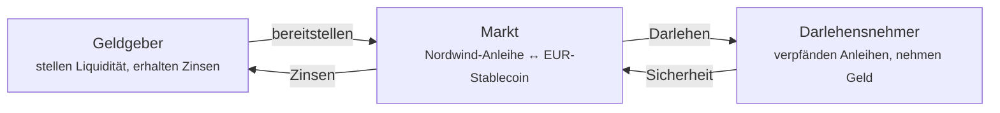

# Station 5 — Pensionsgeschäfte und Beleihung

*Der Anleger braucht Geld. Aber die Anleihe gefällt ihm, und er will sie nicht verkaufen.*

Also nutzt er sie als **Sicherheit**: Er verpfändet sie, leiht sich dagegen und bekommt sie bei Rückzahlung zurück. Das ist die älteste Idee der Finanzmärkte und das, worauf das meiste Geld der Welt tatsächlich läuft.

!!! info "Verfügbarkeit"
    Die Beleihung ist eine Funktion, die der Betreiber je Installation freischaltet. Sehen Sie im Arbeitsbereich Trader kein **Liquidity**, ist sie in Ihrem Register abgeschaltet. Sie ist außerdem der neueste und am wenigsten erprobte Teil der Plattform — siehe die [Compliance-Prüfung](../../compliance/lending-facility-review.md) für offene Feststellungen.

---

## Die Idee, ohne Fachjargon

Sie besitzen etwas Wertvolles. Sie brauchen Geld. Sie wollen nicht verkaufen.

Also geben Sie die wertvolle Sache einem Geldgeber als Sicherheit, nehmen einen Kredit auf, der kleiner ist als ihr Wert, und bekommen die Sache bei Rückzahlung zurück. Zahlen Sie nicht zurück, verwertet der Geldgeber sie, um sein Geld hereinzuholen.

Ein Pfandleiher. Oder eine Hypothek: Die Bank leiht Ihnen Geld, das Haus ist die Sicherheit, und wenn Sie nicht mehr zahlen, nimmt sie das Haus.

**Das Pensionsgeschäft** — englisch *repo*, von *repurchase agreement* — ist die Fassung, die Institutionen nutzen. Formal ist es ein Verkauf mit vereinbartem Rückkauf zu einem etwas höheren Preis. Wirtschaftlich ist es ein besicherter Kredit, und die Preisdifferenz ist der Zins.

??? note "Für Fachleute: warum ein Pensionsgeschäft als Verkauf konstruiert ist"

    Weil die vollständige Eigentumsübertragung die Insolvenz deutlich besser übersteht als ein Sicherungsrecht. Fällt Ihre Gegenpartei aus, ist Eigentum an der Sicherheit eine erheblich stärkere Position als ein Anspruch darauf — kein Vollstreckungsstopp, keine Frage der Verwertungsreife, kein Streit mit einem Insolvenzverwalter.

    Genau diese rechtliche Robustheit ist der Grund für die Volumina im Pensionsgeschäft: Repo-Märkte sind die Rohrleitung der kurzfristigen Refinanzierung, und ihre Größe beruht auf dieser insolvenzrechtlichen Behandlung.

    Und genau deshalb braucht ein tokenisiertes Pensionsgeschäft eine sorgfältige rechtliche statt einer technischen Prüfung. Der Mechanismus hier ist ein besicherter Kredit nach DeFi-Art, und ob er in einer bestimmten Jurisdiktion die Behandlung eines Pensionsgeschäfts erlangt, ist eine Rechts- und keine Solidity-Frage. Feststellung 3 der [Prüfung der Beleihungsfazilität](../../compliance/lending-facility-review.md) betrifft genau das und ist offen.

---

## Wie es hier funktioniert

Die Märkte von Registerwerk folgen dem von Morpho bekannt gemachten Entwurf **isolierter Märkte**: Statt eines großen Pools, in dem jedes Asset jedes Risiko mitträgt, ist jeder Markt ein in sich geschlossenes Paar.

Ein Markt heißt: **ein Sicherheiten-Asset, ein Darlehens-Asset, ein Parametersatz.** Ein Markt für Nordwind-Anleihen gegen einen Euro-Stablecoin ist vollständig getrennt von jedem anderen.

!!! tip "Warum Isolierung zählt"
    In einem gemeinsamen Pool wird ein Kreditausfall bei *irgendeinem* Asset von *allen* Geldgebern getragen. Eine einzige schlecht parametrierte Aufnahme kann Leute schädigen, die damit nie zu tun hatten.

    Bei isolierten Märkten ist ein Geldgeber im Nordwind-Markt gegenüber Nordwind exponiert und sonst nichts. Sie können Ihr Risiko am gewählten Markt ablesen.

### Die Parameter eines Marktes

| Parameter | Was er festlegt |
|---|---|
| **Sicherheiten-Asset** | Was Sie verpfänden dürfen — hier die Nordwind-Anleihe. |
| **Darlehens-Asset** | Was Sie leihen dürfen — typischerweise ein Stablecoin. |
| **LLTV** | Der Punkt, ab dem Ihr Darlehen verwertet werden darf, in Basispunkten. |
| **Verwertungsabschlag** | Der Abschlag, den ein Verwerter erhält, als sein Anreiz. |
| **Zinskurve** | Basiszins und Steigung — wie der Zins auf Nachfrage reagiert. |
| **Preisorakel** | Woher der Kurs der Sicherheit kommt. |

Diese werden bei der Markteinrichtung festgelegt und **können danach nicht geändert werden**. Ein Markt, den Sie gestern verstanden haben, ist heute derselbe Markt.

---

## Leihen

*Arbeitsbereich Trader → Liquidity → Borrow.* Vier Schritte.

**Connect wallet.** Die Verpfändung ist eine On-Chain-Handlung; Sie signieren sie selbst. Die Plattform hält Ihren Schlüssel nie.

**Size the loan.** Der entscheidende Bildschirm. Sie wählen, wie viel Sicherheit Sie stellen, und er zeigt Ihnen, wie viel Sie leihen können.

**Confirm and sign.** Zwei Transaktionen: die Sicherheit freigeben, dann leihen.

**Review.** Die Position erscheint unter *My loans*.

### Die Zahlen auf dem Sizing-Bildschirm

Angenommen, Sie verpfänden **100 Stück** der Nordwind-Anleihe.

| | | |
|---|---|---|
| Sicherheit | 100 Stück | was Sie verpfändet haben |
| Kurs je Stück | 960 € | aus dem Orakel |
| Wert der Sicherheit | 96.000 € | 100 × 960 € |
| LLTV | 7.000 bp = **70 %** | die Verwertungsschwelle |
| Maximal leihbar | 67.200 € | 70 % von 96.000 € |
| Sollzins | z. B. 5,2 % p. a. | aus der Zinskurve |

!!! danger "Das Maximum zu leihen ist der Weg in die Verwertung"
    Bei 67.200 € stehen Sie exakt an der Schwelle. Jeder Kursrückgang der Anleihe — und sei er gering — bringt Sie darüber, und Ihre Sicherheit kann sofort verwertet werden.

    Der Abstand zwischen dem, was Sie leihen, und dem, was Sie leihen könnten, ist Ihr gesamter Puffer. 48.000 € gegen 96.000 € Sicherheit sind eine Beleihungsquote von 50 % und lassen der Anleihe Raum, um fast ein Drittel zu fallen, bevor es gefährlich wird. Das ist der Unterschied zwischen einem Kredit und einer Wette.

### Sicherheitsfaktor

Jede offene Position zeigt einen **Sicherheitsfaktor** (*health factor*) — wie weit Sie von der Verwertung entfernt sind.

| Sicherheitsfaktor | Bedeutet |
|---|---|
| **Über 1,0** | Sicher. Höher ist sicherer. |
| **Genau 1,0** | An der Schwelle. |
| **Unter 1,0** | Sofort verwertbar. |

Er bewegt sich aus zwei Gründen: Ihre Schuld wächst durch auflaufende Zinsen, und der Kurs Ihrer Sicherheit schwankt. Sie können vollkommen untätig bleiben und trotzdem verwertet werden, wenn der Kurs der Anleihe weit genug fällt.

!!! warning "Manchmal steht dort ‚nicht belastbar' — und das sollten Sie glauben"
    Ein Sicherheitsfaktor ist nur so gut wie der Kurs dahinter. Ist der Orakelkurs veraltet oder nicht verfügbar, kennzeichnet die Plattform den Wert als **nicht belastbar**, statt Ihnen eine zuversichtliche Zahl auf Basis schlechter Daten zu zeigen.

    Ein nicht belastbarer Sicherheitsfaktor ist kein Anzeigefehler. Er bedeutet, dass die Plattform gerade wirklich nicht weiß, wie sicher Ihre Position ist — und Sie auch nicht. Erhöhen Sie Ihre Verschuldung nicht auf Grundlage einer so gekennzeichneten Zahl.

??? note "Für Fachleute: Belastbarkeit als ausdrücklicher dritter Zustand"

    Der Sicherheitsfaktor trägt ein nullbares Belastbarkeitskennzeichen mit drei klar getrennten Bedeutungen: `NULL` = nicht gelesen (keine Schuld, oder das Lesen selbst schlug fehl); `false` = Lesen gelang, aber der zugrunde liegende Kurs ist veraltet oder nicht vorhanden; `true` = verlässlich.

    Früher warf ein nicht bepreister Kurs eine Ausnahme, wodurch ein veralteter Kurs von einer kaputten Position ununterscheidbar war. „Unbekannt" in eine plausibel aussehende Zahl zusammenfallen zu lassen ist der gefährlichere Fehlerfall, weil ihn niemand untersucht.

    Das Orakel trägt einen **Abweichungs-Schutzschalter**: Ein Kurs, der mehr als `maxDeviationBps` (Standard 2000 = 20 %) vom vorherigen Stand abweicht, wird abgelehnt. Ein kompromittierter oder vertippter Kursschlüssel kann Sicherheiten weder beliebig hoch bewerten, um den Pool leerzuziehen, noch beliebig tief, um Massenverwertungen auszulösen. Eine berechtigte große Neubewertung läuft über eine gesondert berechtigte Übersteuerung.

---

## Verwertung

Fällt Ihr Sicherheitsfaktor unter 1,0, darf jeder einen Teil Ihrer Schuld tilgen und dafür einen entsprechenden Anteil Ihrer Sicherheit übernehmen, zuzüglich des Verwertungsabschlags.

Das klingt nach Strafe. Es ist das, was Beleihung überhaupt möglich macht: Geldgeber leihen nur, weil unterbesicherte Positionen geschlossen werden, bevor die Sicherheit weniger wert ist als die Schuld. Ohne zügige Verwertung verlieren Geldgeber Geld, und es gibt nichts mehr zu leihen.

**So vermeiden Sie sie:** einen Teil des Darlehens zurückzahlen, Sicherheiten nachlegen oder genug Abstand halten, dass normale Kursbewegungen Sie nicht erreichen.

??? note "Für Fachleute: Verwertung eines *regulierten* Wertpapiers"

    Hier trifft das aus DeFi entlehnte Modell auf das Wertpapierrecht, und die Nähte werden sichtbar.

    Ein ERC-3643-Wertpapier zu verwerten heißt, es an den Verwerter zu übertragen — der folglich ein zugelassener Inhaber dieses Instruments sein muss. Das macht die Verwertung **praktisch erlaubnispflichtig**, wie erlaubnisfrei der Contract auch sein mag. Ist der Kreis geprüfter Verwerter dünn, wird eine unterbesicherte Position womöglich nicht zügig verwertet, und der Geldgeber trägt ein Risiko, das das Modell wegnimmt. Das ist Feststellung 8, und sie ist offen.

    Eine **Zwangsübertragung** nach §24 eWpG kann außerdem Sicherheiten unter einer laufenden Position wegbewegen und das Sicherheitenregister vom Token-Bestand entkoppeln. Ein Abgleichsdienst erkennt das, aber die Reihenfolge ist wirklich schwierig: Registerkorrektur und On-Chain-Zustand lassen sich nicht atomar machen.

    Eine Sperre der Darlehensnehmer-Wallet erreicht bereits verpfändete Sicherheiten derzeit nicht (Feststellung 10, offen).

---

## Die andere Seite: bereitstellen

*Liquidity → Supply & Earn.*

Sie können auch der Geldgeber sein. Zahlen Sie das Darlehens-Asset in einen Markt ein und verdienen Sie Zinsen von den Darlehensnehmern.

Der Zins ist nicht fest. Er folgt der **Auslastung** — dem Anteil der bereitgestellten Mittel, der gerade ausgeliehen ist:

- Wenig ausgeliehen → niedriger Zins, der zum Leihen einlädt
- Fast alles ausgeliehen → hoher Zins, der Mittel anzieht und zur Rückzahlung anhält

Im Prinzip selbstregulierend.

!!! warning "Bereitstellen ist kein Sparkonto"
    Sie verleihen gegen eine Sicherheit, die Sie nicht ausgewählt haben, an einen Darlehensnehmer, den Sie nicht sehen.

    Ihre Risiken: Die Sicherheit fällt schneller, als die Verwertung reagieren kann; Verwerter handeln nicht (siehe oben); das Orakel bepreist falsch; der Contract hat einen Fehler. Der Zins ist die Vergütung für genau diese.

    Der Entwurf isolierter Märkte begrenzt diese Risiken auf den Markt, in den Sie eingezahlt haben. Er macht sie nicht klein.

---

## Wo Sie stehen

Der Anleger hat Geld, ohne verkauft zu haben. Die Anleihe liegt als Sicherheit, gehört weiterhin ihm, steht weiterhin im Register — mit einem Vermerk über die Verpfändung. Zinsen laufen auf. Zahlt er zurück, erlischt das Pfand, und die Anleihe ist wieder unbelastet.

In der Zwischenzeit hat Nordwind seine Kupons gezahlt.

[Station 6: Kapitalmaßnahmen und Rückzahlung :octicons-arrow-right-24:](redemption.md){ .md-button .md-button--primary }
