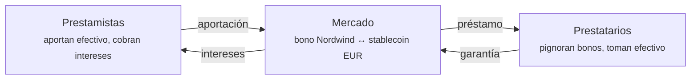
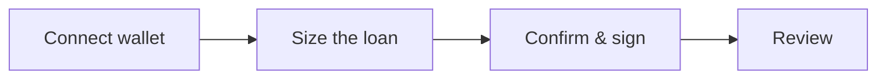

# Etapa 5b — Préstamo garantizado por valores

*El inversor necesita efectivo. Pero le gusta el bono y no quiere venderlo.*

Así que lo utiliza como **garantía**: lo pignora, pide prestado contra él y lo recupera al devolver el préstamo. Es la idea más antigua de los mercados financieros y aquello sobre lo que realmente circula la mayor parte del dinero del mundo.

!!! info "Disponibilidad"
    La financiación es una función que el operador habilita por despliegue. Si no ve **Liquidity** en el espacio Trader, está desactivada en su registro. Es además la parte más reciente y menos probada de la plataforma — véase la [revisión de cumplimiento](../../compliance/lending-facility-review.md) para los hallazgos abiertos.

!!! note "Esto no es un repo"
    Esta función es un préstamo garantizado on-chain dentro de un pool, no una venta bilateral con recompra acordada. Para RFQ repo, cotizaciones privadas y liquidación bilateral, use el [Repo Desk](repo-trading.md) separado.

---

## La idea, sin jerga

Usted posee algo valioso. Necesita dinero. No quiere vender.

Entrega entonces la cosa valiosa a un prestamista en garantía, toma un préstamo inferior a su valor y la recupera al devolverlo. Si no devuelve, el prestamista la ejecuta para recuperar su dinero.

Una casa de empeños. O una hipoteca: el banco le presta dinero, la casa es la garantía, y si deja de pagar se queda con la casa.

El **repo** — de *repurchase agreement*, operación con pacto de recompra — es la versión que utilizan las instituciones. Formalmente es una venta con recompra pactada a un precio algo superior. Económicamente es un préstamo garantizado, y la diferencia de precio es el interés.

??? note "Para especialistas: por qué el repo se estructura como una venta"

    Porque la transmisión plena de la propiedad resiste la insolvencia mucho mejor que una garantía real. Si su contraparte quiebra, ser dueño del colateral es una posición bastante más fuerte que tener un derecho sobre él — sin suspensión de acciones, sin cuestión de oponibilidad, sin pelea con un administrador concursal.

    Esa robustez jurídica es precisamente la razón de los volúmenes del repo: los mercados de repo son la fontanería de la financiación a corto plazo, y su tamaño descansa sobre ese tratamiento concursal.

    Y es también la razón por la que un repo tokenizado exige una revisión jurídica cuidadosa más que una revisión de código. El mecanismo aquí es un préstamo garantizado al estilo de las finanzas descentralizadas, y si obtiene un tratamiento equivalente al del repo en una jurisdicción dada es una cuestión de Derecho, no de Solidity. El hallazgo 3 de la [revisión de la facilidad](../../compliance/lending-facility-review.md) trata exactamente de esto, y sigue abierto.

---

## Cómo funciona aquí

Los mercados de Registerwerk siguen el diseño de **mercados aislados** popularizado por Morpho: en lugar de un único gran fondo común en el que cada activo comparte todos los riesgos, cada mercado es un par autónomo.

Un mercado significa: **un activo de garantía, un activo de préstamo, un juego de parámetros.** Un mercado para bonos de Nordwind contra un stablecoin en euros está completamente separado de cualquier otro.

!!! tip "Por qué importa el aislamiento"
    En un fondo compartido, una insolvencia en *cualquier* activo la absorben *todos* los prestamistas. Una sola incorporación mal parametrizada puede dañar a quienes nunca la tocaron.

    Con mercados aislados, quien presta al mercado de Nordwind está expuesto a Nordwind y a nada más. Puede leer su riesgo en el mercado que eligió.

### Los parámetros que definen un mercado

| Parámetro | Qué determina |
|---|---|
| **Activo de garantía** | Qué puede pignorar — aquí el bono de Nordwind. |
| **Activo de préstamo** | Qué puede tomar prestado — normalmente un stablecoin. |
| **LLTV** | El umbral a partir del cual su préstamo puede ejecutarse, en puntos básicos. |
| **Bonificación de liquidación** | El descuento que obtiene quien ejecuta, como incentivo. |
| **Curva de tipos** | Tipo base y pendiente — cómo responde el tipo a la demanda. |
| **Oráculo de precios** | De dónde procede el precio de la garantía. |

Se fijan al crear el mercado y **no pueden modificarse después**. Un mercado que entendió ayer es el mismo mercado hoy.

---

## Tomar prestado

*Espacio Trader → Liquidity → Borrow.* Cuatro pasos.

**Connect wallet.** La pignoración es una operación on-chain; la firma usted mismo. La plataforma nunca guarda su clave.

**Size the loan.** La pantalla importante. Elige cuánta garantía aportar, y le indica cuánto puede tomar prestado.

**Confirm and sign.** Dos transacciones: autorizar la garantía y después tomar prestado.

**Review.** La posición aparece bajo *My loans*.

### Los números de la pantalla de dimensionamiento

Supongamos que pignora **100 títulos** del bono de Nordwind.

| | | |
|---|---|---|
| Garantía | 100 títulos | lo que ha pignorado |
| Precio por título | 960 € | del oráculo |
| Valor de la garantía | 96.000 € | 100 × 960 € |
| LLTV | 7.000 pb = **70 %** | el umbral de ejecución |
| Máximo disponible | 67.200 € | 70 % de 96.000 € |
| Tipo deudor | p. ej. 5,2 % anual | de la curva de tipos |

!!! danger "Tomar el máximo es la forma de acabar ejecutado"
    Con 67.200 € está exactamente en el umbral. Cualquier caída del precio del bono — por leve que sea — le sitúa por encima, y su garantía puede venderse de inmediato.

    La distancia entre lo que toma y lo que podría tomar es todo su colchón. Tomar 48.000 € contra 96.000 € de garantía da una relación del 50 % y deja al bono margen para caer casi un tercio antes de que haya peligro. Es la diferencia entre un préstamo y una apuesta.

### Factor de salud

Toda posición abierta muestra un **factor de salud** — su distancia a la ejecución.

| Factor de salud | Significa |
|---|---|
| **Por encima de 1,0** | Seguro. Cuanto más alto, más seguro. |
| **Exactamente 1,0** | En el umbral. |
| **Por debajo de 1,0** | Ejecutable ya. |

Se mueve por dos motivos: su deuda crece con los intereses devengados, y el precio de su garantía varía. Puede no hacer absolutamente nada y aun así ser ejecutado, si el precio del bono cae lo suficiente.

!!! warning "A veces el factor de salud dice «no fiable», y conviene creerlo"
    Un factor de salud vale lo que vale el precio que lo sustenta. Si el precio del oráculo está obsoleto o no disponible, la plataforma marca la cifra como **no fiable** en lugar de mostrarle un número confiado calculado sobre datos malos.

    Un factor de salud no fiable no es un fallo de visualización. Significa que en ese momento la plataforma realmente no sabe cuán sólida es su posición — y usted tampoco. No aumente su endeudamiento apoyándose en una cifra marcada así.

??? note "Para especialistas: la fiabilidad como tercer estado explícito"

    El factor de salud lleva un indicador de fiabilidad anulable con tres significados distintos: `NULL` = no leído (sin deuda, o la propia lectura falló); `false` = lectura correcta pero el precio que la sustenta está obsoleto o ausente; `true` = digno de confianza.

    El comportamiento anterior lanzaba una excepción ante un precio ausente, lo que hacía indistinguible un precio obsoleto de una posición rota. Colapsar «desconocido» en una cifra de apariencia plausible es el modo de fallo más peligroso, porque es el que nadie investiga.

    El oráculo lleva un **cortacircuitos de desviación**: un precio que se aparte más de `maxDeviationBps` (2000 por defecto, es decir, 20 %) de la última referencia se rechaza. Una clave de precios comprometida o mal tecleada no puede valorar la garantía arbitrariamente alta para vaciar el fondo, ni arbitrariamente baja para desencadenar ejecuciones masivas. Una revalorización amplia y legítima pasa por una excepción con autorización separada.

---

## Ejecución

Si su factor de salud baja de 1,0, cualquiera puede devolver parte de su deuda y quedarse con la porción correspondiente de su garantía, más la bonificación de liquidación.

Suena punitivo. Es lo que hace posible la financiación: los prestamistas solo prestan porque las posiciones infragarantizadas se cierran antes de que la garantía valga menos que la deuda. Sin ejecución rápida, los prestamistas pierden dinero y no queda nada que tomar prestado.

**Para evitarla:** devuelva parte del préstamo, añada garantía, o mantenga suficiente margen para que un movimiento de precios ordinario no le alcance.

??? note "Para especialistas: ejecutar un valor *regulado*"

    Aquí el modelo tomado de las finanzas descentralizadas se topa con el Derecho del mercado de valores, y se ven las costuras.

    Ejecutar un valor ERC-3643 significa transmitirlo a quien ejecuta — que por tanto debe ser un titular admitido de ese instrumento. Eso hace la ejecución **restringida en la práctica**, por muy abierto que sea el contrato. Si el conjunto de sujetos verificados es reducido, una posición bajo el agua puede no ejecutarse a tiempo, y el prestamista soporta un riesgo que el modelo da por inexistente. Es el hallazgo 8, y está abierto.

    Una **transferencia forzosa** al amparo del §24 eWpG puede además mover la garantía de debajo de una posición viva, desincronizando el registro de garantías del saldo del token. Un servicio de conciliación lo detecta, pero el orden de las operaciones es genuinamente difícil: la corrección registral y el estado on-chain no pueden hacerse atómicos.

    El bloqueo del monedero del prestatario no alcanza actualmente a la garantía ya pignorada (hallazgo 10, abierto).

---

## El otro lado: aportar liquidez

*Liquidity → Supply & Earn.*

También puede ser usted el prestamista. Deposite el activo de préstamo en un mercado y cobre intereses de los prestatarios.

El tipo no es fijo. Sigue la **tasa de utilización** — la fracción del efectivo aportado que está prestada en ese momento:

- Poco prestado → tipo bajo, que anima a endeudarse
- Casi todo prestado → tipo alto, que atrae aportaciones e incita a devolver

Autoequilibrante, en principio.

!!! warning "Aportar liquidez no es una cuenta de ahorro"
    Está prestando contra una garantía que no eligió, a un prestatario al que no ve.

    Sus riesgos: la garantía cae más rápido de lo que la ejecución puede responder; nadie ejecuta (véase arriba); el oráculo valora mal; el contrato tiene un defecto. El interés es la compensación precisamente por estos.

    El diseño de mercados aislados confina esos riesgos al mercado en el que aportó. No los hace pequeños.

---

## Dónde está usted

El inversor tiene efectivo sin haber vendido. El bono queda como garantía, sigue siendo suyo, sigue inscrito en el registro — con la pignoración anotada. Los intereses se devengan. Cuando devuelva, la prenda se levanta y el bono queda libre de cargas.

Entretanto, Nordwind ha estado pagando sus cupones.

[Etapa 6: Operaciones societarias y amortización :octicons-arrow-right-24:](redemption.md){ .md-button .md-button--primary }
