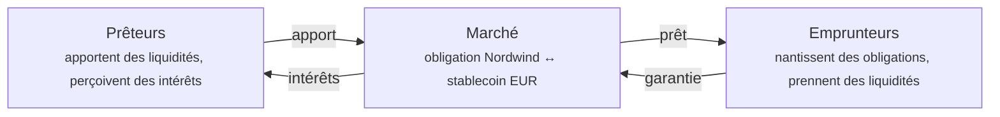

# Étape 5 — Pension livrée et financement

*L'investisseur a besoin de liquidités. Mais l'obligation lui plaît et il ne veut pas la vendre.*

Il l'utilise donc comme **garantie** : il la nantit, emprunte contre elle, et la récupère au remboursement. C'est l'idée la plus ancienne des marchés financiers, et ce sur quoi repose réellement la majeure partie de l'argent du monde.

!!! info "Disponibilité"
    Le financement est une fonctionnalité que l'opérateur active par déploiement. Si vous ne voyez pas **Liquidity** dans l'espace Trader, elle est désactivée dans votre registre. C'est aussi la partie la plus récente et la moins éprouvée de la plateforme — voir la [revue de conformité](../../compliance/lending-facility-review.md) pour les constats ouverts.

---

## L'idée, sans jargon

Vous possédez quelque chose de valeur. Vous avez besoin d'argent. Vous ne voulez pas vendre.

Vous remettez donc la chose de valeur à un prêteur en garantie, prenez un prêt inférieur à sa valeur, et récupérez la chose au remboursement. Si vous ne remboursez pas, le prêteur la réalise pour récupérer sa mise.

Un prêteur sur gage. Ou un prêt immobilier : la banque vous prête, la maison est la garantie, et si vous cessez de payer elle prend la maison.

La **pension livrée** — *repo*, de *repurchase agreement* — est la version qu'utilisent les institutions. Formellement, c'est une vente assortie d'un rachat convenu à un prix légèrement supérieur. Économiquement, c'est un prêt garanti, et l'écart de prix est l'intérêt.

??? note "Pour les spécialistes : pourquoi la pension est structurée comme une vente"

    Parce que le transfert de pleine propriété résiste bien mieux à l'insolvabilité qu'une sûreté. Si votre contrepartie fait défaut, être propriétaire de la garantie est une position bien plus solide que détenir une créance sur elle — pas de suspension des poursuites, pas de question d'opposabilité, pas de bataille avec un liquidateur.

    C'est précisément cette robustesse juridique qui explique les volumes de la pension livrée : les marchés de pension sont la tuyauterie du financement à court terme, et leur taille repose sur ce traitement en cas d'insolvabilité.

    C'est aussi pourquoi une pension tokenisée appelle un examen juridique soigneux plutôt qu'une revue de code. Le mécanisme ici est un prêt garanti à la manière de la finance décentralisée, et savoir s'il obtient un traitement équivalent à la pension dans une juridiction donnée est une question de droit, pas de Solidity. Le constat 3 de la [revue du dispositif](../../compliance/lending-facility-review.md) porte exactement là-dessus, et il reste ouvert.

---

## Comment cela fonctionne ici

Les marchés de Registerwerk suivent la conception en **marchés isolés** popularisée par Morpho : plutôt qu'un unique grand pool où chaque actif partage tous les risques, chaque marché est une paire autonome.

Un marché signifie : **un actif de garantie, un actif de prêt, un jeu de paramètres.** Un marché pour les obligations Nordwind contre un stablecoin euro est entièrement distinct de tout autre.

!!! tip "Pourquoi l'isolement compte"
    Dans un pool partagé, une créance douteuse sur *n'importe quel* actif est absorbée par *tous* les prêteurs. Une seule inscription mal paramétrée peut léser des personnes qui n'y ont jamais touché.

    Avec des marchés isolés, un prêteur du marché Nordwind est exposé à Nordwind et à rien d'autre. Vous pouvez lire votre risque sur le marché que vous avez choisi.

### Les paramètres qui définissent un marché

| Paramètre | Ce qu'il détermine |
|---|---|
| **Actif de garantie** | Ce que vous pouvez nantir — ici l'obligation Nordwind. |
| **Actif de prêt** | Ce que vous pouvez emprunter — typiquement un stablecoin. |
| **LLTV** | Le seuil à partir duquel votre prêt peut être réalisé, en points de base. |
| **Prime de liquidation** | La décote qu'obtient celui qui réalise, à titre d'incitation. |
| **Courbe de taux** | Taux de base et pente — comment le taux réagit à la demande. |
| **Oracle de prix** | D'où vient le prix de la garantie. |

Ils sont figés à la création du marché et **ne peuvent plus être modifiés**. Un marché que vous compreniez hier est le même marché aujourd'hui.

---

## Emprunter

*Espace Trader → Liquidity → Borrow.* Quatre étapes.

**Connect wallet.** Le nantissement est une opération on-chain ; vous la signez vous-même. La plateforme ne détient jamais votre clé.

**Size the loan.** L'écran important. Vous choisissez combien de garantie apporter, et il vous indique combien vous pouvez emprunter.

**Confirm and sign.** Deux transactions : autoriser la garantie, puis emprunter.

**Review.** La position apparaît sous *My loans*.

### Les chiffres de l'écran de dimensionnement

Supposons que vous nantissiez **100 titres** de l'obligation Nordwind.

| | | |
|---|---|---|
| Garantie | 100 titres | ce que vous avez nanti |
| Prix par titre | 960 € | fourni par l'oracle |
| Valeur de la garantie | 96 000 € | 100 × 960 € |
| LLTV | 7 000 pb = **70 %** | le seuil de réalisation |
| Montant empruntable maximal | 67 200 € | 70 % de 96 000 € |
| Taux emprunteur | p. ex. 5,2 % par an | issu de la courbe de taux |

!!! danger "Emprunter le maximum, c'est ainsi qu'on se fait réaliser"
    À 67 200 €, vous êtes exactement au seuil. La moindre baisse du prix de l'obligation vous fait passer au-dessus, et votre garantie peut être vendue immédiatement.

    L'écart entre ce que vous empruntez et ce que vous pourriez emprunter constitue la totalité de votre marge de sécurité. Emprunter 48 000 € contre 96 000 € de garantie donne une quotité de 50 % et laisse à l'obligation la place de baisser de près d'un tiers avant tout danger. C'est la différence entre un prêt et un pari.

### Facteur de santé

Toute position ouverte affiche un **facteur de santé** — votre distance à la réalisation.

| Facteur de santé | Signifie |
|---|---|
| **Supérieur à 1,0** | Sûr. Plus il est élevé, plus c'est sûr. |
| **Exactement 1,0** | Au seuil. |
| **Inférieur à 1,0** | Réalisable immédiatement. |

Il bouge pour deux raisons : votre dette croît avec les intérêts courus, et le prix de votre garantie varie. Vous pouvez ne rien faire du tout et être tout de même réalisé, si le prix de l'obligation baisse suffisamment.

!!! warning "Parfois le facteur de santé indique « non fiable », et il faut le croire"
    Un facteur de santé ne vaut que le prix qui le sous-tend. Si le prix de l'oracle est périmé ou indisponible, la plateforme signale la valeur comme **non fiable** plutôt que de vous montrer un chiffre assuré calculé sur de mauvaises données.

    Un facteur de santé non fiable n'est pas un défaut d'affichage. Il signifie que la plateforme ignore réellement, à cet instant, la solidité de votre position — et vous aussi. N'augmentez pas votre endettement sur la foi d'un chiffre ainsi marqué.

??? note "Pour les spécialistes : la fiabilité comme troisième état explicite"

    Le facteur de santé porte un indicateur de fiabilité nullable à trois significations distinctes : `NULL` = non lu (pas de dette, ou la lecture elle-même a échoué) ; `false` = lecture réussie mais le prix sous-jacent est périmé ou absent ; `true` = digne de confiance.

    Le comportement antérieur levait une exception sur un prix absent, rendant un prix périmé indiscernable d'une position cassée. Réduire « inconnu » à un chiffre d'apparence plausible est le mode de défaillance le plus dangereux, parce que c'est celui que personne n'examine.

    L'oracle porte un **coupe-circuit d'écart** : un prix s'écartant de plus de `maxDeviationBps` (2000 par défaut, soit 20 %) du dernier relevé est rejeté. Une clé de prix compromise ou saisie de travers ne peut ni valoriser la garantie arbitrairement haut pour vider le pool, ni arbitrairement bas pour déclencher des réalisations en masse. Une revalorisation importante légitime passe par une dérogation dotée d'une autorisation distincte.

---

## La réalisation

Si votre facteur de santé passe sous 1,0, quiconque peut rembourser une partie de votre dette et prendre une fraction correspondante de votre garantie, majorée de la prime de liquidation.

Cela paraît punitif. C'est ce qui rend le financement possible : les prêteurs ne prêtent que parce que les positions sous-garanties sont fermées avant que la garantie ne vaille moins que la dette. Sans réalisation rapide, les prêteurs perdent de l'argent et il n'y a plus rien à emprunter.

**Pour l'éviter :** rembourser une partie du prêt, ajouter de la garantie, ou conserver assez de marge pour qu'une variation de prix ordinaire ne vous atteigne pas.

??? note "Pour les spécialistes : réaliser un titre *réglementé*"

    Ici, le modèle emprunté à la finance décentralisée rencontre le droit des titres, et les coutures apparaissent.

    Réaliser un titre ERC-3643 signifie le transférer à celui qui réalise — lequel doit donc être un titulaire admis de cet instrument. Cela rend la réalisation **permissionnée en pratique**, quelle que soit l'ouverture du contrat. Si l'ensemble des acteurs vérifiés est étroit, une position sous l'eau peut ne pas être réalisée rapidement, et le prêteur supporte un risque que le modèle suppose inexistant. C'est le constat 8, et il est ouvert.

    Un **transfert forcé** au titre du §24 eWpG peut par ailleurs déplacer la garantie sous une position vivante, désynchronisant le registre de garanties du solde du jeton. Un service de rapprochement le détecte, mais l'ordonnancement est réellement difficile : la correction du registre et l'état on-chain ne peuvent pas être rendus atomiques.

    Un gel du portefeuille de l'emprunteur n'atteint pas actuellement la garantie déjà nantie (constat 10, ouvert).

---

## L'autre côté : apporter des liquidités

*Liquidity → Supply & Earn.*

Vous pouvez aussi être le prêteur. Déposez l'actif de prêt dans un marché et percevez des intérêts des emprunteurs.

Le taux n'est pas fixe. Il suit le **taux d'utilisation** — la fraction des liquidités apportées actuellement empruntée :

- Peu emprunté → taux bas, qui encourage l'emprunt
- Presque tout emprunté → taux élevé, qui attire des apports et incite au remboursement

Auto-équilibrant, en principe.

!!! warning "Apporter des liquidités n'est pas un compte d'épargne"
    Vous prêtez contre une garantie que vous n'avez pas choisie, à un emprunteur que vous ne voyez pas.

    Vos risques : la garantie baisse plus vite que la réalisation ne peut réagir ; personne ne réalise (voir ci-dessus) ; l'oracle valorise mal ; le contrat comporte une faille. L'intérêt est la rémunération de ces risques précis.

    La conception en marchés isolés confine ces risques au marché où vous avez apporté vos liquidités. Elle ne les rend pas petits.

---

## Où vous en êtes

L'investisseur dispose de liquidités sans avoir vendu. L'obligation est là en garantie, toujours à lui, toujours inscrite au registre — avec la mention du nantissement. Les intérêts courent. Au remboursement, le nantissement est levé et l'obligation redevient libre de toute charge.

Pendant ce temps, Nordwind a versé ses coupons.

[Étape 6 : Opérations sur titres et remboursement :octicons-arrow-right-24:](redemption.md){ .md-button .md-button--primary }
