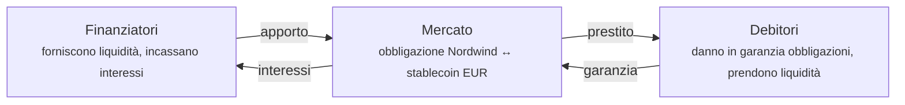
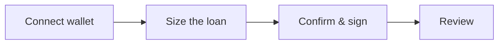

# Fase 5b — Prestito garantito da titoli

*L'investitore ha bisogno di liquidità. Ma l'obbligazione gli piace e non vuole venderla.*

Allora la usa come **garanzia**: la costituisce in pegno, ci prende a prestito sopra e la riottiene quando rimborsa. È l'idea più antica dei mercati finanziari, ed è ciò su cui gira davvero la maggior parte del denaro del mondo.

!!! info "Disponibilità"
    Il finanziamento è una funzione che l'operatore abilita per singola installazione. Se non vedi **Liquidity** nell'area Trader, nel tuo registro è disattivata. È anche la parte più recente e meno collaudata della piattaforma — vedi la [revisione di conformità](../../compliance/lending-facility-review.md) per i rilievi aperti.

!!! note "Questo non è un repo"
    Questa funzione è un prestito collateralizzato on-chain in un pool, non una vendita bilaterale con riacquisto concordato. Per RFQ repo, quotazioni private e regolamento bilaterale usa il [Repo Desk](repo-trading.md) separato.

---

## L'idea, senza gergo

Possiedi qualcosa di valore. Ti serve denaro. Non vuoi vendere.

Consegni allora la cosa di valore a un finanziatore in garanzia, prendi un prestito inferiore al suo valore e riottieni la cosa quando rimborsi. Se non rimborsi, il finanziatore la escute per recuperare il denaro.

Un monte di pegni. Oppure un mutuo: la banca ti presta denaro, la casa è la garanzia, e se smetti di pagare si prende la casa.

I **pronti contro termine** — in inglese *repo*, da *repurchase agreement* — sono la versione usata dalle istituzioni. Formalmente è una vendita con riacquisto concordato a un prezzo leggermente superiore. Economicamente è un prestito garantito, e la differenza di prezzo è l'interesse.

??? note "Per gli specialisti: perché i pronti contro termine sono strutturati come vendita"

    Perché il trasferimento pieno della proprietà regge l'insolvenza molto meglio di una garanzia reale. Se la controparte fallisce, essere proprietari del collaterale è una posizione ben più forte di vantare un diritto su di esso — nessuna sospensione delle azioni, nessuna questione di opponibilità, nessuna battaglia con un curatore.

    È proprio questa solidità giuridica a spiegare i volumi: i mercati dei pronti contro termine sono l'impiantistica del finanziamento a breve, e la loro dimensione poggia su quel trattamento in caso di insolvenza.

    Ed è anche il motivo per cui un'operazione tokenizzata di questo tipo richiede un esame legale accurato più che una revisione del codice. Il meccanismo qui è un prestito garantito in stile finanza decentralizzata, e se ottenga un trattamento equivalente in una data giurisdizione è una questione di diritto, non di Solidity. Il rilievo 3 della [revisione della linea di finanziamento](../../compliance/lending-facility-review.md) riguarda esattamente questo, e resta aperto.

---

## Come funziona qui

I mercati di Registerwerk seguono il modello a **mercati isolati** reso popolare da Morpho: anziché un unico grande pool in cui ogni asset condivide ogni rischio, ciascun mercato è una coppia autonoma.

Un mercato significa: **un asset a garanzia, un asset di prestito, un insieme di parametri.** Un mercato per le obbligazioni Nordwind contro uno stablecoin in euro è del tutto separato da ogni altro.

!!! tip "Perché l'isolamento conta"
    In un pool condiviso, un credito deteriorato su *qualunque* asset viene assorbito da *tutti* i finanziatori. Una sola quotazione mal parametrata può danneggiare persone che non l'hanno mai toccata.

    Con mercati isolati, chi finanzia il mercato Nordwind è esposto a Nordwind e a nient'altro. Puoi leggere il tuo rischio nel mercato che hai scelto.

### I parametri che definiscono un mercato

| Parametro | Che cosa stabilisce |
|---|---|
| **Asset a garanzia** | Che cosa puoi dare in garanzia — qui l'obbligazione Nordwind. |
| **Asset di prestito** | Che cosa puoi prendere a prestito — di norma uno stablecoin. |
| **LLTV** | La soglia oltre la quale il prestito può essere escusso, in punti base. |
| **Premio di liquidazione** | Lo sconto che ottiene chi escute, come incentivo. |
| **Curva dei tassi** | Tasso base e pendenza — come il tasso reagisce alla domanda. |
| **Oracolo dei prezzi** | Da dove arriva il prezzo della garanzia. |

Sono fissati alla creazione del mercato e **non possono più essere modificati**. Un mercato che avevi capito ieri è lo stesso mercato oggi.

---

## Prendere a prestito

*Area Trader → Liquidity → Borrow.* Quattro passaggi.

**Connect wallet.** La costituzione in garanzia è un'operazione on-chain; la firmi tu. La piattaforma non detiene mai la tua chiave.

**Size the loan.** La schermata importante. Scegli quanta garanzia dare, e ti mostra quanto puoi prendere a prestito.

**Confirm and sign.** Due transazioni: autorizzare la garanzia, poi prendere a prestito.

**Review.** La posizione compare sotto *My loans*.

### I numeri della schermata di dimensionamento

Supponiamo che tu dia in garanzia **100 titoli** dell'obbligazione Nordwind.

| | | |
|---|---|---|
| Garanzia | 100 titoli | quanto hai dato in garanzia |
| Prezzo per titolo | 960 € | dall'oracolo |
| Valore della garanzia | 96.000 € | 100 × 960 € |
| LLTV | 7.000 pb = **70 %** | la soglia di escussione |
| Massimo ottenibile | 67.200 € | 70 % di 96.000 € |
| Tasso debitore | ad es. 5,2 % annuo | dalla curva dei tassi |

!!! danger "Prendere il massimo è il modo in cui ci si fa escutere"
    A 67.200 € sei esattamente sulla soglia. Qualunque calo del prezzo dell'obbligazione — anche lieve — ti porta oltre, e la tua garanzia può essere venduta subito.

    La distanza tra ciò che prendi e ciò che potresti prendere è tutto il tuo cuscinetto. Prendere 48.000 € contro 96.000 € di garanzia dà un rapporto del 50 % e lascia all'obbligazione lo spazio per scendere di quasi un terzo prima che sia pericoloso. È la differenza tra un prestito e una scommessa.

### Fattore di salute

Ogni posizione aperta mostra un **fattore di salute** (*health factor*) — quanto sei lontano dall'escussione.

| Fattore di salute | Significa |
|---|---|
| **Sopra 1,0** | Sicuro. Più alto è, più sicuro. |
| **Esattamente 1,0** | Sulla soglia. |
| **Sotto 1,0** | Escutibile subito. |

Si muove per due ragioni: il tuo debito cresce con gli interessi maturati, e il prezzo della garanzia oscilla. Puoi non fare assolutamente nulla ed essere comunque escusso, se il prezzo dell'obbligazione scende abbastanza.

!!! warning "A volte il fattore di salute dice «non attendibile», e devi crederci"
    Un fattore di salute vale quanto il prezzo che c'è dietro. Se il prezzo dell'oracolo è obsoleto o non disponibile, la piattaforma marca il valore come **non attendibile** anziché mostrarti una cifra sicura calcolata su dati cattivi.

    Un fattore di salute non attendibile non è un difetto di visualizzazione. Significa che in quel momento la piattaforma davvero non sa quanto sia solida la tua posizione — e non lo sai nemmeno tu. Non aumentare l'indebitamento sulla base di un numero contrassegnato così.

??? note "Per gli specialisti: l'attendibilità come terzo stato esplicito"

    Il fattore di salute porta un indicatore di attendibilità annullabile con tre significati distinti: `NULL` = non letto (nessun debito, o la lettura stessa è fallita); `false` = lettura riuscita ma il prezzo sottostante è obsoleto o assente; `true` = affidabile.

    Il comportamento precedente sollevava un'eccezione su un prezzo mancante, rendendo un prezzo obsoleto indistinguibile da una posizione rotta. Far collassare «ignoto» in una cifra dall'aria plausibile è la modalità di guasto più pericolosa, perché è quella che nessuno indaga.

    L'oracolo porta un **interruttore di deviazione**: un prezzo che si discosta di più di `maxDeviationBps` (predefinito 2000 = 20 %) dall'ultima rilevazione viene respinto. Una chiave di prezzo compromessa o digitata male non può né valorizzare la garanzia arbitrariamente in alto per prosciugare il pool, né arbitrariamente in basso per innescare escussioni di massa. Una riprezzatura ampia e legittima passa da una deroga con autorizzazione separata.

---

## Escussione

Se il tuo fattore di salute scende sotto 1,0, chiunque può rimborsare una parte del tuo debito e prendersi una quota corrispondente della tua garanzia, più il premio di liquidazione.

Sembra punitivo. È ciò che rende possibile il finanziamento: i finanziatori prestano solo perché le posizioni sotto-garantite vengono chiuse prima che la garanzia valga meno del debito. Senza escussione tempestiva i finanziatori perdono denaro, e non c'è più nulla da prendere a prestito.

**Per evitarla:** rimborsa parte del prestito, aggiungi garanzia, oppure mantieni un margine tale che un normale movimento di prezzo non ti raggiunga.

??? note "Per gli specialisti: escutere uno strumento *regolamentato*"

    Qui il modello preso in prestito dalla finanza decentralizzata incontra il diritto degli strumenti finanziari, e le cuciture si vedono.

    Escutere uno strumento ERC-3643 significa trasferirlo a chi escute — il quale deve dunque essere un titolare ammesso di quello strumento. Questo rende l'escussione **di fatto soggetta ad autorizzazione**, per quanto il contratto sia aperto a tutti. Se l'insieme dei soggetti verificati è ristretto, una posizione sott'acqua può non essere escussa in tempo, e il finanziatore sopporta un rischio che il modello dà per inesistente. È il rilievo 8, ed è aperto.

    Un **trasferimento coattivo** ai sensi del §24 eWpG può inoltre spostare la garanzia da sotto una posizione viva, disallineando il registro delle garanzie dal saldo del token. Un servizio di riconciliazione lo rileva, ma l'ordine delle operazioni è davvero difficile: la correzione del registro e lo stato on-chain non possono essere resi atomici.

    Il congelamento del wallet del debitore non raggiunge attualmente la garanzia già costituita (rilievo 10, aperto).

---

## L'altro lato: fornire liquidità

*Liquidity → Supply & Earn.*

Puoi anche essere il finanziatore. Deposita l'asset di prestito in un mercato e incassa interessi dai debitori.

Il tasso non è fisso. Segue il **tasso di utilizzo** — la quota di liquidità fornita attualmente presa a prestito:

- Poco preso a prestito → tasso basso, che incoraggia l'indebitamento
- Quasi tutto preso a prestito → tasso alto, che attrae liquidità e spinge al rimborso

In linea di principio autoregolante.

!!! warning "Fornire liquidità non è un conto di risparmio"
    Stai prestando contro una garanzia che non hai scelto, a un debitore che non vedi.

    I tuoi rischi: la garanzia scende più in fretta di quanto l'escussione riesca a reagire; nessuno escute (vedi sopra); l'oracolo sbaglia il prezzo; il contratto ha un difetto. L'interesse è il compenso esattamente per questi.

    Il modello a mercati isolati confina questi rischi al mercato in cui hai depositato. Non li rende piccoli.

---

## Dove sei

L'investitore ha liquidità senza aver venduto. L'obbligazione sta lì come garanzia, resta sua, resta iscritta nel registro — con annotata la costituzione in pegno. Gli interessi maturano. Quando rimborsa, il pegno si estingue e l'obbligazione torna libera da vincoli.

Nel frattempo Nordwind ha pagato le sue cedole.

[Fase 6: Operazioni societarie e rimborso :octicons-arrow-right-24:](redemption.md){ .md-button .md-button--primary }
