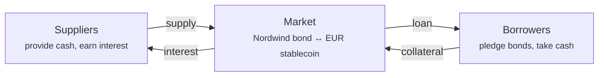

# Stage 5a — Securities-backed lending

*The investor needs cash. But they like the bond and they do not want to sell it.*

So they use it as **collateral**: they pledge it, borrow against it, and get it back when they repay.

!!! info "Availability"
    Lending is a feature the operator enables per deployment. If you do not see **Liquidity** in the Trader workspace, it is switched off in your registry. It is also the newest and least battle-tested part of the platform — see the [compliance review](../../compliance/lending-facility-review.md) for open findings.

---

## The idea, without jargon

You own something valuable. You need money. You do not want to sell.

So you hand the valuable thing to a lender as security, take a loan smaller than its value, and get the thing back when you repay. If you do not repay, the lender sells it to recover the money.

A pawnbroker. Or a mortgage: the bank lends you money, the house is collateral, and if you stop paying they take the house.

This screen is **not a repurchase agreement**. It is an on-chain, over-collateralised loan: title to the security is not sold to a named cash lender under a bilateral sale-and-buy-back contract. Registerwerk now calls it *securities-backed lending* everywhere in the product.

For a conventional institutional repo—targeted or broadcast RFQs, private dealer quotes, transfer of collateral, fixed repurchase price and bilateral lifecycle management—use the separate [Repo Desk](repo-trading.md).

??? note "For the specialist: why repo is structured as a sale"

    Because outright transfer of title survives insolvency far better than a security interest does. If your counterparty fails, owning the collateral is a much stronger position than having a claim over it — no stay, no perfection question, no fight with an administrator.

    That legal robustness is exactly why repo carries the volume it does: repo markets are the plumbing of short-term funding, and their scale rests on that insolvency treatment.

    It is also why this lending market must not be described as repo. The mechanism here is a collateralised loan in the DeFi style. It does not become title-transfer repo merely because the collateral is tokenised.

---

## How it works here

Registerwerk's markets follow the **isolated-market** design popularised by Morpho: rather than one giant pool where every asset shares every risk, each market is a self-contained pair.

One market means: **one collateral asset, one loan asset, one set of parameters.** A market for Nordwind bonds against a euro stablecoin is entirely separate from every other market.

!!! tip "Why isolation matters"
    In a shared pool, a bad debt in *any* asset is absorbed by *all* suppliers. One badly-parameterised listing can damage people who never touched it.

    With isolated markets, a supplier to the Nordwind market is exposed to Nordwind and nothing else. You can read your risk off the market you chose.

### The parameters that define a market

| Parameter | What it decides |
|---|---|
| **Collateral asset** | What you may pledge — here, the Nordwind bond. |
| **Loan asset** | What you may borrow — typically a stablecoin. |
| **LLTV** | The point at which your loan can be liquidated, in basis points. |
| **Liquidation bonus** | The discount a liquidator gets, as their incentive. |
| **Rate curve** | Base rate and slope — how interest responds to demand. |
| **Price oracle** | Where the collateral's price comes from. |

These are fixed when the market is created and **cannot be changed afterwards**. A market you understood yesterday is the same market today.

---

## Borrowing

*Trader workspace → Liquidity → Borrow.* Four steps.

**Connect wallet.** The pledge is an on-chain action; you sign it yourself. The platform never holds your key.

**Size the loan.** The important screen. You choose how much collateral to pledge, and it shows you how much you can borrow.

**Confirm and sign.** Two transactions: approve the collateral, then borrow.

**Review.** The position appears under *My loans*.

### The numbers on the sizing screen

Suppose you pledge **100 units** of the Nordwind bond.

| | | |
|---|---|---|
| Collateral | 100 units | what you pledged |
| Price per unit | €960 | from the oracle |
| Collateral value | €96,000 | 100 × €960 |
| LLTV | 7,000 bps = **70%** | the liquidation threshold |
| Maximum borrowable | €67,200 | 70% of €96,000 |
| Borrow rate | e.g. 5.2% APR | from the rate curve |

!!! danger "Borrowing the maximum is how people get liquidated"
    At €67,200 you are exactly at the threshold. Any fall in the bond's price — even slight — puts you over it, and your collateral can be sold immediately.

    The gap between what you borrow and what you could borrow is your entire buffer. Borrowing €48,000 against €96,000 of collateral is a 50% LTV and leaves the bond room to fall by nearly a third before you are in danger. It is the difference between a loan and a bet.

### Health factor

Every open position shows a **health factor** — how far you are from liquidation.

| Health factor | Means |
|---|---|
| **Above 1.0** | Safe. Higher is safer. |
| **Exactly 1.0** | At the threshold. |
| **Below 1.0** | Liquidatable now. |

It moves for two reasons: your debt grows as interest accrues, and your collateral's price moves. You can do nothing at all and still be liquidated, if the bond's price falls far enough.

!!! warning "Sometimes the health factor says 'unreliable', and you should believe it"
    A health factor is only as good as the price behind it. If the oracle price is stale or unavailable, the platform marks the figure **unreliable** rather than showing you a confident number computed from bad data.

    An unreliable health factor is not a display bug. It means the platform genuinely does not know how safe your position is right now, and neither do you. Do not increase your borrowing on the strength of a number flagged that way.

??? note "For the specialist: reliability as an explicit third state"

    The health factor carries a nullable reliability flag with three distinct meanings: `NULL` = not read (no debt, or the read itself failed); `false` = read succeeded but the price backing it is stale or unpriced; `true` = trustworthy.

    Earlier behaviour reverted on an unpriced mark, which made a stale price indistinguishable from a broken position. Collapsing "unknown" into a plausible-looking number is the more dangerous failure, because it is the one nobody investigates.

    The oracle carries a **deviation circuit breaker**: a push more than `maxDeviationBps` (default 2000 = 20%) from the previous mark reverts. A compromised or fat-fingered price key cannot mark collateral arbitrarily high to drain the pool, nor arbitrarily low to trigger mass liquidations. A genuine large repricing goes through a separately-permissioned override.

---

## Liquidation

If your health factor drops below 1.0, anyone may repay part of your debt and take a corresponding slice of your collateral, plus the liquidation bonus.

It sounds punitive. It is what makes lending possible at all: suppliers only lend because under-collateralised positions are closed before the collateral is worth less than the debt. Without prompt liquidation, lenders lose money and there is nothing to borrow.

**To avoid it:** repay part of the loan, add collateral, or keep enough headroom that ordinary price movement cannot reach you.

??? note "For the specialist: liquidating a *regulated* security"

    Here the model borrowed from DeFi meets securities law, and the seams show.

    Liquidating an ERC-3643 security means transferring it to the liquidator — who must therefore be an admitted holder of that instrument. That makes liquidation **permissioned in practice**, however permissionless the contract is. If the verified-liquidator set is thin, an under-water position may not be liquidated promptly, and the supplier bears a risk the model assumes away. This is finding 8, and it is open.

    A **forced transfer** under §24 eWpG can also move collateral out from under a live position, desyncing the collateral ledger from the token balance. A reconciliation listener detects this, but the ordering is genuinely hard: the register correction and the on-chain state cannot be made atomic.

    A borrower wallet freeze does not currently reach already-pledged collateral (finding 10, open).

---

## The other side: supplying

*Liquidity → Supply & Earn.*

You can also be the lender. Deposit the loan asset into a market and earn interest from borrowers.

The rate is not fixed. It follows **utilisation** — the fraction of supplied cash currently borrowed:

- Little borrowed → low rate, encouraging borrowing
- Most borrowed → high rate, attracting supply and encouraging repayment

Self-balancing, in principle.

!!! warning "Supplying is not a savings account"
    You are lending against collateral you did not choose to a borrower you cannot see.

    Your risks: the collateral falls faster than liquidation can respond; liquidators do not act (see above); the oracle misprices; the contract has a flaw. The interest is compensation for exactly these.

    The isolated-market design means these risks are confined to the market you supplied to. It does not make them small.

---

## Where you are

The investor has cash without selling. The bond sits as collateral, still theirs, still recorded in the register — with a pledge noted against it. Interest accrues. When they repay, the pledge lifts and the bond is unencumbered again.

Meanwhile Nordwind has been paying its coupons.

[Stage 6: Corporate actions and redemption :octicons-arrow-right-24:](redemption.md){ .md-button .md-button--primary }
