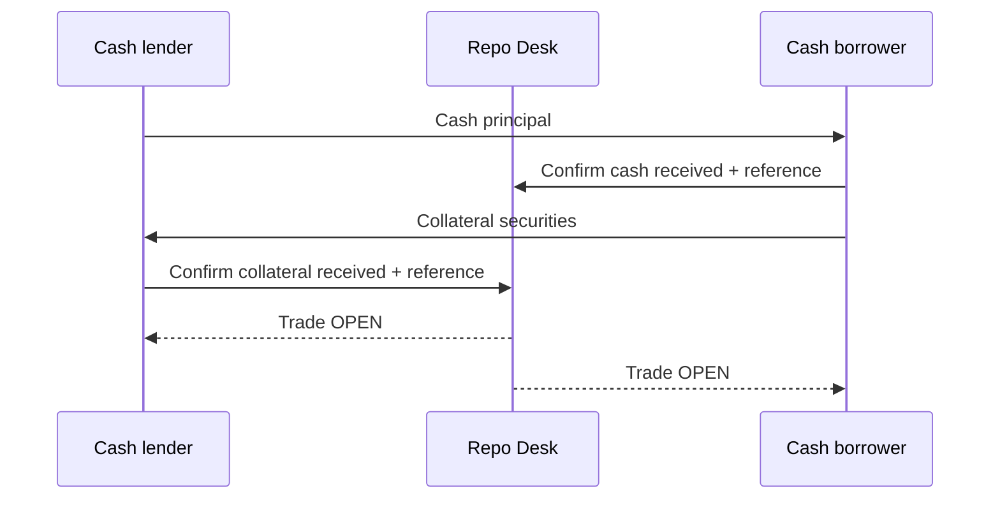

# Stage 5a — Repo trading

A **repurchase agreement (repo)** is two linked transactions agreed together: one party sells securities for cash on the start date and commits to repurchase equivalent securities for a fixed amount on the end date. The cash difference is the repo return.

Registerwerk's Repo Desk models that bilateral workflow. It is deliberately separate from [securities-backed lending](repo-lending.md), where borrowers pledge collateral into an isolated on-chain pool and debt accrues continuously.

| | Repo Desk | Securities-backed lending |
|---|---|---|
| Counterparty | Named bilateral firms | Pooled market |
| Legal/economic form | Sale and agreed repurchase | Collateralised loan |
| Pricing | Fixed quote and repurchase amount | Utilisation-based floating rate |
| Term | Start and end date | Open until repaid/liquidated |
| Risk management | Haircut, margin calls, substitution | LTV, oracle, automated liquidation |
| Settlement | Both firms confirm each leg | Wallet transactions against a contract |

## 1. Send the RFQ

Open **Trader → Repo Desk → New RFQ** and enter:

- whether you want to **borrow cash** or **lend cash**;
- collateral security and quantity;
- cash principal and currency;
- start date, end date, indicative annual repo rate and haircut;
- DvP or FoP settlement; and
- an RFQ expiry before the start date.

Use a **targeted RFQ** for a selected dealer group. Only those companies can discover and quote it. Use **broadcast** for price discovery across every eligible trader.

!!! warning "Broadcast is not anonymous"
    Eligible firms can see the requester and requested terms. Quotes are private, but the RFQ is not. Use targeted distribution for sensitive funding needs.

## 2. Compare private quotes

Each invited dealer may keep one active quote and replace it until expiry. Dealers cannot see competitors' terms. The requester sees cash amount, annual rate, haircut, validity and message together, so the economic package—not only the headline rate—can be compared.

Accepting a quote rejects the alternatives and fixes a trade. For an ACT/360 quote, the system calculates:

```text
repurchase amount = cash principal × (1 + annual rate × term days / 360)
```

The UI expresses the annual rate as a percentage, so 3.25 means 3.25%, not 0.0325%.

## 3. Settle the opening legs



The platform does not infer receipt from a typed transaction reference. Each **recipient** confirms the leg it received. The trade becomes `OPEN` only after both confirmations. DvP remains the preferred method because it reduces principal risk; choosing FoP is an explicit operational exception, not a shortcut.

## 4. Manage the term

- The cash lender can issue a time-bound **margin call**. The borrower records delivery with a transfer reference.
- The borrower can request **collateral substitution**. The lender must explicitly approve before the trade's collateral terms change.
- Every action is appended to the shared lifecycle with company, time, amount/reference and note.
- Default can be declared only for an overdue margin obligation or overdue closing obligation; it is not a general-purpose status button.

These controls record the workflow. They do not replace the parties' master agreement, eligibility schedule, valuation agent, custody arrangement, dispute process or applicable close-out netting opinion.

## 5. Close

At the end date, either party starts closing settlement. The cash lender confirms receipt of the fixed repurchase amount; the cash borrower confirms return of collateral. Only both confirmations close the trade.

!!! info "What the demo proves"
    The demo proves RFQ privacy, term calculation, state transitions and a shared operational record. It does not claim legal enforceability, settlement finality across external rails, accounting treatment, regulatory capital recognition or enforceable close-out netting.

[Stage 5b: Securities-backed lending :octicons-arrow-right-24:](repo-lending.md){ .md-button .md-button--primary }

