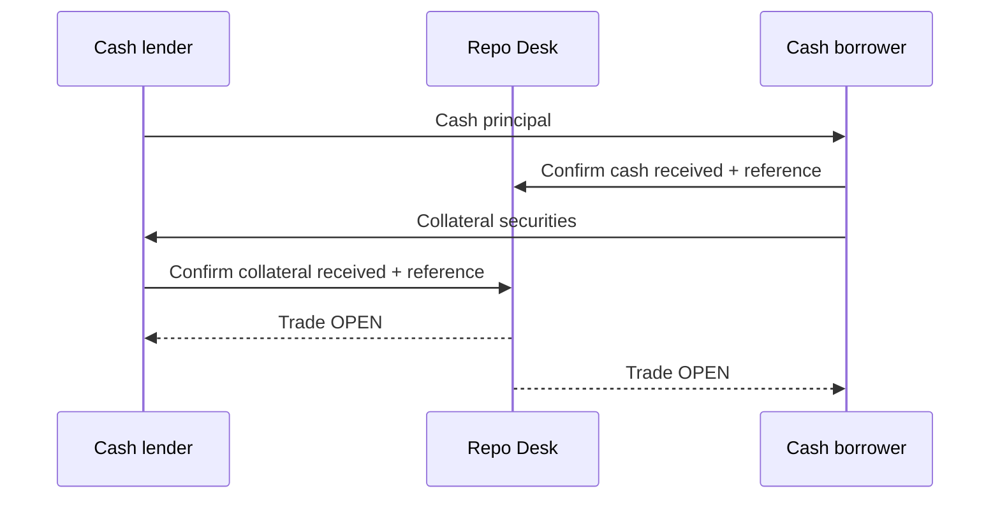

# Stage 5a — Repo trading

A **repurchase agreement (repo)** is two linked transactions agreed together: one party sells securities for cash on the start date and commits to repurchase equivalent securities for a fixed amount on the end date. The cash difference is the repo return.

Registerwerk's Repo Desk models that bilateral workflow. It is deliberately separate from [securities-backed lending](repo-lending.md), where borrowers pledge collateral into an isolated on-chain pool and debt accrues continuously.

| | Repo Desk | Securities-backed lending |
|---|---|---|
| Counterparty | Named bilateral firms | Pooled market |
| Legal/economic form | Sale and agreed repurchase | Collateralised loan |
| Pricing | Fixed quote and repurchase amount | Utilisation-based floating rate |
| Term | Start and end date | Open until repaid/liquidated |
| Risk management | Haircut, margin calls, substitution | LTV, oracle, automated liquidation |
| Settlement | Both firms confirm each leg | Wallet transactions against a contract |

## 1. Send the RFQ

Open **Trader → Repo Desk → New RFQ** and enter:

- whether you want to **borrow cash** or **lend cash**;
- collateral security and quantity;
- cash principal and currency;
- start date, end date, indicative annual repo rate and haircut;
- DvP or FoP settlement; and
- an RFQ expiry before the start date.

Use a **targeted RFQ** for a selected dealer group. Only those companies can discover and quote it. Use **broadcast** for price discovery across every eligible trader.

!!! warning "Broadcast is not anonymous"
    Eligible firms can see the requester and requested terms. Quotes are private, but the RFQ is not. Use targeted distribution for sensitive funding needs.

## 2. Compare private quotes

Each invited dealer may keep one active quote and replace it until expiry. A replacement is a **new quote version**: the earlier version becomes `SUPERSEDED` and can no longer be accepted. Dealers cannot see competitors' terms. The requester sees cash amount, annual rate, haircut, validity and message together, so the economic package—not only the headline rate—can be compared.

Accepting a quote rejects the alternatives and fixes a trade. The accept request carries the `termsHash` the server showed for that quote version; if the quote was replaced or changed in the meantime the accept is refused (409) and you review the current terms. The accepted terms are stored on the trade and never change afterwards. The system calculates:

```text
repurchase amount = cash principal + round(cash principal × annual rate × term days / (basis × 100))
```

The day-count basis is 360 (ACT/360) by default and 365 for currencies that conventionally use ACT/365 (for example GBP); interest and amounts are rounded to the currency's minor unit.

The UI expresses the annual rate as a percentage, so 3.25 means 3.25%, not 0.0325%.

## 3. Settle the opening legs


```mermaid
sequenceDiagram
    participant L as Cash lender
    participant D as Repo Desk
    participant B as Cash borrower
    L->>B: Cash principal
    B->>D: Confirm cash received + reference
    B->>L: Collateral securities
    L->>D: Confirm collateral received + reference
    D-->>L: Trade OPEN
    D-->>B: Trade OPEN
```

The platform does not infer receipt from a typed transaction reference. Each **recipient** confirms the leg it received. The trade becomes `OPEN` only after both confirmations. DvP remains the preferred method because it reduces principal risk; choosing FoP is an explicit operational exception, not a shortcut.

## 4. Manage the term

- Every leg has a **payer** who declares it sent (with a reference) and a **receiver** who confirms or disputes it.
- The cash lender can issue a **margin call** backed by a valuation reference and amount; the amount may not exceed the shortfall that valuation implies, and the borrower gets at least the configured cure period (default 24 hours). The borrower declares the top-up as delivered; **only the lender's confirmation clears the call**.
- The borrower can request **collateral substitution** (a separate request record). If the lender approves, both legs must be confirmed (lender: replacement received; borrower: original returned) before the collateral changes. Substitution is impossible on closed, defaulted or disputed trades, and the replacement must pass the same maturity and holding checks.
- **Default is a two-step process.** The creditor of an overdue obligation serves a *default notice*; after the grace period (default 24 hours) the default can be declared, but only if the obligation is still unmet and the counterparty has not declared performance. If the borrower paid and the lender confirmed, but the lender never returned the collateral, the *borrower* may declare the default (the lender is then the defaulting party). The lender cannot default a borrower who has paid.
- Either party can open a **dispute**; the trade freezes (no default, close, margin call or substitution) until the operator records an outcome under a legal basis with a second approver. The operator does not decide the merits. Parties may add evidence notes at any time.
- Every action is appended to the shared lifecycle with company, time, amount/reference and note.

### Eligibility, holdings and collateral

- Both companies must have **opted in** to the Repo Desk (company administrator), be a professional client or eligible counterparty, and pass the KYC/screening gate. The directory lists only opted-in, listed companies (name and LEI only); the collateral picker shows only securities you actually hold.
- The cash borrower must hold the collateral units on the register and they must not be encumbered: units pledged in another open repo or listed/reserved in secondary trading cannot be pledged again, and pledged units cannot be listed or sold. This is an internal encumbrance; no register entry (Sperrvermerk) is written.
- The repo must end **before** the maturity (or pending call/redemption) of the collateral, and the collateral asset cannot be redeemed while an open repo uses it. Corporate actions on the collateral during the term are recorded on the trade and both parties are notified; any manufactured payment is for the parties to settle under their agreement.
- Both companies need a valid **LEI**. Each trade gets a UTI and exposes the SFTR fields Registerwerk holds (`GET /api/v1/repo-desk/trades/{id}/sftr-fields`). Registerwerk does not report under SFTR; the parties remain responsible. Settlement is bilateral and self-confirmed: there is no atomic delivery-versus-payment mechanism.

These controls record the workflow. They do not replace the parties' master agreement, eligibility schedule, valuation agent, custody arrangement, dispute process or applicable close-out netting opinion.

## 5. Close

At the end date, either party starts closing settlement. The cash lender confirms receipt of the fixed repurchase amount; the cash borrower confirms return of collateral. Only both confirmations close the trade.

!!! info "What the demo proves"
    The demo proves RFQ privacy, term calculation, state transitions and a shared operational record. It does not claim legal enforceability, settlement finality across external rails, accounting treatment, regulatory capital recognition or enforceable close-out netting.

[Stage 5b: Securities-backed lending :octicons-arrow-right-24:](repo-lending.md){ .md-button .md-button--primary }

