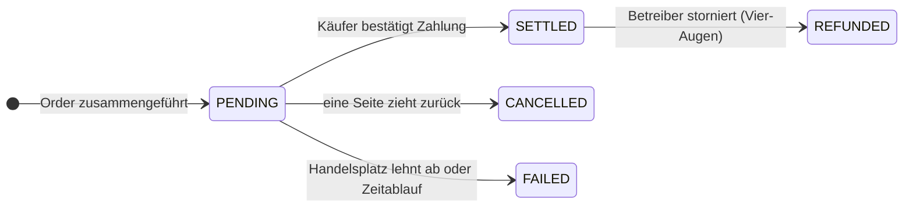

# Station 4 — Sekundärmarkt

*Nach zwei Jahren braucht einer von Nordwinds Anlegern Geld. Die Anleihe wird erst in drei weiteren Jahren fällig.*

Er hat zwei Möglichkeiten. Verkaufen — diese Seite. Oder dagegen leihen und behalten — [die nächste](repo-lending.md).

---

## Primär und sekundär, und warum der Unterschied zählt

**Primärmarkt:** Der Emittent verkauft an Anleger. Geld erreicht den Emittenten. Findet einmal statt.

**Sekundärmarkt:** Anleger verkaufen einander. Geld bewegt sich zwischen Anlegern. Nordwind ist nicht beteiligt und erhält nichts.

Nordwind kümmert es trotzdem — aus zwei leicht zu übersehenden Gründen.

Erstens ist eine Anleihe, die niemand verkaufen kann, weniger wert als eine, die man loswird. Anleger verlangen einen höheren Zins für ein Instrument, aus dem sie nicht herauskommen. **Liquidität wird bei der Emission eingepreist**, ein funktionierender Sekundärmarkt macht das Leihen also billiger.

Zweitens haftet Nordwind dafür, wer am Ende hält. Darf die Anleihe nur von professionellen Anlegern gehalten werden, muss diese Beschränkung fünf Jahre lang jeden Handel überleben, nicht nur den ersten.

---

## Verkaufen: ein Angebot einstellen

*Arbeitsbereich Trader → Trading Desk.*

Ein **Angebot** (*listing*) ist eine Verkaufsofferte: welcher Bestand, wie viele Stücke, zu welchem Preis und welche Zahlungsformen Sie akzeptieren.

| Feld | Bedeutung |
|---|---|
| **Holding** | Aus welcher Position Sie verkaufen. Nur Bestände, die Sie tatsächlich haben. |
| **Quantity** | Wie viele Stücke. Auch ein Teil der Position. |
| **Price per unit** | Ihr Angebotspreis — *nicht* der Nennbetrag. |
| **Payment options** | Welche Wege Sie akzeptieren: Stablecoin, LgZ, SEPA und so fort. |
| **Venue** | Wo das Angebot sichtbar ist. |

!!! tip "Preis und Nennbetrag sind verschiedene Zahlen"
    Nordwinds Stücke haben einen Nennbetrag von 1.000 €. Zwei Jahre später, bei höheren Zinsen als zum Emissionszeitpunkt, könnte ein Verkäufer zu **960 €** anbieten.

    Der Käufer zahlt 960 €, erhält für die verbleibenden drei Jahre Zinsen auf 1.000 € und bekommt bei Fälligkeit 1.000 € zurück. Der Abschlag ist die Art, wie der Markt einen 4,5-%-Kupon in einer Welt neu bepreist, die inzwischen mehr erwartet.

### Handelsplätze

Registerwerk betreibt keinen eigenen Markt. Es bindet Handelsplätze an:

| Handelsplatz | |
|---|---|
| `SIMULATED` | Eingebaut. Für Demos und Tests — führt sofort aus, keine externe Gegenpartei. |
| `ASSETERA`, `ARCHAX`, `TALOS` | Adapter für externe regulierte Handelsplätze. |

Der simulierte Handelsplatz ist das, was eine lokale oder Demo-Installation nutzt, und deshalb werden Geschäfte dort scheinbar sofort ausgeführt. Er unterstützt ausschließlich **Market**- und **Limit**-Orders.

---

## Kaufen: der Marktplatz

*Trading Desk → verfügbare Angebote.* Sie sehen, was Sie sehen dürfen — ein Angebot für ein Instrument, das Sie nicht rechtmäßig halten könnten, wird Ihnen nicht angezeigt.

Wählen Sie ein Angebot, eine Stückzahl, einen Ordertyp und eine Zahlungsoption:

- **Market-Order** — zum angebotenen Preis nehmen.
- **Limit-Order** — geben Sie an, wie viel Sie höchstens zahlen. Liegt das Angebot darüber, wird die Order abgelehnt statt zu einem schlechteren Preis ausgeführt.

Dann wählen Sie die empfangende Wallet: Ihre globale Vorgabe, Ihre Vorgabe für diesen Asset-Typ, einen Ihrer registrierten Endpunkte oder eine bestimmte Adresse.

??? note "Für Fachleute: was den Handel absichert"

    Mehreres, das unsichtbar ist, solange es funktioniert.

    **Zeilensperren.** Sowohl die Verfügbarkeitsprüfung als auch die Abwicklung nehmen ein `SELECT … FOR UPDATE` auf die Zeile. Ohne das könnten zwei Käufer, die gleichzeitig auf dasselbe Angebot zugreifen, beide die Verfügbarkeitsprüfung bestehen und beide aus einem Bestand bedient werden, der nur für einen reicht — und eine doppelte Abwicklung könnte einen Käufer zweimal gutschreiben.

    **Selbsteintritt abgelehnt.** Ein Unternehmen kann sein eigenes Angebot nicht kaufen.

    **Die Zahlungsoption muss eine sein, die der Verkäufer akzeptiert** — der Käufer kann keinen Weg aufzwingen.

    **Fehlschläge werden festgehalten, nicht zurückgerollt.** Eine Ablehnung durch den Handelsplatz warf früher eine Ausnahme und rollte die gesamte Transaktion zurück, sodass kein Nachweis blieb, dass der Versuch stattgefunden hatte. Abgelehnte Ausführungen werden nun mit Grund gespeichert, denn „es gibt keine Aufzeichnung" ist eine schlechte Antwort auf „was ist aus meiner Order geworden?".

---

## Abwicklung: der Teil mit dem Risiko

Eine Ausführung beginnt nicht fertig. Sie beginnt als **`PENDING`**.

`PENDING` bedeutet: Das Geschäft ist vereinbart, das Geld ist nicht bestätigt, und **die Wertpapiere haben sich nicht bewegt**. Der Verkäufer hält sie weiterhin.

Zur Abwicklung liefert der Käufer eine **Zahlungsreferenz** — einen Stablecoin-Transaktions-Hash, eine SEPA-Referenz, was auch immer die Zahlung auf dem gewählten Weg belegt. Erst dann bewegt das Register die Stücke.

!!! warning "Seien Sie ehrlich, was eine Zahlungsreferenz beweist"
    Sie belegt, dass der Käufer eine Zahlung *behauptet* hat, und gibt der Abstimmung etwas Konkretes zum Prüfen. Sie ist nicht die Plattform, die bestätigt, dass Geld angekommen ist.

    Bevor es dieses Feld gab, verlangte die Abwicklung nichts weiter als einen Klick des Käufers — reine Selbstauskunft ohne jeden Prüfansatz. Die Referenz ist eine echte Verbesserung dagegen und immer noch schwächer als eine echte Lieferung gegen Zahlung.

    Wenn Wertpapier und Geld wirklich voneinander abhängen sollen, nutzen Sie einen [LgZ-Weg](primary-issuance.md#wo-das-geld-bleibt) und legen Sie beide Seiten auf dasselbe Ledger.

Geschäfte, die zu lange in `PENDING` stehen, laufen automatisch ab, damit eine schlafende Order die Stücke eines Verkäufers nicht unbegrenzt binden kann. Ein abgewickeltes Geschäft kann vom Betreiber rückabgewickelt werden, aber nur im **[Vier-Augen-Prinzip](../../compliance/step-up-mfa.md)** — zwei verschiedene Personen — denn das Aufheben einer abgeschlossenen Abwicklung ist genau die Art von Befugnis, die niemals bei einer Person allein liegen sollte.

---

## Was die Compliance-Schicht während eines Handels tut

Bei einem ERC-3643-Instrument, in dem Moment, in dem sich die Token bewegen:

1. Die Wallet des Käufers wird zu einer On-Chain-Identität aufgelöst.
2. Diese Identität wird auf gültige Claims vertrauenswürdiger Aussteller geprüft.
3. Jede Compliance-Regel wird befragt — Inhaberobergrenzen, Länderbeschränkungen, Haltefristen.
4. Ein einziges `false` und **die Übertragung wird rückabgewickelt.**

Parallel dazu werden off-chain beide Parteien gegen Sanktionslisten geprüft und Travel-Rule-Angaben beigefügt.

Im Ergebnis wird Nordwinds Beschränkung — nur professionelle Anleger — beim zehntausendsten Handel genauso durchgesetzt wie beim ersten, ohne dass Nordwind etwas tun muss. Das ist das ganze Argument dafür, Compliance in den Token zu legen.

---

## Wie sich das von jeder Seite anfühlt

=== "Sie verkaufen"

    1. *Trading Desk* → **Create listing**
    2. Bestand, Stückzahl, Preis und akzeptierte Zahlungsoptionen wählen
    3. Warten. Das Angebot ist für berechtigte Käufer sichtbar.
    4. Bei einer Zusammenführung geht das Geschäft auf `PENDING`
    5. Zahlungseingang bestätigen; der Käufer wickelt ab; Ihre Position sinkt

    Bis zur Abwicklung können Sie jederzeit stornieren.

=== "Sie kaufen"

    1. *Trading Desk* → Angebote durchsehen
    2. Stückzahl, Ordertyp, Zahlungsoption und empfangende Wallet wählen
    3. Ausführen — das Geschäft geht auf `PENDING`
    4. Auf dem vereinbarten Weg zahlen
    5. Mit der Zahlungsreferenz abwickeln; die Stücke kommen an

    Ihr KYC muss aktuell und Ihre Wallet registriert sein — *vor* Schritt 2.

=== "Sie sind der Emittent"

    Sie tun nichts. Sie können einen rechtmäßigen Handel zwischen berechtigten Inhabern nicht unterbinden.

    Was Sie bekommen, ist Sichtbarkeit: Das Register aktualisiert sich, Ihre Inhaberliste ändert sich, und *Managing your investors* zeigt, wer die Anleihe jetzt hält.

    [:octicons-arrow-right-24: Anleger verwalten](../issuers/managing-investors.md)

---

## Wo Sie stehen

Die Anleihe hat den Besitzer gewechselt. Das Register führt einen neuen Inhaber, der alte hat Geld, Nordwinds Verpflichtung ist unverändert, und die Compliance-Regeln haben durchgehend gehalten.

Aber Verkaufen ist nicht der einzige Weg, aus einer Anleihe Geld zu machen.

[Station 5: Pensionsgeschäfte und Beleihung :octicons-arrow-right-24:](repo-lending.md){ .md-button .md-button--primary }
