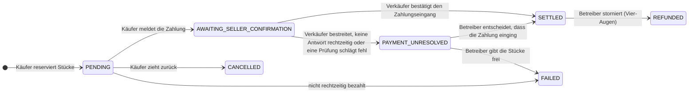

# Station 4 — Sekundärmarkt

*Nach zwei Jahren braucht einer von Nordwinds Anlegern Geld. Die Anleihe wird erst in drei weiteren Jahren fällig.*

Er hat zwei Möglichkeiten. Verkaufen — diese Seite. Oder dagegen leihen und behalten — [die nächste](repo-lending.md).

---

## Primär und sekundär, und warum der Unterschied zählt

**Primärmarkt:** Der Emittent verkauft an Anleger. Geld erreicht den Emittenten. Findet einmal statt.

**Sekundärmarkt:** Anleger verkaufen einander. Geld bewegt sich zwischen Anlegern. Nordwind ist nicht beteiligt und erhält nichts.

Nordwind kümmert es trotzdem — aus zwei leicht zu übersehenden Gründen.

Erstens ist eine Anleihe, die niemand verkaufen kann, weniger wert als eine, die man loswird. Anleger verlangen einen höheren Zins für ein Instrument, aus dem sie nicht herauskommen. **Liquidität wird bei der Emission eingepreist**, ein funktionierender Sekundärmarkt macht das Leihen also billiger.

Zweitens haftet Nordwind dafür, wer am Ende hält. Darf die Anleihe nur von professionellen Anlegern gehalten werden, muss diese Beschränkung fünf Jahre lang jeden Handel überleben, nicht nur den ersten.

---

## Verkaufen: ein Angebot einstellen

*Arbeitsbereich Trader → Trading Desk.*

Ein **Angebot** (*listing*) ist eine Verkaufsofferte: welcher Bestand, wie viele Stücke, zu welchem Preis und welche Zahlungsformen Sie akzeptieren.

| Feld | Bedeutung |
|---|---|
| **Holding** | Aus welcher Position Sie verkaufen. Nur Bestände, die Sie tatsächlich haben. |
| **Quantity** | Wie viele Stücke. Auch ein Teil der Position. |
| **Price per unit** | Ihr Angebotspreis — *nicht* der Nennbetrag. |
| **Payment options** | Welche Wege Sie akzeptieren: Stablecoin, LgZ, SEPA und so fort. |
| **Venue** | Wo das Angebot sichtbar ist. |

!!! tip "Preis und Nennbetrag sind verschiedene Zahlen"
    Nordwinds Stücke haben einen Nennbetrag von 1.000 €. Zwei Jahre später, bei höheren Zinsen als zum Emissionszeitpunkt, könnte ein Verkäufer zu **960 €** anbieten.

    Der Käufer zahlt 960 €, erhält für die verbleibenden drei Jahre Zinsen auf 1.000 € und bekommt bei Fälligkeit 1.000 € zurück. Der Abschlag ist die Art, wie der Markt einen 4,5-%-Kupon in einer Welt neu bepreist, die inzwischen mehr erwartet.

### Handelsplätze

Die integrierten Peer-Angebote sind ein **Demonstrations-Workflow für den Sekundärmarkt, kein zugelassener Handelsplatz**. Externe Handelsplätze werden über Adapter angebunden:

| Handelsplatz | |
|---|---|
| `SIMULATED` | Eingebaut. Für Demos und Tests — handelt gegen Angebote anderer Unternehmen auf der Plattform, keine externe Gegenpartei. |
| `ASSETERA`, `ARCHAX`, `TALOS` | Adapter für externe regulierte Handelsplätze. |

Der simulierte Handelsplatz ist das, was eine lokale oder Demo-Installation nutzt. Geschäfte dort werden wie unten beschrieben abgewickelt; nur wenn der Verkäufer bei seinem Angebot ausdrücklich die Demo-Option „Sofortabwicklung erlauben" gewählt hat, wird sofort (und dann ohne Zahlungsseite) ausgeführt. Er unterstützt ausschließlich **Market**- und **Limit**-Orders.

!!! warning "Währung, Rundung, nahestehende Parteien und Handelsplatz-Perimeter"
    - **Währung.** Jedes Angebot hat eine Abwicklungswährung. Fiat-Optionen (SEPA, CBMT, Pontes) akzeptieren die vom Betreiber zugelassenen Währungen (Standard EUR); ein Stablecoin-Angebot nennt einen aktivierten Zahlungsweg und übernimmt dessen Währung. Native Chain-Währung wird noch nicht unterstützt. Ältere Angebote zeigen „Währung nicht erfasst“.
    - **Rundung.** Der Gesamtbetrag wird kaufmännisch-gerade (Half-Even) auf die kleinste Einheit der Währung gerundet (EUR: 2 Stellen; Stablecoin-Zahlungsweg: dessen Dezimalstellen, höchstens 6). Das exakte Produkt und die Rundung werden mit dem Trade gespeichert; die Bestätigung nennt die Währung.
    - **Nahestehende Parteien.** Käufer und Verkäufer, die einen wirtschaftlich Berechtigten, ein Mitglied oder eine Wallet teilen, können nicht miteinander handeln; der Versuch löst einen Alarm aus. Konzerne über gemeinsame Berechtigte hinaus sind nicht abgebildet. Geschäfte zwischen nahestehenden Parteien (nur wenn der Betreiber sie erlaubt) werden markiert und setzen nie den Referenzpreis, der nur indikativ ist.
    - **Bilaterale Angebote.** Ein Verkäufer kann ein Angebot an eine benannte Gegenpartei richten; niemand sonst sieht oder kauft es. In Produktion muss der Betreiber eine Handelsplatz-Klassifizierung (`BILATERAL_ONLY` oder `LICENSED_VENUE`) setzen und ein Rechtsgutachten referenzieren; sonst werden Peer-Angebote abgelehnt.

---

## Kaufen: der Marktplatz

*Trading Desk → verfügbare Angebote.* Sie sehen, was Sie sehen dürfen — ein Angebot für ein Instrument, das Sie nicht rechtmäßig halten könnten, wird Ihnen nicht angezeigt.

Wählen Sie ein Angebot, eine Stückzahl, einen Ordertyp und eine Zahlungsoption:

- **Market-Order** — zum angebotenen Preis nehmen.
- **Limit-Order** — geben Sie an, wie viel Sie höchstens zahlen. Liegt das Angebot darüber, wird die Order abgelehnt statt zu einem schlechteren Preis ausgeführt.

Dann wählen Sie die empfangende Wallet: Ihre globale Vorgabe, Ihre Vorgabe für diesen Asset-Typ, einen Ihrer registrierten Endpunkte oder eine bestimmte, für Ihr Unternehmen registrierte Adresse (Endpunkt oder Mitglieds-Wallet; frei eingegebene Adressen werden abgelehnt).

??? note "Für Fachleute: was den Handel absichert"

    Mehreres, das unsichtbar ist, solange es funktioniert.

    **Zeilensperren.** Sowohl die Verfügbarkeitsprüfung als auch die Abwicklung nehmen ein `SELECT … FOR UPDATE` auf die Zeile. Ohne das könnten zwei Käufer, die gleichzeitig auf dasselbe Angebot zugreifen, beide die Verfügbarkeitsprüfung bestehen und beide aus einem Bestand bedient werden, der nur für einen reicht — und eine doppelte Abwicklung könnte einen Käufer zweimal gutschreiben.

    **Selbsteintritt abgelehnt.** Ein Unternehmen kann sein eigenes Angebot nicht kaufen.

    **Die Zahlungsoption muss eine sein, die der Verkäufer akzeptiert** — der Käufer kann keinen Weg aufzwingen.

    **Fehlschläge werden festgehalten, nicht zurückgerollt.** Eine Ablehnung durch den Handelsplatz warf früher eine Ausnahme und rollte die gesamte Transaktion zurück, sodass kein Nachweis blieb, dass der Versuch stattgefunden hatte. Abgelehnte Ausführungen werden nun mit Grund gespeichert, denn „es gibt keine Aufzeichnung" ist eine schlechte Antwort auf „was ist aus meiner Order geworden?".

---

## Abwicklung: der Teil mit dem Risiko

Ein Geschäft beginnt nicht fertig. Ein Kauf **reserviert** zunächst nur die Stücke: Das Geschäft steht auf **`PENDING`**.

```mermaid
stateDiagram-v2
    direction LR
    [*] --> PENDING: Käufer reserviert Stücke
    PENDING --> AWAITING_SELLER_CONFIRMATION: Käufer meldet die Zahlung
    PENDING --> CANCELLED: Käufer zieht zurück
    PENDING --> FAILED: nicht rechtzeitig bezahlt
    AWAITING_SELLER_CONFIRMATION --> SETTLED: Verkäufer bestätigt den Zahlungseingang
    AWAITING_SELLER_CONFIRMATION --> PAYMENT_UNRESOLVED: Verkäufer bestreitet, keine Antwort rechtzeitig oder eine Prüfung schlägt fehl
    PAYMENT_UNRESOLVED --> SETTLED: Betreiber entscheidet, dass die Zahlung einging
    PAYMENT_UNRESOLVED --> FAILED: Betreiber gibt die Stücke frei
    SETTLED --> REFUNDED: Betreiber storniert (Vier-Augen)
```

`PENDING` bedeutet: Das Geschäft ist vereinbart, die Stücke sind **reserviert** (der Verkäufer kann sie nicht anderweitig anbieten), das Geld ist nicht bestätigt, und **das Register hat sich nicht bewegt**. Bevor etwas reserviert wird, laufen alle Prüfungen: Status, KYC und Sanktionsprüfung *beider* Parteien, Zielmarkt und Haltegrenzen des Käufers, das Wertpapier muss ausgegeben (`ISSUED`) sein, und die Registereintragung des Verkäufers muss aktiv sein und die Stücke abdecken. Ein Käufer darf höchstens **3** offene Reservierungen gleichzeitig halten, nur eine je Angebot, und nach einem Rückzug oder Zeitablauf gilt für dasselbe Angebot eine **Sperrfrist von 24 Stunden**.

Der Käufer zahlt auf dem vereinbarten Weg und **meldet die Zahlung** mit einer **Zahlungsreferenz** — Stablecoin-Transaktions-Hash, SEPA-Referenz, was die Zahlung auf dem gewählten Weg belegt. Das Geschäft geht auf `AWAITING_SELLER_CONFIRMATION`. Das Register hat sich noch immer nicht bewegt.

**Erst die Bestätigung des Verkäufers bewegt das Register.** Bestätigt der Verkäufer den Zahlungseingang, laufen die Prüfungen ein letztes Mal; bestehen sie, gehen die Stücke über und das Geschäft steht auf `SETTLED`. Scheitert in diesem Moment eine Prüfung, wird das Geschäft *nicht* stillschweigend verworfen: Es geht auf `PAYMENT_UNRESOLVED`.

Bestreitet der Verkäufer die Zahlung oder antwortet er nicht innerhalb der Frist (72 Stunden; der Ablauf-Job läuft stündlich), geht das Geschäft ebenfalls auf **`PAYMENT_UNRESOLVED`** und nicht auf `FAILED`, denn der Käufer kann bezahlt haben. Die Stücke bleiben reserviert, das Angebot wird nicht erneut angeboten, und beide Parteien können Notizen mit Belegen hinzufügen. Der Betreiber entscheidet im **Vier-Augen-Prinzip** und mit Angabe der Rechtsgrundlage: erzwungene Abwicklung (alle Prüfungen laufen erneut), Erfassen der Rückzahlung an den Käufer oder Freigabe der Stücke, wenn der Verkäufer den Nichteingang belegt. Der Betreiber hält Belege fest; er urteilt nicht über die Sache selbst.

Nur der Käufer kann ein Geschäft in `PENDING` zurückziehen. Wird nicht rechtzeitig gezahlt, läuft es ab (`FAILED`) und die Stücke gehen an das Angebot zurück.

Wird die Registereintragung des Verkäufers entfernt oder übergeben, ein Wertpapier ausgesetzt (`SUSPENDED`) oder zurückgezahlt (`REDEEMED`) oder verlässt eine Partei die Plattform, werden die Angebote storniert, unbezahlte Geschäfte abgebrochen und bezahlte Geschäfte auf `PAYMENT_UNRESOLVED` gesetzt. Gegen eine entfernte Registereintragung wird nie abgewickelt.

!!! note "Nur in Demo-Installationen: Sofortabwicklung"
    In einer Demo-Installation kann ein *Verkäufer* bei einem Angebot „Sofortabwicklung erlauben" wählen. Ein Kauf bewegt dann das Register sofort — **ohne jede Zahlungsseite** — und Bestätigungen tragen den Vermerk „SIMULATED - no cash leg". Das ist nie eine echte Abwicklung; die Plattform verweigert im Produktionsbetrieb den Start, wenn die Option aktiv ist. Die frühere Firmeneinstellung des *Käufers* wirkt nicht mehr.

!!! warning "Seien Sie ehrlich, was eine Zahlungsreferenz beweist"
    Sie belegt, dass der Käufer eine Zahlung *behauptet* hat, und gibt der Abstimmung etwas Konkretes zum Prüfen. Sie ist nicht die Plattform, die bestätigt, dass Geld angekommen ist.

    Bevor es dieses Feld gab, verlangte die Abwicklung nichts weiter als einen Klick des Käufers — reine Selbstauskunft ohne jeden Prüfansatz. Die Referenz ist eine echte Verbesserung dagegen und immer noch schwächer als eine echte Lieferung gegen Zahlung.

    Wenn Wertpapier und Geld wirklich voneinander abhängen sollen, nutzen Sie einen [LgZ-Weg](primary-issuance.md#wo-das-geld-bleibt) und legen Sie beide Seiten auf dasselbe Ledger.

Ein abgewickeltes Geschäft kann vom Betreiber rückabgewickelt werden, aber nur im **[Vier-Augen-Prinzip](../../compliance/step-up-mfa.md)** — zwei verschiedene Personen — denn das Aufheben einer abgeschlossenen Abwicklung ist genau die Art von Befugnis, die niemals bei einer Person allein liegen sollte.

---

## Was die Compliance-Schicht während eines Handels tut

Bei einem ERC-3643-Instrument, in dem Moment, in dem sich die Token bewegen:

1. Die Wallet des Käufers wird zu einer On-Chain-Identität aufgelöst.
2. Diese Identität wird auf gültige Claims vertrauenswürdiger Aussteller geprüft.
3. Jede Compliance-Regel wird befragt — Inhaberobergrenzen, Länderbeschränkungen, Haltefristen.
4. Ein einziges `false` und **die Übertragung wird rückabgewickelt.**

Parallel dazu werden off-chain beide Parteien gegen Sanktionslisten geprüft und Travel-Rule-Angaben beigefügt.

Im Ergebnis wird Nordwinds Beschränkung — nur professionelle Anleger — beim zehntausendsten Handel genauso durchgesetzt wie beim ersten, ohne dass Nordwind etwas tun muss. Das ist das ganze Argument dafür, Compliance in den Token zu legen.

---

## Wie sich das von jeder Seite anfühlt

=== "Sie verkaufen"

    1. *Trading Desk* → **Create listing**
    2. Bestand, Stückzahl, Preis und akzeptierte Zahlungsoptionen wählen
    3. Warten. Das Angebot ist für berechtigte Käufer sichtbar.
    4. Bei einem Kauf sind Ihre Stücke reserviert und das Geschäft steht auf `PENDING`
    5. Prüfen, ob die Zahlung eingegangen ist, und den Eingang **bestätigen** — erst dann sinkt Ihre Position. Ist sie nicht eingegangen, **bestreiten** Sie sie mit Begründung; der Betreiber entscheidet.

    Ein Angebot können Sie bis zu einem Kauf jederzeit stornieren. Ein Geschäft in `PENDING` kann nur der Käufer zurückziehen.

=== "Sie kaufen"

    1. *Trading Desk* → Angebote durchsehen
    2. Stückzahl, Ordertyp, Zahlungsoption und empfangende Wallet wählen
    3. Ausführen — die Stücke werden reserviert, das Geschäft geht auf `PENDING`
    4. Auf dem vereinbarten Weg zahlen
    5. Die Zahlung mit der Zahlungsreferenz **melden**; der Verkäufer bestätigt, und die Stücke kommen an

    Ihr KYC muss aktuell und Ihre empfangende Wallet für Ihr Unternehmen registriert sein (Endpunkt oder Mitglieds-Wallet) — *vor* Schritt 2.

=== "Sie sind der Emittent"

    Sie tun nichts. Sie können einen rechtmäßigen Handel zwischen berechtigten Inhabern nicht unterbinden.

    Was Sie bekommen, ist Sichtbarkeit: Das Register aktualisiert sich, Ihre Inhaberliste ändert sich, und *Managing your investors* zeigt, wer die Anleihe jetzt hält.

    [:octicons-arrow-right-24: Anleger verwalten](../issuers/managing-investors.md)

---

## Wo Sie stehen

Die Anleihe hat den Besitzer gewechselt. Das Register führt einen neuen Inhaber, der alte hat Geld, Nordwinds Verpflichtung ist unverändert, und die Compliance-Regeln haben durchgehend gehalten.

Aber Verkaufen ist nicht der einzige Weg, aus einer Anleihe Geld zu machen.

[Station 5: Pensionsgeschäfte und Beleihung :octicons-arrow-right-24:](repo-lending.md){ .md-button .md-button--primary }
