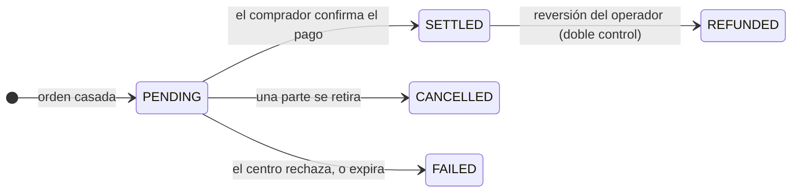

# Etapa 4 — Mercado secundario

*Dos años después, uno de los inversores de Nordwind necesita liquidez. El bono no vence hasta dentro de tres años más.*

Tiene dos opciones. Vender — esta página. O pedir prestado contra él y conservarlo — [la página siguiente](repo-lending.md).

---

## Primario y secundario, y por qué importa la diferencia

**Mercado primario:** el emisor vende a los inversores. El dinero llega al emisor. Ocurre una sola vez.

**Mercado secundario:** los inversores se venden entre sí. El dinero circula entre inversores. Nordwind no es parte y no recibe nada.

Aun así a Nordwind le importa — por dos razones fáciles de pasar por alto.

Primero, un bono que nadie puede revender vale menos que uno transmisible. Los inversores exigen un tipo más alto por un instrumento del que no pueden salir. **La liquidez se descuenta ya en la emisión**, de modo que un mercado secundario que funciona abarata el endeudamiento.

Segundo, Nordwind sigue comprometida respecto de quién acaba siendo titular. Si el bono solo puede estar en manos de inversores profesionales, esa restricción debe sobrevivir a cada negociación durante cinco años, no solo a la primera.

---

## Vender: crear una oferta

*Espacio Trader → Trading Desk.*

Una **oferta de venta** (*listing*) es una propuesta: qué posición, cuántos títulos, a qué precio y qué formas de pago acepta.

| Campo | Significado |
|---|---|
| **Holding** | Desde qué posición vende. Solo posiciones que realmente tiene. |
| **Quantity** | Cuántos títulos. Puede ser parte de la posición. |
| **Price per unit** | Su precio de venta — *no* el valor nominal. |
| **Payment options** | Qué vías acepta: stablecoin, entrega contra pago, SEPA, etc. |
| **Venue** | Dónde es visible la oferta. |

!!! tip "Precio y valor nominal son números distintos"
    Los títulos de Nordwind tienen un valor nominal de 1.000 €. Dos años después, con tipos más altos que en la emisión, un vendedor podría ofrecer **960 €**.

    El comprador paga 960 €, cobra intereses calculados sobre 1.000 € durante los tres años restantes y recibe 1.000 € al vencimiento. El descuento es la forma en que el mercado revaloriza un cupón del 4,5 % en un mundo que ya espera más.

### Centros de negociación

Registerwerk no explota un mercado propio. Se conecta a centros externos:

| Centro | |
|---|---|
| `SIMULATED` | Integrado. Para demostraciones y pruebas — ejecuta al instante, sin contraparte externa. |
| `ASSETERA`, `ARCHAX`, `TALOS` | Conectores hacia centros regulados externos. |

El centro simulado es el que utiliza una instalación local o de demostración, y por eso allí las operaciones parecen ejecutarse de inmediato. Solo admite órdenes **de mercado** y **limitadas**.

---

## Comprar: el mercado

*Trading Desk → ofertas disponibles.* Ve lo que tiene derecho a ver — una oferta sobre un instrumento que no podría tener lícitamente no se le muestra.

Elija una oferta, una cantidad, un tipo de orden y una opción de pago:

- **Orden de mercado** — acepta el precio publicado.
- **Orden limitada** — indica el máximo que pagará. Si la oferta está por encima, la orden se rechaza en lugar de ejecutarse a peor precio.

Después elija el monedero de recepción: su valor por defecto global, el definido para ese tipo de activo, uno de sus puntos finales registrados o una dirección concreta.

??? note "Para especialistas: qué protege la operación"

    Varios mecanismos, invisibles mientras funcionan.

    **Bloqueo a nivel de fila.** Tanto la comprobación de disponibilidad como la liquidación toman un `SELECT … FOR UPDATE` sobre la fila. Sin él, dos compradores que acudan a la misma oferta simultáneamente podrían superar ambos la comprobación y ser servidos con existencias que solo alcanzan para uno — y una doble liquidación podría abonar dos veces a un comprador.

    **Autocontratación rechazada.** Una sociedad no puede comprar su propia oferta.

    **La opción de pago debe estar entre las que acepta el vendedor** — el comprador no puede imponer una vía.

    **Los fallos se registran, no se revierten.** Un rechazo del centro antes lanzaba una excepción y revertía toda la transacción, sin dejar constancia de que el intento se hubiera producido. Las ejecuciones rechazadas ahora se persisten con su motivo, porque «no hay constancia» es una mala respuesta a «¿qué ha pasado con mi orden?».

---

## La liquidación: la parte que soporta el riesgo

Una ejecución no nace completa. Nace **`PENDING`**.

`PENDING` significa: la operación está acordada, el dinero no está confirmado y **los valores no se han movido**. El vendedor los sigue teniendo.

Para liquidar, el comprador aporta una **referencia de pago** — un hash de transacción de stablecoin, una referencia SEPA, lo que acredite el pago en la vía elegida. Solo entonces el registro mueve los títulos.

!!! warning "Sea honesto sobre lo que prueba una referencia de pago"
    Prueba que el comprador *afirmó* haber pagado, y da a la conciliación algo concreto que comprobar. No es la plataforma confirmando que el dinero llegó.

    Antes de que existiera este campo, liquidar no exigía más que un clic del comprador — pura autodeclaración, sin nada que auditar. La referencia es una mejora real, y sigue siendo más débil que una verdadera entrega contra pago.

    Si quiere que el valor y el efectivo estén realmente condicionados el uno al otro, use una [vía de entrega contra pago](primary-issuance.md#adonde-va-el-dinero) y ponga ambas patas en la misma cadena.

Las operaciones que permanecen demasiado tiempo en `PENDING` expiran automáticamente, para que una orden dormida no pueda inmovilizar indefinidamente los títulos de un vendedor. Una operación liquidada puede revertirla el operador, pero solo bajo **[doble control](../../compliance/step-up-mfa.md)** — dos personas distintas — porque deshacer una liquidación consumada es exactamente el tipo de poder que nunca debería recaer en una sola persona.

---

## Qué hace la capa de cumplimiento durante una negociación

Para un instrumento ERC-3643, en el momento en que se mueven los tokens:

1. El monedero del comprador se resuelve a una identidad on-chain.
2. Esa identidad se comprueba en busca de acreditaciones válidas de emisores de confianza.
3. Se consulta cada regla de cumplimiento — límites de titulares, restricciones por país, periodos de bloqueo.
4. Un solo `false` y **la transmisión se revierte.**

En paralelo, fuera de la cadena, ambas partes se filtran contra listas de sanciones y se adjunta la información de la Travel Rule.

El efecto es que la restricción de Nordwind — solo inversores profesionales — se impone en la negociación número diez mil exactamente igual que en la primera, sin que Nordwind haga nada. Ese es todo el argumento a favor de poner el cumplimiento dentro del token.

---

## Cómo se ve desde cada lado

=== "Usted vende"

    1. *Trading Desk* → **Create listing**
    2. Elegir posición, cantidad, precio y opciones de pago aceptadas
    3. Esperar. La oferta es visible para los compradores elegibles.
    4. Al casarse, la operación pasa a `PENDING`
    5. Confirmar la recepción del pago; el comprador liquida; su posición disminuye

    Puede cancelar en cualquier momento antes de la liquidación.

=== "Usted compra"

    1. *Trading Desk* → examinar ofertas
    2. Elegir cantidad, tipo de orden, opción de pago y monedero de recepción
    3. Ejecutar — la operación pasa a `PENDING`
    4. Pagar por la vía acordada
    5. Liquidar con la referencia de pago; los títulos llegan

    Su KYC debe estar vigente y su monedero registrado *antes* del paso 2.

=== "Usted es el emisor"

    No hace nada. No puede bloquear una negociación lícita entre titulares elegibles.

    Lo que obtiene es visibilidad: el registro se actualiza, su lista de titulares cambia y *Managing your investors* muestra quién tiene ahora el bono.

    [:octicons-arrow-right-24: Gestionar sus inversores](../issuers/managing-investors.md)

---

## Dónde está usted

El bono ha cambiado de manos. El registro anota un nuevo titular, el anterior tiene efectivo, la obligación de Nordwind no ha variado y las reglas de cumplimiento aguantaron en todo momento.

Pero vender no es la única forma de obtener liquidez de un bono que se posee.

[Etapa 5: Repo y financiación :octicons-arrow-right-24:](repo-lending.md){ .md-button .md-button--primary }
