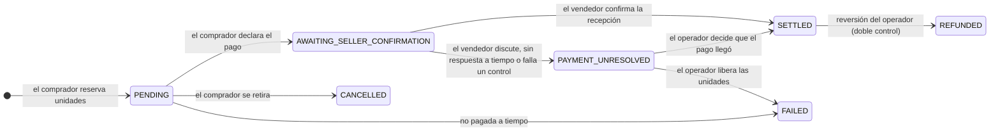

# Etapa 4 — Mercado secundario

*Dos años después, uno de los inversores de Nordwind necesita liquidez. El bono no vence hasta dentro de tres años más.*

Tiene dos opciones. Vender — esta página. O pedir prestado contra él y conservarlo — [la página siguiente](repo-lending.md).

---

## Primario y secundario, y por qué importa la diferencia

**Mercado primario:** el emisor vende a los inversores. El dinero llega al emisor. Ocurre una sola vez.

**Mercado secundario:** los inversores se venden entre sí. El dinero circula entre inversores. Nordwind no es parte y no recibe nada.

Aun así a Nordwind le importa — por dos razones fáciles de pasar por alto.

Primero, un bono que nadie puede revender vale menos que uno transmisible. Los inversores exigen un tipo más alto por un instrumento del que no pueden salir. **La liquidez se descuenta ya en la emisión**, de modo que un mercado secundario que funciona abarata el endeudamiento.

Segundo, Nordwind sigue comprometida respecto de quién acaba siendo titular. Si el bono solo puede estar en manos de inversores profesionales, esa restricción debe sobrevivir a cada negociación durante cinco años, no solo a la primera.

---

## Vender: crear una oferta

*Espacio Trader → Trading Desk.*

Una **oferta de venta** (*listing*) es una propuesta: qué posición, cuántos títulos, a qué precio y qué formas de pago acepta.

| Campo | Significado |
|---|---|
| **Holding** | Desde qué posición vende. Solo posiciones que realmente tiene. |
| **Quantity** | Cuántos títulos. Puede ser parte de la posición. |
| **Price per unit** | Su precio de venta — *no* el valor nominal. |
| **Payment options** | Qué vías acepta: stablecoin, entrega contra pago, SEPA, etc. |
| **Venue** | Dónde es visible la oferta. |

!!! tip "Precio y valor nominal son números distintos"
    Los títulos de Nordwind tienen un valor nominal de 1.000 €. Dos años después, con tipos más altos que en la emisión, un vendedor podría ofrecer **960 €**.

    El comprador paga 960 €, cobra intereses calculados sobre 1.000 € durante los tres años restantes y recibe 1.000 € al vencimiento. El descuento es la forma en que el mercado revaloriza un cupón del 4,5 % en un mundo que ya espera más.

### Centros de negociación

Las ofertas entre pares integradas son un **flujo de demostración del mercado secundario, no un centro de negociación autorizado**. Los centros externos se alcanzan mediante adaptadores:

| Centro | |
|---|---|
| `SIMULATED` | Integrado. Para demostraciones y pruebas — negocia contra las ofertas de otras empresas de la plataforma, sin contraparte externa. |
| `ASSETERA`, `ARCHAX`, `TALOS` | Conectores hacia centros regulados externos. |

El centro simulado es el que utiliza una instalación local o de demostración. Las operaciones allí se liquidan como se describe más abajo; solo si el vendedor ha elegido expresamente en su oferta la opción de demostración «permitir liquidación inmediata» la ejecución es inmediata (y sin pata de pago). Solo admite órdenes **de mercado** y **limitadas**.

!!! warning "Divisa, redondeo, partes vinculadas y perímetro del centro"
    - **Divisa.** Cada oferta lleva una divisa de liquidación. Las opciones fiat (SEPA, CBMT, Pontes) aceptan las divisas permitidas por el operador (EUR por defecto); una oferta con stablecoin indica un carril de pago activado y toma su divisa. La divisa nativa de la cadena aún no se admite. Las ofertas antiguas muestran «divisa no registrada».
    - **Redondeo.** El total se redondea half-even a la unidad menor de la divisa (EUR: 2 decimales; carril stablecoin: sus decimales, máximo 6). El producto exacto y el redondeo se guardan con la operación; la confirmación indica la divisa.
    - **Partes vinculadas.** Un comprador y un vendedor vinculados por un titular real, un miembro o una wallet común no pueden operar entre sí; el intento genera una alerta. No se modelan grupos más allá de titulares reales comunes. Las operaciones entre partes vinculadas (solo si el operador las permite) se marcan y nunca fijan el precio de referencia, meramente indicativo.
    - **Ofertas bilaterales.** Un vendedor puede dirigir una oferta a una contraparte concreta; nadie más la ve ni la compra. En producción el operador debe fijar una clasificación (`BILATERAL_ONLY` o `LICENSED_VENUE`) y referenciar un dictamen jurídico; si no, se rechazan las ofertas entre pares.

---

## Comprar: el mercado

*Trading Desk → ofertas disponibles.* Ve lo que tiene derecho a ver — una oferta sobre un instrumento que no podría tener lícitamente no se le muestra.

Elija una oferta, una cantidad, un tipo de orden y una opción de pago:

- **Orden de mercado** — acepta el precio publicado.
- **Orden limitada** — indica el máximo que pagará. Si la oferta está por encima, la orden se rechaza en lugar de ejecutarse a peor precio.

Después elija el monedero de recepción: su valor por defecto global, el definido para ese tipo de activo, uno de sus puntos finales registrados o una dirección concreta registrada para su empresa (punto final o monedero de miembro; no se aceptan direcciones escritas libremente).

??? note "Para especialistas: qué protege la operación"

    Varios mecanismos, invisibles mientras funcionan.

    **Bloqueo a nivel de fila.** Tanto la comprobación de disponibilidad como la liquidación toman un `SELECT … FOR UPDATE` sobre la fila. Sin él, dos compradores que acudan a la misma oferta simultáneamente podrían superar ambos la comprobación y ser servidos con existencias que solo alcanzan para uno — y una doble liquidación podría abonar dos veces a un comprador.

    **Autocontratación rechazada.** Una sociedad no puede comprar su propia oferta.

    **La opción de pago debe estar entre las que acepta el vendedor** — el comprador no puede imponer una vía.

    **Los fallos se registran, no se revierten.** Un rechazo del centro antes lanzaba una excepción y revertía toda la transacción, sin dejar constancia de que el intento se hubiera producido. Las ejecuciones rechazadas ahora se persisten con su motivo, porque «no hay constancia» es una mala respuesta a «¿qué ha pasado con mi orden?».

---

## La liquidación: la parte que soporta el riesgo

Una ejecución no nace completa. Una compra solo **reserva** las unidades: la operación queda en **`PENDING`**.

```mermaid
stateDiagram-v2
    direction LR
    [*] --> PENDING: el comprador reserva unidades
    PENDING --> AWAITING_SELLER_CONFIRMATION: el comprador declara el pago
    PENDING --> CANCELLED: el comprador se retira
    PENDING --> FAILED: no pagada a tiempo
    AWAITING_SELLER_CONFIRMATION --> SETTLED: el vendedor confirma la recepción
    AWAITING_SELLER_CONFIRMATION --> PAYMENT_UNRESOLVED: el vendedor discute, sin respuesta a tiempo o falla un control
    PAYMENT_UNRESOLVED --> SETTLED: el operador decide que el pago llegó
    PAYMENT_UNRESOLVED --> FAILED: el operador libera las unidades
    SETTLED --> REFUNDED: reversión del operador (doble control)
```

`PENDING` significa: la operación está acordada, las unidades están **reservadas** (el vendedor no puede ofrecerlas en otro sitio), el dinero no está confirmado y **el registro no se ha movido**. Antes de reservar se ejecutan todos los controles: estado, KYC y cribado de sanciones de *ambas* partes, mercado destinatario y límites de tenencia del comprador, el valor debe estar emitido (`ISSUED`) y la inscripción del vendedor debe estar activa y cubrir las unidades. Un comprador puede mantener como máximo **3** reservas abiertas a la vez, una por oferta, y tras una retirada o un vencimiento se aplica a esa misma oferta un **período de espera de 24 horas**.

El comprador paga por la vía acordada y **declara el pago** con una **referencia de pago** — un hash de transacción de stablecoin, una referencia SEPA, lo que acredite el pago en la vía elegida. La operación pasa a `AWAITING_SELLER_CONFIRMATION`. El registro todavía no se ha movido.

**Solo la confirmación del vendedor mueve el registro.** Cuando el vendedor confirma la recepción, los controles se ejecutan una última vez; si se superan, las unidades pasan y la operación queda en `SETTLED`. Si un control falla en ese momento, la operación *no* se descarta en silencio: pasa a `PAYMENT_UNRESOLVED`.

Si el vendedor discute el pago o no responde dentro del plazo (72 horas; la tarea de vencimiento se ejecuta cada hora), la operación pasa también a **`PAYMENT_UNRESOLVED`** y no a `FAILED`, porque el comprador puede haber pagado. Las unidades siguen reservadas, la oferta no se vuelve a ofrecer y ambas partes pueden añadir notas con pruebas. El operador decide con **doble control** e indicando la base jurídica: liquidación forzosa (se repiten todos los controles), registro de la devolución de los fondos al comprador, o liberación de las unidades cuando el vendedor acredita la falta de recepción. El operador deja constancia de las pruebas; no juzga el fondo de la disputa.

Solo el comprador puede retirarse de una operación `PENDING`. Si no se paga a tiempo, vence (`FAILED`) y las unidades vuelven a la oferta.

Si se elimina o se traspasa la inscripción del vendedor, el valor se suspende (`SUSPENDED`) o se reembolsa (`REDEEMED`), o una parte abandona la plataforma, las ofertas se cancelan, las operaciones sin pagar se anulan y las pagadas pasan a `PAYMENT_UNRESOLVED`. Nunca se liquida contra una inscripción eliminada.

!!! note "Solo en instalaciones de demostración: liquidación inmediata"
    En una instalación de demostración, un *vendedor* puede marcar «permitir liquidación inmediata» en una oferta. Una compra mueve entonces el registro al instante — **sin ninguna pata de pago** — y las confirmaciones llevan la marca «SIMULATED - no cash leg». Nunca es una liquidación real; la plataforma se niega a arrancar en producción si la opción está activa. El antiguo ajuste de empresa del *comprador* ya no tiene efecto.

!!! warning "Sea honesto sobre lo que prueba una referencia de pago"
    Prueba que el comprador *afirmó* haber pagado, y da a la conciliación algo concreto que comprobar. No es la plataforma confirmando que el dinero llegó.

    Antes de que existiera este campo, liquidar no exigía más que un clic del comprador — pura autodeclaración, sin nada que auditar. La referencia es una mejora real, y sigue siendo más débil que una verdadera entrega contra pago.

    Si quiere que el valor y el efectivo estén realmente condicionados el uno al otro, use una [vía de entrega contra pago](primary-issuance.md#adonde-va-el-dinero) y ponga ambas patas en la misma cadena.

Una operación liquidada puede ser revertida por el operador, pero solo mediante **[doble control](../../compliance/step-up-mfa.md)** — dos personas distintas — porque deshacer una liquidación completada es justo el tipo de poder que nunca debería recaer en una sola persona.

---

## Qué hace la capa de cumplimiento durante una negociación

Para un instrumento ERC-3643, en el momento en que se mueven los tokens:

1. El monedero del comprador se resuelve a una identidad on-chain.
2. Esa identidad se comprueba en busca de acreditaciones válidas de emisores de confianza.
3. Se consulta cada regla de cumplimiento — límites de titulares, restricciones por país, periodos de bloqueo.
4. Un solo `false` y **la transmisión se revierte.**

En paralelo, fuera de la cadena, ambas partes se filtran contra listas de sanciones y se adjunta la información de la Travel Rule.

El efecto es que la restricción de Nordwind — solo inversores profesionales — se impone en la negociación número diez mil exactamente igual que en la primera, sin que Nordwind haga nada. Ese es todo el argumento a favor de poner el cumplimiento dentro del token.

---

## Cómo se ve desde cada lado

=== "Usted vende"

    1. *Trading Desk* → **Create listing**
    2. Elija la posición, la cantidad, el precio y las opciones de pago aceptadas
    3. Espere. La oferta es visible para compradores elegibles.
    4. Al comprarse, sus unidades quedan reservadas y la operación pasa a `PENDING`
    5. Compruebe que el pago llegó y **confirme** la recepción — solo entonces disminuye su posición. Si no llegó, **discútalo** indicando el motivo; decide el operador.

    Puede cancelar una oferta en cualquier momento antes de una compra. Solo el comprador puede retirarse de una operación `PENDING`.

=== "Usted compra"

    1. *Trading Desk* → explore las ofertas
    2. Elija cantidad, tipo de orden, opción de pago y monedero de recepción
    3. Ejecute — las unidades se reservan y la operación pasa a `PENDING`
    4. Pague por la vía acordada
    5. **Declare** el pago con su referencia; el vendedor confirma y las unidades llegan

    Su KYC debe estar vigente y su monedero de recepción registrado para su empresa (punto final o monedero de miembro) *antes* del paso 2.

=== "Usted es el emisor"

    No hace nada. No puede bloquear una negociación lícita entre titulares elegibles.

    Lo que obtiene es visibilidad: el registro se actualiza, su lista de titulares cambia y *Managing your investors* muestra quién tiene ahora el bono.

    [:octicons-arrow-right-24: Gestionar sus inversores](../issuers/managing-investors.md)

---

## Dónde está usted

El bono ha cambiado de manos. El registro anota un nuevo titular, el anterior tiene efectivo, la obligación de Nordwind no ha variado y las reglas de cumplimiento aguantaron en todo momento.

Pero vender no es la única forma de obtener liquidez de un bono que se posee.

[Etapa 5: Repo y financiación :octicons-arrow-right-24:](repo-lending.md){ .md-button .md-button--primary }
