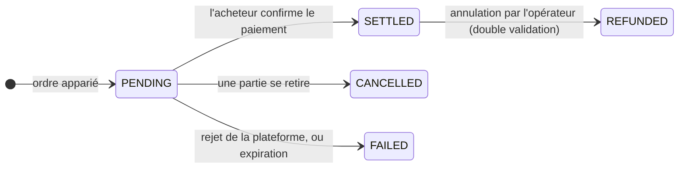

# Étape 4 — Marché secondaire

*Deux ans plus tard, l'un des investisseurs de Nordwind a besoin de liquidités. L'obligation n'arrive à échéance que dans trois ans.*

Il a deux options. Vendre — cette page. Ou emprunter contre son titre et le garder — [la page suivante](repo-lending.md).

---

## Primaire et secondaire, et pourquoi la différence compte

**Marché primaire :** l'émetteur vend aux investisseurs. L'argent parvient à l'émetteur. Cela n'arrive qu'une fois.

**Marché secondaire :** les investisseurs se vendent entre eux. L'argent circule entre investisseurs. Nordwind n'y est pas partie et ne reçoit rien.

Nordwind s'en soucie néanmoins — pour deux raisons faciles à manquer.

D'abord, une obligation que personne ne peut revendre vaut moins qu'une obligation cessible. Les investisseurs exigent un taux plus élevé pour un instrument dont ils ne peuvent pas sortir. **La liquidité est intégrée au prix dès l'émission** : un marché secondaire qui fonctionne rend donc l'emprunt moins cher.

Ensuite, Nordwind reste engagée quant à l'identité des détenteurs finaux. Si l'obligation ne peut être détenue que par des investisseurs professionnels, cette restriction doit survivre à chaque négociation pendant cinq ans, et pas seulement à la première.

---

## Vendre : créer une offre

*Espace Trader → Trading Desk.*

Une **offre** (*listing*) est une proposition de vente : quelle position, combien de titres, à quel prix, et quelles formes de paiement vous acceptez.

| Champ | Signification |
|---|---|
| **Holding** | La position depuis laquelle vous vendez. Seulement des positions que vous détenez réellement. |
| **Quantity** | Combien de titres. Une fraction de la position est possible. |
| **Price per unit** | Votre prix demandé — *pas* la valeur nominale. |
| **Payment options** | Les rails que vous acceptez : stablecoin, LCP, SEPA, etc. |
| **Venue** | Où l'offre est visible. |

!!! tip "Prix et valeur nominale sont deux nombres différents"
    Les titres de Nordwind ont une valeur nominale de 1 000 €. Deux ans plus tard, avec des taux plus élevés qu'à l'émission, un vendeur pourrait proposer **960 €**.

    L'acheteur paie 960 €, perçoit des intérêts calculés sur 1 000 € pendant les trois années restantes, et se voit rembourser 1 000 € à l'échéance. La décote est la façon dont le marché revalorise un coupon de 4,5 % dans un monde qui en attend désormais davantage.

### Plateformes de négociation

Registerwerk n'exploite pas de marché propre. Il se connecte à des plateformes :

| Plateforme | |
|---|---|
| `SIMULATED` | Intégrée. Pour les démonstrations et les tests — exécution immédiate, aucune contrepartie externe. |
| `ASSETERA`, `ARCHAX`, `TALOS` | Connecteurs vers des plateformes réglementées externes. |

La plateforme simulée est celle qu'utilise une installation locale ou de démonstration, et c'est pourquoi les transactions y semblent s'exécuter instantanément. Elle ne prend en charge que les ordres **au marché** et **à cours limité**.

---

## Acheter : la place de marché

*Trading Desk → offres disponibles.* Vous voyez ce que vous avez le droit de voir — une offre portant sur un instrument que vous ne pourriez pas détenir licitement ne vous est pas présentée.

Choisissez une offre, une quantité, un type d'ordre et une option de paiement :

- **Ordre au marché** — accepter le prix affiché.
- **Ordre à cours limité** — indiquer le maximum que vous paierez. Si l'offre est au-dessus, l'ordre est refusé plutôt qu'exécuté à un prix moins favorable.

Puis choisissez le portefeuille de réception : votre valeur par défaut globale, celle définie pour ce type d'actif, l'un de vos points de réception enregistrés, ou une adresse précise.

??? note "Pour les spécialistes : ce qui protège la transaction"

    Plusieurs mécanismes, invisibles tant qu'ils fonctionnent.

    **Verrouillage au niveau de la ligne.** La vérification de disponibilité et le règlement prennent tous deux un `SELECT … FOR UPDATE` sur la ligne. Sans cela, deux acheteurs se présentant simultanément sur la même offre pourraient tous deux passer la vérification et être servis sur un stock ne couvrant qu'un seul d'entre eux — et un double règlement pourrait créditer un acheteur deux fois.

    **Auto-négociation refusée.** Une société ne peut pas acheter sa propre offre.

    **L'option de paiement doit figurer parmi celles acceptées par le vendeur** — l'acheteur ne peut pas imposer un rail.

    **Les échecs sont consignés, pas annulés.** Un rejet par la plateforme levait autrefois une exception et annulait toute la transaction, ne laissant aucune trace de la tentative. Les exécutions rejetées sont désormais persistées avec un motif d'échec, car « il n'existe aucune trace » est une mauvaise réponse à « qu'est devenu mon ordre ? ».

---

## Le règlement : la partie qui porte le risque

Une exécution ne naît pas achevée. Elle naît **`PENDING`**.

`PENDING` signifie : la transaction est convenue, l'argent n'est pas confirmé, et **les titres n'ont pas bougé**. Le vendeur les détient toujours.

Pour régler, l'acheteur fournit une **référence de paiement** — un hachage de transaction stablecoin, une référence SEPA, ce qui atteste le paiement sur le rail choisi. Alors seulement le registre déplace les titres.

!!! warning "Soyez honnête sur ce que prouve une référence de paiement"
    Elle prouve que l'acheteur a *affirmé* avoir payé, et donne au rapprochement quelque chose de concret à vérifier. Ce n'est pas la plateforme qui confirme que l'argent est arrivé.

    Avant l'existence de ce champ, régler n'exigeait rien de plus qu'un clic de l'acheteur — de la pure auto-déclaration, sans rien à auditer. La référence est une amélioration réelle, et reste plus faible qu'une véritable livraison contre paiement.

    Si vous voulez que le titre et les espèces soient réellement conditionnés l'un à l'autre, utilisez un [rail LCP](primary-issuance.md#ou-va-largent) et placez les deux volets sur le même registre.

Les transactions qui restent trop longtemps en `PENDING` expirent automatiquement, afin qu'un ordre dormant ne puisse pas immobiliser indéfiniment les titres d'un vendeur. Une transaction réglée peut être annulée par l'opérateur, mais uniquement en **[double validation](../../compliance/step-up-mfa.md)** — deux personnes distinctes — car défaire un règlement abouti est précisément le genre de pouvoir qui ne devrait jamais reposer sur une seule personne.

---

## Ce que fait la couche de conformité pendant une négociation

Pour un instrument ERC-3643, au moment où les jetons se déplacent :

1. Le portefeuille de l'acheteur est résolu en une identité on-chain.
2. Cette identité est vérifiée quant à des attestations valides d'émetteurs de confiance.
3. Chaque règle de conformité est interrogée — plafonds de titulaires, restrictions géographiques, périodes de blocage.
4. Un seul `false` et **le transfert est annulé.**

En parallèle, hors chaîne, les deux parties sont filtrées contre les listes de sanctions et les informations Travel Rule sont jointes.

Résultat : la restriction de Nordwind — investisseurs professionnels uniquement — est appliquée à la dix-millième négociation exactement comme à la première, sans que Nordwind ait quoi que ce soit à faire. C'est tout l'argument en faveur d'une conformité inscrite dans le jeton.

---

## Ce que cela donne de chaque côté

=== "Vous vendez"

    1. *Trading Desk* → **Create listing**
    2. Choisir la position, la quantité, le prix et les options de paiement acceptées
    3. Attendre. L'offre est visible des acheteurs éligibles.
    4. En cas d'appariement, la transaction passe en `PENDING`
    5. Confirmer la réception du paiement ; l'acheteur règle ; votre position diminue

    Vous pouvez annuler à tout moment avant le règlement.

=== "Vous achetez"

    1. *Trading Desk* → parcourir les offres
    2. Choisir la quantité, le type d'ordre, l'option de paiement et le portefeuille de réception
    3. Exécuter — la transaction passe en `PENDING`
    4. Payer sur le rail convenu
    5. Régler avec la référence de paiement ; les titres arrivent

    Votre KYC doit être à jour et votre portefeuille enregistré *avant* l'étape 2.

=== "Vous êtes l'émetteur"

    Vous ne faites rien. Vous ne pouvez pas bloquer une négociation licite entre titulaires éligibles.

    Ce que vous obtenez, c'est de la visibilité : le registre se met à jour, votre liste de titulaires change, et *Managing your investors* montre qui détient l'obligation désormais.

    [:octicons-arrow-right-24: Gérer vos investisseurs](../issuers/managing-investors.md)

---

## Où vous en êtes

L'obligation a changé de mains. Le registre inscrit un nouveau titulaire, l'ancien dispose de liquidités, l'obligation de Nordwind est inchangée, et les règles de conformité ont tenu d'un bout à l'autre.

Mais vendre n'est pas la seule façon de tirer des liquidités d'une obligation que l'on possède.

[Étape 5 : Pension livrée et financement :octicons-arrow-right-24:](repo-lending.md){ .md-button .md-button--primary }
