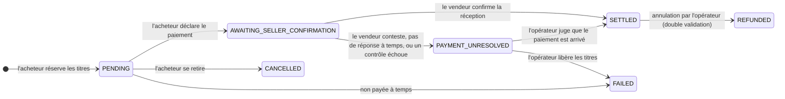

# Étape 4 — Marché secondaire

*Deux ans plus tard, l'un des investisseurs de Nordwind a besoin de liquidités. L'obligation n'arrive à échéance que dans trois ans.*

Il a deux options. Vendre — cette page. Ou emprunter contre son titre et le garder — [la page suivante](repo-lending.md).

---

## Primaire et secondaire, et pourquoi la différence compte

**Marché primaire :** l'émetteur vend aux investisseurs. L'argent parvient à l'émetteur. Cela n'arrive qu'une fois.

**Marché secondaire :** les investisseurs se vendent entre eux. L'argent circule entre investisseurs. Nordwind n'y est pas partie et ne reçoit rien.

Nordwind s'en soucie néanmoins — pour deux raisons faciles à manquer.

D'abord, une obligation que personne ne peut revendre vaut moins qu'une obligation cessible. Les investisseurs exigent un taux plus élevé pour un instrument dont ils ne peuvent pas sortir. **La liquidité est intégrée au prix dès l'émission** : un marché secondaire qui fonctionne rend donc l'emprunt moins cher.

Ensuite, Nordwind reste engagée quant à l'identité des détenteurs finaux. Si l'obligation ne peut être détenue que par des investisseurs professionnels, cette restriction doit survivre à chaque négociation pendant cinq ans, et pas seulement à la première.

---

## Vendre : créer une offre

*Espace Trader → Trading Desk.*

Une **offre** (*listing*) est une proposition de vente : quelle position, combien de titres, à quel prix, et quelles formes de paiement vous acceptez.

| Champ | Signification |
|---|---|
| **Holding** | La position depuis laquelle vous vendez. Seulement des positions que vous détenez réellement. |
| **Quantity** | Combien de titres. Une fraction de la position est possible. |
| **Price per unit** | Votre prix demandé — *pas* la valeur nominale. |
| **Payment options** | Les rails que vous acceptez : stablecoin, LCP, SEPA, etc. |
| **Venue** | Où l'offre est visible. |

!!! tip "Prix et valeur nominale sont deux nombres différents"
    Les titres de Nordwind ont une valeur nominale de 1 000 €. Deux ans plus tard, avec des taux plus élevés qu'à l'émission, un vendeur pourrait proposer **960 €**.

    L'acheteur paie 960 €, perçoit des intérêts calculés sur 1 000 € pendant les trois années restantes, et se voit rembourser 1 000 € à l'échéance. La décote est la façon dont le marché revalorise un coupon de 4,5 % dans un monde qui en attend désormais davantage.

### Plateformes de négociation

Les offres entre pairs intégrées sont un **flux de démonstration du marché secondaire, pas une plateforme de négociation agréée**. Les plateformes externes sont jointes via des adaptateurs :

| Plateforme | |
|---|---|
| `SIMULATED` | Intégrée. Pour les démonstrations et les tests — négocie contre les offres des autres entreprises de la plateforme, aucune contrepartie externe. |
| `ASSETERA`, `ARCHAX`, `TALOS` | Connecteurs vers des plateformes réglementées externes. |

La plateforme simulée est celle qu'utilise une installation locale ou de démonstration. Les transactions y sont réglées comme décrit ci-dessous ; ce n'est que si le vendeur a expressément choisi l'option de démonstration « autoriser le règlement immédiat » sur son offre que l'exécution est immédiate (et sans volet paiement). Elle ne prend en charge que les ordres **au marché** et **à cours limité**.

!!! warning "Devise, arrondi, parties liées et périmètre de la plateforme"
    - **Devise.** Chaque offre porte une devise de règlement. Les options fiat (SEPA, CBMT, Pontes) acceptent les devises autorisées par l'opérateur (EUR par défaut) ; une offre en stablecoin désigne un rail de paiement activé et reprend sa devise. La devise native de la chaîne n'est pas encore prise en charge. Les anciennes offres affichent « devise non enregistrée ».
    - **Arrondi.** Le total est arrondi au plus proche pair (half-even) à la plus petite unité de la devise (EUR : 2 décimales ; rail stablecoin : ses décimales, 6 au plus). Le produit exact et l'arrondi sont conservés avec la transaction ; la confirmation indique la devise.
    - **Parties liées.** Un acheteur et un vendeur liés par un bénéficiaire effectif, un membre ou un portefeuille commun ne peuvent pas traiter ensemble ; la tentative déclenche une alerte. Les groupes au-delà des bénéficiaires communs ne sont pas modélisés. Les transactions entre parties liées (seulement si l'opérateur les autorise) sont signalées et ne fixent jamais le prix de référence, purement indicatif.
    - **Offres bilatérales.** Un vendeur peut adresser une offre à une contrepartie nommée ; personne d'autre ne la voit ni ne l'achète. En production, l'opérateur doit définir une classification (`BILATERAL_ONLY` ou `LICENSED_VENUE`) et référencer un avis juridique ; sinon les offres entre pairs sont refusées.

---

## Acheter : la place de marché

*Trading Desk → offres disponibles.* Vous voyez ce que vous avez le droit de voir — une offre portant sur un instrument que vous ne pourriez pas détenir licitement ne vous est pas présentée.

Choisissez une offre, une quantité, un type d'ordre et une option de paiement :

- **Ordre au marché** — accepter le prix affiché.
- **Ordre à cours limité** — indiquer le maximum que vous paierez. Si l'offre est au-dessus, l'ordre est refusé plutôt qu'exécuté à un prix moins favorable.

Puis choisissez le portefeuille de réception : votre valeur par défaut globale, celle définie pour ce type d'actif, l'un de vos points de réception enregistrés, ou une adresse précise enregistrée pour votre entreprise (point de réception ou portefeuille de membre ; une adresse saisie librement est refusée).

??? note "Pour les spécialistes : ce qui protège la transaction"

    Plusieurs mécanismes, invisibles tant qu'ils fonctionnent.

    **Verrouillage au niveau de la ligne.** La vérification de disponibilité et le règlement prennent tous deux un `SELECT … FOR UPDATE` sur la ligne. Sans cela, deux acheteurs se présentant simultanément sur la même offre pourraient tous deux passer la vérification et être servis sur un stock ne couvrant qu'un seul d'entre eux — et un double règlement pourrait créditer un acheteur deux fois.

    **Auto-négociation refusée.** Une société ne peut pas acheter sa propre offre.

    **L'option de paiement doit figurer parmi celles acceptées par le vendeur** — l'acheteur ne peut pas imposer un rail.

    **Les échecs sont consignés, pas annulés.** Un rejet par la plateforme levait autrefois une exception et annulait toute la transaction, ne laissant aucune trace de la tentative. Les exécutions rejetées sont désormais persistées avec un motif d'échec, car « il n'existe aucune trace » est une mauvaise réponse à « qu'est devenu mon ordre ? ».

---

## Le règlement : la partie qui porte le risque

Une exécution ne naît pas achevée. Un achat ne fait que **réserver** les titres : la transaction est **`PENDING`**.

```mermaid
stateDiagram-v2
    direction LR
    [*] --> PENDING: l'acheteur réserve les titres
    PENDING --> AWAITING_SELLER_CONFIRMATION: l'acheteur déclare le paiement
    PENDING --> CANCELLED: l'acheteur se retire
    PENDING --> FAILED: non payée à temps
    AWAITING_SELLER_CONFIRMATION --> SETTLED: le vendeur confirme la réception
    AWAITING_SELLER_CONFIRMATION --> PAYMENT_UNRESOLVED: le vendeur conteste, pas de réponse à temps, ou un contrôle échoue
    PAYMENT_UNRESOLVED --> SETTLED: l'opérateur juge que le paiement est arrivé
    PAYMENT_UNRESOLVED --> FAILED: l'opérateur libère les titres
    SETTLED --> REFUNDED: annulation par l'opérateur (double validation)
```

`PENDING` signifie : la transaction est convenue, les titres sont **réservés** (le vendeur ne peut pas les proposer ailleurs), l'argent n'est pas confirmé, et **le registre n'a pas bougé**. Avant toute réservation, tous les contrôles s'exécutent : statut, KYC et filtrage des sanctions des *deux* parties, marché cible et plafonds de détention de l'acheteur, titre à l'état émis (`ISSUED`), et inscription du vendeur active et couvrant les titres. Un acheteur ne peut détenir que **3** réservations ouvertes à la fois, une seule par offre, et après un retrait ou une expiration une **période d'attente de 24 heures** s'applique à cette même offre.

L'acheteur paie sur le rail convenu et **déclare le paiement** avec une **référence de paiement** — un hachage de transaction stablecoin, une référence SEPA, ce qui atteste le paiement sur le rail choisi. La transaction passe à `AWAITING_SELLER_CONFIRMATION`. Le registre n'a toujours pas bougé.

**Seule la confirmation du vendeur fait bouger le registre.** Lorsque le vendeur confirme la réception, les contrôles s'exécutent une dernière fois ; s'ils sont satisfaits, les titres passent et la transaction est `SETTLED`. Si un contrôle échoue à cet instant, la transaction n'est *pas* abandonnée en silence : elle passe à `PAYMENT_UNRESOLVED`.

Si le vendeur conteste le paiement ou ne répond pas dans le délai (72 heures ; la tâche d'expiration s'exécute toutes les heures), la transaction passe aussi à **`PAYMENT_UNRESOLVED`** et non à `FAILED`, car l'acheteur a peut-être payé. Les titres restent réservés, l'offre n'est pas remise en vente, et les deux parties peuvent ajouter des notes avec leurs justificatifs. L'opérateur tranche en **double validation** et en indiquant la base juridique : règlement forcé (tous les contrôles sont rejoués), enregistrement de la restitution des fonds à l'acheteur, ou libération des titres lorsque le vendeur établit la non-réception. L'opérateur consigne des preuves ; il ne juge pas le fond du litige.

Seul l'acheteur peut se retirer d'une transaction `PENDING`. Faute de paiement à temps, elle expire (`FAILED`) et les titres retournent à l'offre.

Si l'inscription du vendeur est supprimée ou transférée, si le titre est suspendu (`SUSPENDED`) ou remboursé (`REDEEMED`), ou si une partie quitte la plateforme, les offres sont annulées, les transactions impayées abandonnées et les transactions payées passent à `PAYMENT_UNRESOLVED`. On ne règle jamais contre une inscription supprimée.

!!! note "Installations de démonstration uniquement : règlement immédiat"
    Dans une installation de démonstration, un *vendeur* peut cocher « autoriser le règlement immédiat » sur une offre. Un achat déplace alors le registre sur-le-champ — **sans aucun volet paiement** — et les confirmations portent la mention « SIMULATED - no cash leg ». Ce n'est jamais un vrai règlement ; la plateforme refuse de démarrer en production si l'option est active. L'ancien paramètre d'entreprise de l'*acheteur* n'a plus aucun effet.

!!! warning "Soyez honnête sur ce que prouve une référence de paiement"
    Elle prouve que l'acheteur a *affirmé* avoir payé, et donne au rapprochement quelque chose de concret à vérifier. Ce n'est pas la plateforme qui confirme que l'argent est arrivé.

    Avant l'existence de ce champ, régler n'exigeait rien de plus qu'un clic de l'acheteur — de la pure auto-déclaration, sans rien à auditer. La référence est une amélioration réelle, et reste plus faible qu'une véritable livraison contre paiement.

    Si vous voulez que le titre et les espèces soient réellement conditionnés l'un à l'autre, utilisez un [rail LCP](primary-issuance.md#ou-va-largent) et placez les deux volets sur le même registre.

Une transaction réglée peut être annulée par l'opérateur, mais uniquement en **[double validation](../../compliance/step-up-mfa.md)** — deux personnes distinctes — car défaire un règlement abouti est précisément le genre de pouvoir qui ne devrait jamais reposer sur une seule personne.

---

## Ce que fait la couche de conformité pendant une négociation

Pour un instrument ERC-3643, au moment où les jetons se déplacent :

1. Le portefeuille de l'acheteur est résolu en une identité on-chain.
2. Cette identité est vérifiée quant à des attestations valides d'émetteurs de confiance.
3. Chaque règle de conformité est interrogée — plafonds de titulaires, restrictions géographiques, périodes de blocage.
4. Un seul `false` et **le transfert est annulé.**

En parallèle, hors chaîne, les deux parties sont filtrées contre les listes de sanctions et les informations Travel Rule sont jointes.

Résultat : la restriction de Nordwind — investisseurs professionnels uniquement — est appliquée à la dix-millième négociation exactement comme à la première, sans que Nordwind ait quoi que ce soit à faire. C'est tout l'argument en faveur d'une conformité inscrite dans le jeton.

---

## Ce que cela donne de chaque côté

=== "Vous vendez"

    1. *Trading Desk* → **Create listing**
    2. Choisissez la position, la quantité, le prix et les options de paiement acceptées
    3. Patientez. L'offre est visible des acheteurs éligibles.
    4. Lorsqu'on achète, vos titres sont réservés et la transaction passe à `PENDING`
    5. Vérifiez que le paiement est arrivé et **confirmez** la réception — c'est alors seulement que votre position diminue. S'il n'est pas arrivé, **contestez-le** en motivant ; l'opérateur tranche.

    Vous pouvez annuler une offre à tout moment avant un achat. Seul l'acheteur peut se retirer d'une transaction `PENDING`.

=== "Vous achetez"

    1. *Trading Desk* → parcourez les offres
    2. Choisissez quantité, type d'ordre, option de paiement et portefeuille de réception
    3. Exécutez — les titres sont réservés et la transaction passe à `PENDING`
    4. Payez sur le rail convenu
    5. **Déclarez** le paiement avec sa référence ; le vendeur confirme et les titres arrivent

    Votre KYC doit être à jour et votre portefeuille de réception enregistré pour votre entreprise (point de réception ou portefeuille de membre) *avant* l'étape 2.

=== "Vous êtes l'émetteur"

    Vous ne faites rien. Vous ne pouvez pas bloquer une négociation licite entre titulaires éligibles.

    Ce que vous obtenez, c'est de la visibilité : le registre se met à jour, votre liste de titulaires change, et *Managing your investors* montre qui détient l'obligation désormais.

    [:octicons-arrow-right-24: Gérer vos investisseurs](../issuers/managing-investors.md)

---

## Où vous en êtes

L'obligation a changé de mains. Le registre inscrit un nouveau titulaire, l'ancien dispose de liquidités, l'obligation de Nordwind est inchangée, et les règles de conformité ont tenu d'un bout à l'autre.

Mais vendre n'est pas la seule façon de tirer des liquidités d'une obligation que l'on possède.

[Étape 5 : Pension livrée et financement :octicons-arrow-right-24:](repo-lending.md){ .md-button .md-button--primary }
