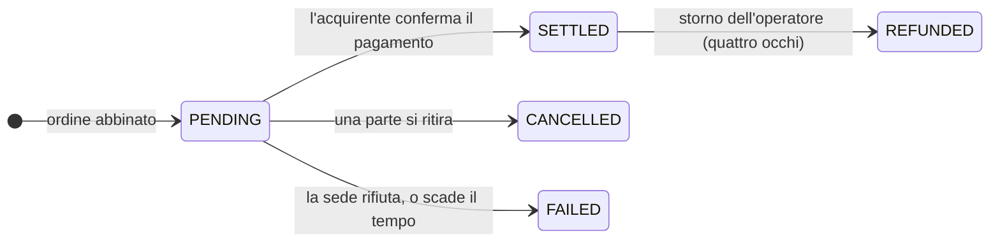

# Fase 4 — Mercato secondario

*Due anni dopo, uno degli investitori di Nordwind ha bisogno di liquidità. L'obbligazione scade solo tra altri tre anni.*

Ha due possibilità. Vendere — questa pagina. Oppure prendere a prestito contro il titolo e tenerselo — [la pagina successiva](repo-lending.md).

---

## Primario e secondario, e perché la differenza conta

**Mercato primario:** l'emittente vende agli investitori. Il denaro arriva all'emittente. Accade una volta sola.

**Mercato secondario:** gli investitori vendono tra loro. Il denaro si muove tra investitori. Nordwind non è parte e non riceve nulla.

A Nordwind interessa comunque — per due motivi facili da trascurare.

Primo, un'obbligazione che nessuno può rivendere vale meno di una cedibile. Gli investitori chiedono un tasso più alto per uno strumento da cui non possono uscire. **La liquidità viene prezzata già in emissione**, quindi un mercato secondario funzionante rende più economico l'indebitamento.

Secondo, Nordwind resta esposta a chi finirà per detenere il titolo. Se l'obbligazione può essere detenuta solo da investitori professionali, quella restrizione deve sopravvivere a ogni negoziazione per cinque anni, non solo alla prima.

---

## Vendere: creare una proposta

*Area Trader → Trading Desk.*

Una **proposta di vendita** (*listing*) è un'offerta: quale posizione, quanti titoli, a quale prezzo e quali forme di pagamento accetti.

| Campo | Significato |
|---|---|
| **Holding** | Da quale posizione stai vendendo. Solo posizioni che detieni davvero. |
| **Quantity** | Quanti titoli. Anche una parte della posizione. |
| **Price per unit** | Il tuo prezzo richiesto — *non* il valore nominale. |
| **Payment options** | Quali binari accetti: stablecoin, consegna contro pagamento, SEPA e così via. |
| **Venue** | Dove la proposta è visibile. |

!!! tip "Prezzo e valore nominale sono numeri diversi"
    I titoli Nordwind hanno un valore nominale di 1.000 €. Due anni dopo, con tassi più alti di quelli dell'emissione, un venditore potrebbe proporre **960 €**.

    L'acquirente paga 960 €, incassa interessi calcolati su 1.000 € per i tre anni residui e riceve 1.000 € a scadenza. Lo sconto è il modo in cui il mercato riprezza una cedola del 4,5 % in un mondo che ormai si aspetta di più.

### Sedi di negoziazione

Registerwerk non gestisce un mercato proprio. Si collega a sedi esterne:

| Sede | |
|---|---|
| `SIMULATED` | Integrata. Per dimostrazioni e test — esegue subito, nessuna controparte esterna. |
| `ASSETERA`, `ARCHAX`, `TALOS` | Connettori verso sedi regolamentate esterne. |

La sede simulata è quella usata da un'installazione locale o dimostrativa, ed è il motivo per cui lì le operazioni sembrano eseguirsi all'istante. Supporta solo ordini **al mercato** e **con limite di prezzo**.

---

## Comprare: il marketplace

*Trading Desk → proposte disponibili.* Vedi ciò che ti è consentito vedere: una proposta relativa a uno strumento che non potresti detenere legittimamente non ti viene mostrata.

Scegli una proposta, una quantità, un tipo di ordine e un'opzione di pagamento:

- **Ordine al mercato** — accetti il prezzo esposto.
- **Ordine con limite** — indichi il massimo che pagheresti. Se la proposta è superiore, l'ordine viene rifiutato anziché eseguito a un prezzo peggiore.

Poi scegli il wallet di ricezione: la tua impostazione predefinita globale, quella per quel tipo di asset, uno dei tuoi endpoint registrati o un indirizzo specifico.

??? note "Per gli specialisti: che cosa protegge l'operazione"

    Diversi meccanismi, invisibili finché funzionano.

    **Blocco a livello di riga.** Sia il controllo di disponibilità sia il regolamento acquisiscono un `SELECT … FOR UPDATE` sulla riga. Senza, due acquirenti che colpiscono la stessa proposta nello stesso istante potrebbero superare entrambi il controllo ed essere serviti da una giacenza che basta per uno solo — e un doppio regolamento potrebbe accreditare due volte un acquirente.

    **Auto-negoziazione rifiutata.** Una società non può comprare la propria proposta.

    **L'opzione di pagamento deve essere tra quelle accettate dal venditore** — l'acquirente non può imporre un binario.

    **I fallimenti vengono registrati, non annullati.** Un rifiuto della sede un tempo sollevava un'eccezione e annullava l'intera transazione, senza lasciare traccia del tentativo. Le esecuzioni rifiutate vengono ora salvate con la motivazione, perché «non c'è alcuna traccia» è una pessima risposta a «che fine ha fatto il mio ordine?».

---

## Il regolamento: la parte che porta il rischio

Un'esecuzione non nasce completa. Nasce **`PENDING`**.

`PENDING` significa: l'operazione è concordata, il denaro non è confermato e **i titoli non si sono mossi**. Il venditore li detiene ancora.

Per regolare, l'acquirente fornisce un **riferimento di pagamento** — un hash di transazione stablecoin, un riferimento SEPA, qualunque cosa attesti il pagamento sul binario scelto. Solo allora il registro muove i titoli.

!!! warning "Sii onesto su che cosa prova un riferimento di pagamento"
    Prova che l'acquirente ha *dichiarato* un pagamento e dà alla riconciliazione qualcosa di concreto da verificare. Non è la piattaforma che conferma l'arrivo del denaro.

    Prima che questo campo esistesse, regolare non richiedeva altro che un clic dell'acquirente — pura autodichiarazione, senza nulla da controllare. Il riferimento è un miglioramento reale, e resta più debole di una vera consegna contro pagamento.

    Se vuoi che titolo e denaro siano davvero condizionati l'uno all'altro, usa un [binario a consegna contro pagamento](primary-issuance.md#dove-va-il-denaro) e metti entrambe le gambe sullo stesso registro.

Le operazioni che restano troppo a lungo in `PENDING` scadono automaticamente, così un ordine dormiente non può tenere bloccati indefinitamente i titoli di un venditore. Un'operazione regolata può essere stornata dall'operatore, ma solo con il **[principio dei quattro occhi](../../compliance/step-up-mfa.md)** — due persone diverse — perché disfare un regolamento concluso è esattamente il tipo di potere che non dovrebbe mai stare in capo a una sola persona.

---

## Che cosa fa lo strato di conformità durante una negoziazione

Per uno strumento ERC-3643, nel momento in cui i token si muovono:

1. Il wallet dell'acquirente viene risolto in un'identità on-chain.
2. Quell'identità viene verificata per claim validi di emittenti fidati.
3. Ogni regola di conformità viene interrogata — limiti di titolari, restrizioni per paese, periodi di lock-up.
4. Un solo `false` e **il trasferimento viene annullato.**

In parallelo, off-chain, entrambe le parti vengono sottoposte a screening sanzioni e vengono allegate le informazioni Travel Rule.

L'effetto è che la restrizione di Nordwind — solo investitori professionali — viene imposta alla decimillesima negoziazione esattamente come alla prima, senza che Nordwind faccia nulla. È l'intero argomento a favore della conformità inserita nel token.

---

## Come si presenta da ciascun lato

=== "Stai vendendo"

    1. *Trading Desk* → **Create listing**
    2. Scegli posizione, quantità, prezzo e opzioni di pagamento accettate
    3. Aspetta. La proposta è visibile agli acquirenti idonei.
    4. All'abbinamento, l'operazione passa a `PENDING`
    5. Conferma l'arrivo del pagamento; l'acquirente regola; la tua posizione cala

    Puoi annullare in qualsiasi momento prima del regolamento.

=== "Stai comprando"

    1. *Trading Desk* → sfoglia le proposte
    2. Scegli quantità, tipo di ordine, opzione di pagamento e wallet di ricezione
    3. Esegui — l'operazione passa a `PENDING`
    4. Paga sul binario concordato
    5. Regola con il riferimento di pagamento; i titoli arrivano

    Il tuo KYC deve essere in corso di validità e il wallet registrato *prima* del passaggio 2.

=== "Sei l'emittente"

    Non fai nulla. Non puoi bloccare una negoziazione lecita tra titolari idonei.

    Quello che ottieni è visibilità: il registro si aggiorna, la tua lista dei titolari cambia e *Managing your investors* mostra chi detiene ora l'obbligazione.

    [:octicons-arrow-right-24: Gestire gli investitori](../issuers/managing-investors.md)

---

## Dove sei

L'obbligazione ha cambiato mano. Il registro riporta un nuovo titolare, il vecchio ha liquidità, l'obbligazione di Nordwind è invariata e le regole di conformità hanno tenuto per tutto il percorso.

Ma vendere non è l'unico modo di ricavare liquidità da un'obbligazione che possiedi.

[Fase 5: Pronti contro termine e finanziamento :octicons-arrow-right-24:](repo-lending.md){ .md-button .md-button--primary }
