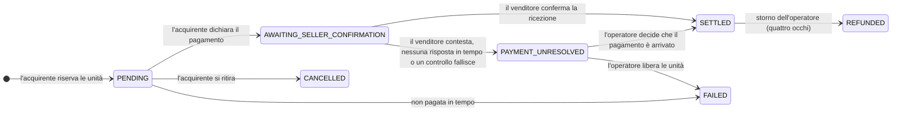

# Fase 4 — Mercato secondario

*Due anni dopo, uno degli investitori di Nordwind ha bisogno di liquidità. L'obbligazione scade solo tra altri tre anni.*

Ha due possibilità. Vendere — questa pagina. Oppure prendere a prestito contro il titolo e tenerselo — [la pagina successiva](repo-lending.md).

---

## Primario e secondario, e perché la differenza conta

**Mercato primario:** l'emittente vende agli investitori. Il denaro arriva all'emittente. Accade una volta sola.

**Mercato secondario:** gli investitori vendono tra loro. Il denaro si muove tra investitori. Nordwind non è parte e non riceve nulla.

A Nordwind interessa comunque — per due motivi facili da trascurare.

Primo, un'obbligazione che nessuno può rivendere vale meno di una cedibile. Gli investitori chiedono un tasso più alto per uno strumento da cui non possono uscire. **La liquidità viene prezzata già in emissione**, quindi un mercato secondario funzionante rende più economico l'indebitamento.

Secondo, Nordwind resta esposta a chi finirà per detenere il titolo. Se l'obbligazione può essere detenuta solo da investitori professionali, quella restrizione deve sopravvivere a ogni negoziazione per cinque anni, non solo alla prima.

---

## Vendere: creare una proposta

*Area Trader → Trading Desk.*

Una **proposta di vendita** (*listing*) è un'offerta: quale posizione, quanti titoli, a quale prezzo e quali forme di pagamento accetti.

| Campo | Significato |
|---|---|
| **Holding** | Da quale posizione stai vendendo. Solo posizioni che detieni davvero. |
| **Quantity** | Quanti titoli. Anche una parte della posizione. |
| **Price per unit** | Il tuo prezzo richiesto — *non* il valore nominale. |
| **Payment options** | Quali binari accetti: stablecoin, consegna contro pagamento, SEPA e così via. |
| **Venue** | Dove la proposta è visibile. |

!!! tip "Prezzo e valore nominale sono numeri diversi"
    I titoli Nordwind hanno un valore nominale di 1.000 €. Due anni dopo, con tassi più alti di quelli dell'emissione, un venditore potrebbe proporre **960 €**.

    L'acquirente paga 960 €, incassa interessi calcolati su 1.000 € per i tre anni residui e riceve 1.000 € a scadenza. Lo sconto è il modo in cui il mercato riprezza una cedola del 4,5 % in un mondo che ormai si aspetta di più.

### Sedi di negoziazione

Le proposte tra pari integrate sono un **flusso dimostrativo del mercato secondario, non una sede di negoziazione autorizzata**. Le sedi esterne si raggiungono tramite adattatori:

| Sede | |
|---|---|
| `SIMULATED` | Integrata. Per dimostrazioni e test — negozia contro le proposte di altre aziende della piattaforma, nessuna controparte esterna. |
| `ASSETERA`, `ARCHAX`, `TALOS` | Connettori verso sedi regolamentate esterne. |

La sede simulata è quella usata da un'installazione locale o dimostrativa. Le operazioni vi si regolano come descritto sotto; solo se il venditore ha scelto espressamente sulla sua proposta l'opzione dimostrativa «consenti regolamento immediato» l'esecuzione è immediata (e senza componente di pagamento). Supporta solo ordini **al mercato** e **con limite di prezzo**.

!!! warning "Valuta, arrotondamento, parti correlate e perimetro della sede"
    - **Valuta.** Ogni proposta ha una valuta di regolamento. Le opzioni fiat (SEPA, CBMT, Pontes) accettano le valute consentite dall'operatore (EUR di default); una proposta in stablecoin indica un canale di pagamento attivo e ne assume la valuta. La valuta nativa della chain non è ancora supportata. Le proposte più vecchie mostrano «valuta non registrata».
    - **Arrotondamento.** Il totale è arrotondato half-even all'unità minore della valuta (EUR: 2 decimali; canale stablecoin: i suoi decimali, al massimo 6). Il prodotto esatto e l'arrotondamento sono salvati con l'operazione; la conferma indica la valuta.
    - **Parti correlate.** Acquirente e venditore collegati da un titolare effettivo, un membro o un wallet in comune non possono negoziare tra loro; il tentativo genera un allarme. I gruppi oltre i titolari effettivi comuni non sono modellati. Le operazioni tra parti correlate (solo se l'operatore le consente) sono segnalate e non fissano mai il prezzo di riferimento, solo indicativo.
    - **Proposte bilaterali.** Un venditore può indirizzare una proposta a una controparte nominata; nessun altro la vede o la acquista. In produzione l'operatore deve impostare una classificazione (`BILATERAL_ONLY` o `LICENSED_VENUE`) e citare un parere legale; altrimenti le proposte tra pari sono rifiutate.

---

## Comprare: il marketplace

*Trading Desk → proposte disponibili.* Vedi ciò che ti è consentito vedere: una proposta relativa a uno strumento che non potresti detenere legittimamente non ti viene mostrata.

Scegli una proposta, una quantità, un tipo di ordine e un'opzione di pagamento:

- **Ordine al mercato** — accetti il prezzo esposto.
- **Ordine con limite** — indichi il massimo che pagheresti. Se la proposta è superiore, l'ordine viene rifiutato anziché eseguito a un prezzo peggiore.

Poi scegli il wallet di ricezione: la tua impostazione predefinita globale, quella per quel tipo di asset, uno dei tuoi endpoint registrati o un indirizzo specifico registrato per la tua azienda (endpoint o wallet di membro; gli indirizzi digitati liberamente vengono rifiutati).

??? note "Per gli specialisti: che cosa protegge l'operazione"

    Diversi meccanismi, invisibili finché funzionano.

    **Blocco a livello di riga.** Sia il controllo di disponibilità sia il regolamento acquisiscono un `SELECT … FOR UPDATE` sulla riga. Senza, due acquirenti che colpiscono la stessa proposta nello stesso istante potrebbero superare entrambi il controllo ed essere serviti da una giacenza che basta per uno solo — e un doppio regolamento potrebbe accreditare due volte un acquirente.

    **Auto-negoziazione rifiutata.** Una società non può comprare la propria proposta.

    **L'opzione di pagamento deve essere tra quelle accettate dal venditore** — l'acquirente non può imporre un binario.

    **I fallimenti vengono registrati, non annullati.** Un rifiuto della sede un tempo sollevava un'eccezione e annullava l'intera transazione, senza lasciare traccia del tentativo. Le esecuzioni rifiutate vengono ora salvate con la motivazione, perché «non c'è alcuna traccia» è una pessima risposta a «che fine ha fatto il mio ordine?».

---

## Il regolamento: la parte che porta il rischio

Un'esecuzione non nasce completa. Un acquisto **riserva** soltanto le unità: l'operazione è **`PENDING`**.

```mermaid
stateDiagram-v2
    direction LR
    [*] --> PENDING: l'acquirente riserva le unità
    PENDING --> AWAITING_SELLER_CONFIRMATION: l'acquirente dichiara il pagamento
    PENDING --> CANCELLED: l'acquirente si ritira
    PENDING --> FAILED: non pagata in tempo
    AWAITING_SELLER_CONFIRMATION --> SETTLED: il venditore conferma la ricezione
    AWAITING_SELLER_CONFIRMATION --> PAYMENT_UNRESOLVED: il venditore contesta, nessuna risposta in tempo o un controllo fallisce
    PAYMENT_UNRESOLVED --> SETTLED: l'operatore decide che il pagamento è arrivato
    PAYMENT_UNRESOLVED --> FAILED: l'operatore libera le unità
    SETTLED --> REFUNDED: storno dell'operatore (quattro occhi)
```

`PENDING` significa: l'operazione è concordata, le unità sono **riservate** (il venditore non può offrirle altrove), il denaro non è confermato e **il registro non si è mosso**. Prima di riservare vengono eseguiti tutti i controlli: stato, KYC e verifica delle sanzioni di *entrambe* le parti, mercato di riferimento e limiti di detenzione dell'acquirente, strumento emesso (`ISSUED`), iscrizione del venditore attiva e capiente. Un acquirente può avere al massimo **3** prenotazioni aperte contemporaneamente, una sola per proposta, e dopo un ritiro o una scadenza vale per la stessa proposta un **periodo di attesa di 24 ore**.

L'acquirente paga sul canale concordato e **dichiara il pagamento** con un **riferimento di pagamento** — un hash di transazione stablecoin, un riferimento SEPA, ciò che documenta il pagamento sul canale scelto. L'operazione passa a `AWAITING_SELLER_CONFIRMATION`. Il registro non si è ancora mosso.

**Solo la conferma del venditore muove il registro.** Quando il venditore conferma la ricezione, i controlli vengono eseguiti un'ultima volta; se sono superati, le unità passano e l'operazione è `SETTLED`. Se un controllo fallisce in quel momento, l'operazione *non* viene scartata in silenzio: passa a `PAYMENT_UNRESOLVED`.

Se il venditore contesta il pagamento o non risponde entro il termine (72 ore; il job di scadenza gira ogni ora), l'operazione passa anch'essa a **`PAYMENT_UNRESOLVED`** e non a `FAILED`, perché l'acquirente potrebbe aver pagato. Le unità restano riservate, la proposta non viene rimessa in vendita ed entrambe le parti possono aggiungere note con le prove. L'operatore decide secondo il **principio dei quattro occhi** e indicando la base giuridica: regolamento forzato (tutti i controlli vengono rieseguiti), registrazione della restituzione dei fondi all'acquirente, oppure rilascio delle unità quando il venditore dimostra il mancato accredito. L'operatore raccoglie le prove; non giudica nel merito.

Solo l'acquirente può ritirarsi da un'operazione `PENDING`. Se non viene pagata in tempo, scade (`FAILED`) e le unità tornano alla proposta.

Se l'iscrizione del venditore viene rimossa o trasferita, lo strumento viene sospeso (`SUSPENDED`) o rimborsato (`REDEEMED`), o una parte lascia la piattaforma, le proposte vengono annullate, le operazioni non pagate revocate e quelle pagate passano a `PAYMENT_UNRESOLVED`. Non si regola mai contro un'iscrizione rimossa.

!!! note "Solo nelle installazioni dimostrative: regolamento immediato"
    In un'installazione dimostrativa un *venditore* può spuntare «consenti regolamento immediato» su una proposta. Un acquisto sposta allora il registro subito — **senza alcuna componente di pagamento** — e le conferme riportano la dicitura «SIMULATED - no cash leg». Non è mai un regolamento reale; la piattaforma rifiuta di avviarsi in produzione se l'opzione è attiva. La precedente impostazione aziendale dell'*acquirente* non ha più alcun effetto.

!!! warning "Sii onesto su che cosa prova un riferimento di pagamento"
    Prova che l'acquirente ha *dichiarato* un pagamento e dà alla riconciliazione qualcosa di concreto da verificare. Non è la piattaforma che conferma l'arrivo del denaro.

    Prima che questo campo esistesse, regolare non richiedeva altro che un clic dell'acquirente — pura autodichiarazione, senza nulla da controllare. Il riferimento è un miglioramento reale, e resta più debole di una vera consegna contro pagamento.

    Se vuoi che titolo e denaro siano davvero condizionati l'uno all'altro, usa un [binario a consegna contro pagamento](primary-issuance.md#dove-va-il-denaro) e metti entrambe le gambe sullo stesso registro.

Un'operazione regolata può essere stornata dall'operatore, ma solo secondo il **[principio dei quattro occhi](../../compliance/step-up-mfa.md)** — due persone distinte — perché annullare un regolamento concluso è proprio il tipo di potere che non dovrebbe mai spettare a una sola persona.

---

## Che cosa fa lo strato di conformità durante una negoziazione

Per uno strumento ERC-3643, nel momento in cui i token si muovono:

1. Il wallet dell'acquirente viene risolto in un'identità on-chain.
2. Quell'identità viene verificata per claim validi di emittenti fidati.
3. Ogni regola di conformità viene interrogata — limiti di titolari, restrizioni per paese, periodi di lock-up.
4. Un solo `false` e **il trasferimento viene annullato.**

In parallelo, off-chain, entrambe le parti vengono sottoposte a screening sanzioni e vengono allegate le informazioni Travel Rule.

L'effetto è che la restrizione di Nordwind — solo investitori professionali — viene imposta alla decimillesima negoziazione esattamente come alla prima, senza che Nordwind faccia nulla. È l'intero argomento a favore della conformità inserita nel token.

---

## Come si presenta da ciascun lato

=== "Stai vendendo"

    1. *Trading Desk* → **Create listing**
    2. Scegli la posizione, la quantità, il prezzo e le opzioni di pagamento accettate
    3. Attendi. La proposta è visibile agli acquirenti idonei.
    4. Quando qualcuno acquista, le tue unità sono riservate e l'operazione passa a `PENDING`
    5. Verifica che il pagamento sia arrivato e **conferma** la ricezione — solo allora la tua posizione diminuisce. Se non è arrivato, **contestalo** motivando; decide l'operatore.

    Puoi annullare una proposta in qualsiasi momento prima di un acquisto. Solo l'acquirente può ritirarsi da un'operazione `PENDING`.

=== "Stai comprando"

    1. *Trading Desk* → sfoglia le proposte
    2. Scegli quantità, tipo di ordine, opzione di pagamento e wallet di ricezione
    3. Esegui — le unità vengono riservate e l'operazione passa a `PENDING`
    4. Paga sul canale concordato
    5. **Dichiara** il pagamento con il riferimento; il venditore conferma e le unità arrivano

    Il tuo KYC deve essere in corso di validità e il wallet di ricezione registrato per la tua azienda (endpoint o wallet di membro) *prima* del passaggio 2.

=== "Sei l'emittente"

    Non fai nulla. Non puoi bloccare una negoziazione lecita tra titolari idonei.

    Quello che ottieni è visibilità: il registro si aggiorna, la tua lista dei titolari cambia e *Managing your investors* mostra chi detiene ora l'obbligazione.

    [:octicons-arrow-right-24: Gestire gli investitori](../issuers/managing-investors.md)

---

## Dove sei

L'obbligazione ha cambiato mano. Il registro riporta un nuovo titolare, il vecchio ha liquidità, l'obbligazione di Nordwind è invariata e le regole di conformità hanno tenuto per tutto il percorso.

Ma vendere non è l'unico modo di ricavare liquidità da un'obbligazione che possiedi.

[Fase 5: Pronti contro termine e finanziamento :octicons-arrow-right-24:](repo-lending.md){ .md-button .md-button--primary }
