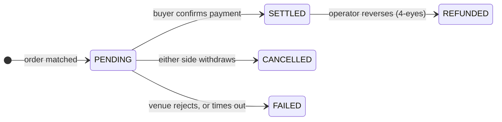

# Stage 4 — Secondary trading

*Two years in, one of Nordwind's investors needs cash. The bond does not mature for another three years.*

They have two options. Sell it — this page. Or borrow against it and keep it — [the next page](repo-lending.md).

---

## Primary and secondary, and why the difference matters

**Primary market:** the issuer sells to investors. Money reaches the issuer. Happens once.

**Secondary market:** investors sell to each other. Money moves between investors. Nordwind is not a party and receives nothing.

Nordwind still cares, though — for two reasons that are easy to miss.

First, a bond nobody can sell is worth less than one they can. Investors demand a higher interest rate for an instrument they cannot exit. **Liquidity is priced in at issuance**, so a functioning secondary market makes borrowing cheaper.

Second, Nordwind is on the hook for who ends up holding it. If the bond may only be held by professional investors, that restriction has to survive every trade for five years, not just the first one.

---

## Selling: create a listing

*Trader workspace → Trading Desk.*

A **listing** is an offer to sell: which holding, how many units, at what price, and which forms of payment you will accept.

| Field | Meaning |
|---|---|
| **Holding** | Which position you are selling from. Only holdings you actually have. |
| **Quantity** | How many units. Can be part of a position. |
| **Price per unit** | Your asking price — *not* the face value. |
| **Payment options** | Which rails you accept: stablecoin, DvP, SEPA, and so on. |
| **Venue** | Where the offer is visible. |

!!! tip "Price and face value are different numbers"
    Nordwind's units have a face value of €1,000. Two years on, with rates higher than when it was issued, a seller might list at **€960**.

    The buyer pays €960, receives interest on €1,000 for the remaining three years, and is repaid €1,000 at maturity. The discount is how the market re-prices a 4.5% coupon in a world that now expects more.

### Venues

Registerwerk does not run a market of its own. It connects to venues:

| Venue | |
|---|---|
| `SIMULATED` | Built in. For demos and testing — matches instantly, no external counterparty. |
| `ASSETERA`, `ARCHAX`, `TALOS` | Adapters for external regulated venues. |

The simulated venue is what a local or demo deployment uses, and it is why trades appear to fill immediately there. It supports **market** and **limit** orders only.

---

## Buying: the marketplace

*Trading Desk → available offers.* You see what you are permitted to see — an offer for an instrument you could not lawfully hold is not shown to you.

Choose an offer, a quantity, an order type, and a payment option:

- **Market order** — take the listed price.
- **Limit order** — specify the most you will pay. If the listing is above it, the order is refused rather than filled at a worse price.

Then pick the wallet to receive into: your global default, your default for that asset type, one of your registered endpoints, or a specific address.

??? note "For the specialist: what protects the trade"

    Several things that are invisible when they work.

    **Row-level locking.** Both the availability check and the settlement take a `SELECT … FOR UPDATE` on the row. Without it, two buyers hitting the same listing simultaneously could both pass the availability check and both be filled from stock that only covers one — and a double-settlement could credit a buyer twice.

    **Self-dealing refused.** A company cannot buy its own listing.

    **Payment option must be one the seller accepts** — the buyer cannot impose a rail.

    **Failures are recorded, not rolled back.** A venue rejection used to throw and roll the whole transaction back, leaving no evidence the attempt happened. Rejected executions are now persisted with a failure reason, because "there is no record" is a bad answer to "what happened to my order".

---

## Settlement: the part that carries the risk

An execution does not start life complete. It starts **`PENDING`**.

`PENDING` means: the trade is agreed, the money has not been confirmed, and **the securities have not moved**. The seller still holds them.

To settle, the buyer supplies a **payment reference** — a stablecoin transaction hash, a SEPA reference, whatever evidences the payment on the rail they chose. Only then does the register move the units.

!!! warning "Be honest about what a payment reference proves"
    It proves the buyer *asserted* a payment, and it gives reconciliation something concrete to check. It is not the platform verifying that money arrived.

    Before this field existed, settling required nothing beyond the buyer clicking a button — pure self-attestation with nothing to audit. The reference is a meaningful improvement over that, and still weaker than true delivery-versus-payment.

    If you want the security and the cash to be genuinely conditional on each other, use a [DvP rail](primary-issuance.md#where-the-money-goes) and put both legs on the same ledger.

Trades that sit `PENDING` too long are timed out automatically, so a stale order cannot hold a seller's units hostage indefinitely. A settled trade can be reversed by the operator, but only as a **[four-eyes](../../compliance/step-up-mfa.md)** action — two different people — because unwinding a completed settlement is exactly the kind of power that should never rest with one person.

---

## What the compliance layer does during a trade

For an ERC-3643 instrument, at the moment the tokens move:

1. The buyer's wallet is resolved to an on-chain identity.
2. That identity is checked for valid claims from trusted issuers.
3. Every compliance rule is asked — holder caps, country restrictions, lock-ups.
4. Any `false` and **the transfer reverts.**

In parallel, off-chain, both parties are screened against sanctions lists and Travel Rule information is attached.

The effect is that Nordwind's restriction — professional investors only — is enforced on the ten-thousandth trade exactly as on the first, without Nordwind doing anything. That is the whole argument for putting compliance in the token.

---

## What this looks like from each side

=== "You are selling"

    1. *Trading Desk* → **Create listing**
    2. Pick the holding, quantity, price, accepted payment options
    3. Wait. The listing is visible to eligible buyers.
    4. On a match, the trade goes `PENDING`
    5. Confirm payment arrived; the buyer settles; your position decreases

    Cancel any time before settlement.

=== "You are buying"

    1. *Trading Desk* → browse offers
    2. Choose quantity, order type, payment option, receiving wallet
    3. Execute — the trade goes `PENDING`
    4. Pay on the agreed rail
    5. Settle with the payment reference; the units arrive

    Your KYC must be current and your wallet registered *before* step 2.

=== "You are the issuer"

    You do nothing. You cannot block a lawful trade between eligible holders.

    What you get is visibility: the register updates, your holder list changes, and *Managing your investors* shows who holds the bond now.

    [:octicons-arrow-right-24: Managing your investors](../issuers/managing-investors.md)

---

## Where you are

The bond has changed hands. The register records a new holder, the old holder has cash, Nordwind's obligation is unchanged, and the compliance rules held throughout.

But selling is not the only way to raise cash from a bond you own.

[Stage 5a: Repo trading :octicons-arrow-right-24:](repo-trading.md){ .md-button .md-button--primary }
