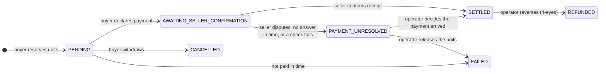

# Stage 4 — Secondary trading

*Two years in, one of Nordwind's investors needs cash. The bond does not mature for another three years.*

They have two options. Sell it — this page. Or borrow against it and keep it — [the next page](repo-lending.md).

---

## Primary and secondary, and why the difference matters

**Primary market:** the issuer sells to investors. Money reaches the issuer. Happens once.

**Secondary market:** investors sell to each other. Money moves between investors. Nordwind is not a party and receives nothing.

Nordwind still cares, though — for two reasons that are easy to miss.

First, a bond nobody can sell is worth less than one they can. Investors demand a higher interest rate for an instrument they cannot exit. **Liquidity is priced in at issuance**, so a functioning secondary market makes borrowing cheaper.

Second, Nordwind is on the hook for who ends up holding it. If the bond may only be held by professional investors, that restriction has to survive every trade for five years, not just the first one.

---

## Selling: create a listing

*Trader workspace → Trading Desk.*

A **listing** is an offer to sell: which holding, how many units, at what price, and which forms of payment you will accept.

| Field | Meaning |
|---|---|
| **Holding** | Which position you are selling from. Only holdings you actually have. |
| **Quantity** | How many units. Can be part of a position. |
| **Price per unit** | Your asking price — *not* the face value. |
| **Payment options** | Which rails you accept: stablecoin, DvP, SEPA, and so on. |
| **Venue** | Where the offer is visible. |

!!! tip "Price and face value are different numbers"
    Nordwind's units have a face value of €1,000. Two years on, with rates higher than when it was issued, a seller might list at **€960**.

    The buyer pays €960, receives interest on €1,000 for the remaining three years, and is repaid €1,000 at maturity. The discount is how the market re-prices a 4.5% coupon in a world that now expects more.

### Venues

The built-in peer listings are a **demonstration secondary-market workflow, not an authorised trading venue**. External venues are reached through adapters:

| Venue | |
|---|---|
| `SIMULATED` | Built in. For demos and testing — trades against other companies' listings on the platform, no external counterparty. |
| `ASSETERA`, `ARCHAX`, `TALOS` | Adapters for external regulated venues. |

The simulated venue is what a local or demo deployment uses. Trades there settle as described below; only when the seller has explicitly chosen the demo option "allow instant settlement" on their listing does a trade fill immediately (and then with no cash leg). It supports **market** and **limit** orders only.

!!! warning "Currency, rounding, related parties and the venue perimeter"
    - **Currency.** Every listing carries a settlement currency. Fiat options (SEPA, CBMT, Pontes) accept the currencies the operator allows (default EUR); a stablecoin listing names an enabled payment rail and takes its currency. Native chain currency is not supported yet. Older listings show "currency not recorded".
    - **Rounding.** The total is rounded half-even to the currency's minor unit (EUR: 2 decimals; stablecoin rail: its decimals, at most 6). The exact product and the rounding are stored with the trade, and the confirmation states the currency.
    - **Related parties.** A buyer and seller linked by a shared beneficial owner, a shared member or a shared wallet cannot trade with each other; the attempt raises an alert. Corporate groups beyond shared owners are not modelled. Trades between related parties (only if the operator allows them) are flagged and never set the reference price, which is indicative only.
    - **Bilateral listings.** A seller may address a listing to one named counterparty; nobody else can see or buy it. In production the operator must set a venue classification (`BILATERAL_ONLY` or `LICENSED_VENUE`) and reference a legal opinion; otherwise peer listings are refused.

---

## Buying: the marketplace

*Trading Desk → available offers.* You see what you are permitted to see — an offer for an instrument you could not lawfully hold is not shown to you.

Choose an offer, a quantity, an order type, and a payment option:

- **Market order** — take the listed price.
- **Limit order** — specify the most you will pay. If the listing is above it, the order is refused rather than filled at a worse price.

Then pick the wallet to receive into: your global default, your default for that asset type, one of your registered endpoints, or a specific address registered for your company (endpoint or member wallet; a freely typed address is rejected).

??? note "For the specialist: what protects the trade"

    Several things that are invisible when they work.

    **Row-level locking.** Both the availability check and the settlement take a `SELECT … FOR UPDATE` on the row. Without it, two buyers hitting the same listing simultaneously could both pass the availability check and both be filled from stock that only covers one — and a double-settlement could credit a buyer twice.

    **Self-dealing refused.** A company cannot buy its own listing.

    **Payment option must be one the seller accepts** — the buyer cannot impose a rail.

    **Failures are recorded, not rolled back.** A venue rejection used to throw and roll the whole transaction back, leaving no evidence the attempt happened. Rejected executions are now persisted with a failure reason, because "there is no record" is a bad answer to "what happened to my order".

---

## Settlement: the part that carries the risk

A trade does not start life complete. Buying only **reserves** the units: the trade is **`PENDING`**.

```mermaid
stateDiagram-v2
    direction LR
    [*] --> PENDING: buyer reserves units
    PENDING --> AWAITING_SELLER_CONFIRMATION: buyer declares payment
    PENDING --> CANCELLED: buyer withdraws
    PENDING --> FAILED: not paid in time
    AWAITING_SELLER_CONFIRMATION --> SETTLED: seller confirms receipt
    AWAITING_SELLER_CONFIRMATION --> PAYMENT_UNRESOLVED: seller disputes, no answer in time, or a check fails
    PAYMENT_UNRESOLVED --> SETTLED: operator decides the payment arrived
    PAYMENT_UNRESOLVED --> FAILED: operator releases the units
    SETTLED --> REFUNDED: operator reverses (4-eyes)
```

`PENDING` means: the trade is agreed, the units are **reserved** (the seller cannot offer them elsewhere), the money is not confirmed, and **the register has not moved**. Before anything is reserved, every check runs: status, KYC and sanctions screening of *both* parties, the buyer's target market and holding limits, the asset must be issued (`ISSUED`), and the seller's register entry must be active and cover the units. A buyer may hold at most **3** open reservations at once, one per listing, and after a withdrawal or a lapse a **24-hour cool-down** applies to that same listing.

The buyer pays on the agreed rail and **declares the payment** with a **payment reference** — a stablecoin transaction hash, a SEPA reference, whatever evidences the payment on the rail they chose. The trade moves to `AWAITING_SELLER_CONFIRMATION`. The register still has not moved.

**Only the seller's confirmation moves the register.** When the seller confirms receipt, the checks run one last time; if they pass, the units move and the trade is `SETTLED`. If a check fails at that moment, the trade is *not* silently dropped: it goes to `PAYMENT_UNRESOLVED`.

If the seller disputes the payment, or does not answer within the timeout (72 hours; the expiry job runs hourly), the trade also goes to **`PAYMENT_UNRESOLVED`** and not to `FAILED`, because the buyer may have paid. The units stay reserved, the listing is not offered again, and both parties can add notes with their evidence. The operator decides under **four-eyes** and states a legal basis: force-settle (all checks run again), record the return of funds to the buyer, or release the units when the seller establishes non-receipt. The operator records evidence; it does not judge the merits of the dispute.

Only the buyer can withdraw from a `PENDING` trade. If it is not paid in time it expires (`FAILED`) and the units go back to the listing.

If the seller's register entry is removed or handed over, the asset is suspended (`SUSPENDED`) or redeemed (`REDEEMED`), or a party leaves the platform, the listings are cancelled, unpaid trades are cancelled and paid trades go to `PAYMENT_UNRESOLVED`. Nothing is ever settled against a removed register entry.

!!! note "Demo deployments only: instant settlement"
    In a demo deployment a *seller* can tick "allow instant settlement" on a listing. A purchase then moves the register immediately — **with no cash leg at all** — and confirmations carry the mark "SIMULATED - no cash leg". It is never a real settlement; the platform refuses to start in production mode if the option is on. The old company setting of the *buyer* no longer has any effect.

!!! warning "Be honest about what a payment reference proves"
    It proves the buyer *asserted* a payment, and it gives reconciliation something concrete to check. It is not the platform verifying that money arrived.

    Before this field existed, settling required nothing beyond the buyer clicking a button — pure self-attestation with nothing to audit. The reference is a meaningful improvement over that, and still weaker than true delivery-versus-payment.

    If you want the security and the cash to be genuinely conditional on each other, use a [DvP rail](primary-issuance.md#where-the-money-goes) and put both legs on the same ledger.

A settled trade can be reversed by the operator, but only as a **[four-eyes](../../compliance/step-up-mfa.md)** action — two different people — because unwinding a completed settlement is exactly the kind of power that should never rest with one person.

---

## What the compliance layer does during a trade

For an ERC-3643 instrument, at the moment the tokens move:

1. The buyer's wallet is resolved to an on-chain identity.
2. That identity is checked for valid claims from trusted issuers.
3. Every compliance rule is asked — holder caps, country restrictions, lock-ups.
4. Any `false` and **the transfer reverts.**

In parallel, off-chain, both parties are screened against sanctions lists and Travel Rule information is attached.

The effect is that Nordwind's restriction — professional investors only — is enforced on the ten-thousandth trade exactly as on the first, without Nordwind doing anything. That is the whole argument for putting compliance in the token.

---

## What this looks like from each side

=== "You are selling"

    1. *Trading Desk* → **Create listing**
    2. Pick the holding, quantity, price, accepted payment options
    3. Wait. The listing is visible to eligible buyers.
    4. When someone buys, your units are reserved and the trade goes `PENDING`
    5. Check that the payment arrived and **confirm** receipt — only then does your position decrease. If it did not arrive, **dispute** it with a reason; the operator decides.

    You can cancel a listing any time before a purchase. Only the buyer can withdraw from a `PENDING` trade.

=== "You are buying"

    1. *Trading Desk* → browse offers
    2. Choose quantity, order type, payment option, receiving wallet
    3. Execute — the units are reserved and the trade goes `PENDING`
    4. Pay on the agreed rail
    5. **Declare** the payment with its reference; the seller confirms and the units arrive

    Your KYC must be current and your receiving wallet registered for your company (endpoint or member wallet) *before* step 2.

=== "You are the issuer"

    You do nothing. You cannot block a lawful trade between eligible holders.

    What you get is visibility: the register updates, your holder list changes, and *Managing your investors* shows who holds the bond now.

    [:octicons-arrow-right-24: Managing your investors](../issuers/managing-investors.md)

---

## Where you are

The bond has changed hands. The register records a new holder, the old holder has cash, Nordwind's obligation is unchanged, and the compliance rules held throughout.

But selling is not the only way to raise cash from a bond you own.

[Stage 5a: Repo trading :octicons-arrow-right-24:](repo-trading.md){ .md-button .md-button--primary }
