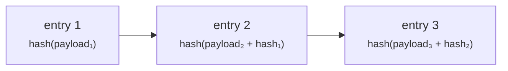

# Prüfer

**Sie prüfen, und Sie fassen nichts an.** Externer Abschlussprüfer, aufsichtsrechtlicher Prüfer oder interne Compliance — Sie müssen sehen, was geschehen ist, und Sie müssen strukturell außerstande sein, es zu ändern.

Die Rolle `AUDIT` gewährt lesenden Zugriff über das gesamte Register. Sie gewährt keinerlei Möglichkeit, etwas anzulegen, zu genehmigen, zu ändern oder zu löschen.

---

## Wo Sie arbeiten

!!! info "Prüfer nutzen das Betreiberportal, nicht das Kundenportal"
    Das überrascht viele. Das Kundenportal hat keine Prüfsicht — es ist um die Aktivität einer einzelnen Organisation herum gebaut.

    Registerweiter Lesezugriff wird über das **Betreiberportal** ausgeübt, und dort liegt auch das [Audit-Log](../../platform/audit-log.md). Ihr Ansprechpartner beim Betreiber stellt URL und Konto bereit.

    Die Zugriffskontrolle setzt das **Backend** durch, bei jeder Anfrage, anhand Ihres Tokens. Die Navigation des Betreiberportals ist nicht rollengefiltert, Sie sehen also Menüpunkte für Dinge, die Sie nicht tun können. Ein Aufruf führt zur Ablehnung, nicht zur Änderung. Ihr Nur-Lese-Status hängt nicht davon ab, dass die Oberfläche Schaltflächen verbirgt.

---

## Was Sie lesen können

| | |
|---|---|
| Assets und Emissionen, aller Emittenten | Konditionen, Status, Historie |
| Ausbringungen | Chain, Netz, Contract-Adresse, Transaktions-Hashes |
| Inhaber und Registereinträge | Einschließlich Eintragungsart und Beschränkungen |
| Übertragungen | Vollständige Historie, on-chain und registerseitig |
| KYC-Status und Dokumente | Wie vom Betreiber konfiguriert |
| Wirtschaftlich Berechtigte | |
| Kapitalmaßnahmen | Einschließlich Stichtagsaufnahmen und Ansprüche |
| Steuerbescheinigungen und Depotauszüge | |
| Das Audit-Log | Jedes aufgezeichnete Ereignis |

---

## Das Audit-Log

Jede zustandsändernde Operation schreibt einen Eintrag: wer, was, wann, und genug Kontext zur Rekonstruktion.

Mehr wert als ein Anwendungsprotokoll ist es deshalb, weil es **manipulationssicher nachweisbar** ist. Die Einträge sind hash-verkettet: Der Hash jeder Zeile bezieht den ihres Vorgängers ein, sodass Ändern oder Entfernen eines Eintrags die Kette ab dort bricht — und der Bruch ist erkennbar.

Die Prüfung steht als ausdrückliche Operation zur Verfügung, und sie arbeitet **fail-closed**: Eine unverkettete Zeile lässt die Prüfung scheitern, statt übersprungen zu werden.

!!! warning "Seien Sie präzise, was das belegt"
    Manipulations-*Nachweisbarkeit* ist keine Manipulations-*Sicherheit*. Wer Datenbankzugriff hat, kann Zeilen weiterhin ändern — was er nicht kann, ist sie unbemerkt zu ändern, sofern die Kette von etwas geprüft wird, das er nicht kontrolliert.

    Eine Hash-Kette, die nur von dem System geprüft wird, das sie geschrieben hat, ist eine schwächere Kontrolle, als sie scheint. Fragen Sie den Betreiber, wie und wo die Prüfung läuft und welche unabhängigen Nachweise es gibt. Diese Frage gehört zur normalen Beurteilung dieser Kontrolle, sie ist kein Vorwurf.

??? note "Für Spezialisten: Die Kette war sieben Wochen lang wirkungslos"
    Wissenswert, weil es den Fehlermodus genau veranschaulicht. Die Hash-Kette existierte, schrieb Einträge und verkettete sie tatsächlich rund sieben Wochen lang nicht, bevor der Defekt gefunden und behoben wurde.

    Am Verhalten des Systems sah in dieser Zeit nichts falsch aus — Einträge wurden geschrieben, das Log war abfragbar, die Funktion wirkte vorhanden. Aufgefallen wäre es allein dadurch, die Prüfung laufen zu lassen und zu kontrollieren, dass sie scheitern kann.

    Die Lehre lässt sich verallgemeinern: **Eine Integritätskontrolle, die niemand ausübt, ist von einer nicht funktionierenden nicht zu unterscheiden.** Wenn Sie diese Plattform beurteilen, verlangen Sie Nachweise durchgeführter Prüfläufe, nicht die Existenz des Mechanismus.

    Die Tabelle `audit_event` ist zeitpartitioniert; Aufbewahrung und Partitionsverwaltung sind daher betriebliche Themen, nach denen zu fragen sich lohnt.

---

## Was *nicht* im Audit-Log steht

Klarheit über die Grenze nützt mehr als eine lange Liste dessen, was drin ist.

!!! danger "Lesezugriffe werden nicht protokolliert"
    Das Audit-Log erfasst **zustandsändernde Operationen**. Eine Seite ansehen, eine Suche ausführen, ein Dokument öffnen — das wird nicht als Audit-Ereignis aufgezeichnet.

    Falls Sie Dokumentation gesehen haben, die behauptet, jeder Seitenaufruf und jede Suche werde mit der Identität des Betrachters protokolliert: Diese Behauptung ist falsch, und diese Seite korrigiert sie. Verlassen Sie sich nicht auf das Audit-Log, um „Wer hat das angesehen?" zu beantworten.

    Zugriff auf personenbezogene Daten ist ein Thema des [Datenschutzes](../../compliance/data-protection.md); verlangt Ihr Auftrag die Protokollierung von Lesezugriffen, bringen Sie das als Anforderung beim Betreiber ein, statt es vorauszusetzen.

Ebenfalls nicht enthalten: alles, was außerhalb der Plattform geschah. Eine per Banküberweisung geleistete Zahlung erscheint nur als die Referenz, die jemand eingetippt hat. Eine in einer Sitzung getroffene Entscheidung erscheint nur, wenn sie hier zu einer Handlung geführt hat.

---

## Ein Wertpapier lückenlos nachverfolgen

Die häufigste Prüferaufgabe. Der Weg:

1. **Das Asset finden** — über ISIN, Namen oder Emittenten.
2. **Seinen Lebenszyklus lesen** — angelegt, eingereicht, genehmigt (von wem), emittiert und jeder Übergang seither, aus dem Audit-Log.
3. **Seine Ausbringung lesen** — Chain, Contract-Adresse, Transaktions-Hash. Prüfen Sie unabhängig in einem Block-Explorer nach; Sie müssen der Plattform nicht glauben.
4. **Das Inhaberregister lesen** — einschließlich logisch gelöschter Einträge. Beendete Inhaber bleiben erhalten, werden nie entfernt, sodass die Historie vollständig ist.
5. **Übertragungen lesen** — registerseitig und on-chain.
6. **Kapitalmaßnahmen lesen** — Stichtagsaufnahmen, die genau zeigen, wer worauf Anspruch hatte und wann abgewickelt wurde.

!!! tip "Zwei Aufzeichnungen, und sie können voneinander abweichen"
    Registerwerk führt das Register (eine Datenbank, rechtlich maßgeblich) und den Token (on-chain, unabhängig verifizierbar) als getrennte Aufzeichnungen, die Indexer im Gleichlauf halten.

    Sie können auseinanderlaufen — kurz im Normalbetrieb, länger, wenn ein Indexer nachhinkt oder eine Chain überlastet ist. **Eine Abweichung zu finden heißt nicht automatisch, einen Defekt gefunden zu haben.** Stellen Sie fest, wann jede Aufzeichnung geschrieben wurde, bevor Sie schließen. [Verwahrung und Bestand](../lifecycle/holding.md) erklärt das Modell.

---

## Fragen, die sich an den Betreiber lohnen

Weder der Code noch diese Dokumentation kann sie beantworten. Sie entscheiden darüber, ob die Kontrollen in dieser Installation etwas bedeuten.

- **Wie oft wird die Audit-Kette geprüft, wodurch, und wo liegt der Nachweis?** Können Sie eine gescheiterte Prüfung sehen?
- **Wie lang ist die Aufbewahrungsfrist, und wie werden Partitionen verwaltet?**
- **Wird lesender Zugriff auf personenbezogene Daten irgendwo protokolliert?** (Nicht im Audit-Log — siehe oben.)
- **Wer hält `REGISTRY_ADMIN`, und wie viele Personen können allein handeln?** Welche Operationen verlangen wirklich das [Vier-Augen-Prinzip](../../compliance/step-up-mfa.md)?
- **Wie ist die [Identitätsübernahme](../../operator/customers/impersonation.md) geregelt?** Betreiber können innerhalb des Kundenportals handeln. Jede solche Handlung wird dem Betreiber zugerechnet, nicht dem Kunden — vergewissern Sie sich, dass Sie beides im Log unterscheiden können.
- **Welche [Compliance-Bausteine](../../compliance/index.md) sind tatsächlich eingeschaltet?** Mehrere sind je Installation zuschaltbar. Sanktionsprüfung, Travel Rule, aufsichtsrechtliches Meldewesen und Kreditvergabe sind allesamt konfigurierbar, und eine Funktionsbeschreibung ist kein Nachweis, dass sie hier aktiv ist.

---

## Wohin als Nächstes

- [Audit-Log](../../platform/audit-log.md) — die technische Referenz
- [Rechtsrahmen](../../legal/index.md) · [Compliance-Bausteine](../../compliance/index.md)
- [Prüfungsbefunde](../../assurance-review-ledger.md) — gegen diese Codebasis erhobene Feststellungen
