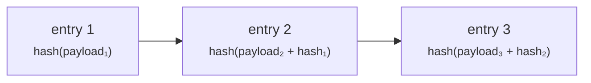

# Auditor

**Usted inspecciona y no toca.** Auditor externo, inspector de la autoridad supervisora o cumplimiento interno — necesita ver qué ocurrió, y debe ser estructuralmente incapaz de cambiarlo.

La función `AUDIT` otorga acceso de lectura a todo el registro. No concede capacidad alguna de crear, aprobar, modificar o eliminar nada.

---

## Dónde trabaja

!!! info "Los auditores usan el portal del operador, no el del cliente"
    Esto sorprende. El portal del cliente no tiene vista de auditoría — está construido en torno a la actividad propia de una sola organización.

    El acceso de lectura a todo el registro se ejerce desde el **portal del operador**, y ahí reside la [pista de auditoría](../../platform/audit-log.md). Su contacto en el operador le facilita la URL y su cuenta.

    El control de acceso lo aplica el **backend**, en cada petición, a partir de su token. La navegación del portal del operador no está filtrada por función, así que verá entradas de menú de cosas que no puede hacer. Abrir una produce un rechazo, no un cambio. Su condición de solo lectura no depende de que la interfaz oculte botones.

---

## Qué puede leer

| | |
|---|---|
| Activos y emisiones, de todos los emisores | Condiciones, estado, historial |
| Despliegues | Cadena, red, dirección del contrato, hashes de transacción |
| Titulares e inscripciones registrales | Incluidos tipo de inscripción y restricciones |
| Transmisiones | Historial completo, on-chain y del lado del registro |
| Estado KYC y documentos | Según lo configure el operador |
| Titularidad real | |
| Operaciones societarias | Incluidas las fotografías a fecha de registro y los derechos |
| Certificados fiscales y extractos de posición | |
| La pista de auditoría | Cada evento registrado |

---

## La pista de auditoría

Toda operación que cambia el estado escribe una entrada: quién, qué, cuándo, y contexto suficiente para reconstruirla.

Lo que la hace valer más que un registro de aplicación es que es **a prueba de manipulación en el sentido de la detectabilidad**. Las entradas están encadenadas por hash: el hash de cada fila incorpora el de su predecesora, de modo que alterar o eliminar una entrada rompe la cadena a partir de ese punto, y la rotura es detectable.

La verificación existe como operación explícita y funciona por **denegación por defecto**: una fila no encadenada hace fallar la verificación en lugar de omitirse.

!!! warning "Sea preciso sobre lo que esto prueba"
    La *detectabilidad* de la manipulación no es la *imposibilidad* de manipular. Quien tenga acceso a la base de datos aún puede alterar filas — lo que no puede es alterarlas sin ser detectado, siempre que la cadena la verifique algo que no controle.

    Una cadena de hash verificada solo por el sistema que la escribió es un control más débil de lo que parece. Pregunte al operador cómo y dónde se ejecuta la verificación y qué evidencia independiente existe. Esa pregunta forma parte normal de evaluar este control, no es una acusación.

??? note "Para el especialista: la cadena no hizo nada durante siete semanas"
    Vale la pena saberlo, porque ilustra el modo de fallo con precisión. La cadena de hash existía, escribía entradas y en realidad no las encadenaba, durante unas siete semanas, antes de que el defecto se encontrara y corrigiera.

    Nada en el comportamiento del sistema parecía mal durante ese periodo — las entradas se escribían, el registro era consultable, la funcionalidad parecía presente. Lo único que lo habría detectado es ejecutar la verificación y comprobar que puede fallar.

    La lección se generaliza: **un control de integridad que nadie ejercita es indistinguible de uno que no funciona.** Si está evaluando esta plataforma, pida evidencia de ejecuciones de verificación, no la existencia del mecanismo.

    La tabla `audit_event` está particionada por tiempo, así que la conservación y la gestión de particiones son cuestiones operativas por las que conviene preguntar.

---

## Qué *no* está en la pista de auditoría

Tener claro el límite es más útil que una larga lista de lo que sí está.

!!! danger "Los accesos de lectura no se registran"
    La pista de auditoría recoge **operaciones que cambian el estado**. Ver una página, ejecutar una búsqueda, abrir un documento — no se registran como eventos de auditoría.

    Si ha visto documentación que afirma que cada visualización de página y cada búsqueda quedan registradas con la identidad de quien mira, esa afirmación es falsa y esta página la corrige. No confíe en la pista de auditoría para responder «¿quién miró esto?».

    El acceso a datos personales es una cuestión de [protección de datos](../../compliance/data-protection.md); si su encargo exige registrar los accesos de lectura, plantéelo al operador como requisito en lugar de darlo por hecho.

También ausente: todo lo ocurrido fuera de la plataforma. Un pago hecho por transferencia bancaria aparece solo como la referencia que alguien tecleó. Una decisión tomada en una reunión aparece solo si produjo una actuación aquí.

---

## Rastrear un valor de principio a fin

La tarea más habitual de un auditor. El camino:

1. **Encontrar el activo** — por ISIN, nombre o emisor.
2. **Leer su ciclo de vida** — creado, enviado, aprobado (por quién), emitido, y cada transición desde entonces, en la pista de auditoría.
3. **Leer su despliegue** — cadena, dirección del contrato, hash de transacción. Verifíquelo de forma independiente en un explorador de bloques; no tiene por qué creer a la plataforma bajo palabra.
4. **Leer el registro de titulares** — incluidas las entradas borradas lógicamente. Los titulares cerrados se conservan, nunca se eliminan, de modo que el historial es completo.
5. **Leer las transmisiones** — del lado del registro y on-chain.
6. **Leer las operaciones societarias** — las fotografías a fecha de registro que muestran exactamente a quién le correspondía qué, y cuándo se liquidó.

!!! tip "Dos registros, y pueden discrepar"
    Registerwerk mantiene el registro (una base de datos, jurídicamente determinante) y el token (on-chain, verificable de forma independiente) como registros separados, mantenidos acompasados por indexadores.

    Pueden desviarse — brevemente en operación normal, más tiempo si un indexador se retrasa o una cadena está congestionada. **Encontrar una discrepancia no equivale automáticamente a encontrar un defecto.** Determine cuándo se escribió cada registro antes de concluir. [Tenencia y custodia](../lifecycle/holding.md) explica el modelo.

---

## Preguntas que vale la pena hacer al operador

Ni el código ni esta documentación pueden responderlas. Son las que determinan si los controles significan algo en esta instalación.

- **¿Con qué frecuencia se verifica la cadena de auditoría, mediante qué, y dónde está la evidencia?** ¿Puede ver una verificación que haya fallado?
- **¿Cuál es el plazo de conservación y cómo se gestionan las particiones?**
- **¿Se registra en algún sitio el acceso de lectura a datos personales?** (No en la pista de auditoría — véase arriba.)
- **¿Quién tiene `REGISTRY_ADMIN`, y cuántas personas pueden actuar solas?** ¿Qué operaciones exigen realmente [doble control](../../compliance/step-up-mfa.md)?
- **¿Cómo se gobierna el [modo soporte](../../operator/customers/impersonation.md)?** Los operadores pueden actuar dentro del portal de un cliente. Toda actuación así se atribuye al operador, no al cliente — confirme que sabe distinguirlas en el registro.
- **¿Qué [componentes de cumplimiento](../../compliance/index.md) están realmente activados?** Varios son opcionales por instalación. Filtrado de sanciones, Travel Rule, reporte regulatorio y préstamo son todos configurables, y una documentación que describe una función no es prueba de que esté habilitada aquí.

---

## Adónde ir ahora

- [Pista de auditoría](../../platform/audit-log.md) — la referencia técnica
- [Marcos jurídicos](../../legal/index.md) · [Componentes de cumplimiento](../../compliance/index.md)
