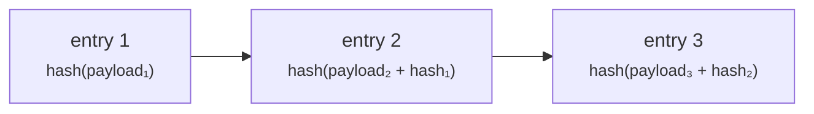

# Auditeur

**Vous inspectez et vous ne touchez à rien.** Commissaire aux comptes, inspecteur de l'autorité de supervision ou conformité interne — il vous faut voir ce qui s'est passé, et vous devez être structurellement incapable de le modifier.

Le rôle `AUDIT` donne un accès en lecture sur tout le registre. Il ne confère aucune capacité de créer, approuver, modifier ou supprimer quoi que ce soit.

---

## Où vous travaillez

!!! info "Les auditeurs utilisent le portail opérateur, pas le portail client"
    Cela surprend. Le portail client n'a pas de vue d'audit — il est conçu autour de l'activité propre à une seule organisation.

    L'accès en lecture à tout le registre s'exerce depuis le **portail opérateur**, et c'est là que réside la [piste d'audit](../../platform/audit-log.md). Votre contact chez l'opérateur vous fournit l'URL et votre compte.

    Le contrôle d'accès est appliqué par le **backend**, à chaque requête, à partir de votre jeton. La navigation du portail opérateur n'est pas filtrée par rôle : vous verrez donc des entrées de menu pour des choses que vous ne pouvez pas faire. En ouvrir une produit un refus, pas une modification. Votre statut de lecture seule ne dépend pas de l'interface qui masquerait des boutons.

---

## Ce que vous pouvez lire

| | |
|---|---|
| Actifs et émissions, tous émetteurs confondus | Conditions, statut, historique |
| Déploiements | Chaîne, réseau, adresse du contrat, hachages de transaction |
| Titulaires et inscriptions | Y compris type d'inscription et restrictions |
| Transferts | Historique complet, on-chain et côté registre |
| Statut KYC et documents | Selon la configuration de l'opérateur |
| Bénéficiaires effectifs | |
| Opérations sur titres | Y compris photographies à la date d'enregistrement et droits |
| Attestations fiscales et relevés de positions | |
| La piste d'audit | Chaque événement consigné |

---

## La piste d'audit

Chaque opération modifiant l'état écrit une entrée : qui, quoi, quand, et assez de contexte pour la reconstituer.

Ce qui la rend plus précieuse qu'un journal applicatif, c'est qu'elle est **inviolable au sens de la détection**. Les entrées sont chaînées par hachage : le hachage de chaque ligne intègre celui de la précédente, de sorte que modifier ou supprimer une entrée rompt la chaîne à partir de ce point, et la rupture est détectable.

La vérification existe comme opération explicite et fonctionne en **rejet par défaut** : une ligne non chaînée fait échouer la vérification au lieu d'être ignorée.

!!! warning "Soyez précis sur ce que cela prouve"
    La *détection* de l'altération n'est pas l'*impossibilité* de l'altération. Qui dispose d'un accès à la base peut toujours modifier des lignes — ce qu'il ne peut pas faire, c'est les modifier sans être détecté, à condition que la chaîne soit vérifiée par quelque chose qu'il ne contrôle pas.

    Une chaîne de hachage vérifiée uniquement par le système qui l'a écrite est un contrôle plus faible qu'il n'y paraît. Demandez à l'opérateur comment et où la vérification s'exécute, et quelles preuves indépendantes existent. Cette question fait normalement partie de l'évaluation de ce contrôle ; ce n'est pas une accusation.

??? note "Pour le spécialiste : la chaîne n'a rien fait pendant sept semaines"
    Bon à savoir, car cela illustre précisément le mode de défaillance. La chaîne de hachage existait, écrivait des entrées, et ne les chaînait en réalité pas, pendant environ sept semaines, avant que le défaut ne soit trouvé et corrigé.

    Rien dans le comportement du système ne paraissait anormal durant cette période — les entrées s'écrivaient, le journal était interrogeable, la fonctionnalité semblait présente. La seule chose qui l'aurait détecté, c'est d'exécuter la vérification et de contrôler qu'elle peut échouer.

    La leçon se généralise : **un contrôle d'intégrité que personne n'exerce est indiscernable d'un contrôle qui ne fonctionne pas.** Si vous évaluez cette plateforme, demandez des preuves d'exécutions de vérification, pas l'existence du mécanisme.

    La table `audit_event` est partitionnée dans le temps : la conservation et la gestion des partitions sont donc des sujets opérationnels sur lesquels il vaut la peine d'interroger.

---

## Ce qui n'est *pas* dans la piste d'audit

Être clair sur la frontière est plus utile qu'une longue liste de ce qui s'y trouve.

!!! danger "Les accès en lecture ne sont pas journalisés"
    La piste d'audit consigne les **opérations modifiant l'état**. Consulter une page, lancer une recherche, ouvrir un document — cela n'est pas consigné comme événement d'audit.

    Si vous avez vu une documentation affirmant que chaque consultation de page et chaque recherche sont journalisées avec l'identité du lecteur, cette affirmation est fausse et cette page la corrige. Ne comptez pas sur la piste d'audit pour répondre à « qui a regardé ceci ? ».

    L'accès aux données à caractère personnel relève de la [protection des données](../../compliance/data-protection.md) ; si votre mission exige la journalisation des accès en lecture, posez-la à l'opérateur comme une exigence plutôt que de la supposer acquise.

Également absent : tout ce qui s'est passé hors de la plateforme. Un paiement effectué par virement n'apparaît que sous la forme de la référence saisie par quelqu'un. Une décision prise en réunion n'apparaît que si elle a produit une action ici.

---

## Retracer un titre de bout en bout

La tâche d'auditeur la plus courante. Le chemin :

1. **Trouver l'actif** — par ISIN, nom ou émetteur.
2. **Lire son cycle de vie** — créé, soumis, approuvé (par qui), émis, et chaque transition depuis, dans la piste d'audit.
3. **Lire son déploiement** — chaîne, adresse du contrat, hachage de transaction. Vérifiez-le indépendamment sur un explorateur de blocs ; vous n'êtes pas tenu de croire la plateforme sur parole.
4. **Lire le registre des titulaires** — y compris les entrées supprimées logiquement. Les titulaires clôturés sont conservés, jamais effacés : l'historique est complet.
5. **Lire les transferts** — côté registre et on-chain.
6. **Lire les opérations sur titres** — les photographies à la date d'enregistrement montrant exactement qui avait droit à quoi, et quand cela a été réglé.

!!! tip "Deux enregistrements, et ils peuvent diverger"
    Registerwerk tient le registre (une base de données, juridiquement faisant foi) et le jeton (on-chain, vérifiable indépendamment) comme deux enregistrements distincts, maintenus en phase par des indexeurs.

    Ils peuvent dériver — brièvement en fonctionnement normal, plus longtemps si un indexeur prend du retard ou si une chaîne est congestionnée. **Trouver un écart n'équivaut pas automatiquement à trouver un défaut.** Établissez quand chaque enregistrement a été écrit avant de conclure. [Détention et conservation](../lifecycle/holding.md) explique le modèle.

---

## Questions qu'il vaut la peine de poser à l'opérateur

Ni le code ni cette documentation ne peuvent y répondre. Ce sont elles qui déterminent si les contrôles signifient quelque chose dans cette installation.

- **À quelle fréquence la chaîne d'audit est-elle vérifiée, par quoi, et où est la preuve ?** Pouvez-vous voir une vérification qui a échoué ?
- **Quelle est la durée de conservation, et comment les partitions sont-elles gérées ?**
- **L'accès en lecture aux données personnelles est-il journalisé quelque part ?** (Pas dans la piste d'audit — voir ci-dessus.)
- **Qui détient `REGISTRY_ADMIN`, et combien de personnes peuvent agir seules ?** Quelles opérations exigent réellement une [double validation](../../compliance/step-up-mfa.md) ?
- **Comment le [mode support](../../operator/customers/impersonation.md) est-il encadré ?** Les opérateurs peuvent agir à l'intérieur du portail d'un client. Chacune de ces actions est imputée à l'opérateur, non au client — vérifiez que vous savez les distinguer dans le journal.
- **Quels [composants de conformité](../../compliance/index.md) sont réellement activés ?** Plusieurs sont optionnels selon l'installation. Filtrage des sanctions, Travel Rule, déclarations réglementaires et prêt sont tous configurables, et une documentation décrivant une fonctionnalité n'est pas la preuve qu'elle est activée ici.

---

## Et ensuite

- [Piste d'audit](../../platform/audit-log.md) — la référence technique
- [Cadres juridiques](../../legal/index.md) · [Composants de conformité](../../compliance/index.md)
