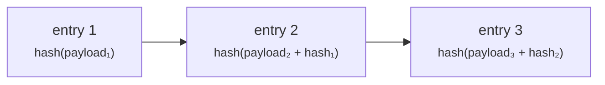

# Revisore

**Ispezioni e non tocchi.** Revisore esterno, ispettore dell'autorità di vigilanza o conformità interna — devi vedere che cosa è successo, e devi essere strutturalmente incapace di modificarlo.

Il ruolo `AUDIT` dà accesso in lettura su tutto il registro. Non conferisce alcuna capacità di creare, approvare, modificare o cancellare alcunché.

---

## Dove lavori

!!! info "I revisori usano il portale operatore, non quello cliente"
    Questo sorprende. Il portale cliente non ha una vista di revisione — è costruito attorno all'attività di una singola organizzazione.

    L'accesso in lettura a tutto il registro si esercita dal **portale operatore**, ed è lì che risiede la [pista di controllo](../../platform/audit-log.md). Il tuo referente presso l'operatore fornisce URL e account.

    Il controllo degli accessi è applicato dal **backend**, a ogni richiesta, a partire dal tuo token. La navigazione del portale operatore non è filtrata per ruolo, quindi vedrai voci di menu per cose che non puoi fare. Aprirne una produce un rifiuto, non una modifica. Il tuo stato di sola lettura non dipende dal fatto che l'interfaccia nasconda dei pulsanti.

---

## Che cosa puoi leggere

| | |
|---|---|
| Asset ed emissioni, di tutti gli emittenti | Condizioni, stato, storico |
| Distribuzioni | Chain, rete, indirizzo del contratto, hash delle transazioni |
| Titolari e iscrizioni a registro | Compresi tipo di iscrizione e restrizioni |
| Trasferimenti | Storico completo, on-chain e lato registro |
| Stato KYC e documenti | Secondo la configurazione dell'operatore |
| Titolarità effettiva | |
| Operazioni societarie | Comprese le fotografie alla data di registrazione e le spettanze |
| Certificazioni fiscali ed estratti posizione | |
| La pista di controllo | Ogni evento registrato |

---

## La pista di controllo

Ogni operazione che modifica lo stato scrive una voce: chi, che cosa, quando, e abbastanza contesto per ricostruirla.

Ciò che la rende più preziosa di un log applicativo è che è **a prova di manomissione nel senso della rilevabilità**. Le voci sono concatenate tramite hash: l'hash di ogni riga incorpora quello della precedente, sicché alterare o rimuovere una voce spezza la catena da quel punto in avanti, e la rottura è rilevabile.

La verifica è disponibile come operazione esplicita e funziona in **rifiuto in caso di errore**: una riga non concatenata fa fallire la verifica anziché essere saltata.

!!! warning "Sii preciso su che cosa questo prova"
    La *rilevabilità* della manomissione non è l'*impossibilità* della manomissione. Chi ha accesso al database può ancora alterare righe — ciò che non può fare è alterarle senza essere scoperto, purché la catena sia verificata da qualcosa che non controlla.

    Una catena di hash verificata solo dal sistema che l'ha scritta è un controllo più debole di quanto sembri. Chiedi all'operatore come e dove gira la verifica e quali prove indipendenti esistono. Quella domanda fa parte della normale valutazione di questo controllo, non è un'accusa.

??? note "Per lo specialista: la catena è stata inefficace per sette settimane"
    Vale la pena saperlo, perché illustra con precisione il modo di guasto. La catena di hash esisteva, scriveva voci e in realtà non le concatenava, per circa sette settimane, prima che il difetto fosse trovato e corretto.

    Nel comportamento del sistema nulla sembrava sbagliato in quel periodo — le voci venivano scritte, il log era interrogabile, la funzione appariva presente. L'unica cosa che l'avrebbe colto è eseguire la verifica e controllare che possa fallire.

    La lezione si generalizza: **un controllo di integrità che nessuno esercita è indistinguibile da uno che non funziona.** Se stai valutando questa piattaforma, chiedi prove di esecuzioni della verifica, non l'esistenza del meccanismo.

    La tabella `audit_event` è partizionata nel tempo, quindi conservazione e gestione delle partizioni sono questioni operative su cui vale la pena informarsi.

---

## Che cosa *non* c'è nella pista di controllo

Essere chiari sul confine è più utile di un lungo elenco di ciò che c'è.

!!! danger "Gli accessi in lettura non sono registrati"
    La pista di controllo registra le **operazioni che modificano lo stato**. Visualizzare una pagina, eseguire una ricerca, aprire un documento — non vengono registrati come eventi di revisione.

    Se hai visto documentazione che sostiene che ogni visualizzazione di pagina e ogni ricerca sono registrate con l'identità di chi guarda, quell'affermazione è errata e questa pagina la corregge. Non fare affidamento sulla pista di controllo per rispondere a «chi ha guardato questo?».

    L'accesso ai dati personali è una questione di [protezione dei dati](../../compliance/data-protection.md); se il tuo incarico richiede la registrazione degli accessi in lettura, ponila all'operatore come requisito anziché darla per acquisita.

Assente anche: tutto ciò che è accaduto fuori dalla piattaforma. Un pagamento eseguito con bonifico compare solo come il riferimento che qualcuno ha digitato. Una decisione presa in una riunione compare solo se ha prodotto un'azione qui.

---

## Ricostruire uno strumento da capo a fondo

Il compito più comune di un revisore. Il percorso:

1. **Trovare l'asset** — per ISIN, nome o emittente.
2. **Leggerne il ciclo di vita** — creato, inviato, approvato (da chi), emesso, e ogni transizione successiva, dalla pista di controllo.
3. **Leggerne la distribuzione** — chain, indirizzo del contratto, hash della transazione. Verifica indipendentemente su un block explorer; non devi credere alla piattaforma sulla parola.
4. **Leggere il registro dei titolari** — comprese le voci cancellate logicamente. I titolari chiusi restano, non vengono mai rimossi, così lo storico è completo.
5. **Leggere i trasferimenti** — lato registro e on-chain.
6. **Leggere le operazioni societarie** — le fotografie alla data di registrazione che mostrano esattamente a chi spettava che cosa, e quando è stato regolato.

!!! tip "Due registrazioni, e possono divergere"
    Registerwerk tiene il registro (un database, giuridicamente autoritativo) e il token (on-chain, verificabile in modo indipendente) come registrazioni separate, mantenute allineate dagli indicizzatori.

    Possono discostarsi — brevemente in condizioni normali, più a lungo se un indicizzatore resta indietro o una chain è congestionata. **Trovare una discrepanza non equivale automaticamente a trovare un difetto.** Stabilisci quando ciascuna registrazione è stata scritta prima di trarre conclusioni. [Detenzione e custodia](../lifecycle/holding.md) spiega il modello.

---

## Domande che vale la pena porre all'operatore

Né il codice né questa documentazione possono rispondervi. Sono quelle che determinano se i controlli significano qualcosa in questa installazione.

- **Con quale frequenza la catena di revisione viene verificata, da che cosa, e dov'è la prova?** Riesci a vedere una verifica fallita?
- **Qual è il periodo di conservazione e come sono gestite le partizioni?**
- **L'accesso in lettura ai dati personali è registrato da qualche parte?** (Non nella pista di controllo — vedi sopra.)
- **Chi detiene `REGISTRY_ADMIN`, e quante persone possono agire da sole?** Quali operazioni richiedono davvero il [principio dei quattro occhi](../../compliance/step-up-mfa.md)?
- **Come è disciplinata la [modalità supporto](../../operator/customers/impersonation.md)?** Gli operatori possono agire dentro il portale di un cliente. Ogni azione del genere è attribuita all'operatore, non al cliente — accertati di saperle distinguere nel log.
- **Quali [componenti di conformità](../../compliance/index.md) sono effettivamente attivi?** Diversi sono opzionali per installazione. Screening sanzioni, Travel Rule, segnalazioni regolamentari e prestito sono tutti configurabili, e una documentazione che descrive una funzione non è prova che sia attiva qui.

---

## Dove andare adesso

- [Pista di controllo](../../platform/audit-log.md) — il riferimento tecnico
- [Quadri giuridici](../../legal/index.md) · [Componenti di conformità](../../compliance/index.md)
