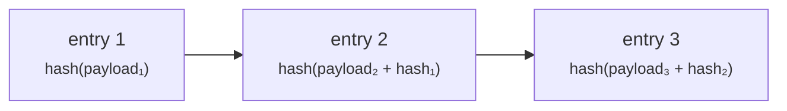

# Auditor

**You inspect and you do not touch.** External auditor, regulatory inspector, or internal compliance — you need to see what happened, and you must be structurally unable to change it.

The `AUDIT` role gives read access across the registry. It grants no ability to create, approve, modify or delete anything.

---

## Where you work

!!! info "Auditors use the operator portal, not the customer portal"
    This surprises people. The customer portal has no audit view — it is built around a single organisation's own activity.

    Cross-registry read access is exercised through the **operator portal**, and the [audit log](../../platform/audit-log.md) lives there. Your operator contact provides the URL and your account.

    Access control is enforced by the **backend**, on every request, from your token. The operator portal's navigation is not role-filtered, so you will see menu entries for things you cannot do. Opening one produces a refusal, not a change. Your read-only status does not depend on the interface hiding buttons.

---

## What you can read

| | |
|---|---|
| Assets and issuances, all issuers | Terms, status, history |
| Deployments | Chain, network, contract address, transaction hashes |
| Holders and register entries | Including entry type and restrictions |
| Transfers | Full history, on-chain and register-side |
| KYC status and documents | As configured by the operator |
| Beneficial ownership | |
| Corporate actions | Including record-date snapshots and entitlements |
| Tax certificates and position statements | |
| The audit log | Every recorded event |

---

## The audit log

Every state-changing operation writes an entry: who, what, when, and enough context to reconstruct it.

What makes it worth more than an application log is that it is **tamper-evident**. Entries are hash-chained: each row's hash incorporates its predecessor's, so altering or removing an entry breaks the chain from that point forward and the break is detectable.

Verification is available as an explicit operation, and it **fails closed**: an unchained row causes verification to fail rather than be skipped.

!!! warning "Be precise about what this proves"
    Tamper-*evidence* is not tamper-*proofing*. Someone with database access can still alter rows — what they cannot do is alter them undetectably, provided the chain is verified by something they do not control.

    A hash chain verified only by the system that wrote it is a weaker control than it appears. Ask the operator how and where verification runs, and what independent evidence exists. That question is a normal part of assessing this control, not an accusation.

??? note "For the specialist: the chain was a no-op for seven weeks"
    Worth knowing, because it illustrates the failure mode precisely. The hash chain existed, wrote entries, and did not actually chain them for roughly seven weeks before the defect was found and fixed.

    Nothing about the system's behaviour looked wrong during that period — entries were written, the log was queryable, the feature appeared present. The only thing that would have caught it is running verification and checking that it can fail.

    The lesson generalises: **an integrity control nobody exercises is indistinguishable from one that does not work.** If you are assessing this platform, ask for evidence of verification runs, not for the existence of the mechanism.

    The `audit_event` table is time-partitioned, so retention and partition management are operational matters worth asking about.

---

## What is *not* in the audit log

Being clear about the boundary is more useful than a long list of what is.

!!! danger "Read access is not audited"
    The audit log records **state-changing operations**. Viewing a page, running a search, opening a document — these are not recorded as audit events.

    If you have seen documentation claiming every page view and search is logged with the viewer's identity, that claim is wrong and this page corrects it. Do not rely on the audit log to answer "who looked at this?".

    Access to personal data is a [data-protection](../../compliance/data-protection.md) concern, and if your engagement requires read-access logging, raise it with the operator as a requirement rather than assuming it exists.

Also absent: anything that happened outside the platform. A payment made by bank transfer appears only as the reference somebody typed. A decision taken in a meeting appears only if it produced an action here.

---

## Tracing a security end to end

The most common auditor task. The path:

1. **Find the asset** — by ISIN, name or issuer.
2. **Read its lifecycle** — created, submitted, approved (by whom), issued, and every transition since, from the audit log.
3. **Read its deployment** — chain, contract address, transaction hash. Verify independently on a block explorer; you do not have to take the platform's word for it.
4. **Read the holder register** — including soft-deleted entries. Closed holders are retained, never removed, so the history is complete.
5. **Read transfers** — register-side and on-chain.
6. **Read corporate actions** — record-date snapshots showing exactly who was entitled to what, and when it settled.

!!! tip "Two records, and they can disagree"
    Registerwerk keeps the register (a database, legally authoritative) and the token (on-chain, independently verifiable) as separate records kept in step by indexers.

    They can drift — briefly during normal operation, longer if an indexer lags or a chain is congested. **Finding a discrepancy is not automatically finding a defect.** Establish when each record was written before drawing a conclusion. [Holding and custody](../lifecycle/holding.md) explains the model.

---

## Questions worth asking the operator

Neither the code nor this documentation can answer these. They are the ones that determine whether the controls mean anything in this deployment.

- **How often is the audit chain verified, by what, and where is the evidence?** Can you see a verification that failed?
- **What is the retention period, and how are partitions managed?**
- **Is read access to personal data logged anywhere?** (Not in the audit log — see above.)
- **Who holds `REGISTRY_ADMIN`, and how many people can act alone?** Which operations genuinely require [four eyes](../../compliance/step-up-mfa.md)?
- **How is [impersonation](../../operator/customers/impersonation.md) governed?** Operators can act inside a customer's portal. Every such action is attributed to the operator, not the customer — confirm you can distinguish them in the log.
- **Which [compliance components](../../compliance/index.md) are actually switched on?** Several are opt-in per deployment. Sanctions screening, Travel Rule, regulatory reporting and lending are all configurable, and documentation describing a feature is not evidence it is enabled here.

---

## Where next

- [Audit log](../../platform/audit-log.md) — the technical reference
- [Legal frameworks](../../legal/index.md) · [Compliance components](../../compliance/index.md)
