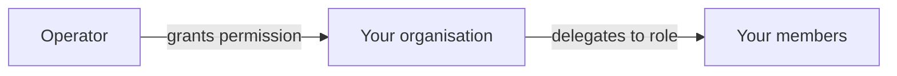

# Administrador de empresa

**Usted es responsable de su organización dentro del registro.** Quién tiene cuenta, qué puede hacer, cómo se autentica y cómo se identifica su empresa on-chain.

No es un espacio de trabajo propio — aparece como **Company Admin** dentro del espacio Issuer. Es una responsabilidad que se superpone a todo lo demás que usted haga.

---

## Qué hay aquí

| Pestaña | Para |
|---|---|
| **Users** | Invitar personas, asignar funciones, desactivar a quienes se van. |
| **IdP Settings** | Conectar su inicio de sesión único corporativo. |
| **Organization** | Su identidad on-chain y los monederos vinculados a ella. |
| **External IDs** | Identificadores que enlazan su organización con sistemas externos. |

---

## Users

*Company Admin → Users.*

Usted invita a personas, asigna funciones y las desactiva cuando se marchan. Funciones que puede conceder dentro de su organización:

| Función | Permite |
|---|---|
| `INVESTOR` | Mantener y consultar valores. |
| `TRADER` | Comprar, vender y usar los mercados de liquidez. |
| `ISSUER` | Crear y administrar emisiones. |
| `COMPANY_ADMIN` | Todo lo de esta página. |
| `DAPP_PUBLISHER` | Publicar aplicaciones en el mercado. |

Una persona puede acumular varias. Las funciones determinan qué [espacios de trabajo](index.md) aparecen y — más importante — qué permitirá hacer realmente el backend.

!!! danger "Desactive el mismo día a quien se va"
    Una cuenta que sigue funcionando después de que alguien ha dejado su organización es una cuenta que aún puede mover valores.

    La desactivación es inmediata y reversible. No borra nada: sus actuaciones pasadas permanecen en la [pista de auditoría](../../platform/audit-log.md), atribuidas a esa persona, de forma permanente. Esa es justamente la idea — puede retirar el acceso a alguien sin borrar la constancia de lo que hizo.

!!! warning "No puede conceder más de lo que tiene"
    Ni una función que su organización no posea. Si su entidad está registrada como inversor, no puede convertir a uno de sus usuarios en emisor. Esa es una decisión del operador.

### Cuando el acceso se gestiona en otro sitio

Si su registro funciona sobre Microsoft Entra ID y su organización está **federada** — sus personas se autentican con las cuentas corporativas de ustedes —, el ciclo de vida de usuarios vive en *su* proveedor de identidad, no aquí. La página se lo indica.

Las funciones de Registerwerk las sigue asignando aquí. Quién existe es asunto de su IdP; qué puede hacer es asunto suyo.

---

## Ajustes de IdP

*Company Admin → IdP Settings.* Conecte su proveedor de identidad compatible con OIDC para que sus personas accedan con credenciales corporativas en lugar de con una contraseña aparte.

Usted aporta una **URL de emisor** y un **identificador de cliente**.

!!! info "No hay secreto de cliente, deliberadamente"
    Quizá espere un tercer campo. No lo hay, y no es un descuido.

    La federación entrante se establece **de inquilino a inquilino en su proveedor de identidad**. Registerwerk nunca ejecuta un flujo de código de autorización contra su inquilino, así que no tiene uso para su secreto de cliente — y almacenarlo significaría custodiar una credencial suya que no necesita.

    El campo se retiró y los valores existentes se borraron.

Dos filas de esta página son de **solo lectura**, y ambas las fija el operador del registro:

| | |
|---|---|
| **Identity model** | Si sus usuarios son invitados en el inquilino del operador, miembros de él, o federados desde el suyo propio. |
| **Inbound MFA trust** | Si la autenticación de doble factor realizada en *su* inquilino se acepta aquí. |

!!! warning "Por qué la confianza en el MFA no le corresponde"
    Que un cliente afirmara «confíen en nuestro MFA» sería un vector de elevación de privilegios: podría rebajar el listón de autenticación aplicado a sus propios usuarios declarando suficientes sus propias medidas.

    Es decisión del operador. Pídale que la cambie; usted no puede.

[:octicons-arrow-right-24: Acceder](../authentication.md) · [:octicons-arrow-right-24: Configuración de Entra ID](../../platform/entra-setup.md)

---

## Organization — su identidad on-chain

*Company Admin → Organization.*

Su organización tiene una identidad **en la blockchain** además de en el registro. Es el anclaje de los permisos en el ecosistema: qué monederos actúan por usted y qué pueden hacer las aplicaciones en su nombre.

### Vincular un monedero

Para vincular un monedero a su organización acredita que lo controla firmando un **reto de un solo uso** — la plataforma emite un valor aleatorio, usted lo firma con la clave del monedero, y la firma prueba la posesión sin revelar jamás la clave.

Una vez vinculado, ese monedero actúa on-chain por su organización.

!!! warning "Una organización por monedero y por cadena"
    Un monedero no puede representar a dos organizaciones en la misma cadena. Si necesita identidades separadas, use monederos separados.

### Permisos y delegación

El operador concede **permisos** a su organización — el derecho a usar una capacidad determinada. Usted los delega después en funciones dentro de su organización y, si quiere, marca un permiso como **restringido por función**: tenerlo a nivel de organización ya no basta; el miembro concreto necesita además la función delegada.

Así es como una dApp puede confiar en que el monedero que la invoca pertenece a una organización habilitada para lo que pide — sin que la dApp sepa nada de su estructura interna.

??? note "Para el especialista: los contratos que hay debajo"

    **OrgRegistry** guarda los vínculos monedero-organización; la organización *es* su dirección ONCHAINID. La autorización es doble: o un operador con `OPERATOR_ROLE`, o una clave MANAGEMENT ERC-734 sobre el propio ONCHAINID de la organización.

    **PermissionRegistry** guarda los permisos concedidos por el operador como `keccak256("<slug>.<action>")`, más la delegación del administrador de la organización hacia las funciones de los miembros y la marca de restricción por función.

    **PermissionOracle** es la fachada estable que una dApp almacena. Las dApps de clientes heredan `RegisterwerkGated`, que expone `requiresPermission`, `requiresClaim` y `requiresActiveMember`. Esa indirección evita redesplegar las dApps cuando los registros cambian de dirección.

    [:octicons-arrow-right-24: Desarrollo de dApps](../../platform/dapp-development.md)

---

## External IDs

Identificadores que conectan su organización con sistemas externos al registro — LEI, números de registro nacional, referencias de depositario.

Poco vistosos, y lo que hace posible la conciliación con el mundo exterior.

---

## Sus tareas recurrentes

- **Cada alta y cada baja.** Desactive el mismo día en que alguien se va.
- **Cada trimestre, revise las funciones.** Los permisos se acumulan. La gente cambia de equipo y conserva accesos que ya no necesita.
- **Vigile la caducidad de su KYC.** Cuando decae la verificación de su organización, las transmisiones se detienen para todos. La renovación lleva tiempo — empiece antes de que caduque, no después.
- **Mantenga al día los vínculos de monedero.** Un monedero vinculado que ya nadie controla es un riesgo.

---

## Adónde ir ahora

- [Funciones y permisos](../../operator/customers/roles.md) — el modelo completo
- [Acceder](../authentication.md)
- [Editor de dApps](dapp-publisher.md)
