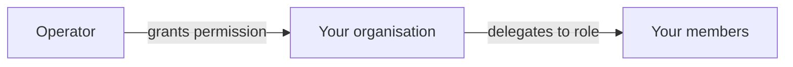

# Administrateur d'entreprise

**Vous êtes responsable de votre organisation à l'intérieur du registre.** Qui possède un compte, ce qu'il peut faire, comment il se connecte, et comment votre société est identifiée on-chain.

Ce n'est pas un espace de travail à part entière — cela apparaît comme **Company Admin** à l'intérieur de l'espace Émetteur. C'est une responsabilité qui se superpose à tout le reste.

---

## Ce que vous y trouvez

| Onglet | Pour |
|---|---|
| **Users** | Inviter des personnes, attribuer des rôles, désactiver les partants. |
| **IdP Settings** | Raccorder votre authentification unique d'entreprise. |
| **Organization** | Votre identité on-chain et les portefeuilles qui y sont liés. |
| **External IDs** | Les identifiants reliant votre organisation aux systèmes extérieurs. |

---

## Users

*Company Admin → Users.*

Vous invitez des personnes, attribuez des rôles et les désactivez à leur départ. Les rôles que vous pouvez accorder au sein de votre organisation :

| Rôle | Permet de |
|---|---|
| `INVESTOR` | Détenir et consulter des titres. |
| `TRADER` | Acheter, vendre et utiliser les marchés de liquidité. |
| `ISSUER` | Créer et administrer des émissions. |
| `COMPANY_ADMIN` | Tout ce qui figure sur cette page. |
| `DAPP_PUBLISHER` | Publier des applications sur la place de marché. |

Une personne peut en cumuler plusieurs. Les rôles déterminent quels [espaces de travail](index.md) apparaissent et — plus important — ce que le backend autorise réellement.

!!! danger "Désactivez les partants le jour même"
    Un compte qui fonctionne encore après le départ de quelqu'un est un compte qui peut encore déplacer des titres.

    La désactivation est immédiate et réversible. Elle n'efface rien : les actions passées demeurent dans la [piste d'audit](../../platform/audit-log.md), attribuées à leur auteur, définitivement. C'est précisément l'idée — vous pouvez retirer un accès sans effacer la trace de ce qui a été fait.

!!! warning "Vous ne pouvez pas accorder plus que ce que vous avez"
    Ni un rôle que votre organisation ne détient pas. Si votre entité est enregistrée comme investisseur, vous ne pouvez pas faire d'un de vos utilisateurs un émetteur. C'est une décision de l'opérateur.

### Quand la connexion est gérée ailleurs

Si votre registre fonctionne sur Microsoft Entra ID et que votre organisation est **fédérée** — vos collaborateurs se connectent avec vos propres comptes d'entreprise —, le cycle de vie des utilisateurs vit dans *votre* fournisseur d'identité, pas ici. La page vous le signale.

Vous attribuez toujours les rôles Registerwerk ici. Qui existe relève de votre IdP ; ce qu'il peut faire relève de vous.

---

## Réglages IdP

*Company Admin → IdP Settings.* Raccordez votre fournisseur d'identité conforme à OIDC pour que vos collaborateurs se connectent avec leurs identifiants d'entreprise plutôt qu'avec un mot de passe distinct.

Vous fournissez une **URL d'émetteur** et un **identifiant client**.

!!! info "Il n'y a pas de secret client, délibérément"
    Vous vous attendez peut-être à un troisième champ. Il n'y en a pas, et ce n'est pas un oubli.

    La fédération entrante s'établit **de locataire à locataire dans votre fournisseur d'identité**. Registerwerk n'exécute jamais de flux d'autorisation par code contre votre locataire : il n'a donc aucun usage de votre secret client — et le conserver reviendrait à détenir un de vos secrets dont il n'a pas besoin.

    Le champ a été supprimé et les valeurs existantes effacées.

Deux lignes de cette page sont en **lecture seule**, et toutes deux sont fixées par l'opérateur du registre :

| | |
|---|---|
| **Identity model** | Si vos utilisateurs sont invités dans le locataire de l'opérateur, membres de celui-ci, ou fédérés depuis le vôtre. |
| **Inbound MFA trust** | Si l'authentification à deux facteurs effectuée dans *votre* locataire est acceptée ici. |

!!! warning "Pourquoi la confiance MFA ne vous appartient pas"
    Un client déclarant « faites confiance à notre MFA » constituerait un vecteur d'élévation de privilèges : vous pourriez abaisser le niveau d'authentification appliqué à vos propres utilisateurs en décrétant vos dispositions suffisantes.

    C'est la décision de l'opérateur. Demandez-lui de la modifier ; vous ne le pouvez pas.

[:octicons-arrow-right-24: Se connecter](../authentication.md) · [:octicons-arrow-right-24: Configuration Entra ID](../../platform/entra-setup.md)

---

## Organization — votre identité on-chain

*Company Admin → Organization.*

Votre organisation possède une identité **sur la blockchain** autant que dans le registre. C'est le point d'ancrage des permissions dans l'écosystème : quels portefeuilles agissent pour vous, et ce que les applications peuvent faire en votre nom.

### Lier un portefeuille

Pour lier un portefeuille à votre organisation, vous prouvez que vous le contrôlez en signant un **défi à usage unique** — la plateforme émet une valeur aléatoire, vous la signez avec la clé du portefeuille, et la signature prouve la possession sans jamais révéler la clé.

Une fois lié, ce portefeuille agit on-chain pour votre organisation.

!!! warning "Une organisation par portefeuille et par chaîne"
    Un portefeuille ne peut pas représenter deux organisations sur la même chaîne. S'il vous faut des identités distinctes, utilisez des portefeuilles distincts.

### Permissions et délégation

L'opérateur accorde des **permissions** à votre organisation — le droit d'utiliser une capacité donnée. Vous les déléguez ensuite à des rôles au sein de votre organisation, et vous pouvez marquer une permission comme **restreinte par rôle** : la détenir au niveau de l'organisation ne suffit alors plus ; le membre concerné doit aussi porter le rôle délégué.

C'est ainsi qu'une dApp peut avoir confiance dans le fait que le portefeuille qui l'appelle appartient à une organisation habilitée à ce qu'elle demande — sans rien savoir de votre structure interne.

??? note "Pour le spécialiste : les contrats sous-jacents"

    **OrgRegistry** conserve les liaisons portefeuille-organisation ; l'organisation *est* son adresse ONCHAINID. L'autorisation est double : soit un opérateur détenant `OPERATOR_ROLE`, soit une clé MANAGEMENT ERC-734 sur l'ONCHAINID propre à l'organisation.

    **PermissionRegistry** conserve les permissions accordées par l'opérateur sous la forme `keccak256("<slug>.<action>")`, ainsi que la délégation par l'administrateur de l'organisation vers les rôles des membres et le drapeau de restriction par rôle.

    **PermissionOracle** est la façade stable qu'une dApp mémorise. Les dApps clientes héritent de `RegisterwerkGated`, qui expose `requiresPermission`, `requiresClaim` et `requiresActiveMember`. Cette indirection évite de redéployer les dApps lorsque les registres changent d'adresse.

    [:octicons-arrow-right-24: Développement de dApp](../../platform/dapp-development.md)

---

## External IDs

Les identifiants reliant votre organisation à des systèmes extérieurs au registre — LEI, numéros de registre national, références de conservateur.

Ingrat, et c'est ce qui rend possible le rapprochement avec le monde extérieur.

---

## Vos tâches récurrentes

- **Chaque arrivée et chaque départ.** Désactivez le jour même du départ.
- **Chaque trimestre, revoyez les rôles.** Les permissions s'accumulent. Les gens changent d'équipe et gardent des accès dont ils n'ont plus besoin.
- **Surveillez l'expiration de votre KYC.** Quand la vérification de votre organisation expire, les transferts s'arrêtent pour tout le monde. Le renouvellement prend du temps — commencez avant l'échéance, pas après.
- **Tenez les liaisons de portefeuille à jour.** Un portefeuille lié que plus personne ne contrôle est un risque.

---

## Et ensuite

- [Rôles et permissions](../../operator/customers/roles.md) — le modèle complet
- [Se connecter](../authentication.md)
- [Éditeur de dApp](dapp-publisher.md)
